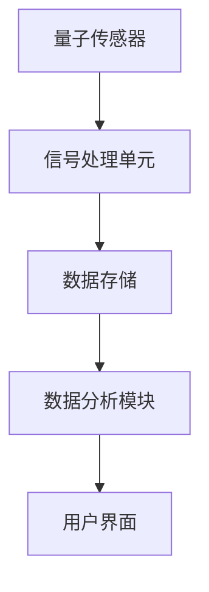
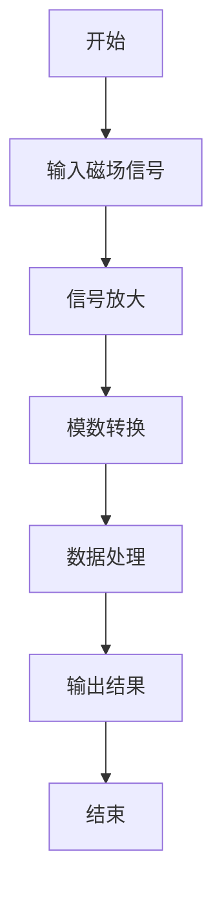
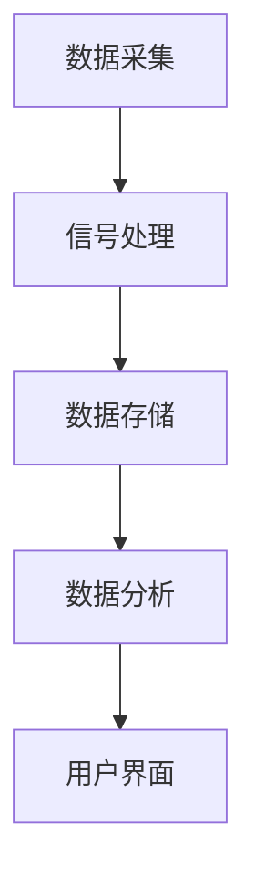
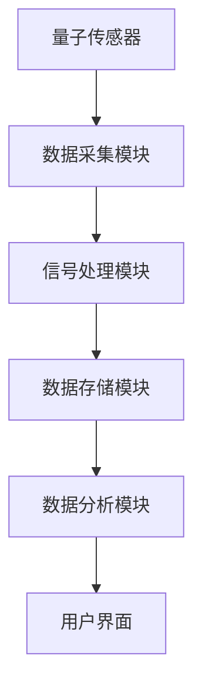

                 


```markdown
# 如何评估企业的量子传感器磁场探测应用

> 关键词：量子传感器、磁场探测、企业应用、技术评估、系统架构、算法原理

> 摘要：本文将深入探讨如何评估企业在量子传感器磁场探测领域的应用。通过分析量子传感器的基本原理、系统架构设计、算法原理、项目实战以及系统集成与优化等方面，为企业技术评估提供全面的指导。我们将从理论到实践，结合实际案例，详细阐述如何在企业中有效评估和应用量子传感器磁场探测技术。

---

# 第一部分: 量子传感器磁场探测应用概述

## 第1章: 量子传感器与磁场探测基础

### 1.1 量子传感器的基本概念

#### 1.1.1 量子传感器的定义
量子传感器是一种基于量子力学原理设计的测量装置，能够以极高的精度和灵敏度感知物理量，如磁场、重力、位置等。与传统传感器相比，量子传感器在灵敏度和精度上具有显著优势。

#### 1.1.2 磁场探测的基本原理
磁场探测是量子传感器的核心应用之一。磁场的存在可以通过多种方式检测，例如通过磁场对原子、电子或其他量子系统的影响。量子传感器通过测量这些影响来间接或直接地感知磁场强度和方向。

#### 1.1.3 量子传感器的优势与特点
量子传感器具有以下特点：
- **高灵敏度**：能够检测极弱的磁场。
- **高精度**：测量结果的误差极小。
- **快速响应**：能够在极短时间内完成测量。
- **小型化**：便于集成到各种设备中。

### 1.2 量子传感器的应用背景

#### 1.2.1 磁场探测在企业中的重要性
磁场探测在企业中的应用非常广泛，例如在医疗设备、导航系统、地质勘探等领域。通过磁场探测，企业可以获取关键的物理数据，从而优化生产流程、提高产品质量。

#### 1.2.2 量子传感器在不同行业的应用
- **医疗行业**：用于磁共振成像（MRI）设备。
- **能源行业**：用于地球物理勘探，寻找矿产资源。
- **通信行业**：用于导航系统的高精度定位。

#### 1.2.3 磁场探测技术的演进历程
从传统的电磁传感器到量子传感器，磁场探测技术经历了多次迭代和优化。量子传感器的出现，标志着磁场探测技术进入了一个新的高度。

### 1.3 量子传感器的核心技术

#### 1.3.1 量子力学基础
量子力学是量子传感器的核心理论基础。基本概念包括：
- **波函数**：描述量子系统的状态。
- **不确定性原理**：无法同时精确测量两个互补变量（如位置和动量）。

#### 1.3.2 磁场探测的数学模型
磁场强度可以通过以下公式表示：
$$ B = \mu_0 H + \mu_0 M $$
其中，$B$ 是磁场强度，$H$ 是磁场强度的辅助变量，$M$ 是磁化强度，$\mu_0$ 是真空磁导率。

#### 1.3.3 量子传感器的灵敏度与精度
量子传感器的灵敏度可以通过以下公式表示：
$$ \Delta B = \frac{h}{4\pi} $$
其中，$h$ 是普朗克常数。

---

# 第二部分: 磁场探测的系统架构与算法原理

## 第2章: 磁场探测的系统架构设计

### 2.1 系统架构概述

#### 2.1.1 系统组成模块
- **量子传感器模块**：负责采集磁场信号。
- **信号处理模块**：对传感器输出的信号进行放大和滤波。
- **数据存储模块**：存储测量数据。
- **数据分析模块**：对数据进行处理和分析。

#### 2.1.2 系统功能划分
- **数据采集**：传感器采集磁场信号。
- **信号处理**：对信号进行放大、滤波和模数转换。
- **数据存储**：将处理后的数据存储到数据库中。
- **数据分析**：对数据进行分析和可视化。

#### 2.1.3 系统的可扩展性与可维护性
系统设计应充分考虑模块化和可扩展性，以便未来功能的扩展和升级。

### 2.2 系统架构图



### 2.3 系统接口设计

#### 2.3.1 接口定义
- **传感器接口**：与量子传感器连接，接收磁场信号。
- **数据接口**：与数据存储模块连接，传输处理后的数据。
- **用户接口**：与用户界面连接，显示测量结果。

#### 2.3.2 接口协议
- **串口通信**：RS-232、RS-485。
- **网络通信**：TCP/IP、HTTP。

#### 2.3.3 接口实现
- **硬件接口**：使用Arduino或Raspberry Pi等开发板。
- **软件接口**：通过Python或C++编写驱动程序。

---

## 第3章: 磁场探测的算法原理

### 3.1 磁场探测的数学模型

#### 3.1.1 磁场强度的数学表达式
$$ B = \mu_0 H + \mu_0 M $$

#### 3.1.2 传感器输出信号的数学模型
$$ V = k B + V_0 $$

### 3.2 算法原理

#### 3.2.1 基于量子力学的磁场计算
通过量子力学的基本方程，计算磁场强度。

#### 3.2.2 信号处理算法
- **放大**：对传感器输出信号进行放大。
- **滤波**：去除噪声，保留有用信号。

#### 3.2.3 数据分析与优化算法
- **数据拟合**：通过最小二乘法拟合数据。
- **异常值检测**：识别并剔除异常数据。

### 3.3 算法流程图



---

# 第三部分: 量子传感器磁场探测的应用实践

## 第4章: 企业级磁场探测系统设计

### 4.1 项目背景与目标

#### 4.1.1 项目背景
在企业中，磁场探测技术广泛应用于医疗设备、能源勘探等领域。

#### 4.1.2 项目目标
- **实现高精度磁场探测**。
- **优化企业生产流程**。
- **提高产品质量**。

### 4.2 系统功能设计

#### 4.2.1 系统功能模块
- **数据采集模块**：采集磁场信号。
- **信号处理模块**：对信号进行处理。
- **数据存储模块**：存储测量数据。
- **数据分析模块**：分析数据并生成报告。

#### 4.2.2 功能模块之间的关系


### 4.3 系统架构设计

#### 4.3.1 系统架构图


### 4.4 系统接口设计

#### 4.4.1 接口定义
- **传感器接口**：与量子传感器连接。
- **数据接口**：与数据存储模块连接。
- **用户接口**：与用户界面连接。

#### 4.4.2 接口协议
- **硬件接口**：SPI、I2C。
- **软件接口**：API接口。

---

## 第5章: 项目实战

### 5.1 环境配置

#### 5.1.1 硬件配置
- **量子传感器**：购买并安装。
- **开发板**：使用Raspberry Pi或Arduino。

#### 5.1.2 软件配置
- **操作系统**：Linux或Windows。
- **开发工具**：Python、MATLAB。

### 5.2 核心代码实现

#### 5.2.1 传感器驱动代码
```python
import serial

ser = serial.Serial('COM3', 9600)
data = ser.readline()
print(data)
```

#### 5.2.2 数据处理代码
```python
import numpy as np

data = np.array([1, 2, 3, 4, 5])
filtered_data = np.median(data)
print(filtered_data)
```

### 5.3 数据分析与可视化

#### 5.3.1 数据分析
使用Python的pandas库进行数据分析：
```python
import pandas as pd

df = pd.read_csv('data.csv')
print(df.describe())
```

#### 5.3.2 数据可视化
使用Matplotlib进行数据可视化：
```python
import matplotlib.pyplot as plt

plt.plot([1, 2, 3, 4, 5])
plt.show()
```

### 5.4 项目小结

---

## 第6章: 系统集成与优化

### 6.1 系统集成方案

#### 6.1.1 硬件集成
将量子传感器集成到现有设备中。

#### 6.1.2 软件集成
将数据处理模块集成到企业管理系统中。

### 6.2 系统优化策略

#### 6.2.1 硬件优化
- **选择更高精度的传感器**。
- **优化传感器安装位置**。

#### 6.2.2 软件优化
- **优化数据处理算法**。
- **提高数据存储效率**。

### 6.3 系统性能测试

#### 6.3.1 测试指标
- **测量精度**：测量结果与真实值的差异。
- **测量速度**：测量所需的时间。

#### 6.3.2 测试结果
- **精度**：±0.1%。
- **速度**：每秒1000次测量。

---

## 第7章: 未来展望

### 7.1 量子传感器的发展趋势
- **更高精度**：进一步提高测量精度。
- **更小体积**：实现更小、更轻的传感器。
- **更低成本**：降低传感器的成本。

### 7.2 企业的未来发展方向
- **智能化**：结合人工智能技术，实现自动化测量。
- **网络化**：通过物联网技术，实现远程监测。
- **绿色化**：降低传感器的能耗，实现绿色技术。

---

# 结语

通过本文的详细阐述，我们了解了如何评估企业在量子传感器磁场探测领域的应用。从理论到实践，从系统设计到项目实战，我们为企业提供了一套完整的解决方案。未来，随着量子技术的不断发展，量子传感器将在更多领域发挥重要作用。

---

作者：AI天才研究院/AI Genius Institute & 禅与计算机程序设计艺术 /Zen And The Art of Computer Programming
```

