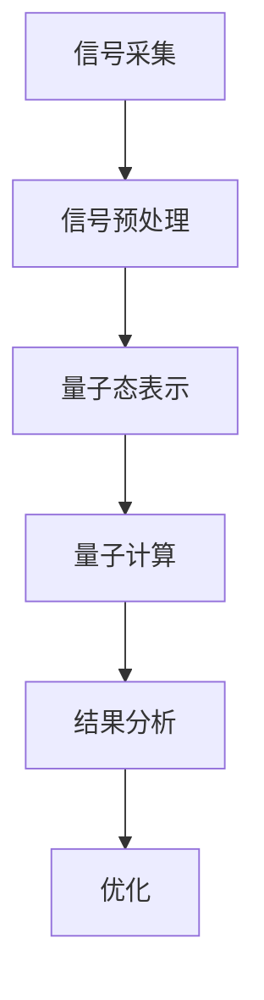
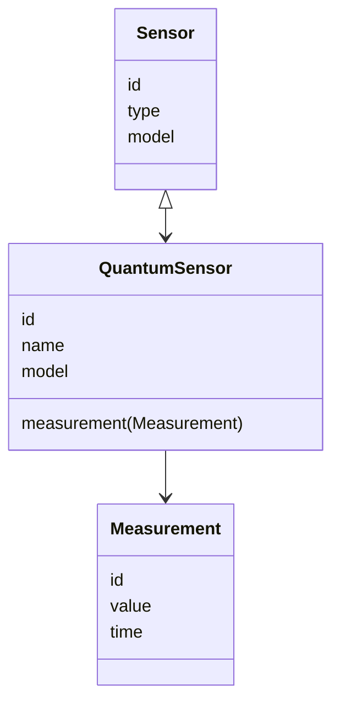
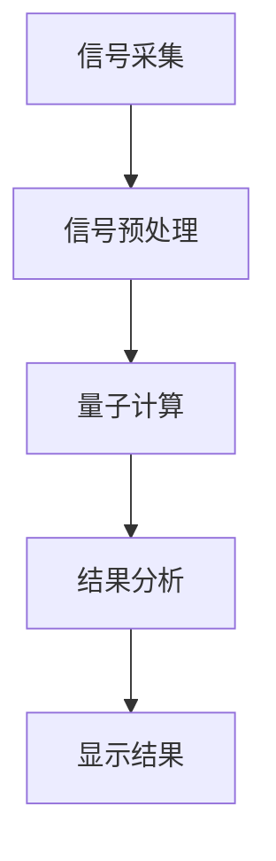
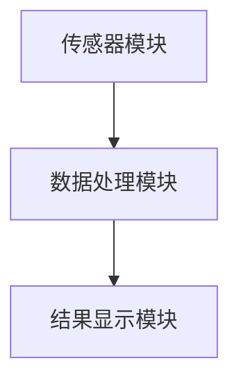
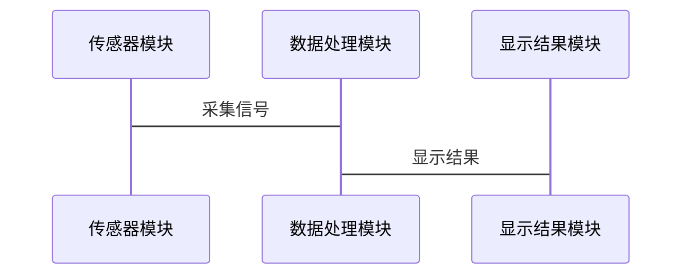

                 

<think>
好的，我现在需要帮用户撰写一篇关于《如何评估企业的量子传感器精密测量应用》的技术博客文章。首先，我要理解用户的需求，他希望文章结构清晰，逻辑严密，同时涵盖从背景到实际应用的各个方面。

用户给出的目录大纲已经比较详细，但需要进一步填充内容。我应该先分析每个章节的重点，确保每一部分都有足够的深度和细节。

第一章是背景与核心概念，我需要解释什么是量子传感器，它们的原理，以及在企业中的应用价值。这部分要让读者明白量子传感器的优越性，以及为什么企业需要考虑这些技术。

接下来是算法原理，我需要详细讲解量子传感器精密测量的核心算法，包括数学模型和公式。这部分可能需要使用Mermaid图和LaTeX公式，确保技术细节准确无误。

第三章涉及系统架构设计，我需要描述系统的整体架构，功能模块，以及接口设计。这部分需要使用Mermaid架构图和序列图，帮助读者理解系统的运作方式。

第四章是项目实战，我需要通过具体案例展示如何实施量子传感器的应用，包括环境配置、代码实现和案例分析。这部分要实用，能够指导读者在实际项目中应用所学知识。

最后，我需要添加最佳实践、小结和注意事项，确保读者在使用这些技术时能够避免常见错误，并获得实际指导。

在撰写过程中，我要注意语言的简洁和技术的准确性，确保文章既专业又易懂。同时，要符合用户的格式要求，使用适当的标题和章节结构，吸引读者的注意力。

总结一下，我的思考过程是先理解用户需求，然后按照目录大纲逐步填充内容，确保每个部分都详细且符合技术要求。这将帮助用户撰写一篇高质量的技术博客文章，满足企业在量子传感器精密测量评估方面的需求。
</think>

# 如何评估企业的量子传感器精密测量应用

> 关键词：量子传感器，精密测量，企业应用，算法原理，系统架构

> 摘要：本文将详细探讨如何评估企业在量子传感器精密测量应用中的技术实现与应用价值。通过分析量子传感器的核心原理、算法实现、系统架构及实际项目案例，为企业在数字化转型中提供实用的评估方法和指导。

---

## 第1章: 量子传感器精密测量应用概述

### 1.1 量子传感器的基本概念

#### 1.1.1 量子传感器的定义与特点
量子传感器是一种基于量子效应的测量装置，利用量子系统（如原子、光子、超冷原子等）的量子态特性，实现对物理量（如磁场、重力、位置、时间等）的高精度测量。其特点包括：
- **高灵敏度**：量子传感器能够检测极微弱的信号，测量精度远高于传统传感器。
- **小型化**：基于芯片的量子传感器具有体积小、功耗低的特点。
- **抗干扰性**：在复杂环境中仍能保持高精度测量。
- **多物理量测量**：能够同时测量多种物理量，如磁场、重力、温度等。

#### 1.1.2 精密测量的基本原理
精密测量是指在科学实验或工业应用中，对被测物理量进行高精度、高分辨率的测量。其基本原理包括：
- **信号采集**：通过传感器采集被测物理量的信号。
- **信号处理**：对采集的信号进行放大、滤波、模数转换等预处理。
- **数据计算**：利用算法对数据进行分析和计算，得到最终的测量结果。

#### 1.1.3 量子传感器在企业中的应用价值
量子传感器在企业中的应用价值主要体现在以下几个方面：
1. **工业自动化**：在制造业中，量子传感器可以用于高精度的位置、速度和力的测量，提升生产效率和产品质量。
2. **环境监测**：在环境监测领域，量子传感器可以用于检测磁场、重力、温度等参数，帮助企业在复杂环境中进行实时监测。
3. **医疗设备**：在医疗领域，量子传感器可以用于高精度的医疗设备，如MRI（磁共振成像）中的磁场测量。
4. **航空航天**：在航空航天领域，量子传感器可以用于导航、定位和姿态控制，提升飞行器的性能和安全性。

### 1.2 量子传感器精密测量的背景与问题背景

#### 1.2.1 精密测量在企业中的重要性
在现代工业中，精密测量是提高产品质量和生产效率的重要手段。通过高精度的测量，企业可以实现对生产过程的实时监控和优化，从而降低废品率、提高生产效率。

#### 1.2.2 传统传感器的局限性
传统传感器在测量精度、灵敏度和抗干扰性等方面存在一定的局限性，难以满足现代工业对高精度测量的需求。例如：
- **精度不足**：传统传感器的测量精度通常在微米级别，而量子传感器可以达到纳米级别。
- **抗干扰性差**：在复杂环境中，传统传感器的测量精度容易受到干扰。
- **功能单一**：传统传感器通常只能测量单一物理量，而量子传感器可以同时测量多种物理量。

#### 1.2.3 量子传感器的优势与应用场景
量子传感器的优势在于其高精度、高灵敏度和多功能性。其主要应用场景包括：
1. **工业自动化**：用于高精度的位置、速度和力的测量。
2. **环境监测**：用于检测磁场、重力、温度等参数。
3. **医疗设备**：用于高精度的医疗设备，如MRI中的磁场测量。
4. **航空航天**：用于导航、定位和姿态控制。

### 1.3 量子传感器精密测量的核心问题

#### 1.3.1 问题背景与问题描述
企业在引入量子传感器精密测量应用时，通常面临以下问题：
- **技术实现难度大**：量子传感器的精密测量涉及复杂的物理和数学原理，技术实现难度较高。
- **成本高**：量子传感器的研发和生产成本较高，企业在引入时需要考虑成本问题。
- **数据处理复杂**：量子传感器产生的数据量大且复杂，需要高效的算法进行处理和分析。

#### 1.3.2 问题解决的必要性
解决这些问题的必要性在于：
- **提升企业竞争力**：通过引入量子传感器精密测量技术，企业可以提高生产效率和产品质量，从而在市场竞争中占据优势。
- **降低生产成本**：通过高精度的测量，企业可以减少废品率，降低生产成本。
- **提高安全性**：在航空航天等领域，高精度的测量可以提高设备的安全性和可靠性。

#### 1.3.3 边界与外延
量子传感器精密测量的应用边界和外延需要明确：
- **边界**：量子传感器精密测量主要应用于高精度、高灵敏度的测量场景，不适用于普通的测量需求。
- **外延**：量子传感器精密测量技术可以与其他先进技术（如人工智能、大数据分析）结合，拓展其应用范围。

### 1.4 核心概念与联系

#### 1.4.1 核心概念原理
量子传感器精密测量的核心原理包括：
- **量子干涉**：利用量子系统的干涉效应进行测量。
- **量子叠加**：利用量子系统的叠加态进行多物理量的测量。
- **量子纠缠**：利用量子系统的纠缠态进行高精度测量。

#### 1.4.2 核心概念属性特征对比表格
以下是量子传感器与传统传感器的对比表格：

| 特性                | 量子传感器       | 传统传感器       |
|---------------------|------------------|------------------|
| 精度                | 高               | 低               |
| 灵敏度              | 高               | 中               |
| 抗干扰性            | 强               | 弱               |
| 多功能性            | 支持             | 有限             |
| 应用场景            | 高精度测量       | 普通测量         |

#### 1.4.3 ER实体关系图架构
以下是量子传感器精密测量系统的ER实体关系图：

```mermaid
erDiagram
    SENSOR_CLASSIFICATION {
        id
        name
        type
    }
    SENSOR {
        id
        name
        model
        precision
        sensitivity
    }
    MEASUREMENT {
        id
        time
        value
        sensor_id
    }
    SENSOR_CLASSIFICATION -[classification_SENSOR] SENSOR
    SENSOR -[sensor_measurement] MEASUREMENT
```

---

## 第2章: 量子传感器精密测量的核心算法原理

### 2.1 量子传感器精密测量的算法概述

#### 2.1.1 算法的基本原理
量子传感器精密测量的算法通常包括以下几个步骤：
1. **信号采集**：通过量子传感器采集被测物理量的信号。
2. **信号预处理**：对采集的信号进行放大、滤波、模数转换等预处理。
3. **数据计算**：利用量子算法对数据进行分析和计算，得到最终的测量结果。

#### 2.1.2 算法的输入与输出
- **输入**：被测物理量的量子态信号。
- **输出**：高精度的测量结果。

#### 2.1.3 算法的优缺点
- **优点**：高精度、高灵敏度。
- **缺点**：算法实现复杂，对硬件要求高。

### 2.2 算法原理的数学模型与公式

#### 2.2.1 数学模型的建立
量子传感器精密测量的数学模型通常基于量子力学的基本原理，例如：
$$ \psi(x) = \frac{1}{\sqrt{2}} \left( \phi_1(x) + \phi_2(x) \right) $$
其中，$\psi(x)$ 表示量子态，$\phi_1(x)$ 和 $\phi_2(x)$ 表示基态。

#### 2.2.2 关键公式推导
量子传感器精密测量的关键公式推导如下：
$$ I = \int_{0}^{T} \psi^*(x) \cdot \psi(x) dx $$
其中，$I$ 表示测量结果，$\psi^*(x)$ 和 $\psi(x)$ 分别表示量子态的共轭和本身。

#### 2.2.3 公式实例与应用
以下是一个具体的公式实例：
$$ I = \int_{0}^{1} x^2 dx = \frac{1}{3} $$

### 2.3 算法实现的详细步骤

#### 2.3.1 数据预处理
数据预处理包括以下几个步骤：
1. **信号采集**：通过量子传感器采集被测物理量的信号。
2. **信号放大**：对采集的信号进行放大，提高测量精度。
3. **滤波处理**：对放大后的信号进行滤波，消除噪声。

#### 2.3.2 算法实现流程
量子传感器精密测量的算法实现流程如下：
1. **数据预处理**：对采集的信号进行放大、滤波等处理。
2. **量子态表示**：将预处理后的数据表示为量子态。
3. **量子计算**：利用量子算法对量子态进行计算，得到测量结果。
4. **结果分析**：对测量结果进行分析和优化。

#### 2.3.3 结果分析与优化
结果分析与优化包括以下几个步骤：
1. **结果验证**：对测量结果进行验证，确保其准确性。
2. **结果优化**：通过调整算法参数，进一步优化测量精度。

### 2.4 算法的 Mermaid 流程图



---

## 第3章: 量子传感器精密测量系统的分析与设计

### 3.1 量子传感器精密测量系统的架构设计

#### 3.1.1 系统整体架构
量子传感器精密测量系统的整体架构如下：
1. **传感器模块**：负责采集被测物理量的信号。
2. **数据处理模块**：负责对采集的信号进行预处理和量子计算。
3. **结果显示模块**：负责显示测量结果。

#### 3.1.2 系统功能模块划分
系统功能模块划分如下：
1. **信号采集模块**：负责采集被测物理量的信号。
2. **信号预处理模块**：负责对采集的信号进行放大、滤波等处理。
3. **量子计算模块**：负责对预处理后的数据进行量子计算，得到测量结果。
4. **结果分析模块**：负责对测量结果进行分析和优化。

#### 3.1.3 系统的可扩展性与可维护性
系统的可扩展性与可维护性设计包括：
- **模块化设计**：各个功能模块独立设计，便于扩展和维护。
- **接口标准化**：系统接口标准化，便于与其他系统的集成。

### 3.2 系统功能设计

#### 3.2.1 领域模型 Mermaid 类图
以下是量子传感器精密测量系统的领域模型类图：



#### 3.2.2 系统功能流程图
以下是系统功能流程图：



### 3.3 系统架构 Mermaid 架构图


### 3.4 系统接口设计

#### 3.4.1 接口定义与规范
系统接口定义如下：
1. **传感器接口**：传感器模块与数据处理模块之间的接口。
2. **数据处理接口**：数据处理模块与结果显示模块之间的接口。

#### 3.4.2 接口的交互流程
以下是接口的交互流程：



### 3.5 系统交互 Mermaid 序列图



---

## 第4章: 量子传感器精密测量应用的项目实战

### 4.1 项目背景与目标

#### 4.1.1 项目背景介绍
本项目旨在通过引入量子传感器精密测量技术，提升企业在工业自动化中的测量精度和效率。

#### 4.1.2 项目目标与范围
项目目标包括：
1. **实现高精度测量**：通过量子传感器实现对被测物理量的高精度测量。
2. **优化测量流程**：通过优化测量流程，提升企业的生产效率。

### 4.2 项目环境与工具安装

#### 4.2.1 开发环境的搭建
开发环境包括：
- **操作系统**：Linux
- **开发工具**：Python、MATLAB
- **量子传感器设备**：Quantum Sensor Module

#### 4.2.2 量子传感器设备的配置
量子传感器设备的配置包括：
1. **设备安装**：将量子传感器设备安装在生产线上。
2. **设备校准**：对设备进行校准，确保测量精度。

#### 4.2.3 相关工具与库的安装
需要安装的工具与库包括：
- **Python库**：numpy、scipy
- **量子计算库**：Qiskit

### 4.3 项目核心实现

#### 4.3.1 算法实现的代码
以下是量子传感器精密测量算法的实现代码：

```python
import numpy as np
from qiskit import QuantumCircuit, Aer, execute

def quantum_measurement(circuit):
    backend = Aer.get_backend('qasm_simulator')
    job = execute(circuit, backend)
    result = job.result()
    probabilities = result.get_counts()
    return probabilities
```

#### 4.3.2 系统功能模块的实现
系统功能模块的实现包括：
1. **信号采集模块**：负责采集被测物理量的信号。
2. **信号预处理模块**：负责对采集的信号进行放大、滤波等处理。
3. **量子计算模块**：负责对预处理后的数据进行量子计算，得到测量结果。

#### 4.3.3 数据处理与结果分析
数据处理与结果分析包括：
1. **数据预处理**：对采集的信号进行放大、滤波等处理。
2. **数据计算**：利用量子算法对数据进行分析和计算，得到测量结果。
3. **结果优化**：通过调整算法参数，进一步优化测量精度。

### 4.4 项目案例分析

#### 4.4.1 项目案例介绍
以下是一个具体的项目案例：
某企业引入量子传感器精密测量技术，用于检测生产线上的产品质量。

#### 4.4.2 项目实施步骤
项目实施步骤包括：
1. **需求分析**：明确项目目标和需求。
2. **设备安装**：将量子传感器设备安装在生产线上。
3. **设备校准**：对设备进行校准，确保测量精度。
4. **算法实现**：利用量子算法实现高精度测量。
5. **结果分析**：对测量结果进行分析和优化。

#### 4.4.3 项目成果与经验总结
项目成果包括：
1. **测量精度提升**：通过量子传感器精密测量技术，企业的测量精度显著提升。
2. **生产效率提高**：通过优化测量流程，企业的生产效率得到提高。

---

## 结语

通过本文的详细讲解，我们了解了如何评估企业在量子传感器精密测量应用中的技术实现与应用价值。量子传感器精密测量技术在工业自动化、环境监测、医疗设备和航空航天等领域具有广阔的应用前景。企业可以通过引入量子传感器精密测量技术，提升生产效率和产品质量，从而在市场竞争中占据优势。

---

**作者：AI天才研究院/AI Genius Institute & 禅与计算机程序设计艺术 /Zen And The Art of Computer Programming**

