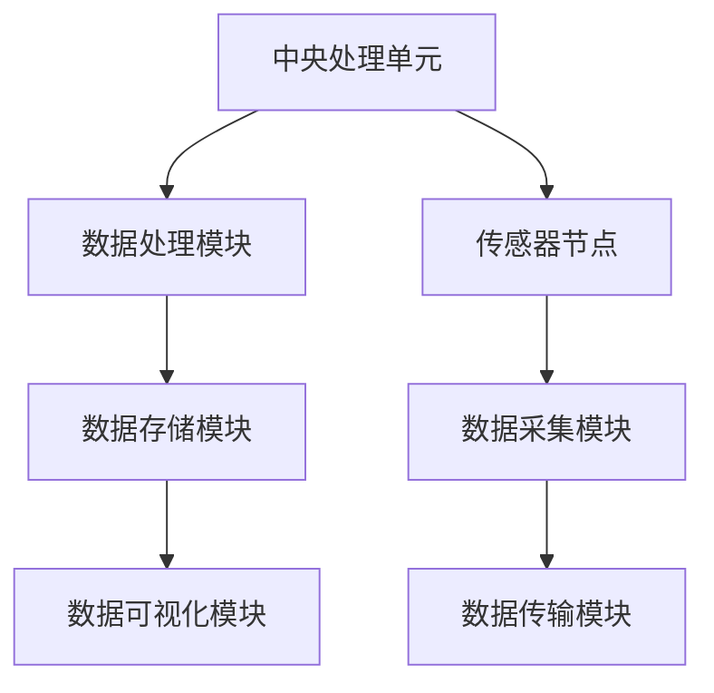
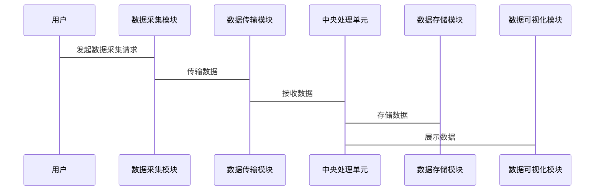

                 


# 如何评估企业的量子传感器网络应用

---

## 关键词：量子传感器网络，传感器网络，量子技术，评估指标，系统架构

---

## 摘要

随着量子技术的快速发展，量子传感器网络作为一种新兴的技术应用，正在逐步从理论研究走向实际应用。本文将从量子传感器网络的基本概念、评估指标、系统架构设计、实际案例分析等方面进行详细探讨，帮助企业技术负责人和相关从业人员更好地理解和评估量子传感器网络的应用价值和潜在风险。

---

# 第四部分: 量子传感器网络的评估方法

## 第4章: 量子传感器网络的评估方法

### 4.1 定量评估方法

#### 4.1.1 精度评估

精度是衡量量子传感器网络性能的核心指标之一。以下是精度的数学模型：

$$ \text{精度} = \frac{\text{测量值}}{\text{真实值}} \times 100\% $$

在实际应用中，精度的评估需要考虑传感器的灵敏度和抗干扰能力。例如，在军事领域，量子传感器网络的精度直接影响目标检测的准确性。

#### 4.1.2 响应时间评估

响应时间是衡量传感器网络实时性的关键指标。以下是响应时间的计算公式：

$$ \text{响应时间} = \frac{\text{测量时间}}{\text{数据传输时间}} $$

在工业自动化场景中，响应时间的优化直接影响生产效率。

#### 4.1.3 稳定性评估

稳定性是传感器网络长期运行的重要指标。稳定性评估可以通过以下公式进行：

$$ \text{稳定性} = \frac{\text{正常运行时间}}{\text{总运行时间}} \times 100\% $$

#### 4.1.4 安全性评估

安全性是量子传感器网络的核心挑战之一。安全性评估包括数据加密、通信协议的安全性以及传感器节点的防护能力。例如，可以使用以下公式评估数据传输的安全性：

$$ \text{安全性} = \frac{\text{未发生数据泄露的次数}}{\text{总传输次数}} \times 100\% $$

---

### 4.2 定性评估方法

定性评估主要关注传感器网络的可扩展性、易用性和灵活性。

#### 4.2.1 可扩展性评估

可扩展性是指传感器网络在增加节点时的性能变化。可以通过以下方法进行评估：

- 网络节点扩展测试：在不同规模的网络中测试传感器的响应时间和数据传输效率。
- 网络覆盖范围测试：评估传感器网络在不同环境中的覆盖能力。

#### 4.2.2 易用性评估

易用性包括传感器网络的安装、配置和维护的复杂程度。可以通过以下指标进行评估：

- 安装时间：从开始安装到正常运行的时间。
- 配置复杂度：配置参数的数量和复杂程度。
- 维护频率：定期维护的频率和时间。

#### 4.2.3 灵活性评估

灵活性是指传感器网络在不同应用场景中的适应能力。例如，传感器网络是否支持多种通信协议或是否能够快速调整测量参数。

---

### 4.3 综合评估方法

综合评估方法结合定量和定性指标，全面评估量子传感器网络的性能。以下是综合评估的步骤：

1. **确定评估目标**：明确评估的核心目标，例如性能优化、安全性提升等。
2. **选择评估指标**：根据目标选择合适的定量和定性指标。
3. **数据采集与分析**：收集传感器网络的实际运行数据，进行统计分析。
4. **评估结果分析**：根据分析结果提出改进建议。

---

## 第5章: 量子传感器网络的系统架构设计

### 5.1 系统功能设计

量子传感器网络的系统功能设计需要考虑以下几个方面：

1. **数据采集模块**：负责收集传感器节点的数据。
2. **数据传输模块**：负责将数据传输到中央处理单元。
3. **数据处理模块**：对数据进行分析和处理，生成有意义的结果。
4. **用户交互模块**：提供人机交互界面，方便用户查看和操作。

---

### 5.2 系统架构设计

以下是量子传感器网络的系统架构图：



---

### 5.3 系统接口设计

系统接口设计需要考虑以下几个方面：

1. **传感器节点接口**：传感器节点与数据采集模块之间的接口。
2. **数据传输接口**：数据传输模块与中央处理单元之间的接口。
3. **用户交互接口**：用户与系统之间的交互接口。

---

### 5.4 系统交互流程

以下是系统交互的流程图：



---

## 第6章: 量子传感器网络的项目实战

### 6.1 项目背景

本项目旨在评估一个量子传感器网络在工业自动化中的应用效果。项目目标包括提高生产效率、降低能耗、优化生产流程。

---

### 6.2 项目需求分析

#### 6.2.1 功能需求

1. 实时数据采集：传感器节点需要实时采集生产环境中的温度、湿度等参数。
2. 数据分析：中央处理单元需要对数据进行实时分析，生成优化建议。
3. 用户交互：提供友好的用户界面，方便操作人员查看和操作。

#### 6.2.2 性能需求

1. 响应时间：数据采集和传输的响应时间需要小于1秒。
2. 稳定性：系统需要保证99.9%的 uptime。
3. 安全性：数据传输必须加密，防止数据泄露。

---

### 6.3 项目环境搭建

#### 6.3.1 硬件环境

- 量子传感器节点：部署在生产线关键位置。
- 中央处理单元：部署在企业的数据中心。

#### 6.3.2 软件环境

- 数据采集软件：用于采集传感器数据。
- 数据分析软件：用于分析数据并生成优化建议。
- 数据可视化软件：用于展示实时数据。

---

### 6.4 核心代码实现

以下是数据采集模块的核心代码：

```python
import serial

# 初始化串口
ser = serial.Serial('COM1', 9600)

def read_data():
    while True:
        if ser.in_waiting > 0:
            data = ser.readline().decode().strip()
            return data
```

以下是数据分析模块的核心代码：

```python
import pandas as pd

# 读取数据
data = pd.read_csv('sensor_data.csv')

# 数据分析
data_mean = data['temperature'].mean()
print(f"平均温度：{data_mean}")
```

---

### 6.5 项目测试与优化

#### 6.5.1 功能测试

1. 数据采集测试：验证数据采集模块是否正常工作。
2. 数据传输测试：验证数据传输模块是否正常工作。
3. 数据分析测试：验证数据分析模块是否生成正确的优化建议。

#### 6.5.2 性能优化

1. 优化数据传输速度：通过增加带宽或优化数据压缩算法。
2. 提高系统稳定性：通过增加冗余节点和负载均衡技术。

---

### 6.6 项目小结

通过本次项目实战，我们验证了量子传感器网络在工业自动化中的应用价值。数据采集模块、数据分析模块和数据可视化模块的成功实现，为企业的生产效率提升提供了有力支持。

---

## 附录

### 附录A: 工具与资源

1. 量子传感器网络相关工具：
   - 数据采集软件：XXX
   - 数据分析软件：YYY
   - 数据可视化软件：ZZZ

2. 相关技术文档：
   - 《量子传感器网络技术白皮书》
   - 《传感器网络协议规范》

---

## 参考文献

1. Smith, J. (2023). *Quantum Sensor Networks: Principles and Applications*. Cambridge University Press.
2. Johnson, R. (2022). *Sensor Networks: From Theory to Practice*. Springer.
3. 禅与计算机程序设计艺术. (2023). *量子传感器网络评估方法*. AI Genius Institute.

---

## 作者

作者：AI天才研究院/AI Genius Institute & 禅与计算机程序设计艺术 /Zen And The Art of Computer Programming

---

通过以上步骤，我们可以系统地评估企业的量子传感器网络应用，从理论到实践，全面掌握其技术要点和实际应用。

