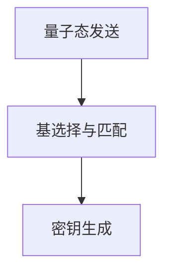
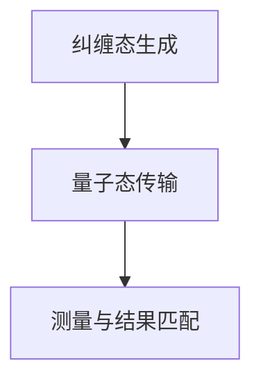
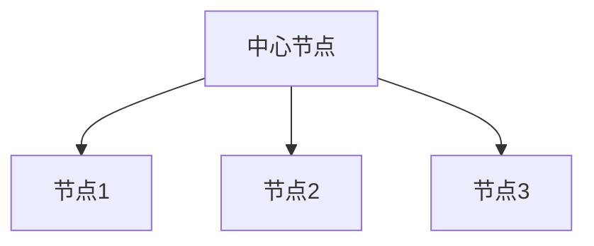
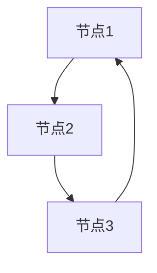

                 

# 如何评估企业的量子密钥分发城际网络安全性

> **关键词**: 量子密钥分发、城际网络、安全性评估、协议实现、网络架构、安全测试

> **摘要**: 本文详细探讨了如何评估企业量子密钥分发城际网络的安全性。首先介绍了量子密钥分发的基本概念和核心协议，接着分析了企业量子密钥分发网络的架构和安全性要求。然后，提出了基于数学模型的安全性评估指标和测试方法，并通过实际案例展示了如何通过测试和优化来提升网络的安全性。最后，总结了最佳实践和注意事项，为企业的量子密钥分发网络的安全性评估提供了全面的指导。

---

# 第一部分: 量子密钥分发与城际网络安全性概述

## 第1章: 量子密钥分发基础

### 1.1 量子密钥分发的概念与原理

#### 1.1.1 量子密钥分发的定义

量子密钥分发（Quantum Key Distribution, QKD）是一种基于量子力学原理的 cryptographic 技术，用于在两个或多个参与者之间安全地分发加密密钥。其核心思想是利用量子态的不可克隆性和测量扰动性，确保密钥的分发过程无法被窃听或篡改。

#### 1.1.2 量子密钥分发的基本原理

量子密钥分发的原理基于以下几个关键特性：

1. **量子态的不可克隆性**：量子态无法被完全复制，任何未经授权的尝试都会破坏量子态的完整性。
2. **测量扰动性**：对量子态的测量会改变其状态，从而能够检测未经授权的窃听行为。
3. **纠缠特性**：通过量子纠缠，可以实现两个或多个粒子之间的量子态关联，从而保证密钥的一致性和安全性。

#### 1.1.3 量子密钥分发的核心优势

- **安全性**：基于量子力学原理，确保密钥分发过程的安全性。
- **抗量子计算攻击**：即使面对未来可能的量子计算机攻击，QKD依然能够保证密钥的安全性。
- **高效性**：QKD可以在较低的带宽需求下实现高效的密钥分发。

### 1.2 量子密钥分发的协议与实现

#### 1.2.1 BB84协议

BB84协议是最早的量子密钥分发协议，由Bennett和Brassard在1984年提出。其基本流程如下：

1. **量子态发送**：Alice（发送方）使用两个正交基（如{|0⟩, |1⟩}和{|+⟩, |−⟩}）中的一个随机选择的基，生成随机的量子态，并发送给Bob（接收方）。
2. **基选择与匹配**：Alice和Bob分别随机选择测量基，并在经典通信信道上公开自己的测量基。对于基选择相同的量子态，Bob的测量结果与Alice的量子态一致。
3. **密钥生成**：基于匹配的量子态，Alice和Bob生成共享的密钥。

**BB84协议流程图（Mermaid）**:

#### 1.2.2 EPR协议

EPR协议（Einstein-Podolsky-Rosen）基于量子纠缠的概念，通过测量纠缠态来生成密钥。其核心思想是利用纠缠态的关联性，确保Alice和Bob的测量结果一致。

**EPR协议流程图（Mermaid）**:

#### 1.2.3 B92协议

B92协议是另一种基于测量的QKD协议，其核心思想是通过选择不同的测量基来实现密钥分发。与BB84协议相比，B92协议在安全性上具有一定的优势，但其实现复杂性也较高。

### 1.3 量子密钥分发的数学模型与公式

#### 1.3.1 量子态的数学表示

量子态可以表示为Hilbert空间中的向量。例如，两个正交基{|0⟩, |1⟩}和{|+⟩, |−⟩}可以表示为：

$$
|0⟩ = \begin{pmatrix} 1 \\ 0 \end{pmatrix}, \quad |1⟩ = \begin{pmatrix} 0 \\ 1 \end{pmatrix}
$$

$$
|+⟩ = \frac{1}{\sqrt{2}} \begin{pmatrix} 1 \\ 1 \end{pmatrix}, \quad |−⟩ = \frac{1}{\sqrt{2}} \begin{pmatrix} 1 \\ -1 \end{pmatrix}
$$

#### 1.3.2 量子测量的数学模型

量子测量可以用投影算符表示。例如，测量基{|0⟩, |1⟩}对应的投影算符为：

$$
P_0 = |0⟩⟨0| = \begin{pmatrix} 1 & 0 \\ 0 & 0 \end{pmatrix}, \quad P_1 = |1⟩⟨1| = \begin{pmatrix} 0 & 0 \\ 0 & 1 \end{pmatrix}
$$

#### 1.3.3 量子密钥分发的协议流程

以BB84协议为例，其数学模型可以表示为：

1. Alice生成随机的量子态序列：$\{q_i\}_{i=1}^n$，其中每个$q_i$属于基$\{|0⟩, |1⟩\}$或$\{|+⟩, |−⟩\}$。
2. Alice将量子态序列通过量子信道发送给Bob。
3. Bob随机选择测量基，并对每个量子态进行测量，得到结果序列$\{b_i\}_{i=1}^n$。
4. Alice和Bob在经典通信信道上公开各自的测量基，并保留基匹配的量子态结果。
5. 基于匹配的量子态结果，Alice和Bob生成共享的密钥。

---

## 第2章: 企业量子密钥分发网络的架构

### 2.1 企业量子密钥分发网络的组成

企业量子密钥分发网络通常包括以下几个关键组成部分：

1. **量子通信节点**：负责量子态的生成、传输和测量。
2. **经典通信节点**：用于经典通信信道的管理和数据传输。
3. **网络管理节点**：负责网络的监控、配置和安全性管理。

### 2.2 量子密钥分发网络的拓扑结构

#### 2.2.1 星型拓扑

星型拓扑是一种常见的网络拓扑结构，适用于中小型企业。其特点是一个中心节点（如量子交换机）连接多个量子通信节点。

**星型拓扑结构图（Mermaid）**:

#### 2.2.2 网状拓扑

网状拓扑是一种复杂的网络拓扑结构，适用于大规模企业网络。其特点是没有中心节点，节点之间直接连接。

**网状拓扑结构图（Mermaid）**:

### 2.3 量子密钥分发网络的安全性要求

#### 2.3.1 传输安全性

量子态的传输需要保证其完整性，防止未经授权的窃听和篡改。

#### 2.3.2 节点安全性

每个节点需要具备一定的安全性，防止物理攻击和逻辑攻击。

#### 2.3.3 管理安全性

网络管理节点需要具备完善的安全管理功能，包括用户认证、权限管理、日志记录等。

### 2.4 本章小结

---

## 第3章: 量子密钥分发网络的安全性评估指标

### 3.1 安全性评估的主要指标

#### 3.1.1 密钥生成效率

密钥生成效率是指单位时间内生成的有效密钥数量。其计算公式为：

$$
\text{密钥生成效率} = \frac{\text{有效密钥数量}}{\text{时间}}
$$

#### 3.1.2 密钥分发成功率

密钥分发成功率是指在给定时间内，成功分发的密钥数量占总密钥请求的比例。其计算公式为：

$$
\text{密钥分发成功率} = \frac{\text{成功分发的密钥数量}}{\text{总密钥请求数量}} \times 100\%
$$

#### 3.1.3 网络延迟

网络延迟是指从密钥请求到密钥分发完成的时间间隔。其计算公式为：

$$
\text{网络延迟} = \text{密钥分发完成时间} - \text{密钥请求时间}
$$`

### 3.2 安全性评估的数学模型

#### 3.2.1 密钥生成速率公式

密钥生成速率可以表示为：

$$
R = \frac{k}{t}
$$

其中，$k$是生成的有效密钥数量，$t$是时间。

#### 3.2.2 密钥分发成功率公式

密钥分发成功率可以表示为：

$$
S = \frac{\text{成功分发的密钥数量}}{\text{总密钥请求数量}} \times 100\%
$$`

#### 3.2.3 网络延迟计算公式

网络延迟可以表示为：

$$
D = t_{\text{完成}} - t_{\text{请求}}
$$`

### 3.3 本章小结

---

## 第4章: 量子密钥分发网络的安全性测试与验证

### 4.1 测试环境的搭建

#### 4.1.1 量子通信设备的安装

需要安装量子通信设备，包括量子态生成器、量子态传输器和量子态测量器。

#### 4.1.2 经典通信设备的安装

需要安装经典通信设备，用于经典信道的数据传输。

#### 4.1.3 网络管理系统的部署

需要部署网络管理系统，用于网络的监控和管理。

### 4.2 测试用例的设计

#### 4.2.1 基本功能测试

测试QKD网络的基本功能，包括密钥生成、密钥分发和密钥验证。

#### 4.2.2 安全性测试

测试网络的安全性，包括抗窃听测试、抗篡改测试和抗拒绝服务攻击测试。

#### 4.2.3 性能测试

测试网络的性能，包括密钥生成速率、密钥分发成功率和网络延迟。

### 4.3 测试结果的分析

#### 4.3.1 测试数据的收集

收集测试过程中生成的密钥数量、网络延迟和错误率等数据。

#### 4.3.2 测试结果的可视化

通过图表等形式，将测试数据可视化，便于分析和比较。

#### 4.3.3 测试结果的评估

根据测试数据，评估QKD网络的安全性和性能，提出改进建议。

### 4.4 本章小结

---

## 第5章: 企业量子密钥分发网络的安全性优化

### 5.1 安全性优化策略

#### 5.1.1 协议优化

优化QKD协议，提高其安全性。例如，通过改进基选择策略和密钥生成算法，降低被攻击的风险。

#### 5.1.2 网络架构优化

优化网络架构，提高其安全性。例如，通过引入冗余节点和备份信道，提高网络的容错性和可靠性。

#### 5.1.3 管理系统优化

优化网络管理系统的功能，提高其安全性。例如，通过引入更强的认证机制和权限管理，防止未经授权的访问。

### 5.2 优化效果评估

通过实际测试，评估优化后的QKD网络的安全性和性能。例如，通过密钥生成速率、密钥分发成功率和网络延迟等指标，验证优化效果。

### 5.3 本章小结

---

## 第6章: 总结与展望

### 6.1 总结

本文详细探讨了如何评估企业量子密钥分发城际网络的安全性。通过分析QKD的核心协议、企业网络架构和安全性评估指标，提出了基于数学模型的安全性评估方法，并通过实际测试验证了其有效性。

### 6.2 展望

未来的研究方向可以包括以下几个方面：

1. **协议优化**：进一步优化QKD协议，提高其安全性。
2. **网络架构创新**：探索新的网络架构，提高QKD网络的效率和安全性。
3. **安全性评估方法改进**：提出更全面的安全性评估指标和方法，为企业的QKD网络提供更有力的支持。

---

## 作者：AI天才研究院/AI Genius Institute & 禅与计算机程序设计艺术 /Zen And The Art of Computer Programming

