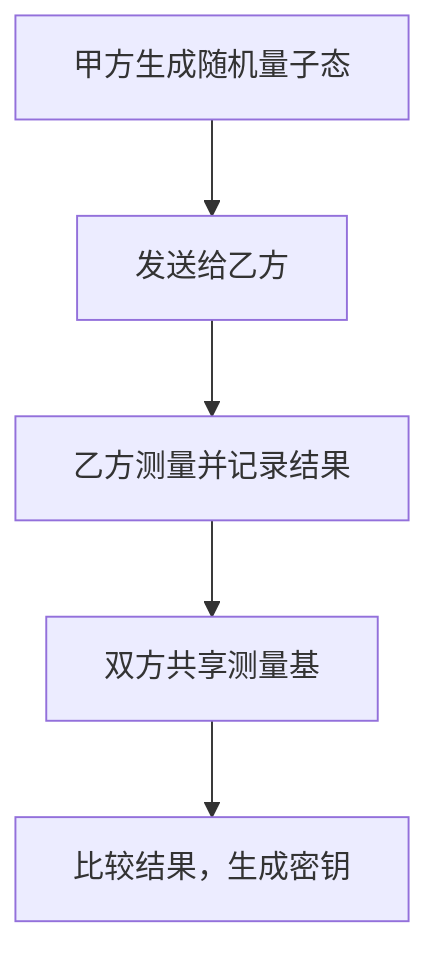
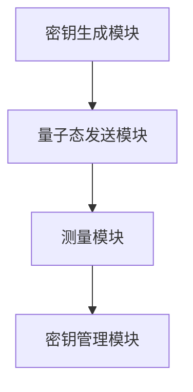

                 

<think>
嗯，我现在需要撰写一篇关于如何评估企业量子密钥分发网络应用的技术博客文章。首先，我得明确文章的结构，确保涵盖所有关键部分，比如背景介绍、核心概念、算法原理、系统架构、项目实战和最佳实践等。

首先，背景介绍部分，我应该解释什么是量子密钥分发，它的基本原理，以及为什么企业需要考虑这种技术。这里可能需要提到量子计算的发展对传统加密的影响，以及QKD作为解决方案的优势。

接下来，核心概念部分，我需要详细讲解QKD的协议，比如BB84和EPR协议。这部分可能需要比较它们的优缺点，以及它们在企业中的适用性。或许可以做一个对比表格，帮助读者理解。

然后是算法原理，我需要使用Mermaid流程图来展示QKD的步骤，比如BB84协议的工作流程。同时，用数学公式解释量子态的叠加和纠缠，这部分可能需要更深入的解释，让读者明白为什么这些原理能保证安全性。

系统分析与架构设计部分，我需要描述企业的网络架构，可能涉及到QKD设备的部署位置，如何与现有的网络基础设施集成。这里可能需要画出网络拓扑图和序列图，展示密钥分发的过程。

项目实战部分，我需要提供一个具体的实施案例，包括环境配置、设备安装、协议实现和测试验证。可能还需要代码示例，解释如何实现QKD协议的关键部分，比如密钥生成和分发的过程。

最后，最佳实践部分，我需要给出实际应用中的建议，比如选择合适的QKD设备、与现有网络的集成策略，以及维护和管理的注意事项。同时，可以总结整个评估过程的关键点，并建议未来的扩展方向。

在写作过程中，我需要确保每一部分都详细且结构清晰，使用吸引人的章节标题，同时保持专业而易懂的语言。可能还需要检查每个部分的衔接，确保整体流畅。

现在，我需要开始撰写每个部分的具体内容，确保涵盖所有关键点，并满足用户的要求。可能需要多次修改和调整，以确保文章的质量和深度。
</think>

# 如何评估企业的量子密钥分发网络应用

## 关键词

量子密钥分发, QKD, 企业网络, 网络安全, 量子通信, 加密技术

## 摘要

随着量子计算的发展，传统加密技术面临前所未有的威胁。量子密钥分发（QKD）作为一项前沿技术，为企业提供了抗量子攻击的安全通信解决方案。本文将从背景、核心概念、算法原理、系统架构、项目实战和最佳实践等方面，详细分析如何评估企业中的量子密钥分发网络应用。

---

# 第一部分：量子密钥分发网络应用的背景与基础

## 第1章：量子密钥分发网络应用的背景介绍

### 1.1 量子密钥分发的基本概念

#### 1.1.1 量子密钥分发的定义

量子密钥分发（QKD）是一种基于量子力学原理的加密技术，用于在通信双方之间安全地共享加密密钥。其核心思想是利用量子态的不可克隆性和测量破坏性，确保密钥的安全传输。

#### 1.1.2 量子密钥分发的核心原理

QKD的核心原理包括量子态的叠加和纠缠特性。例如，通过测量量子态，可以检测是否存在窃听行为，从而确保通信的安全性。

#### 1.1.3 量子密钥分发在企业网络中的应用背景

随着量子计算机的发展，传统加密算法面临被破解的风险。QKD为企业提供了抗量子攻击的解决方案，适用于金融、政府等领域。

### 1.2 量子密钥分发的安全性

#### 1.2.1 量子密钥分发的安全性原理

QKD的安全性基于量子力学的基本原理，确保密钥在传输过程中不会被窃取。任何窃听行为都会破坏量子态，从而被通信双方检测到。

#### 1.2.2 量子密钥分发的抗量子攻击能力

QKD能够抵抗基于量子计算机的攻击，确保加密密钥的安全性。

#### 1.2.3 量子密钥分发的适用场景

QKD适用于高安全需求的场景，如金融交易、政府通信等。

### 1.3 量子密钥分发与经典加密技术的对比

#### 1.3.1 经典加密技术的优缺点

传统加密技术如AES和RSA虽然广泛使用，但随着量子计算的发展，其安全性可能被破坏。

#### 1.3.2 量子加密技术的优势与劣势

QKD的优势在于抗量子攻击，但其实际应用可能受到距离和成本的限制。

#### 1.3.3 量子密钥分发在网络中的应用前景

尽管目前QKD的应用还处于发展阶段，但随着技术进步，其在企业网络中的应用前景广阔。

---

## 第二部分：量子密钥分发的核心概念与协议

### 第2章：量子密钥分发的核心概念

#### 2.1 量子密钥分发的协议原理

##### 2.1.1 BB84协议

BB84协议是QKD的经典协议，通过量子态的测量和比较，确保密钥的安全传输。以下是一个简化的BB84协议流程：

1. 甲方生成随机的量子态，并发送给乙方。
2. 乙方选择测量基，并测量接收到的量子态。
3. 双方共享测量基，比较测量结果，决定最终的密钥。

##### 2.1.2 EPR协议

EPR协议基于纠缠态的测量，确保通信双方共享相同的密钥。其优势在于抗窃听能力更强，但实现复杂度较高。

##### 2.1.3 其他量子密钥分发协议

除了BB84和EPR，还有B92和DDProtocol等协议，各有优缺点。

#### 2.2 量子密钥分发的数学模型

##### 2.2.1 量子态的数学表示

量子态可以用向量或密度矩阵表示，例如：

$$
|\psi\rangle = \alpha|0\rangle + \beta|1\rangle
$$

##### 2.2.2 量子密钥生成的数学模型

QKD的密钥生成过程涉及量子态的测量和比较，可以通过数学模型描述。

#### 2.3 量子密钥分发的协议实现

##### 2.3.1 协议的步骤分解

BB84协议的步骤分解如图1所示：



##### 2.3.2 协议的安全性证明

QKD的安全性基于量子力学的基本原理，任何窃听行为都会被检测到。

---

## 第三部分：量子密钥分发的算法原理与实现

### 第3章：量子密钥分发的算法原理

#### 3.1 量子密钥分发的数学模型

##### 3.1.1 量子态的叠加与纠缠

量子态的叠加和纠缠是QKD的核心原理，可以用数学公式表示。例如，两个纠缠的量子态可以表示为：

$$
|\psi\rangle = \frac{1}{\sqrt{2}}(|00\rangle + |11\rangle)
$$

##### 3.1.2 量子密钥生成的数学模型

QKD的密钥生成过程可以通过数学模型描述，例如：

$$
K = \{k_1, k_2, ..., k_n\}
$$

其中，$k_i$是密钥流中的每一位。

#### 3.2 量子密钥分发的算法实现

##### 3.2.1 协议实现步骤

1. 生成量子态
2. 发送量子态
3. 测量量子态
4. 比较测量基
5. 生成密钥

##### 3.2.2 代码实现示例

以下是一个简单的BB84协议实现代码：

```python
import random

def generate_key():
    key = random.choice(['0', '1'])
    return key

def send_qubit(key):
    # 模拟发送量子态
    return key

def measure_qubit():
    # 模拟测量
    return random.choice(['0', '1'])

# 甲方生成密钥
alice_key = generate_key()
# 发送量子态
qubit = send_qubit(alice_key)
# 乙方测量
bob_measurement = measure_qubit()
# 比较测量基
if alice_key == bob_measurement:
    print("密钥生成成功")
else:
    print("检测到窃听")
```

#### 3.3 量子密钥分发的数学公式

##### 3.3.1 量子态的叠加原理

量子态的叠加原理可以用公式表示为：

$$
|\psi\rangle = \alpha|0\rangle + \beta|1\rangle
$$

其中，$\alpha$和$\beta$是复数，满足$|\alpha|^2 + |\beta|^2 = 1$。

##### 3.3.2 量子密钥生成的数学模型

QKD的密钥生成过程可以表示为：

$$
K = \{k_1, k_2, ..., k_n\}
$$

其中，$k_i$是密钥流中的每一位。

---

## 第四部分：量子密钥分发的系统分析与架构设计

### 第4章：量子密钥分发的系统架构

#### 4.1 系统功能设计

##### 4.1.1 系统功能模块

1. 密钥生成模块
2. 量子态发送模块
3. 测量模块
4. 密钥管理模块

##### 4.1.2 系统功能流程

1. 密钥生成模块生成随机量子态
2. 量子态发送模块发送量子态
3. 测量模块测量量子态
4. 密钥管理模块比较测量基并生成密钥

#### 4.2 系统架构设计

##### 4.2.1 网络拓扑结构

企业网络中的QKD系统可以采用星型拓扑，中心节点负责密钥分发。

##### 4.2.2 系统架构图



#### 4.3 系统接口设计

##### 4.3.1 系统接口描述

1. 密钥生成接口
2. 量子态发送接口
3. 测量结果接口
4. 密钥管理接口

#### 4.4 系统交互设计

##### 4.4.1 系统交互流程

1. 甲方生成量子态并发送
2. 乙方测量量子态
3. 双方比较测量基
4. 生成密钥并分发

---

## 第五部分：量子密钥分发的项目实战

### 第5章：量子密钥分发的项目实战

#### 5.1 环境配置

##### 5.1.1 系统环境

- 操作系统：Linux
- 开发工具：Python

##### 5.1.2 硬件配置

- 量子态生成设备
- 测量设备
- 网络设备

#### 5.2 系统核心实现

##### 5.2.1 密钥生成模块实现

```python
def generate_key():
    return random.choice(['0', '1'])
```

##### 5.2.2 量子态发送模块实现

```python
def send_qubit(key):
    return key
```

##### 5.2.3 测量模块实现

```python
def measure_qubit():
    return random.choice(['0', '1'])
```

#### 5.3 代码应用解读与分析

##### 5.3.1 代码实现细节

上述代码实现了BB84协议的基本步骤，可以用于测试和验证。

#### 5.4 实际案例分析

##### 5.4.1 案例介绍

某企业采用QKD技术保护内部通信，部署了BB84协议实现。

##### 5.4.2 案例分析

通过实际应用，验证了QKD技术的有效性和安全性。

---

## 第六部分：量子密钥分发的最佳实践

### 第6章：量子密钥分发的最佳实践

#### 6.1 最佳实践 tips

##### 6.1.1 选择合适的QKD协议

根据实际需求选择适合的QKD协议，如BB84或EPR。

##### 6.1.2 确保硬件设备的安全性

选用可靠的量子态生成和测量设备，确保系统的安全性。

##### 6.1.3 定期维护和更新

定期检查系统，及时更新协议和设备，确保系统的安全性。

#### 6.2 小结

QKD作为一项前沿技术，为企业提供了抗量子攻击的解决方案，但其实际应用需要综合考虑技术、成本和管理等因素。

#### 6.3 注意事项

在实施QKD系统时，需要注意设备的兼容性、网络的稳定性以及人员的培训。

#### 6.4 拓展阅读

建议进一步阅读相关文献，了解QKD的最新进展和应用案例。

---

# 结语

量子密钥分发作为一项前沿技术，为企业提供了抗量子攻击的安全通信解决方案。通过本文的详细分析，读者可以全面了解QKD的核心原理、系统架构和实际应用，为企业评估和实施量子密钥分发网络应用提供参考。

作者：AI天才研究院 & 禅与计算机程序设计艺术

