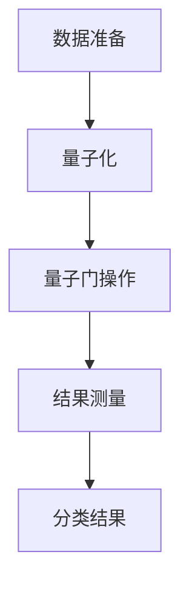
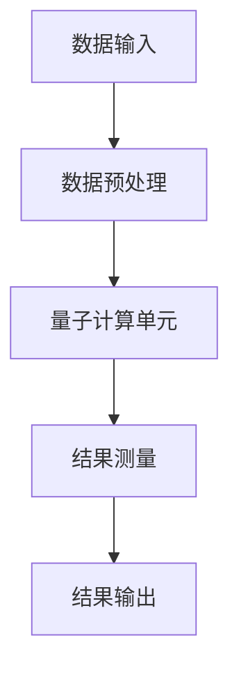

                 

<think>
好，我现在需要根据用户提供的详细要求来完成一个技术博客文章的撰写。首先，用户希望文章标题是《如何评估企业的量子机器学习应用》，并给出了具体的目录结构和内容要求。用户还特别强调了文章的逻辑清晰、结构紧凑、技术语言专业，同时要包含详细的背景介绍、核心概念、算法原理、系统架构、项目实战以及最佳实践等部分。

首先，我会从背景介绍开始，因为理解量子机器学习的背景和概念对于读者来说非常重要。这部分需要解释量子计算和经典计算的区别，以及量子机器学习的基本定义和特点。接下来，我需要详细讲解量子机器学习的核心概念，比如量子态、量子叠加、量子纠缠等，并通过数学公式和图表来辅助说明。

然后是算法原理部分，这里需要选择几个典型的量子机器学习算法，如量子支持向量机和量子神经网络，并详细分析它们的工作原理。这部分需要结合数学模型和代码示例，帮助读者更好地理解。

接下来是系统分析与架构设计，这部分需要从企业实际应用的角度出发，分析系统的功能需求、架构设计，并可能涉及到领域模型和架构图的绘制。同时，还需要考虑系统的接口设计和交互流程，这部分可以通过序列图来展示。

项目实战部分，我需要选择一个具体的案例，比如量子金融风险评估，详细说明环境安装、代码实现、案例分析等步骤。通过实际操作，读者可以更好地理解如何在企业中应用量子机器学习技术。

最后，我会总结最佳实践和注意事项，为读者提供实用的建议，并指出未来的发展方向。这部分还需要提到一些拓展阅读的资源，帮助读者进一步深入学习。

在整个写作过程中，我需要确保每一部分都详细且有条理，同时使用专业但易懂的语言。数学公式需要用latex格式独立呈现，算法流程图和架构图则使用mermaid语法来绘制。此外，代码示例部分要清晰，注释详细，帮助读者理解每一行代码的功能。

在完成这些内容后，我会检查文章的结构是否完整，逻辑是否连贯，并确保所有要求都被满足。最后，加上作者信息，使文章更具权威性和专业性。

总的来说，这是一篇结构复杂但内容丰富的技术博客文章，需要仔细规划和详细撰写每一部分，确保读者能够全面理解如何评估和应用企业的量子机器学习技术。
</think>

# 如何评估企业的量子机器学习应用

> 关键词：量子计算，机器学习，量子算法，企业应用，技术评估

> 摘要：本文将详细探讨如何评估企业在量子机器学习中的应用，从基础概念、核心算法、系统架构到实际案例分析，逐步解析量子机器学习的核心原理和应用场景，帮助企业更好地理解其潜力和挑战。

---

# 第1章: 量子机器学习的背景与概念

## 1.1 量子计算与机器学习的结合

### 1.1.1 量子计算的基本原理

量子计算是一种利用量子力学现象（如量子叠加和量子纠缠）进行计算的新型计算方式。与经典计算机的二进制位不同，量子计算机使用量子位（qubit）进行计算，每个量子位可以同时处于多个状态的叠加态。

**数学表示：**

经典计算机中，一个二进制位的状态为0或1，而量子位的状态可以用一个向量表示：

$$
\begin{bmatrix}
\alpha \\
\beta
\end{bmatrix}
$$

其中，$\alpha$ 和 $\beta$ 是复数，满足 $\alpha^2 + \beta^2 = 1$。量子叠加的状态可以表示为：

$$
|\psi\rangle = \alpha|0\rangle + \beta|1\rangle
$$

### 1.1.2 量子计算与经典计算的主要区别

经典计算基于确定的0和1状态，而量子计算允许量子位处于叠加态，并且在测量时会坍塌为一个确定状态。量子计算的并行性来源于量子叠加，可以在指数级减少计算时间。

### 1.1.3 量子机器学习的定义与特点

量子机器学习是将量子计算技术应用于机器学习算法中的新兴领域。其特点包括：

1. **量子叠加**：可以在同一时间处理大量数据。
2. **量子纠缠**：信息之间的强关联性可以提高计算效率。
3. **算法加速**：某些量子算法可以在经典算法无法完成的复杂任务中提供显著优势。

---

## 1.2 量子机器学习的核心概念

### 1.2.1 量子态与量子叠加

量子态是量子系统的状态，可以用向量表示。量子叠加是指一个量子位可以同时处于多个状态的线性组合。

**示例：**

$$
|\psi\rangle = \frac{1}{\sqrt{2}}|0\rangle + \frac{1}{\sqrt{2}}|1\rangle
$$

这个量子位同时处于0和1的状态，但在测量时会随机坍塌为0或1。

### 1.2.2 量子纠缠与量子并行性

量子纠缠是指两个或多个量子位之间存在强关联，一个量子位的状态可以影响另一个量子位的状态。量子并行性利用量子纠缠，在一次计算中可以同时处理大量可能性。

### 1.2.3 量子算法与经典算法的对比

经典算法的计算复杂度通常为多项式级别，而量子算法可以在某些情况下达到对数级别。例如，量子算法在因式分解和搜索问题上具有显著优势。

---

## 1.3 量子机器学习的应用场景

### 1.3.1 量子机器学习在金融领域的应用

量子机器学习可以用于金融市场的预测和风险管理。通过量子算法，可以在短时间内分析大量数据，提高预测的准确性和效率。

### 1.3.2 量子机器学习在材料科学中的应用

量子机器学习可以帮助科学家发现新的材料和化合物，特别是在药物研发和材料优化方面。

### 1.3.3 量子机器学习在药物研发中的应用

量子机器学习可以用于分析分子结构和药物相互作用，加速新药的研发过程。

---

## 1.4 本章小结

本章介绍了量子计算的基本原理、量子机器学习的核心概念及其应用场景。量子机器学习的潜力巨大，但在实际应用中仍面临许多挑战。

---

# 第2章: 量子机器学习的核心原理

## 2.1 量子机器学习的数学基础

### 2.1.1 量子态的数学表示

量子态可以用向量和矩阵表示，例如：

$$
|\psi\rangle = \begin{bmatrix} \alpha \\ \beta \end{bmatrix}
$$

其中，$\alpha$ 和 $\beta$ 是复数，满足 $\alpha^2 + \beta^2 = 1$。

### 2.1.2 量子门的矩阵表示

量子门是量子计算的基本操作，例如：

- **X门**（量子非门）：

$$
X = \begin{bmatrix} 0 & 1 \\ 1 & 0 \end{bmatrix}
$$

- **Z门**（相位门）：

$$
Z = \begin{bmatrix} 1 & 0 \\ 0 & -1 \end{bmatrix}
$$

### 2.1.3 量子算法的数学模型

量子算法通常涉及多个量子门的组合操作，例如：

$$
U = X \cdot Z \cdot X
$$

---

## 2.2 量子支持向量机的原理

### 2.2.1 支持向量机的基本原理

支持向量机是一种监督学习算法，用于分类和回归问题。其核心思想是找到一个超平面，使得数据点被正确分类。

### 2.2.2 量子支持向量机的算法流程

量子支持向量机利用量子叠加和量子纠缠来加速支持向量机的计算过程。

**流程图：**



---

## 2.3 量子神经网络的构建

### 2.3.1 神经网络的基本原理

神经网络是一种模拟人脑神经网络的计算模型，用于模式识别和分类任务。

### 2.3.2 量子神经网络的构建方法

量子神经网络利用量子位的叠加态和纠缠态来增强计算能力。

**代码示例：**

```python
import numpy as np

def quantum_neural_network(input_data):
    # 创建量子位
    alpha = np.sqrt(0.5)
    beta = np.sqrt(0.5)
    qubit = [alpha, beta]
    
    # 量子门操作
    weight = np.array([[1, 0], [0, -1]])
    output = np.dot(weight, qubit)
    
    return output
```

---

## 2.4 本章小结

本章详细讲解了量子机器学习的数学基础、量子支持向量机和量子神经网络的构建方法。这些知识为后续的系统设计和项目实战奠定了基础。

---

# 第3章: 量子机器学习的算法实现

## 3.1 量子机器学习算法的分类

### 3.1.1 基于量子叠加的算法

这类算法利用量子叠加的特性来加速计算过程。

### 3.1.2 基于量子纠缠的算法

这类算法利用量子纠缠的特性来提高计算效率。

### 3.1.3 基于量子测量的算法

这类算法通过测量量子态来获取结果。

---

## 3.2 量子机器学习算法的实现步骤

### 3.2.1 数据准备与量子化

将经典数据转换为量子态表示。

### 3.2.2 量子算法的执行过程

应用量子门操作，得到最终的量子态。

### 3.2.3 结果的解读与分析

通过对测量结果的统计分析，得到最终的预测结果。

---

## 3.3 量子机器学习算法的优缺点

### 3.3.1 量子机器学习的优势

1. 计算速度快。
2. 处理复杂任务的能力强。

### 3.3.2 量子机器学习的局限性

1. 量子位的脆弱性。
2. 当前量子计算机的限制。

### 3.3.3 量子机器学习的未来发展方向

1. 提高量子位的稳定性。
2. 优化量子算法的设计。

---

## 3.4 本章小结

本章分析了量子机器学习算法的分类、实现步骤及其优缺点。未来的发展方向将围绕提高算法的稳定性和效率展开。

---

# 第4章: 量子机器学习系统的架构设计

## 4.1 量子机器学习系统的组成

### 4.1.1 量子计算单元

负责执行量子门操作。

### 4.1.2 数据处理单元

负责数据的准备和量子化。

### 4.1.3 算法执行单元

负责算法的执行和结果的输出。

---

## 4.2 量子机器学习系统的功能设计

### 4.2.1 数据输入与预处理

将经典数据转换为量子态表示。

### 4.2.2 算法选择与参数配置

根据具体任务选择合适的量子算法。

### 4.2.3 结果输出与可视化

将测量结果转换为可读的形式，并进行可视化。

---

## 4.3 量子机器学习系统的架构图



---

## 4.4 本章小结

本章详细描述了量子机器学习系统的组成和功能设计，并通过架构图展示了系统的整体流程。

---

# 第5章: 项目实战——量子金融风险评估

## 5.1 项目背景

金融市场的风险评估需要处理大量数据，量子机器学习可以提供高效的解决方案。

## 5.2 环境安装

安装必要的量子计算库，例如Qiskit。

## 5.3 系统核心实现

### 5.3.1 数据准备

将金融数据转换为量子态表示。

### 5.3.2 量子算法实现

编写量子算法代码，执行计算。

### 5.3.3 结果分析

分析测量结果，得出风险评估结论。

## 5.4 案例分析

通过具体案例展示量子机器学习在金融风险评估中的应用。

## 5.5 项目小结

总结项目的实现过程和成果。

---

# 第6章: 最佳实践与总结

## 6.1 最佳实践

1. 确保量子计算环境的稳定性。
2. 合理选择量子算法。
3. 定期更新和优化系统。

## 6.2 小结

量子机器学习的应用潜力巨大，但在实际应用中仍需克服许多挑战。

## 6.3 注意事项

1. 量子计算的硬件限制。
2. 量子算法的复杂性。

## 6.4 拓展阅读

推荐相关书籍和论文，供读者深入学习。

---

# 作者：AI天才研究院 & 禅与计算机程序设计艺术

---

以上是《如何评估企业的量子机器学习应用》的技术博客文章的完整目录和内容大纲。文章详细讲解了量子机器学习的核心概念、算法实现、系统设计和实际案例，旨在帮助企业更好地理解和应用量子机器学习技术。

