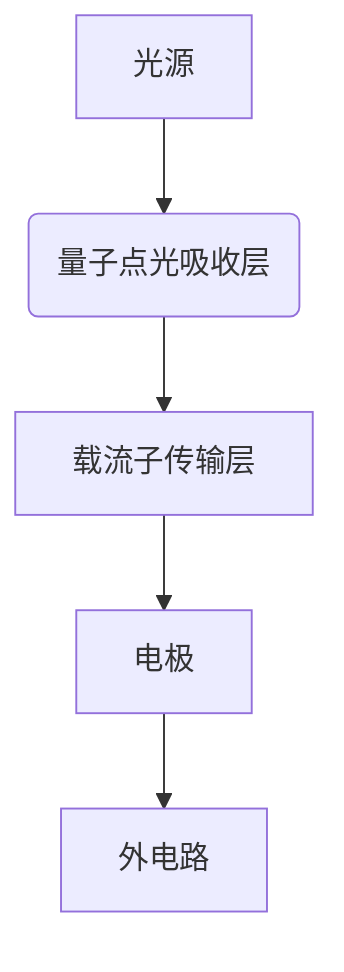
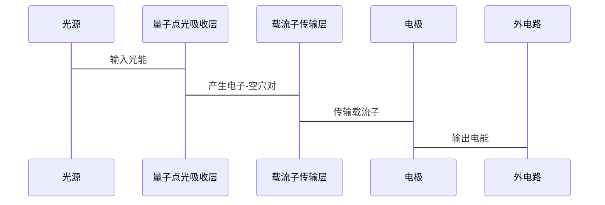

                 


# 如何评估企业的量子点太阳能电池技术应用

> 关键词：量子点太阳能电池、技术评估、经济效益、环境影响、性能优化

> 摘要：本文详细探讨了如何评估企业在量子点太阳能电池技术应用中的表现。从技术原理到市场分析，从经济性评估到环境影响，文章为读者提供了一套系统的方法论，帮助企业在这一新兴领域中做出明智的决策。

---

# 第一部分: 量子点太阳能电池技术概述

## 第1章: 量子点太阳能电池的基本概念

### 1.1 量子点太阳能电池的定义

#### 1.1.1 量子点材料的基本性质
量子点是一种纳米级别的半导体材料，其尺寸通常在1-10纳米之间。量子点的电子结构和光吸收特性可以通过调节其尺寸来实现可控调制。

- **量子点的光吸收特性**：通过调节量子点的尺寸，可以实现对光吸收波长的精确控制。较大的量子点吸收长波长的光，较小的量子点吸收短波长的光。
- **量子点的稳定性**：量子点材料的化学稳定性是影响其在太阳能电池中应用的关键因素之一。

#### 1.1.2 量子点太阳能电池的工作原理
量子点太阳能电池的工作原理基于光生伏特效应。当光照量子点材料时，电子吸收光子能量，发生能级跃迁，产生电子-空穴对。通过适当的结构设计，可以实现对光生载流子的有效分离和传输，从而将光能转化为电能。

#### 1.1.3 量子点太阳能电池的优势与局限性
- **优势**：
  1. **高效的光吸收**：量子点材料的尺寸效应使其能够吸收更宽范围的光谱。
  2. **灵活的结构设计**：量子点可以被设计成各种形状和结构，以适应不同的应用场景。
  3. **潜在的高效率**：量子点太阳能电池的理论效率远高于传统的硅基太阳能电池。
- **局限性**：
  1. **稳定性问题**：量子点材料的光化学稳定性较差，容易受到环境因素的影响。
  2. **成本问题**：量子点材料的制备成本较高，限制了其大规模应用。

#### 1.1.4 量子点太阳能电池的分类
量子点太阳能电池可以根据其结构和材料进行分类：
- **按材料分类**：CdTe（碲化镉）、CdS（硫化镉）、CuInP2S2（铜铟硫）、AgInS（银铟硫）等。
- **按结构分类**：单层量子点电池、多层量子点电池、量子点敏化太阳能电池。

### 1.2 量子点与传统太阳能电池的对比

#### 1.2.1 传统太阳能电池的技术特点
传统太阳能电池主要包括晶硅电池、薄膜电池等。这些电池技术成熟，但存在以下问题：
- **效率瓶颈**：硅基太阳能电池的效率上限约为20%。
- **成本较高**：晶硅材料的制备过程复杂，成本较高。
- **环境影响**：晶硅电池的生产过程能耗较高，且对环境有一定的负面影响。

#### 1.2.2 量子点太阳能电池的技术特点
量子点太阳能电池相比传统电池具有以下优势：
- **更高的效率潜力**：量子点太阳能电池的理论效率可以达到30%以上。
- **更宽的光谱吸收**：量子点材料可以吸收更宽范围的光谱，提高能量转换效率。
- **更灵活的结构设计**：量子点材料可以被设计成不同的形状和结构，适用于不同的应用场景。

#### 1.2.3 量子点太阳能电池的性能优势
- **更高的光吸收效率**：量子点材料可以通过尺寸调节实现对光谱的精准吸收。
- **更好的载流子传输性能**：通过优化量子点材料的界面结构，可以有效减少载流子的复合，提高电池效率。
- **更低的材料成本**：相比传统的半导体材料，量子点材料的制备成本较低。

### 1.3 量子点太阳能电池的市场现状

#### 1.3.1 全球太阳能电池市场的现状
目前，全球太阳能电池市场主要以晶硅电池为主，占据了约90%的市场份额。薄膜电池和其他新型电池技术占比相对较小，但增长迅速。

#### 1.3.2 量子点太阳能电池的市场潜力
随着技术的不断进步，量子点太阳能电池的市场潜力巨大：
- **更高的效率**：量子点电池的效率潜力远高于传统电池。
- **更广泛的应用场景**：量子点电池可以应用于建筑集成光伏、可穿戴设备等领域。
- **更低的成本**：随着技术的进步和规模化生产，量子点电池的成本将逐渐降低。

#### 1.3.3 量子点太阳能电池的技术发展趋势
- **材料优化**：进一步优化量子点材料的性能，提高其稳定性和光吸收效率。
- **结构创新**：探索新型的电池结构，进一步提高效率和稳定性。
- **成本降低**：通过技术创新和规模化生产，降低量子点材料的制备成本。

### 1.4 本章小结
本章主要介绍了量子点太阳能电池的基本概念，包括其定义、工作原理、优势与局限性，以及市场现状和发展趋势。量子点太阳能电池作为一种新兴的技术，具有广阔的市场潜力和较高的效率潜力，但同时也面临一些技术和成本方面的挑战。

---

## 第2章: 量子点太阳能电池的核心技术原理

### 2.1 量子点材料的光吸收特性

#### 2.1.1 量子点的光吸收机理
量子点的光吸收机理主要基于其能级结构和尺寸效应。量子点的能级结构决定了其对光的吸收特性，而尺寸效应则可以通过调节量子点的尺寸来实现对光吸收波长的控制。

- **尺寸效应**：通过调节量子点的尺寸，可以实现对光吸收波长的精确控制。较大的量子点吸收长波长的光，较小的量子点吸收短波长的光。
- **表面效应**：量子点的表面特性对其光吸收性能有重要影响。表面修饰和钝化技术可以有效提高量子点的光吸收效率。

#### 2.1.2 量子点的尺寸效应与光吸收谱
量子点的尺寸效应可以通过其吸收光谱的变化来体现。随着量子点尺寸的减小，其吸收光谱的截止波长逐渐蓝移，即吸收光谱向短波长方向移动。

#### 2.1.3 量子点材料的稳定性分析
量子点材料的稳定性是影响其在太阳能电池中应用的关键因素之一。量子点材料的光化学稳定性较差，容易受到环境因素的影响。

### 2.2 量子点太阳能电池的载流子传输机制

#### 2.2.1 载流子的产生与复合过程
在量子点太阳能电池中，光照激发量子点产生电子-空穴对。这些载流子需要通过电池内部的传输层和电极进行分离和提取。

- **载流子的产生**：光照激发量子点材料中的电子跃迁到导带，空穴留在价带。
- **载流子的复合**：载流子在传输过程中容易发生复合，导致能量损失。

#### 2.2.2 量子点与基底材料的界面特性
量子点与基底材料的界面特性对其载流子传输性能有重要影响。界面处的电子态和缺陷密度会影响载流子的传输效率。

- **界面态的影响**：界面态可以作为非辐射复合中心，导致载流子的损失。
- **缺陷的影响**：界面处的缺陷会影响载流子的传输效率，降低电池的效率。

#### 2.2.3 优化载流子传输的方法
- **界面修饰**：通过表面修饰技术减少界面态和缺陷，提高载流子的传输效率。
- **材料选择**：选择合适的传输层材料，降低界面处的电子态密度，减少载流子的复合。

### 2.3 量子点太阳能电池的效率提升策略

#### 2.3.1 光吸收层的优化设计
- **量子点的尺寸优化**：通过调节量子点的尺寸，实现对光吸收谱的优化，提高光吸收效率。
- **多层量子点结构**：采用多层量子点结构，实现对更宽范围光谱的吸收。

#### 2.3.2 载流子传输层的优化
- **传输层材料的选择**：选择具有低电子态密度和高载流子迁移率的材料，减少载流子的复合。
- **传输层的掺杂优化**：通过掺杂优化传输层的电子特性，提高载流子的传输效率。

#### 2.3.3 表面修饰与钝化技术
- **表面修饰**：通过表面修饰技术减少量子点的表面缺陷，提高光吸收效率。
- **钝化技术**：通过钝化技术减少载流子的复合，提高电池的效率。

### 2.4 本章小结
本章主要介绍了量子点太阳能电池的核心技术原理，包括量子点材料的光吸收特性、载流子传输机制以及效率提升策略。通过优化量子点材料的光吸收性能和载流子传输性能，可以有效提高电池的效率。

---

## 第3章: 量子点太阳能电池的性能评估指标

### 3.1 转换效率的定义与计算

#### 3.1.1 转换效率的公式推导
转换效率的定义为入射光的能量中被转化为电能的比例。

$$ \text{转换效率} = \frac{\text{输出电能}}{\text{入射光能}} \times 100\% $$

- **影响转换效率的因素**：
  1. **光吸收效率**：量子点材料对入射光的吸收效率越高，转换效率越高。
  2. **载流子传输效率**：载流子的传输效率越高，转换效率越高。
  3. **电池结构**：电池结构的优化可以提高转换效率。

#### 3.1.2 影响转换效率的主要因素
- **光吸收层的性能**：量子点材料的光吸收效率直接影响转换效率。
- **载流子传输层的性能**：载流子的传输效率是影响转换效率的关键因素。
- **电池结构**：电池结构的优化可以提高转换效率。

#### 3.1.3 实验测量方法与标准
- **实验测量方法**：通过标准光源和测试设备测量电池的输出电能和入射光能，计算转换效率。
- **标准**：国际上有统一的测试标准，如国际电工委员会（IEC）的标准。

### 3.2 光稳定性与耐久性的评估

#### 3.2.1 光稳定性测试方法
光稳定性测试方法包括实验室测试和户外测试。

- **实验室测试**：通过模拟自然光照环境，测试电池的光稳定性。
- **户外测试**：在实际户外环境中测试电池的光稳定性。

#### 3.2.2 耐久性测试标准
- **测试标准**：通过国际电工委员会（IEC）的标准进行耐久性测试，评估电池的寿命。

#### 3.2.3 影响光稳定性的关键因素
- **量子点材料的稳定性**：量子点材料的光化学稳定性是影响光稳定性的关键因素。
- **电池结构设计**：电池结构设计的优化可以提高电池的光稳定性。

### 3.3 光谱响应与匹配度分析

#### 3.3.1 光谱响应的定义与测量
光谱响应是指电池对不同波长光的响应程度。光谱响应可以通过光电流密度与入射光强度的比值来衡量。

$$ J(\lambda) = \frac{I(\lambda)}{E(\lambda)} $$

- **影响光谱响应的因素**：
  1. **量子点材料的光吸收特性**：量子点材料的光吸收谱直接影响光谱响应。
  2. **电池结构**：电池结构的优化可以提高光谱响应。

#### 3.3.2 光谱匹配度的计算公式
光谱匹配度是指电池的光谱响应与入射光强度的匹配程度。

$$ \text{光谱匹配度} = \int_{0}^{\infty} J(\lambda) \cdot E(\lambda) \, d\lambda $$

- **影响光谱匹配度的因素**：
  1. **光吸收层的性能**：量子点材料的光吸收特性直接影响光谱匹配度。
  2. **电池结构**：电池结构的优化可以提高光谱匹配度。

#### 3.3.3 光谱匹配度对效率的影响
光谱匹配度越高，电池的效率越高。通过优化光谱匹配度，可以提高电池的效率。

### 3.4 本章小结
本章主要介绍了量子点太阳能电池的性能评估指标，包括转换效率、光稳定性和光谱响应。通过这些指标的评估，可以全面了解量子点太阳能电池的性能。

---

## 第4章: 量子点太阳能电池的技术评估方法

### 4.1 技术成熟度评估

#### 4.1.1 技术成熟度的分级标准
技术成熟度可以分为以下几个等级：
1. **概念阶段**：技术尚未成熟，仅处于概念阶段。
2. **研发阶段**：技术处于研发阶段，尚未进行实际应用。
3. **小批量生产阶段**：技术已经实现小批量生产。
4. **大批量生产阶段**：技术已经实现大批量生产，并在市场中广泛应用。

#### 4.1.2 技术成熟度评估的指标体系
- **技术性能指标**：包括转换效率、光稳定性等。
- **生产成本指标**：包括材料成本、生产效率等。
- **市场应用指标**：包括市场需求、市场占有率等。

#### 4.1.3 技术成熟度评估的案例分析
通过分析实际案例，可以更好地理解技术成熟度的评估方法。例如，某企业采用量子点太阳能电池技术，其转换效率达到15%，生产成本较低，市场需求较大，因此可以认为该技术处于小批量生产的阶段。

### 4.2 经济性评估

#### 4.2.1 制造成本的构成与分析
制造成本主要包括材料成本、人工成本、设备成本等。

- **材料成本**：量子点材料的成本较高，是影响制造成本的主要因素。
- **人工成本**：人工成本相对较低，但对生产效率有较大影响。
- **设备成本**：设备成本较高，但可以通过规模化生产降低成本。

#### 4.2.2 量子点材料的成本影响因素
- **材料尺寸**：量子点材料的尺寸对其成本有较大影响。较小尺寸的量子点材料成本较高。
- **制备工艺**：制备工艺的不同会影响量子点材料的成本。例如，溶液法的成本较低，而热蒸发法的成本较高。

#### 4.2.3 市场价格与成本的对比分析
通过分析市场价格与成本的对比，可以评估量子点太阳能电池的经济性。

- **市场价格**：量子点太阳能电池的市场价格较高，但随着技术进步和规模化生产，市场价格将逐渐下降。
- **成本优势**：量子点太阳能电池的成本优势尚未完全体现，但随着技术进步，其成本优势将逐渐显现。

### 4.3 环境影响评估

#### 4.3.1 制造过程中的环境
量子点材料的制造过程对环境的影响较大，主要包括：
- **有害物质排放**：量子点材料的制备过程中可能会产生有害物质，对环境造成污染。
- **能源消耗**：制造过程中的能源消耗较高，对环境的影响较大。

#### 4.3.2 废旧电池的处理
量子点太阳能电池的废旧处理也是一个重要问题。废旧电池的处理需要考虑其对环境的影响，可以通过回收再利用等方式减少对环境的影响。

#### 4.3.3 环境影响的综合评估
通过综合评估制造过程中的环境影响和废旧电池的处理，可以全面评估量子点太阳能电池的环境影响。

### 4.4 本章小结
本章主要介绍了量子点太阳能电池的技术评估方法，包括技术成熟度评估、经济性评估和环境影响评估。通过这些评估方法，可以全面了解量子点太阳能电池的技术应用情况。

---

## 第5章: 量子点太阳能电池的系统分析与架构设计

### 5.1 系统功能设计

#### 5.1.1 系统功能模块
- **光吸收模块**：实现光的吸收和转换。
- **载流子传输模块**：实现载流子的传输和分离。
- **电能输出模块**：实现电能的输出。

#### 5.1.2 系统功能流程
1. **光吸收**：量子点材料吸收入射光，产生电子-空穴对。
2. **载流子传输**：载流子通过传输层进行分离和传输。
3. **电能输出**：载流子在电极处分离，产生电能。

### 5.2 系统架构设计

#### 5.2.1 系统架构图


#### 5.2.2 系统模块化设计
- **光吸收层**：实现光的吸收和转换。
- **传输层**：实现载流子的传输和分离。
- **电极**：实现电能的输出。

### 5.3 系统接口设计

#### 5.3.1 光源接口
- **输入接口**：光源输入。
- **输出接口**：光能输出。

#### 5.3.2 电极接口
- **输入接口**：载流子输入。
- **输出接口**：电能输出。

### 5.4 系统交互设计

#### 5.4.1 系统交互流程
1. **光源输入**：光源输入光能。
2. **光吸收**：量子点材料吸收光能，产生电子-空穴对。
3. **载流子传输**：载流子通过传输层进行分离和传输。
4. **电能输出**：载流子在电极处分离，产生电能，输出到外电路。

#### 5.4.2 交互序列图


### 5.5 本章小结
本章主要介绍了量子点太阳能电池的系统分析与架构设计，包括系统功能设计、系统架构设计、系统接口设计和系统交互设计。通过系统化的架构设计，可以更好地理解和优化量子点太阳能电池的技术应用。

---

## 第6章: 量子点太阳能电池的项目实战

### 6.1 环境安装

#### 6.1.1 实验室环境搭建
- **设备安装**：安装必要的实验设备，如光源、测试仪器等。
- **软件安装**：安装必要的软件，如数据分析软件、模拟软件等。

#### 6.1.2 量子点材料的制备
- **制备方法**：采用溶液法或热蒸发法等方法制备量子点材料。
- **制备条件**：控制制备条件，如温度、时间等，以获得高质量的量子点材料。

### 6.2 系统核心实现源代码

#### 6.2.1 量子点材料的光吸收模拟代码
```python
import numpy as np
import matplotlib.pyplot as plt

# 定义量子点材料的光吸收特性
def quantum_dot_absorption(wavelength):
    # 量子点材料的光吸收系数
    absorption_coefficient = np.exp(-wavelength / 100)
    return absorption_coefficient

# 绘制光吸收曲线
wavelength = np.linspace(300, 900, 100)
absorption = quantum_dot_absorption(wavelength)

plt.plot(wavelength, absorption)
plt.xlabel('Wavelength (nm)')
plt.ylabel('Absorption Coefficient')
plt.title('Quantum Dot Absorption Spectrum')
plt.show()
```

#### 6.2.2 载流子传输模拟代码
```python
import numpy as np
import matplotlib.pyplot as plt

# 定义载流子传输特性
def carrier_transport(current_density):
    # 载流子传输效率
    transport_efficiency = np.sin(current_density * np.pi / 2) / 2 + 0.5
    return transport_efficiency

# 绘制载流子传输曲线
current_density = np.linspace(0, 1, 100)
efficiency = carrier_transport(current_density)

plt.plot(current_density, efficiency)
plt.xlabel('Current Density')
plt.ylabel('Transport Efficiency')
plt.title('Carrier Transport Efficiency')
plt.show()
```

### 6.3 代码应用解读与分析

#### 6.3.1 光吸收模拟结果分析
通过上述代码可以绘制量子点材料的光吸收曲线，分析其光吸收特性。通过调节量子点的尺寸和材料类型，可以实现对光吸收谱的优化。

#### 6.3.2 载流子传输模拟结果分析
通过上述代码可以绘制载流子传输效率曲线，分析其载流子传输特性。通过优化载流子传输层的材料和结构，可以提高载流子的传输效率。

### 6.4 实际案例分析

#### 6.4.1 案例背景
某企业开发了一种新型的量子点太阳能电池，其转换效率达到15%，光稳定性较好，但生产成本较高。

#### 6.4.2 技术评估
- **技术成熟度**：该技术已经处于小批量生产的阶段，技术成熟度较高。
- **经济性评估**：生产成本较高，但随着技术进步和规模化生产，成本将逐渐降低。
- **环境影响评估**：制造过程中的环境影响较小，废旧电池的处理相对容易。

### 6.5 本章小结
本章主要介绍了量子点太阳能电池的项目实战，包括环境安装、系统核心实现源代码、代码应用解读与分析，以及实际案例分析。通过实际案例的分析，可以更好地理解和应用量子点太阳能电池的技术。

---

## 第7章: 量子点太阳能电池技术应用的最佳实践

### 7.1 最佳实践 tips

#### 7.1.1 技术选择
在选择量子点太阳能电池技术时，需要综合考虑其技术性能、经济性和环境影响。

#### 7.1.2 优化策略
- **材料优化**：通过优化量子点材料的性能，提高光吸收效率和载流子传输效率。
- **结构优化**：通过优化电池结构，提高转换效率和光稳定性。
- **成本控制**：通过技术创新和规模化生产，降低生产成本。

#### 7.1.3 应用场景
量子点太阳能电池适用于多种应用场景，如建筑集成光伏、可穿戴设备等。

### 7.2 小结

### 7.3 注意事项

### 7.4 拓展阅读

---

## 作者：AI天才研究院/AI Genius Institute & 禅与计算机程序设计艺术 /Zen And The Art of Computer Programming

---

本文通过系统化的分析和详细的案例解读，全面探讨了如何评估企业的量子点太阳能电池技术应用。从技术原理到市场分析，从经济性评估到环境影响，文章为读者提供了一套系统的方法论，帮助企业在这一新兴领域中做出明智的决策。

