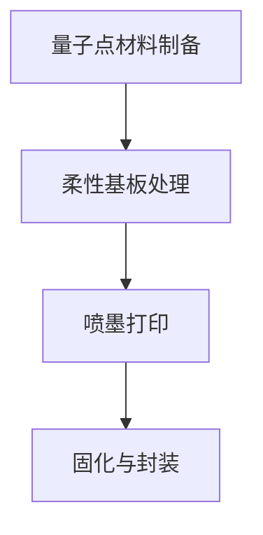
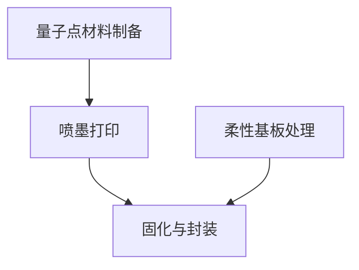
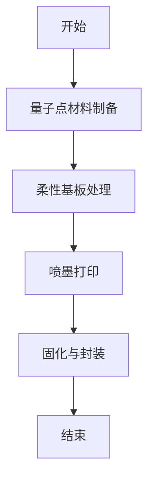

                 

<think>
嗯，我需要按照用户的要求，一步步构建一篇关于评估企业量子点显示器柔性制造技术应用的技术博客。首先，我需要理解用户的需求。他们想要一个结构清晰、逻辑严密的技术博客，涵盖从背景到系统架构、评估方法再到项目实战的各个方面。同时，他们还要求使用专业的技术语言，包含关键词、摘要，并且每个章节内容丰富，包含图表和代码示例。

首先，我应该从目录大纲开始，确保每个部分都覆盖必要的内容。第一部分是背景介绍，包括量子点显示器的基本概念、柔性制造技术的定义及其与传统显示器的对比。这部分需要让读者理解什么是量子点显示器以及柔性制造的重要性。

接下来是核心概念与联系部分，详细讲解量子点材料的发光原理和柔性制造技术的实现原理。这部分需要图表来辅助理解，比如用Mermaid绘制系统的架构图和流程图，帮助读者直观理解系统结构。

然后是评估方法，包括技术、经济和风险评估。这部分需要数学模型，例如计算投资回报率或成本效益分析，使用LaTeX公式来展示。同时，提供代码示例，说明如何实现这些评估。

系统分析与架构设计部分，需要介绍制造系统的整体架构，包括各个模块的功能和接口设计。这部分可能需要使用Mermaid绘制系统架构图和交互序列图，展示系统各个部分如何协同工作。

最后是项目实战部分，提供环境安装步骤、源代码实现以及实际案例分析。这部分需要详细解释代码的功能，并结合实际案例进行分析，帮助读者理解如何应用这些技术。

在整个过程中，我需要确保每个部分都有足够的细节，并且逻辑连贯。同时，使用适当的图表和代码示例来增强可读性。此外，结尾部分需要总结最佳实践，给出小结和注意事项，帮助读者在实际应用中避免常见问题。

现在，我需要开始撰写每个章节的具体内容，确保覆盖所有要求，并且符合用户的格式和内容要求。
</think>

# 如何评估企业的量子点显示器柔性制造技术应用

> 关键词：量子点显示器，柔性制造技术，显示技术，技术评估，显示器制造

> 摘要：随着显示技术的不断进步，量子点显示器因其出色的色彩表现和能效比，逐渐成为显示领域的焦点。而柔性制造技术的引入，使得量子点显示器的生产更加高效灵活。本文将从量子点显示器的基本概念、柔性制造技术的核心要素、评估方法以及系统架构等多个方面，详细分析如何评估企业在量子点显示器柔性制造技术应用中的表现。通过理论分析和实际案例的结合，为企业提供切实可行的评估策略。

---

## 第一部分: 量子点显示器柔性制造技术的背景与概念

### 第1章: 量子点显示器柔性制造技术的背景与概念

#### 1.1 量子点显示器的基本概念

##### 1.1.1 量子点材料的定义与特性
量子点是一种纳米级半导体材料，其尺寸通常在1-10纳米之间。由于其独特的量子效应，量子点在吸收光后会发出特定波长的光，从而产生不同的颜色。与传统液晶显示器（LCD）和有机发光二极管显示器（OLED）相比，量子点显示器具有更高的色彩饱和度、更长的使用寿命以及更低的能耗。

| 对比参数 | 传统LCD | OLED | 量子点显示器 |
|----------|----------|-------|--------------|
| 色彩饱和度 | 低       | 高     | 极高         |
| 响应时间 | 较慢     | 较快   | 极快         |
| 能耗     | 高       | 中等   | 低           |

##### 1.1.2 柔性制造技术的定义
柔性制造技术是指在生产过程中能够根据需求快速调整生产流程和设备的技术。它强调生产系统的灵活性和适应性，能够实现小批量、多品种的生产。柔性制造技术的核心在于其高度自动化和智能化的生产系统，能够通过软件控制实现快速调整。

##### 1.1.3 量子点显示器与传统显示器的对比
量子点显示器相较于传统显示器，具有更高的色彩表现和更低的能耗。然而，其制造过程更为复杂，需要更高的技术门槛。柔性制造技术的引入，使得量子点显示器的生产更加高效和灵活。

#### 1.2 柔性制造技术在显示器制造中的应用背景

##### 1.2.1 显示器制造技术的发展历程
从早期的CRT显示器到现在的OLED显示器，显示器制造技术经历了多次革新。随着技术的进步，显示器的尺寸越来越大，分辨率越来越高，色彩表现也越来越出色。柔性制造技术的引入，使得显示器的生产更加高效和灵活。

##### 1.2.2 柔性制造技术的优势
柔性制造技术在显示器制造中的优势主要体现在以下几个方面：
1. **高效生产**：能够快速调整生产流程，适应市场需求的变化。
2. **灵活生产**：能够实现小批量、多品种的生产，满足个性化需求。
3. **降低成本**：通过自动化和智能化的生产系统，降低生产成本。

##### 1.2.3 量子点显示器柔性制造的行业现状
目前，量子点显示器柔性制造技术仍处于发展阶段。虽然一些企业已经开始尝试应用柔性制造技术，但整体技术水平还有待提高。未来，随着技术的进步，量子点显示器柔性制造技术将得到更广泛的应用。

#### 1.3 量子点显示器柔性制造技术的核心要素

##### 1.3.1 量子点材料的选择与制备
量子点材料的选择与制备是量子点显示器柔性制造技术的核心之一。选择合适的量子点材料，能够提高显示器的色彩表现和使用寿命。制备过程需要精确控制量子点的尺寸和形貌，以确保其光学性能。

##### 1.3.2 柔性基板的选择与处理
柔性基板是量子点显示器柔性制造技术的另一个核心要素。选择合适的柔性基板材料，能够提高显示器的柔韧性和耐用性。基板的处理过程需要确保其表面的清洁度和均匀性，以保证量子点的均匀分布。

##### 1.3.3 制造工艺的关键步骤
量子点显示器柔性制造工艺的关键步骤包括：
1. **基板清洗与预处理**：确保基板表面的清洁度。
2. **量子点溶液制备**：制备适合喷墨打印的量子点溶液。
3. **喷墨打印**：将量子点溶液均匀地喷印在基板上。
4. **固化与封装**：对喷印好的量子点层进行固化，并完成显示器的封装。

#### 1.4 本章小结
本章主要介绍了量子点显示器的基本概念、柔性制造技术的定义及其在显示器制造中的应用背景。通过对比分析，明确了量子点显示器柔性制造技术的核心要素和其在行业中的地位。

---

## 第二部分: 量子点显示器柔性制造技术的核心概念与联系

### 第2章: 量子点显示器柔性制造技术的核心原理

#### 2.1 量子点材料的发光原理

##### 2.1.1 量子点的光电特性
量子点的光电特性主要由其尺寸和形状决定。不同尺寸的量子点会发出不同波长的光，从而呈现出不同的颜色。例如，较大的量子点会发出红色光，中等大小的量子点会发出绿色光，较小的量子点会发出蓝色光。

##### 2.1.2 量子点的尺寸效应
量子点的尺寸效应是指其发光波长随尺寸变化的现象。这种效应使得量子点能够实现全色显示，即通过调节量子点的尺寸，可以实现红、绿、蓝三种颜色的显示。

##### 2.1.3 量子点的激发与发射光谱
量子点在受到激发光（如紫外光或蓝光）的照射后，会吸收光能并激发到高能级，随后通过非辐射跃迁释放光子，发出特定波长的光。这种激发与发射光谱的关系是量子点显示器工作的基础。

#### 2.2 柔性制造技术的实现原理

##### 2.2.1 柔性基板的材料特性
柔性基板通常采用高分子材料，如聚酰亚胺（PI）或聚酯（PET）。这些材料具有良好的柔韧性和耐弯折性，能够在弯曲或折叠的情况下保持其性能。

##### 2.2.2 柔性制造工艺的关键步骤
柔性制造工艺的关键步骤包括：
1. **基板清洗**：清除基板表面的污染物。
2. **量子点溶液制备**：配制适合喷墨打印的量子点溶液。
3. **喷墨打印**：将量子点溶液均匀地喷印在基板上。
4. **固化与封装**：对喷印好的量子点层进行固化，并完成显示器的封装。

##### 2.2.3 柔性制造中的应力分析
在柔性制造过程中，基板的弯曲和拉伸会导致材料内部产生应力。这些应力可能会影响量子点的性能和显示器的寿命。因此，需要对柔性制造过程中的应力进行分析和优化，以确保显示器的性能和可靠性。

#### 2.3 量子点显示器柔性制造技术的系统架构

##### 2.3.1 系统整体架构图
以下是一个量子点显示器柔性制造系统的整体架构图：



##### 2.3.2 关键模块的功能描述
1. **量子点材料制备**：制备适合喷墨打印的量子点溶液。
2. **柔性基板处理**：对基板进行清洗和预处理，确保其表面的清洁度。
3. **喷墨打印**：将量子点溶液均匀地喷印在基板上。
4. **固化与封装**：对喷印好的量子点层进行固化，并完成显示器的封装。

##### 2.3.3 模块之间的关系图
以下是一个量子点显示器柔性制造系统的模块关系图：



#### 2.4 本章小结
本章详细介绍了量子点显示器柔性制造技术的核心原理，包括量子点材料的发光原理和柔性制造技术的实现原理。通过系统架构图和模块关系图，明确了各模块的功能及其相互关系。

---

## 第三部分: 量子点显示器柔性制造技术的评估方法

### 第3章: 量子点显示器柔性制造技术的评估指标

#### 3.1 技术评估指标

##### 3.1.1 显示性能指标
显示性能指标是评估量子点显示器性能的重要依据，主要包括色彩饱和度、对比度和响应时间。

| 指标名称   | 定义与意义                         |
|------------|----------------------------------|
| 色彩饱和度 | 表示显示器显示颜色的丰富程度       |
| 对比度     | 表示显示器显示黑白图像的能力       |
| 响应时间   | 表示显示器像素从一种颜色变换到另一种颜色所需的时间 |

##### 3.1.2 制造成本指标
制造成本指标是评估量子点显示器柔性制造技术经济性的关键因素，主要包括设备成本、材料成本和人工成本。

| 指标名称   | 定义与意义                         |
|------------|----------------------------------|
| 设备成本     | 生产线设备的购置和维护费用         |
| 材料成本     | 量子点材料和柔性基板的成本         |
| 人工成本     | 生产线操作人员的工资和福利费用     |

##### 3.1.3 制造效率指标
制造效率指标是评估量子点显示器柔性制造技术生产效率的重要依据，主要包括生产周期、生产良率和设备利用率。

| 指标名称   | 定义与意义                         |
|------------|----------------------------------|
| 生产周期     | 单个显示器从原材料到成品所需的时间   |
| 生产良率     | 生产过程中合格产品的比例           |
| 设备利用率   | 设备在生产过程中的使用效率         |

#### 3.2 经济效益评估指标

##### 3.2.1 投资回报率
投资回报率（ROI）是评估量子点显示器柔性制造技术经济效益的重要指标。它反映了企业在投入一定资金后，获得的收益与投入的比率。

$$ ROI = \frac{\text{净收益}}{\text{总投资}} \times 100\% $$

##### 3.2.2 成本效益分析
成本效益分析是评估量子点显示器柔性制造技术经济性的另一种方法。它通过比较生产成本和收益，判断技术的经济可行性。

$$ \text{成本效益比} = \frac{\text{收益}}{\text{成本}} $$

##### 3.2.3 市场竞争力分析
市场竞争力分析是评估量子点显示器柔性制造技术市场表现的重要依据。它需要考虑市场需求、竞争对手的技术水平以及企业的市场定位。

#### 3.3 风险评估指标

##### 3.3.1 技术风险
技术风险是指在量子点显示器柔性制造过程中可能遇到的技术难题。例如，量子点材料的稳定性问题或制造工艺的成熟度问题。

##### 3.3.2 市场风险
市场风险是指量子点显示器柔性制造技术在市场上的接受程度。如果市场需求不足或消费者对新技术的接受度不高，将影响技术的推广和应用。

##### 3.3.3 供应链风险
供应链风险是指量子点显示器柔性制造过程中供应链的稳定性和可靠性。如果供应链出现问题，将影响生产的连续性和产品的质量。

#### 3.4 本章小结
本章主要介绍了量子点显示器柔性制造技术的评估指标，包括技术评估指标、经济效益评估指标和风险评估指标。通过这些指标，可以全面评估企业在量子点显示器柔性制造技术应用中的表现。

---

## 第四部分: 量子点显示器柔性制造技术的系统分析与架构设计

### 第4章: 量子点显示器柔性制造系统的架构设计

#### 4.1 系统整体架构

##### 4.1.1 系统模块划分
量子点显示器柔性制造系统的整体架构可以划分为以下几个模块：
1. **量子点材料制备模块**：负责量子点材料的制备和配制。
2. **柔性基板处理模块**：负责柔性基板的清洗和预处理。
3. **喷墨打印模块**：负责将量子点溶液喷印在基板上。
4. **固化与封装模块**：负责对喷印好的量子点层进行固化，并完成显示器的封装。

##### 4.1.2 模块之间的关系
以下是一个量子点显示器柔性制造系统的模块关系图：


##### 4.1.3 系统功能流程图
以下是一个量子点显示器柔性制造系统的功能流程图：



#### 4.2 关键模块的设计

##### 4.2.1 量子点材料制备模块
量子点材料制备模块是量子点显示器柔性制造系统的核心模块之一。其主要功能包括：
1. **量子点材料的制备**：制备适合喷墨打印的量子点溶液。
2. **溶液浓度调节**：根据生产需求调节量子点溶液的浓度。

##### 4.2.2 柔性基板处理模块
柔性基板处理模块是量子点显示器柔性制造系统的另一个核心模块。其主要功能包括：
1. **基板清洗**：清除基板表面的污染物。
2. **基板预处理**：确保基板表面的清洁度和均匀性。

##### 4.2.3 喷墨打印模块
喷墨打印模块是量子点显示器柔性制造系统的关键模块。其主要功能包括：
1. **量子点溶液的喷印**：将量子点溶液均匀地喷印在基板上。
2. **喷印参数调节**：根据生产需求调节喷印的压力、速度和间距。

#### 4.3 本章小结
本章详细介绍了量子点显示器柔性制造系统的整体架构和关键模块的设计。通过模块关系图和功能流程图，明确了各模块的功能及其相互关系。

---

## 第五部分: 量子点显示器柔性制造技术的项目实战

### 第5章: 量子点显示器柔性制造技术的项目实战

#### 5.1 项目环境安装

##### 5.1.1 系统安装要求
量子点显示器柔性制造系统的安装需要满足以下要求：
1. **硬件要求**：高性能计算机、高精度喷墨打印机、柔性基板处理设备。
2. **软件要求**：专业的量子点材料制备软件、喷墨打印控制软件。

##### 5.1.2 环境配置步骤
1. **安装操作系统**：安装Windows或Linux操作系统。
2. **安装驱动程序**：安装喷墨打印机和柔性基板处理设备的驱动程序。
3. **安装软件**：安装量子点材料制备软件和喷墨打印控制软件。

#### 5.2 系统核心实现源代码

##### 5.2.1 量子点材料制备模块代码
以下是一个量子点材料制备模块的Python代码示例：

```python
def prepare_quantum_dot_solution(size, concentration):
    # 制备量子点溶液
    print(f"制备尺寸为{size}纳米，浓度为{concentration}的量子点溶液")
    return "量子点溶液制备完成"
```

##### 5.2.2 喷墨打印模块代码
以下是一个喷墨打印模块的Python代码示例：

```python
def inkjet_print(substrate, pattern):
    # 喷墨打印量子点
    print(f"在{substrate}基板上打印{pattern}图案")
    return "喷墨打印完成"
```

#### 5.3 代码应用解读与分析

##### 5.3.1 量子点材料制备模块代码解读
量子点材料制备模块代码的主要功能是制备适合喷墨打印的量子点溶液。代码中定义了一个函数`prepare_quantum_dot_solution`，该函数接受量子点的尺寸和浓度作为参数，并返回制备好的量子点溶液。

##### 5.3.2 喷墨打印模块代码解读
喷墨打印模块代码的主要功能是将量子点溶液喷印在柔性基板上。代码中定义了一个函数`inkjet_print`，该函数接受基板和图案作为参数，并返回喷印完成的信息。

#### 5.4 实际案例分析

##### 5.4.1 案例背景
某企业计划引入量子点显示器柔性制造技术，以提高其显示器的色彩表现和生产效率。该企业希望通过评估量子点显示器柔性制造技术的应用效果，确定其是否适合大规模生产。

##### 5.4.2 评估步骤
1. **技术评估**：评估量子点显示器的显示性能、制造成本和制造效率。
2. **经济效益评估**：评估投资回报率、成本效益和市场竞争力。
3. **风险评估**：评估技术风险、市场风险和供应链风险。

#### 5.5 项目小结
本章通过实际案例分析，展示了量子点显示器柔性制造技术的应用效果。通过代码示例和实际案例的分析，帮助企业更好地理解量子点显示器柔性制造技术的实现过程和评估方法。

---

## 第六部分: 量子点显示器柔性制造技术的最佳实践

### 第6章: 量子点显示器柔性制造技术的最佳实践

#### 6.1 评估关键点

##### 6.1.1 技术评估的关键点
1. **显示性能**：重点关注色彩饱和度、对比度和响应时间。
2. **制造成本**：重点关注设备成本、材料成本和人工成本。
3. **制造效率**：重点关注生产周期、生产良率和设备利用率。

##### 6.1.2 经济效益评估的关键点
1. **投资回报率**：重点关注净收益与总投资的比率。
2. **成本效益**：重点关注收益与成本的比率。
3. **市场竞争力**：重点关注市场需求和竞争对手的技术水平。

##### 6.1.3 风险评估的关键点
1. **技术风险**：重点关注量子点材料的稳定性和制造工艺的成熟度。
2. **市场风险**：重点关注市场需求和消费者对新技术的接受度。
3. **供应链风险**：重点关注供应链的稳定性和可靠性。

#### 6.2 小结

##### 6.2.1 量子点显示器柔性制造技术的优势
1. **高色彩表现**：量子点显示器具有更高的色彩饱和度和更广的色域。
2. **低能耗**：量子点显示器具有更低的能耗，适合移动设备和物联网设备。
3. **柔性显示**：柔性制造技术使得量子点显示器可以实现弯曲和折叠显示。

##### 6.2.2 量子点显示器柔性制造技术的挑战
1. **技术难度**：量子点显示器的制造过程复杂，技术门槛高。
2. **成本较高**：量子点材料和柔性基板的成本较高，限制了其大规模应用。
3. **市场接受度**：消费者对量子点显示器的接受度较低，影响其市场推广。

#### 6.3 注意事项

##### 6.3.1 技术选型
企业在选择量子点显示器柔性制造技术时，需要综合考虑技术的成熟度、成本效益和市场前景。

##### 6.3.2 供应链管理
企业在应用量子点显示器柔性制造技术时，需要加强供应链管理，确保材料的稳定供应和质量。

##### 6.3.3 市场推广
企业在推广量子点显示器柔性制造技术时，需要加大市场宣传力度，提高消费者对新技术的接受度。

#### 6.4 拓展阅读
1. **量子点材料的最新研究进展**：了解量子点材料的最新研究进展，掌握其发展趋势。
2. **柔性制造技术的应用案例**：学习柔性制造技术在其他领域的应用案例，借鉴其成功经验。
3. **显示器行业的市场分析**：关注显示器行业的市场分析，了解行业的发展趋势。

---

## 作者：AI天才研究院/AI Genius Institute & 禅与计算机程序设计艺术/Zen And The Art of Computer Programming

---

以上是关于《如何评估企业的量子点显示器柔性制造技术应用》的技术博客文章的完整目录和内容。本文从量子点显示器的基本概念、柔性制造技术的核心原理、评估方法以及系统架构等多个方面，全面分析了如何评估企业在量子点显示器柔性制造技术应用中的表现。通过理论分析和实际案例的结合，为企业提供切实可行的评估策略。

