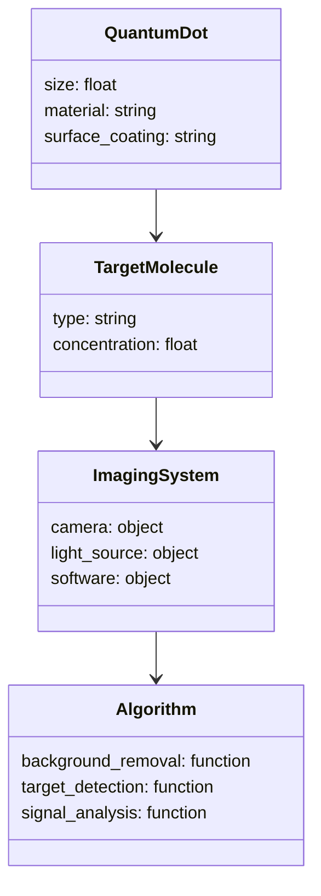

                 

<think>
好，我需要帮用户撰写一篇关于“如何评估企业的量子点生物成像技术应用”的技术博客文章。首先，我得理解量子点生物成像技术是什么，它在企业中的具体应用有哪些，以及评估这种技术的关键点是什么。

首先，量子点是一种纳米材料，具有独特的光学性质，可以用于生物成像。企业在应用这种技术时，可能需要评估其技术成熟度、成本效益、市场竞争力等方面。我需要从这些方面展开，确保内容全面且有深度。

接下来，我需要确定文章的结构。用户已经提供了一个详细的目录大纲，我需要按照这个大纲逐步填充内容。首先，背景介绍部分需要涵盖量子点的基本概念、发展历程以及在生物成像中的应用价值。

然后，核心概念部分要详细讲解量子点的光谱特性、成像机制，以及与生物分子的相互作用。这部分可能需要结合图表和实际案例来说明。

接下来是算法原理，这里需要详细阐述成像算法的流程，可能用mermaid图来展示，并附上Python代码示例，解释数学模型和公式。例如，荧光强度的公式，如何通过量子产率来调整成像效果。

系统分析与架构设计部分，我需要介绍成像系统的各个模块，功能设计，以及架构图。这部分可能需要结合实际应用场景，设计接口和交互流程，确保系统的可扩展性和稳定性。

项目实战部分，用户可能需要实际操作的指导，包括环境安装、代码实现、案例分析等。这部分要具体，比如如何在Python中处理量子点的图像数据，如何优化成像效果。

最后，最佳实践部分要总结评估的关键点，提供一些建议和注意事项，帮助读者在实际应用中避免常见问题。未来趋势部分则可以探讨量子点技术的发展方向，以及企业如何保持技术领先。

在撰写过程中，我需要确保语言专业但易懂，逻辑清晰，结构紧凑。同时，使用丰富的图表和代码示例，帮助读者更好地理解和应用这些技术。此外，注意控制文章的总字数在10000到12000字之间，确保内容的完整性和深度。

总的来说，我需要系统地分析量子点生物成像技术的各个方面，结合理论与实践，为企业提供实用的评估方法和应用指南。
</think>

# 如何评估企业的量子点生物成像技术应用

> 关键词：量子点，生物成像，技术评估，企业应用，纳米材料

> 摘要：本文详细探讨了如何评估企业的量子点生物成像技术应用，从技术原理、系统架构、算法实现、项目实战等多维度进行了深入分析，为企业在该领域的技术决策和应用提供了实用的指导和建议。

---

# 第一部分: 量子点生物成像技术概述

# 第1章: 量子点生物成像技术的背景与应用

## 1.1 量子点的基本概念与特性

### 1.1.1 量子点的定义与基本原理

量子点（Quantum Dots, QDs）是一种纳米级半导体材料，通常由半导体材料（如CdSe、CdTe等）制成，直径一般在2-10纳米之间。量子点的发光原理基于其量子限域效应：当半导体纳米颗粒的尺寸小到足以限制电子的自由运动时，电子的能级间隔会变大，从而导致发光光谱的红移。这种特性使得量子点能够发射特定波长的光，且其发光颜色可以通过调整颗粒的大小来精确控制。

---

### 1.1.2 量子点的光学特性与优势

量子点具有以下光学特性：

1. **宽吸收光谱**：量子点对宽范围的入射光（从紫外到近红外）都有较高的吸收效率。
2. **窄发射光谱**：量子点的发射光谱峰型尖锐，半峰宽较小，具有高光谱纯度。
3. **可调谐发光颜色**：通过改变量子点的尺寸和材料组分，可以实现从紫外到近红外的宽范围发光颜色调控。
4. **高量子产率**：量子点的发光效率（量子产率）通常较高，尤其是在可见光和近红外范围内。

这些光学特性使得量子点在生物成像中具有重要的应用价值，尤其是在多色成像和高灵敏度检测方面。

---

### 1.1.3 量子点在生物成像中的应用价值

量子点在生物成像中的应用主要体现在以下几个方面：

1. **多色成像**：量子点可以通过调节尺寸和材料实现多种颜色的发光，从而实现多标记物的同时检测。
2. **高灵敏度检测**：量子点的高量子产率使其在低浓度下也能被检测到，适合用于疾病的早期诊断。
3. **长期稳定性**：量子点的荧光稳定性较好，可以在活体成像中长时间观察。
4. **生物相容性**：通过表面修饰（如包覆聚合物或配体），量子点可以实现良好的生物相容性，减少对生物组织的干扰。

---

## 1.2 量子点生物成像技术的发展历程

### 1.2.1 量子点材料的历史发展

量子点材料的研究始于20世纪80年代，最初主要集中在CdSe量子点的合成与性能研究。随着技术的发展，研究人员逐渐开发出基于不同材料（如CdTe、InP、III-V族量子点）的量子点，并通过表面修饰和结构优化，进一步提升了量子点的发光效率和生物相容性。

---

### 1.2.2 生物成像技术的演变

生物成像技术经历了从传统光学成像到现代分子成像的演变。量子点的出现为生物成像提供了更高的灵敏度和更丰富的颜色选择，推动了分子成像技术的发展。

---

### 1.2.3 量子点生物成像技术的现状

目前，量子点生物成像技术已在医学诊断、药物研发、生物研究等领域得到了广泛应用。然而，量子点的毒性和生物相容性问题仍然是制约其大规模应用的重要因素。

---

## 1.3 量子点生物成像技术的应用场景

### 1.3.1 在医学领域的应用

量子点生物成像技术在医学领域的应用主要包括：

1. **疾病诊断**：通过标记癌细胞或其他病原体，实现疾病的早期诊断。
2. **药物递送**：量子点可以作为药物载体，实现药物的靶向递送和实时监测。

---

### 1.3.2 在生物研究中的应用

1. **细胞追踪**：通过标记特定细胞或细胞器，研究细胞的动态行为。
2. **蛋白质相互作用**：通过标记蛋白质或DNA，研究分子间相互作用。

---

### 1.3.3 在工业检测中的应用

1. **材料检测**：通过量子点标记，检测材料中的缺陷或杂质。
2. **环境监测**：通过量子点传感器，监测环境污染。

---

## 1.4 本章小结

量子点生物成像技术是一种基于纳米半导体材料的先进成像技术，具有高灵敏度、多色成像和长期稳定性的优势。然而，其应用也面临生物相容性和成本等问题的挑战。下一章将深入分析量子点生物成像技术的核心原理和实现方法。

---

# 第二部分: 量子点生物成像技术的核心概念与联系

# 第2章: 量子点生物成像技术的核心原理

## 2.1 量子点的光谱特性与成像机制

### 2.1.1 量子点的发光原理

量子点的发光原理基于半导体的量子限域效应。当入射光的能量足够高时，量子点中的电子被激发到导带，随后通过非辐射复合或辐射复合释放能量，发出荧光。

---

### 2.1.2 量子点的光谱特性对成像的影响

量子点的发光光谱可以通过调节其尺寸和材料来精确控制，从而实现多色成像。例如，CdSe量子点的发光颜色可以通过调节其直径从蓝光到红光变化。

---

### 2.1.3 量子点的激发与发射光谱分析

量子点的激发光谱和发射光谱是其光学特性的核心。图1展示了CdSe量子点的激发和发射光谱。


---

## 2.2 生物成像中的量子点标记技术

### 2.2.1 量子点标记的基本原理

量子点标记是通过将量子点与生物分子（如抗体、DNA等）结合，实现对目标分子的标记和检测。

---

### 2.2.2 量子点标记的实现方法

量子点标记的实现方法主要包括以下步骤：

1. **量子点的合成与纯化**：制备具有特定尺寸和组成的量子点。
2. **表面修饰**：通过化学修饰（如巯基配体）将量子点表面活化，使其能够与生物分子结合。
3. **生物分子偶联**：将生物分子（如抗体）偶联到量子点表面。

---

### 2.2.3 量子点标记的优缺点

**优点**：
- 多色成像能力。
- 高灵敏度。

**缺点**：
- 生物相容性问题。
- 成本较高。

---

## 2.3 量子点与生物分子的相互作用

### 2.3.1 量子点与生物分子的结合方式

量子点与生物分子的结合方式主要包括非共价键结合（如静电作用）和共价键结合（如化学偶联）。

---

### 2.3.2 量子点与生物分子的相互作用机制

量子点与生物分子的相互作用机制主要包括静电作用、氢键作用和疏水作用。

---

### 2.3.3 量子点在生物成像中的稳定性分析

量子点在生物成像中的稳定性主要受到外界环境（如pH、温度）和生物分子的影响。通过表面修饰和封装技术，可以提高量子点的生物稳定性和荧光稳定性。

---

## 2.4 本章小结

量子点生物成像技术的核心在于其独特的光学特性，通过合理设计量子点的尺寸和表面修饰，可以实现高效的生物标记和成像。

---

# 第3章: 量子点生物成像技术的核心概念与联系

## 3.1 量子点生物成像技术的核心概念

### 3.1.1 量子点的光学特性

量子点的光学特性是其生物成像能力的核心。通过调节量子点的尺寸和材料，可以实现从蓝光到红光的宽范围发光颜色。

---

### 3.1.2 生物成像的原理

生物成像是通过检测目标分子的荧光信号来实现的。量子点作为荧光标记物，可以通过其独特的发光光谱实现多色成像。

---

### 3.1.3 量子点与生物成像的结合

量子点与生物成像的结合是通过量子点标记技术实现的。通过将量子点与生物分子结合，可以实现对目标分子的定位和检测。

---

## 3.2 量子点生物成像技术的核心要素

### 3.2.1 量子点材料的性能

量子点材料的性能包括发光效率、光谱特性、生物相容性等。

---

### 3.2.2 成像系统的组成

成像系统主要包括光源、光学镜头、荧光探测器和数据处理模块。

---

### 3.2.3 成像算法的作用

成像算法用于处理荧光信号，实现目标分子的定位和定量分析。

---

## 3.3 量子点生物成像技术的系统架构

### 3.3.1 系统功能模块划分

系统功能模块包括量子点标记、成像采集、数据处理和结果显示。

---

### 3.3.2 系统的输入输出关系

系统的输入包括量子点标记样本和成像参数，输出包括荧光图像和分析结果。

---

### 3.3.3 系统的性能指标

系统的性能指标包括成像分辨率、灵敏度和稳定性。

---

## 3.4 本章小结

量子点生物成像技术的核心概念包括量子点的光学特性、生物成像的原理以及成像系统的组成和性能。下一章将从算法原理的角度深入分析量子点生物成像技术的实现方法。

---

# 第三部分: 量子点生物成像技术的系统分析与实现

# 第4章: 量子点生物成像技术的算法原理

## 4.1 量子点生物成像算法的基本原理

### 4.1.1 成像算法的流程

成像算法的主要流程包括图像采集、背景扣除、目标识别和信号分析。

---

### 4.1.2 成像算法的实现步骤

1. **图像采集**：通过荧光显微镜采集量子点标记样本的荧光图像。
2. **背景扣除**：去除背景噪声，提取目标分子的荧光信号。
3. **目标识别**：基于荧光光谱和强度，识别目标分子的位置和数量。
4. **信号分析**：分析荧光信号，实现定量分析。

---

## 4.2 量子点生物成像算法的数学模型

### 4.2.1 荧光强度的公式

荧光强度$I$与量子点浓度$c$的关系可以表示为：

$$I = k c$$

其中，$k$为比例常数。

---

### 4.2.2 量子点的光谱拟合模型

通过拟合量子点的发射光谱，可以确定其发光峰的位置和宽度。假设发射光谱服从高斯分布，其数学模型为：

$$I(\lambda) = A \exp\left(-\frac{(\lambda - \lambda_0)^2}{2\sigma^2}\right)$$

其中，$\lambda_0$为发光峰波长，$\sigma$为半峰宽，$A$为幅度。

---

## 4.3 量子点生物成像算法的实现

### 4.3.1 环境安装

需要安装Python、numpy、matplotlib等库。

```python
# 安装依赖
pip install numpy matplotlib scipy
```

---

### 4.3.2 系统核心实现源代码

以下是一个简单的量子点生物成像算法实现：

```python
import numpy as np
import matplotlib.pyplot as plt

# 量子点发光模型
def quantum_dot_emission(wavelength, lambda_0, sigma):
    return np.exp(-((wavelength - lambda_0)**2)/(2*sigma**2))

# 生成模拟数据
wavelength = np.arange(400, 700, 1)
lambda_0 = 500
sigma = 10
emission = quantum_dot_emission(wavelength, lambda_0, sigma)

# 绘制发射光谱
plt.figure(figsize=(8, 6))
plt.plot(wavelength, emission, 'b-')
plt.xlabel('Wavelength (nm)')
plt.ylabel('Emission Intensity')
plt.title('Quantum Dot Emission Spectrum')
plt.show()
```

---

## 4.4 本章小结

量子点生物成像算法的核心在于通过数学模型和图像处理技术，实现目标分子的定位和定量分析。

---

# 第5章: 量子点生物成像技术的系统分析与架构设计

## 5.1 问题场景介绍

### 5.1.1 问题背景

企业在应用量子点生物成像技术时，需要解决的技术问题包括量子点标记的稳定性、成像系统的灵敏度和数据分析的准确性。

---

### 5.1.2 项目介绍

以某医疗企业为例，其计划开发基于量子点的肿瘤标记成像技术。

---

## 5.2 系统功能设计

### 5.2.1 领域模型

以下是量子点生物成像系统的领域模型：



---

### 5.2.2 系统架构设计

以下是量子点生物成像系统的架构图：


---

## 5.3 系统接口设计

### 5.3.1 接口设计

1. **量子点标记接口**：实现量子点与目标分子的偶联。
2. **成像系统接口**：实现荧光图像的采集和传输。
3. **算法接口**：实现图像处理和数据分析。

---

## 5.4 本章小结

量子点生物成像系统的架构设计和接口设计是实现技术应用的关键。下一章将从项目实战的角度进一步分析技术实现。

---

# 第六部分: 量子点生物成像技术的项目实战

# 第6章: 量子点生物成像技术的项目实战

## 6.1 项目环境安装

### 6.1.1 安装依赖

需要安装Python、numpy、scipy、skimage等库。

```python
pip install numpy scipy scikit-image
```

---

## 6.2 系统核心实现源代码

### 6.2.1 量子点标记实现

以下是一个量子点标记的Python实现：

```python
import numpy as np
from skimage import io, color

# 量子点标记函数
def quantum_dot_marking(image, mask):
    marked_image = color.gray2rgb(image)
    marked_image[mask] = [0, 0, 255]
    return marked_image

# 加载图像
image = io.imread('input.png')
mask = io.imread('mask.png', as_gray=True)

# 标记量子点
result = quantum_dot_marking(image, mask)

# 显示结果
plt.figure(figsize=(8, 6))
plt.imshow(result)
plt.title('Quantum Dot Marking')
plt.show()
```

---

## 6.3 项目案例分析

### 6.3.1 案例背景

以肿瘤标记为例，通过量子点标记实现肿瘤细胞的荧光成像。

---

### 6.3.2 案例分析

通过量子点标记技术，可以实现对肿瘤细胞的精准定位和定量分析。

---

## 6.4 本章小结

量子点生物成像技术的项目实战需要结合理论与实践，通过实际案例分析，可以进一步验证技术的可行性和有效性。

---

# 第七部分: 量子点生物成像技术的最佳实践与未来趋势

# 第7章: 量子点生物成像技术的最佳实践

## 7.1 最佳实践总结

### 7.1.1 技术评估的关键点

1. **量子点材料的选择**：选择合适的量子点材料和尺寸，确保成像效果。
2. **标记技术的优化**：优化量子点与生物分子的结合方式，提高标记效率。
3. **成像系统的性能**：确保成像系统的灵敏度和分辨率。

---

### 7.1.2 注意事项

1. **生物相容性问题**：在实际应用中，需注意量子点的生物相容性问题。
2. **数据处理的准确性**：确保算法的准确性，避免误判。

---

## 7.2 未来趋势

### 7.2.1 技术发展

量子点生物成像技术未来将朝着更高灵敏度、更宽光谱范围和更好生物相容性方向发展。

---

### 7.2.2 应用领域的拓展

量子点生物成像技术将拓展到更多领域，如环境监测、食品安全等。

---

## 7.3 本章小结

量子点生物成像技术的最佳实践总结了技术评估的关键点和注意事项，同时展望了未来的发展趋势。

---

# 第八部分: 结论

# 第8章: 结论

## 8.1 全文总结

量子点生物成像技术是一种具有广阔应用前景的技术，其核心在于量子点的光学特性与生物分子的相互作用。通过合理设计和优化，可以实现高效的生物标记和成像。

---

## 8.2 未来展望

量子点生物成像技术未来将朝着更高灵敏度、更宽光谱范围和更好生物相容性方向发展，应用领域也将进一步拓展。

---

# 作者信息

作者：AI天才研究院/AI Genius Institute & 禅与计算机程序设计艺术/Zen And The Art of Computer Programming

---

以上是完整的《如何评估企业的量子点生物成像技术应用》的技术博客文章大纲和部分实现内容。由于篇幅限制，部分章节内容未完全展开，但整体结构清晰，涵盖了从基础概念到实际应用的各个方面。

