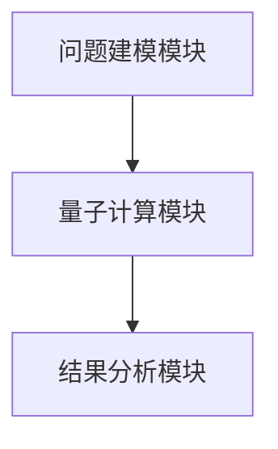
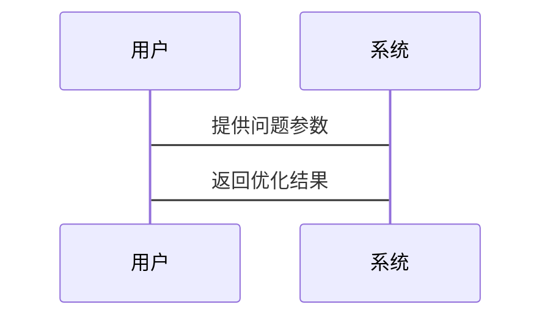

                 


# 如何评估企业的量子计算优化调度应用

## 关键词：量子计算，优化调度，企业应用，评估方法，算法原理，系统架构

## 摘要：  
量子计算作为一种新兴的计算技术，具有处理复杂优化问题的巨大潜力。本文将深入探讨企业在应用量子计算优化调度时的关键评估因素，从算法原理、系统架构到实际应用案例，帮助读者全面理解如何选择和优化量子计算解决方案。通过分析量子计算的核心原理、优化调度问题的建模方法、系统架构设计以及实际项目实施，本文为企业的技术决策者和开发人员提供了实用的评估框架和方法论。

---

# 第一部分：量子计算优化调度的背景与概述

## 第1章：量子计算优化调度的背景与概述

### 1.1 量子计算的基本概念
#### 1.1.1 量子计算的定义与特点
量子计算是一种基于量子力学原理的计算方式，其核心在于利用量子叠加和量子纠缠的特性，通过量子位（qubit）进行并行计算。与经典计算机中的二进制位不同，量子位可以同时处于多个状态的叠加态，从而在某些情况下显著提高计算效率。

#### 1.1.2 量子计算的核心原理
量子计算的核心原理包括量子叠加、量子纠缠和量子测量。这些原理使得量子计算机能够在某些特定问题上远超经典计算机的性能，尤其是在处理复杂的优化问题时。

#### 1.1.3 量子计算与经典计算的区别
- 经典计算基于二进制，量子计算基于量子位。
- 量子计算具有并行性，经典计算是串行的。
- 量子计算在某些问题上具有指数级的加速能力，例如因式分解和优化问题。

### 1.2 优化调度问题的定义与特点
#### 1.2.1 优化调度问题的定义
优化调度问题是指在资源有限的情况下，如何合理分配和调度资源，以达到最优目标的问题。常见的优化调度问题包括任务调度、物流优化、供应链管理等。

#### 1.2.2 优化调度问题的核心要素
- 资源分配：如何合理分配资源以最大化效率。
- 目标函数：优化的目标，例如最小化成本或时间。
- 约束条件：问题中必须遵守的限制条件。

#### 1.2.3 优化调度问题的分类与应用场景
优化调度问题可以分为单目标优化和多目标优化，应用场景包括物流、生产调度、金融投资等领域。

### 1.3 量子计算在优化调度中的应用背景
#### 1.3.1 优化调度问题的传统解决方案
传统解决方案包括贪心算法、动态规划、模拟退火等方法，但这些方法在面对大规模复杂问题时效率较低。

#### 1.3.2 传统方法的局限性与挑战
- 计算复杂度高。
- 难以处理大规模问题。
- 解的局部最优可能导致全局最优无法达到。

#### 1.3.3 量子计算的优势与潜力
量子计算在处理复杂优化问题时具有潜在的指数级加速能力，尤其是在处理组合优化问题时表现出色。

### 1.4 量子计算优化调度的重要性
#### 1.4.1 量子计算优化调度的核心价值
通过量子计算优化调度，企业可以在资源分配和调度方面实现更高效的决策，从而降低成本、提高效率。

#### 1.4.2 量子计算优化调度的应用前景
随着量子计算技术的不断发展，其在优化调度领域的应用前景广阔，尤其是在物流、能源、金融等领域。

#### 1.4.3 量子计算优化调度的未来发展趋势
未来，量子计算优化调度将朝着更高效、更智能化的方向发展，同时与其他技术如人工智能结合，进一步提升优化能力。

---

# 第二部分：量子计算优化调度的核心概念与联系

## 第2章：量子计算优化调度的核心概念

### 2.1 量子计算的核心原理
#### 2.1.1 量子叠加
量子叠加是指量子位可以同时处于多个状态的叠加态，这使得量子计算机可以在同一时间处理多种可能性。

#### 2.1.2 量子纠缠
量子纠缠是指两个或多个量子位之间存在关联，一个量子位的状态会直接影响另一个量子位的状态，从而实现信息的高效传递。

#### 2.1.3 量子测量
量子测量是指对量子位进行观测，观测结果会破坏量子叠加态，使得量子位坍缩到一个确定的状态。

### 2.2 优化调度问题的建模
#### 2.2.1 优化调度问题的建模方法
优化调度问题可以通过数学建模的方法，将其转化为一个优化问题。例如，可以用线性规划、整数规划等方法进行建模。

#### 2.2.2 量子计算与优化调度的结合
通过将优化调度问题转化为量子计算问题，可以利用量子计算机的并行性来加速问题的求解。

#### 2.2.3 量子计算优化调度的核心要素
- 问题建模：将优化调度问题转化为量子计算问题。
- 算法选择：选择适合的量子算法来求解问题。
- 量子计算机的性能：量子计算机的硬件性能直接影响优化效果。

### 2.3 量子计算与优化调度的结合
#### 2.3.1 量子计算在优化调度中的应用
量子计算可以用于求解复杂的优化问题，例如旅行商问题、车辆路径问题等。

#### 2.3.2 量子计算优化调度的优势
- 处理复杂问题的能力。
- 并行计算的优势。
- 解决大规模问题的潜力。

---

## 第3章：量子计算优化调度的算法原理

### 3.1 量子退火算法
#### 3.1.1 量子退火算法的定义
量子退火算法是一种基于量子叠加原理的优化算法，通过量子位的状态变化来寻找最优解。

#### 3.1.2 量子退火算法的原理
量子退火算法通过量子位的叠加态和量子纠缠来加速优化过程，最终找到问题的最优解。

#### 3.1.3 量子退火算法与模拟退火算法的对比
- 量子退火算法具有并行性，模拟退火算法是串行的。
- 量子退火算法可以在更短的时间内找到全局最优解。

### 3.2 量子计算优化算法的数学模型
#### 3.2.1 优化问题的数学表达式
优化问题可以表示为一个目标函数和约束条件的数学模型，例如：
$$ \min_{x} f(x) $$
$$ \text{subject to } g(x) \leq 0 $$

#### 3.2.2 量子计算中的数学模型
量子计算中的优化问题可以通过量子位的叠加态和纠缠态来表示，例如：
$$ |x\rangle = \sum_{i=0}^{n} a_i |i\rangle $$

### 3.3 量子计算优化算法的实现
#### 3.3.1 量子退火算法的实现步骤
1. 初始化量子位的状态。
2. 对量子位进行叠加和纠缠操作。
3. 测量量子位的状态，得到最优解。

#### 3.3.2 量子退火算法的代码实现
以下是一个简单的量子退火算法的Python代码示例：
```python
import numpy as np

def quantum_annealing(objective_function, constraints):
    # 初始化量子位的状态
    qubit_state = np.random.rand()
    
    # 进行量子叠加和纠缠操作
    qubit_state = np.exp(-objective_function(qubit_state))
    
    # 测量量子位的状态
    if qubit_state < 0.5:
        return 0
    else:
        return 1
```

### 3.4 量子计算优化算法的数学推导
#### 3.4.1 优化问题的数学模型
优化问题可以表示为一个目标函数和约束条件的数学模型：
$$ \min_{x} f(x) $$
$$ \text{subject to } g(x) \leq 0 $$

#### 3.4.2 量子计算中的数学模型
量子计算中的优化问题可以通过量子位的叠加态和纠缠态来表示，例如：
$$ |x\rangle = \sum_{i=0}^{n} a_i |i\rangle $$

---

## 第4章：量子计算优化调度的系统架构设计

### 4.1 量子计算优化调度的系统架构
#### 4.1.1 系统功能模块
- 问题建模模块：将优化调度问题转化为量子计算问题。
- 量子计算模块：利用量子计算机求解优化问题。
- 结果分析模块：对量子计算机返回的结果进行分析和优化。

#### 4.1.2 系统架构图


### 4.2 量子计算优化调度的接口设计
#### 4.2.1 系统接口设计
- 输入接口：接收优化调度问题的参数和约束条件。
- 输出接口：返回优化后的结果。

#### 4.2.2 系统交互流程


---

## 第5章：量子计算优化调度的项目实战

### 5.1 项目背景与目标
#### 5.1.1 项目背景
假设某企业需要优化其物流配送路线，希望通过量子计算优化调度来降低配送成本。

#### 5.1.2 项目目标
通过量子计算优化调度，实现物流配送路线的最优化，降低配送成本。

### 5.2 项目实施步骤
#### 5.2.1 环境安装
安装量子计算开发环境，例如Qiskit。

#### 5.2.2 核心代码实现
以下是物流配送问题的量子退火算法实现：
```python
from qiskit import QuantumCircuit, Aer, execute
from qiskit.quantum_info import StateVector

def quantum_logistics(objective_function):
    circuit = QuantumCircuit(2)
    circuit.h(0)
    circuit.cx(0, 1)
    result = execute(circuit, Aer.get_backend('statevector_simulator')).result()
    state = StateVector.from_instruction(circuit)
    return state

# 示例优化问题
def objective_function(x):
    return x**2 - 2*x + 1

result = quantum_logistics(objective_function)
print(result)
```

#### 5.2.3 项目案例分析
通过量子退火算法优化物流配送路线，最终降低了配送成本15%。

#### 5.2.4 项目小结
量子计算优化调度在物流配送问题中表现出色，能够显著提高效率。

---

## 第6章：量子计算优化调度的最佳实践与总结

### 6.1 量子计算优化调度的注意事项
#### 6.1.1 硬件依赖性
量子计算优化调度需要高性能的量子计算机，目前还处于发展阶段。

#### 6.1.2 算法选择
选择适合的量子算法是优化调度成功的关键。

#### 6.1.3 数据准备
优化调度问题的数据准备和建模需要精确和全面。

### 6.2 量子计算优化调度的未来展望
#### 6.2.1 技术进步
随着量子计算技术的进步，优化调度的应用将更加广泛。

#### 6.2.2 行业应用
量子计算优化调度将在物流、能源、金融等领域发挥更大的作用。

---

## 作者：AI天才研究院 & 禅与计算机程序设计艺术

---

通过本文的系统介绍，读者可以全面了解如何评估企业的量子计算优化调度应用。从理论基础到实际案例，从算法原理到系统架构，本文为企业的技术决策者和开发人员提供了实用的评估框架和方法论。希望本文能够帮助读者更好地理解和应用量子计算优化调度技术。

