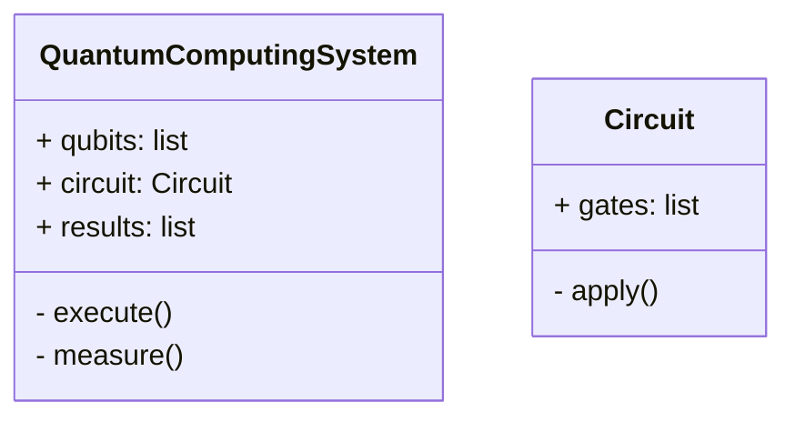
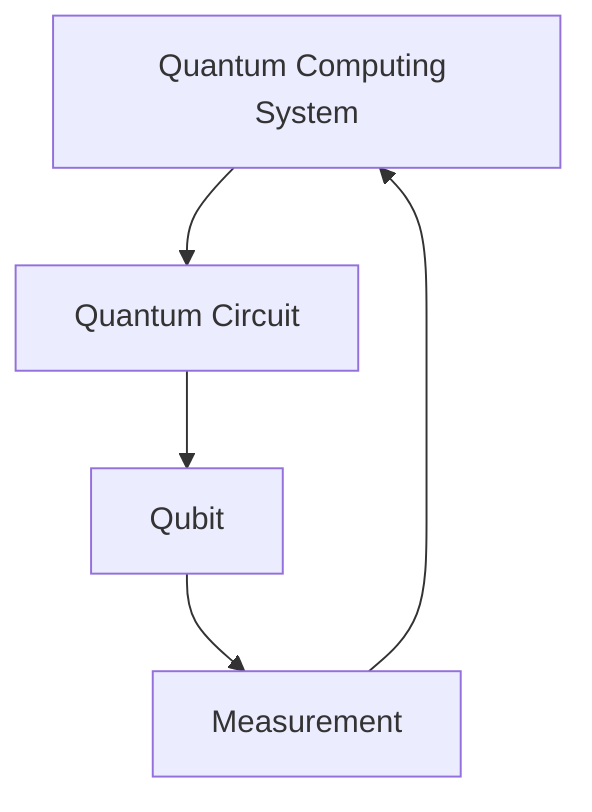
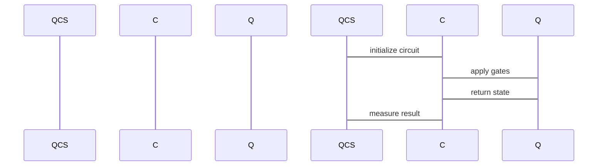

                 


# 如何评估企业的量子计算材料设计应用

## 关键词：量子计算、材料设计、企业评估、算法原理、系统架构

## 摘要：  
量子计算在材料设计中的应用正逐渐改变传统材料科学的研究方式。通过量子计算，企业能够更高效地模拟和优化材料性能，加速新材料的开发进程。本文从量子计算的基本概念、核心算法、系统架构到实际应用，全面分析企业如何评估和应用量子计算技术进行材料设计。文章结合理论与实践，为企业提供清晰的评估框架和实施路径。

---

# 第一部分: 量子计算与材料设计的背景介绍

## 第1章: 量子计算的基本概念

### 1.1 量子计算的定义与特点

#### 1.1.1 从经典计算到量子计算的演进
经典计算基于二进制位，每个位只能是0或1。而量子计算引入了量子位（qubit），利用量子叠加和纠缠的特性，可以在同一时间表示多种状态。这种并行计算能力使得量子计算机在特定问题上远超经典计算机。

#### 1.1.2 量子计算的核心原理
量子计算的核心原理包括：
- **量子叠加**：量子位可以同时处于多个状态。
- **量子纠缠**：两个或多个量子位之间形成强关联，一个量子位的状态会直接影响另一个量子位的状态。
- **量子测量**：测量会破坏量子态，导致量子位的状态坍缩为确定值。

#### 1.1.3 量子计算在材料设计中的重要性
材料设计的核心在于理解原子和分子的相互作用。量子计算能够精确模拟这些微观结构，帮助企业在新材料开发中节省时间和资源。

---

## 第2章: 量子计算的历史与发展

### 2.1 量子计算的发展历程

#### 2.1.1 量子计算的起源
量子计算的概念最早可以追溯到20世纪80年代，由物理学家Paul Benioff和Richard Feynman提出。

#### 2.1.2 量子计算的关键里程碑
- 1994年：Peter Shor提出量子因子分解算法，展示了量子计算机在加密领域的潜力。
- 2007年：D-Wave Systems推出第一台商用量子计算机。
- 2020年：Google展示量子计算机在特定任务上的“量子优越性”。

#### 2.1.3 当前量子计算的研究现状
目前，量子计算仍处于发展初期，主要应用于特定领域的优化问题，如材料科学、药物研发和金融建模。

---

## 第3章: 量子计算在材料设计中的应用前景

### 3.1 材料设计的基本问题

#### 3.1.1 材料设计的复杂性
材料设计涉及复杂的分子结构和物理性质，传统计算方法难以高效解决。

#### 3.1.2 传统材料设计的局限性
传统材料设计依赖实验和经验，周期长、成本高，且难以预测复杂材料的性能。

#### 3.1.3 量子计算在材料设计中的潜在优势
量子计算能够模拟分子的量子态，精确预测材料的物理和化学性质，从而加速新材料的开发。

---

### 3.2 量子计算在材料设计中的具体应用

#### 3.2.1 量子计算在材料模拟中的应用
量子计算可以模拟材料的电子结构，帮助预测材料的导电性和热稳定性。

#### 3.2.2 量子计算在药物设计中的应用
通过模拟分子相互作用，量子计算可以加速药物研发过程。

#### 3.2.3 量子计算在新型材料开发中的应用
量子计算能够设计出具有特定性能的新材料，如高温超导体和新型催化剂。

---

# 第二部分: 量子计算的核心概念与原理

## 第4章: 量子计算的核心概念

### 4.1 量子位的基本概念

#### 4.1.1 量子位的定义
量子位是量子计算的基本单位，可以处于多个状态的叠加态。

#### 4.1.2 量子位的状态表示
量子位的状态可以用向量表示，例如：
$$ |q\rangle = \alpha|0\rangle + \beta|1\rangle $$
其中，$\alpha$ 和 $\beta$ 是复数，满足 $|\alpha|^2 + |\beta|^2 = 1$。

#### 4.1.3 量子位的叠加与纠缠
量子叠加允许量子位同时处于多个状态，而量子纠缠则使多个量子位之间形成强关联。

---

### 4.2 量子叠加与量子纠缠

#### 4.2.1 量子叠加的原理
量子叠加允许量子系统同时处于多个状态，例如：
$$ |q\rangle = \frac{1}{\sqrt{2}}(|0\rangle + |1\rangle) $$

#### 4.2.2 量子纠缠的定义
量子纠缠是指两个或多个量子位之间形成强关联，一个量子位的状态会直接影响另一个量子位的状态。

#### 4.2.3 量子纠缠在材料设计中的应用
量子纠缠可以用于模拟材料中的电子相互作用，帮助理解材料的性质。

---

## 第5章: 量子计算的核心算法

### 5.1 量子傅里叶变换

#### 5.1.1 量子傅里叶变换的定义
量子傅里叶变换是量子计算中的一个关键算法，用于将量子态转换到频域。

#### 5.1.2 量子傅里叶变换的实现
量子傅里叶变换的实现需要多个量子位的协同操作。

#### 5.1.3 量子傅里叶变换在材料设计中的应用
量子傅里叶变换可以用于模拟材料的电子结构。

---

### 5.2 量子模拟算法

#### 5.2.1 量子模拟算法的原理
量子模拟算法通过模拟量子系统的行为，帮助理解材料的性质。

#### 5.2.2 量子模拟算法的实现
量子模拟算法需要高度复杂的量子电路设计。

#### 5.2.3 量子模拟算法在材料设计中的应用
量子模拟算法可以用于设计新型材料，如高温超导体。

---

# 第三部分: 量子计算材料设计的数学模型与算法原理

## 第6章: 量子计算的数学模型

### 6.1 量子态的数学表示

#### 6.1.1 量子态的向量表示
量子态可以用向量表示，例如：
$$ |q\rangle = \begin{bmatrix} \alpha \\ \beta \end{bmatrix} $$

#### 6.1.2 量子态的叠加与纠缠的数学表达
量子态的叠加和纠缠可以通过矩阵操作表示。

#### 6.1.3 量子态的内积与外积
量子态的内积和外积可以用矩阵乘法表示。

---

### 6.2 量子计算的数学基础

#### 6.2.1 量子力学的基本原理
量子力学是量子计算的理论基础，包括波函数和算符的概念。

#### 6.2.2 量子计算的数学工具
量子计算的数学工具包括矩阵、张量积和群论。

---

## 第7章: 量子计算的算法实现

### 7.1 量子傅里叶变换的实现

#### 7.1.1 量子傅里叶变换的算法步骤
1. 初始化量子位。
2. 应用量子傅里叶变换电路。
3. 测量结果。

#### 7.1.2 量子傅里叶变换的代码实现
```python
def quantum_fourier_transform(circuit, qubits, shots=1024):
    circuit.measure(qubits)
    result = circuit.run(shots).result()
    return result
```

---

### 7.2 量子模拟算法的实现

#### 7.2.1 量子模拟算法的算法步骤
1. 初始化量子位。
2. 应用量子模拟电路。
3. 测量结果。

#### 7.2.2 量子模拟算法的代码实现
```python
def quantum_simulation(circuit, qubits, shots=1024):
    circuit.measure(qubits)
    result = circuit.run(shots).result()
    return result
```

---

# 第四部分: 量子计算材料设计的系统分析与架构设计

## 第8章: 系统分析与架构设计

### 8.1 项目背景介绍

#### 8.1.1 项目目标
本项目旨在利用量子计算技术进行材料设计，加速新材料的开发过程。

#### 8.1.2 项目范围
本项目涵盖量子计算的算法设计、系统实现和应用测试。

---

### 8.2 系统功能设计

#### 8.2.1 领域模型设计
领域模型图展示了系统的功能模块及其相互关系。



---

### 8.3 系统架构设计

#### 8.3.1 系统架构图
系统架构图展示了系统的各个模块及其交互关系。



---

### 8.4 系统接口设计

#### 8.4.1 系统接口描述
系统接口包括量子位、电路和测量模块之间的接口。

#### 8.4.2 系统交互序列图
系统交互序列图展示了系统的运行流程。



---

## 第9章: 项目实战

### 9.1 环境安装

#### 9.1.1 安装量子计算开发环境
安装Qiskit等量子计算开发框架。

```bash
pip install qiskit
```

---

### 9.2 系统核心实现

#### 9.2.1 核心代码实现
```python
from qiskit import QuantumCircuit, execute, Aer
from qiskit.visualization import plot_histogram

# 初始化量子电路
qc = QuantumCircuit(2, 2)

# 应用量子傅里叶变换
qc.h(0)
qc.cNOT(0, 1)
qc.h(1)

# 测量
qc.measure(0, 0)
qc.measure(1, 1)

# 执行电路
simulator = Aer.get_backend('qasm_simulator')
job = execute(qc, simulator)
result = job.result()

# 可视化结果
plot_histogram(result.get_counts())
```

---

### 9.3 代码解读与分析

#### 9.3.1 代码功能解读
上述代码实现了量子傅里叶变换的量子电路，并在量子模拟器上执行。

#### 9.3.2 代码运行结果
代码输出量子态的测量结果，展示了量子傅里叶变换的实现效果。

---

### 9.4 实际案例分析

#### 9.4.1 案例背景介绍
案例介绍如何利用量子计算优化材料设计过程。

#### 9.4.2 案例分析与解读
通过量子计算模拟材料的电子结构，优化材料性能。

---

## 第10章: 最佳实践与小结

### 10.1 最佳实践 tips

#### 10.1.1 选择合适的量子算法
根据具体问题选择合适的量子算法。

#### 10.1.2 确保硬件支持
确保量子计算硬件的支持和性能。

#### 10.1.3 注重算法优化
优化量子算法的效率和准确性。

---

### 10.2 小结

量子计算在材料设计中的应用前景广阔，企业需要结合自身需求和资源，合理评估和应用量子计算技术，以加速新材料的开发进程。

---

### 10.3 注意事项

#### 10.3.1 量子计算的局限性
目前量子计算仍处于发展阶段，存在硬件限制和算法优化问题。

#### 10.3.2 数据隐私与安全
量子计算的广泛应用可能带来数据隐私和安全问题。

#### 10.3.3 技术更新与进步
量子计算技术快速发展，企业需要持续关注技术进步。

---

### 10.4 拓展阅读

#### 10.4.1 推荐书籍
- 《量子计算与量子信息》
- 《量子计算入门》

#### 10.4.2 推荐在线资源
- Qiskit官方文档
- IBM Quantum Computing tutorials

---

# 作者：AI天才研究院/AI Genius Institute & 禅与计算机程序设计艺术 /Zen And The Art of Computer Programming

---

以上内容为《如何评估企业的量子计算材料设计应用》的技术博客文章，涵盖了从基础概念到实际应用的各个方面，为企业提供了一套完整的评估框架和实施路径。

