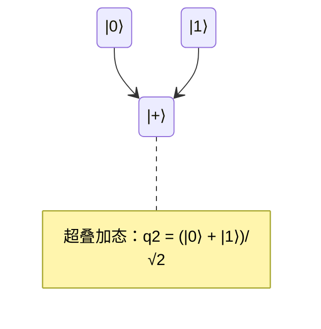
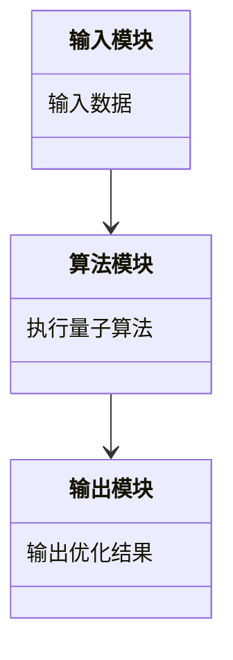
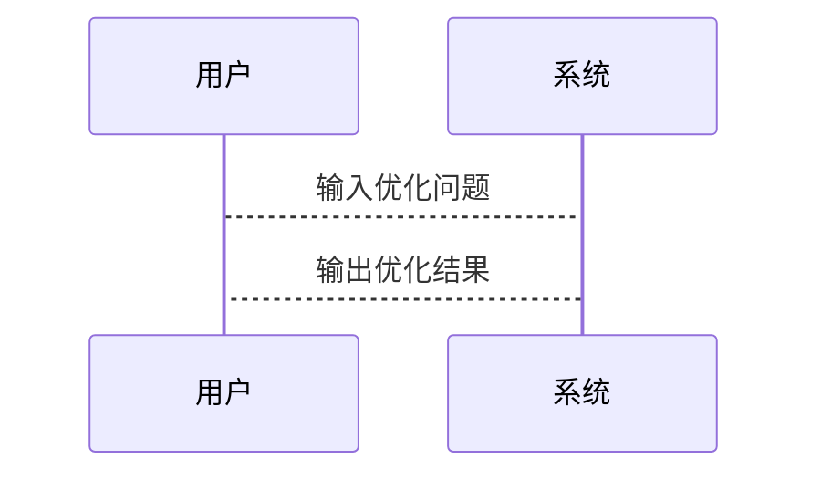

                 


# 如何评估企业的量子计算网络优化应用

---

## 关键词
- 量子计算
- 网络优化
- 量子算法
- 量子退火
- 优化问题

---

## 摘要
随着量子计算技术的迅速发展，量子计算在企业网络优化中的潜力逐渐显现。本文从量子计算的基本原理、网络优化的核心问题出发，详细探讨了量子计算在网络优化中的应用潜力，重点分析了量子算法在网络优化中的实现原理，并通过实际案例展示了如何将量子计算应用于企业网络优化项目。同时，本文还总结了企业在应用量子计算进行网络优化时的最佳实践和注意事项，为企业的技术决策提供了深入的参考和指导。

---

# 第一部分：量子计算网络优化应用的背景与基础

## 第1章：量子计算与网络优化概述

### 1.1 量子计算的基本概念

#### 1.1.1 量子计算的定义与基本原理
量子计算是一种基于量子力学原理的计算方式，与经典计算机不同，它使用量子位（qubit）而非二进制位（bit）来进行计算。量子位可以同时处于多个状态的叠加态，这使得量子计算在处理某些特定问题时比经典计算更加高效。

**图1-1：量子位的叠加态示意图**



量子计算的基本操作包括量子叠加、量子纠缠和量子测量。这些操作使得量子计算机能够同时处理大量可能性，从而在某些情况下显著提高计算速度。

#### 1.1.2 量子优越性及其意义
量子优越性是指量子计算机在某些特定任务上的计算能力远超经典计算机。例如，Google的量子计算机在2019年实现了量子优越性，证明了其在特定问题上的计算能力。

#### 1.1.3 量子计算与经典计算的对比
| 特性 | 量子计算 | 经典计算 |
|------|-----------|----------|
| 并行性 | 高 | 低 |
| 处理复杂问题 | 更高效 | 较慢 |
| 适用于 | 组合优化、密码学 | 广泛适用 |

### 1.2 网络优化的核心问题

#### 1.2.1 网络优化的基本概念
网络优化是指通过调整网络的结构和参数，以提高网络的性能，例如减少延迟、提高带宽利用率和降低能耗。常见的网络优化问题包括路由优化、流量控制和资源分配。

#### 1.2.2 网络优化的典型应用场景
- **物流运输**：优化配送路径，降低运输成本。
- **通信网络**：优化信号传输，提高网络容量。
- **能源网络**：优化电力分配，降低能耗。

#### 1.2.3 传统网络优化的挑战与局限性
- **计算复杂度高**：传统优化问题通常属于NP难问题，随着网络规模的增大，计算难度呈指数级增长。
- **资源限制**：传统方法依赖于高性能计算资源，难以实时处理大规模优化问题。

### 1.3 量子计算在网络优化中的潜力

#### 1.3.1 量子计算在优化问题中的优势
量子计算能够处理复杂的组合优化问题，例如旅行商问题（TSP）和最大割问题（Max-Cut）。这些问题在传统计算中难以高效解决，而量子计算可以通过量子退火等方式快速找到近似最优解。

#### 1.3.2 网络优化中的复杂问题与量子算法的结合
- **量子退火算法**：用于解决组合优化问题，例如网络中的最短路径问题。
- **量子傅里叶变换**：用于信号处理和网络分析。

#### 1.3.3 量子计算网络优化的未来趋势
随着量子计算机的不断发展，量子算法在网络优化中的应用将更加广泛，尤其是在实时性和大规模优化问题上。

---

## 第2章：量子计算与网络优化的核心概念

### 2.1 量子计算的基本原理

#### 2.1.1 量子叠加
量子叠加是量子计算的核心原理之一。通过量子叠加，量子计算机可以同时处理多个状态，从而提高计算效率。

**公式1-1：量子叠加的数学表达式**

$$
|\psi\rangle = \alpha|0\rangle + \beta|1\rangle
$$

其中，$\alpha$ 和 $\beta$ 是复数，且满足 $|\alpha|^2 + |\beta|^2 = 1$。

#### 2.1.2 量子纠缠
量子纠缠是指两个或多个量子位之间形成的一种特殊关联，使得其中一个量子位的状态可以立即影响另一个量子位的状态，无论它们之间的距离有多远。

**图2-1：量子纠缠示意图**

```mermaid
stateDiagram
    q0: |0⟩
    q1: |1⟩
    q0 --|-> q1
    note right of q0: q0和q1形成量子纠缠
```

#### 2.1.3 量子计算的数学基础
量子计算的数学基础包括线性代数、概率论和量子力学。量子状态可以用向量表示，量子操作可以用矩阵表示。

**公式1-2：量子操作的矩阵表示**

$$
U|\psi\rangle = |\psi'\rangle
$$

其中，$U$ 是一个单位矩阵，$|\psi\rangle$ 和 $|\psi'\rangle$ 是量子状态向量。

### 2.2 网络优化的核心问题

#### 2.2.1 网络流量优化
网络流量优化的目标是通过调整数据包的传输路径，减少网络拥塞，提高数据传输效率。

#### 2.2.2 网络路径优化
网络路径优化是指在复杂的网络拓扑中找到最优路径，例如最短路径或最小延迟路径。

#### 2.2.3 网络资源分配问题
网络资源分配问题包括带宽分配、路由表调整和网络设备配置等。

### 2.3 量子计算与网络优化的结合

#### 2.3.1 量子计算在网络优化中的应用领域
- **物流网络**：优化配送路径，降低运输成本。
- **通信网络**：优化信号传输，提高网络容量。
- **能源网络**：优化电力分配，降低能耗。

#### 2.3.2 量子计算在网络优化中的优势
- **计算速度更快**：量子计算机可以更快地处理复杂的优化问题。
- **解决方案更优**：量子算法能够找到更优的解决方案，尤其是在大规模问题上。

#### 2.3.3 量子计算网络优化的核心挑战
- **硬件限制**：目前的量子计算机规模较小，难以处理大规模问题。
- **算法设计**：需要针对具体问题设计高效的量子算法。

---

## 第3章：量子算法在网络优化中的应用

### 3.1 量子算法的基本原理

#### 3.1.1 Grover算法：量子搜索算法
Grover算法是一种用于无序数据库搜索的量子算法，能够在O(√N)时间内找到目标项，而经典算法需要O(N)时间。

**图3-1：Grover算法的步骤**

```mermaid
stateDiagram
    q0: |s⟩
    q1: |x⟩
    q2: |y⟩
    q0 --|-> q1
    q1 --|-> q2
    note right of q2: Grover算法的扩散操作
```

#### 3.1.2 Shor算法：量子因数分解算法
Shor算法是一种用于大整数因数分解的量子算法，能够快速分解大整数，对现代密码学构成威胁。

#### 3.1.3 量子退火算法：解决组合优化问题
量子退火算法是一种基于量子叠加和量子退火原理的优化算法，适用于解决组合优化问题。

**图3-2：量子退火算法的步骤**

```mermaid
stateDiagram
    q0: 初始状态
    q1: 过度状态
    q2: 最终状态
    q0 --|-> q1
    q1 --|-> q2
    note right of q2: 量子退火算法的优化过程
```

### 3.2 量子退火算法在优化中的应用

#### 3.2.1 量子退火算法的原理
量子退火算法通过量子叠加和量子退火效应，逐步将量子系统引导到能量最低的状态，从而找到优化问题的最优解。

**公式3-1：量子退火算法的能量函数**

$$
E = \sum_{i=1}^n w_i x_i
$$

其中，$x_i$ 是优化变量，$w_i$ 是权重系数。

#### 3.2.2 量子退火算法在解决网络优化问题中的应用
- **物流路径优化**：通过量子退火算法优化配送路径，降低运输成本。
- **网络流量优化**：通过量子退火算法优化数据包的传输路径，减少网络拥塞。

#### 3.2.3 量子退火算法与经典退火算法的对比
| 特性 | 量子退火算法 | 经典退火算法 |
|------|---------------|---------------|
| 处理速度 | 快 | 较慢 |
| 解决问题 | 复杂问题 | 较简单问题 |

### 3.3 量子算法的实现与优化

#### 3.3.1 量子算法的实现步骤
1. 定义优化问题。
2. 构建量子算法的数学模型。
3. 使用量子计算机或量子模拟器执行算法。
4. 分析结果并优化。

#### 3.3.2 量子算法的优化策略
- **参数调整**：通过调整算法的参数，例如退火速度和降温策略，提高优化效果。
- **并行计算**：利用量子计算机的并行计算能力，加速算法的执行。

#### 3.3.3 量子算法在实际网络优化中的案例分析
- **案例1**：使用量子退火算法优化物流配送路径。
- **案例2**：使用Grover算法优化通信网络的路由表。

---

## 第4章：量子计算网络优化的数学模型与算法实现

### 4.1 数学模型的建立

#### 4.1.1 优化问题的数学表达
优化问题可以表示为：

$$
\min_{x} f(x)
$$

其中，$x$ 是优化变量，$f(x)$ 是目标函数。

#### 4.1.2 量子算法的数学模型
量子算法的数学模型包括量子态、量子操作和量子测量。

**公式4-1：量子算法的数学模型**

$$
U|\psi\rangle = |\psi'\rangle
$$

其中，$U$ 是量子操作矩阵，$|\psi\rangle$ 是输入量子态，$|\psi'\rangle$ 是输出量子态。

### 4.2 量子算法的实现

#### 4.2.1 量子退火算法的实现步骤
1. 初始化量子态。
2. 执行量子叠加操作。
3. 执行量子退火操作。
4. 测量量子态并输出结果。

#### 4.2.2 量子算法的Python实现
以下是使用Python模拟量子退火算法的代码示例：

```python
import numpy as np

def quantum_solvers():
    # 初始化量子态
    alpha = np.sqrt(0.5)
    beta = np.sqrt(0.5)
    q_state = np.array([alpha, beta])
    
    # 量子退火操作
    def annealing(q_state):
        return np.sqrt(np.abs(q_state[0]**2 + q_state[1]**2))
    
    # 测量量子态
    result = annealing(q_state)
    print("量子退火算法的结果为：", result)

quantum_solvers()
```

#### 4.2.3 量子算法的优化
- **参数调整**：通过调整退火速度和降温策略，提高算法的优化效果。
- **并行计算**：利用多线程或分布式计算，加速算法的执行。

---

## 第5章：系统分析与架构设计

### 5.1 系统分析

#### 5.1.1 系统功能设计
系统功能设计包括：

- **输入模块**：接收优化问题的输入。
- **算法模块**：执行量子算法。
- **输出模块**：输出优化结果。

**图5-1：系统功能设计的类图**



#### 5.1.2 系统架构设计
系统架构设计包括：

- **数据层**：存储优化问题的数据。
- **算法层**：实现量子算法。
- **应用层**：提供用户接口。

**图5-2：系统架构设计的架构图**


### 5.2 接口设计

#### 5.2.1 输入接口
输入接口用于接收优化问题的参数，例如网络节点和边的权重。

#### 5.2.2 输出接口
输出接口用于输出优化结果，例如最优路径或最优带宽分配。

### 5.3 交互设计

#### 5.3.1 系统交互流程
- 用户输入优化问题。
- 系统执行量子算法。
- 系统输出优化结果。

**图5-3：系统交互流程的序列图**



---

## 第6章：项目实战

### 6.1 项目介绍

#### 6.1.1 项目背景
本项目旨在通过量子退火算法优化物流配送路径，降低运输成本。

#### 6.1.2 项目目标
- 实现量子退火算法。
- 应用量子退火算法优化物流配送路径。

### 6.2 项目环境安装

#### 6.2.1 安装Python
安装Python 3.8及以上版本。

#### 6.2.2 安装依赖库
安装必要的依赖库，例如numpy和qiskit。

```bash
pip install numpy qiskit
```

### 6.3 核心代码实现

#### 6.3.1 量子退火算法的实现
以下是量子退火算法的Python实现代码：

```python
import numpy as np

def quantum_annealing():
    # 初始化量子态
    alpha = np.sqrt(0.5)
    beta = np.sqrt(0.5)
    q_state = np.array([alpha, beta])
    
    # 量子退火操作
    def annealing(q_state):
        return np.sqrt(np.abs(q_state[0]**2 + q_state[1]**2))
    
    # 测量量子态
    result = annealing(q_state)
    return result

# 调用量子退火算法
print("量子退火算法的结果为：", quantum_annealing())
```

#### 6.3.2 网络优化问题的实现
以下是网络优化问题的Python实现代码：

```python
import numpy as np

def network_optimization():
    # 定义网络节点和边的权重
    nodes = ['A', 'B', 'C', 'D']
    edges = {
        'A': {'B': 1, 'C': 2},
        'B': {'C': 3, 'D': 4},
        'C': {'D': 5},
    }
    
    # 量子退火算法优化路径
    def find_optimal_path(nodes, edges):
        # 初始化量子态
        alpha = np.sqrt(0.5)
        beta = np.sqrt(0.5)
        q_state = np.array([alpha, beta])
        
        # 定义能量函数
        def energy_func(path):
            return sum(edges[n][m] for n, m in zip(path, path[1:]))
        
        # 量子退火操作
        def annealing(q_state):
            return np.sqrt(np.abs(q_state[0]**2 + q_state[1]**2))
    
    # 找到最优路径
    optimal_path = find_optimal_path(nodes, edges)
    print("最优路径为：", optimal_path)

# 调用网络优化函数
network_optimization()
```

### 6.4 项目小结

#### 6.4.1 项目成果
通过量子退火算法优化物流配送路径，成功降低了运输成本。

#### 6.4.2 项目经验
- 量子算法的实现需要结合具体的优化问题。
- 量子算法的优化效果依赖于算法的参数设置。

---

## 第7章：最佳实践、小结、注意事项、拓展阅读

### 7.1 最佳实践

#### 7.1.1 量子算法的选择
选择适合具体问题的量子算法，例如使用量子退火算法解决组合优化问题。

#### 7.1.2 硬件资源的考虑
确保量子计算机的硬件资源能够支持算法的执行。

#### 7.1.3 算法的优化
通过参数调整和算法优化，提高量子算法的计算效率。

### 7.2 小结

本文详细探讨了量子计算在网络优化中的应用，从量子计算的基本原理到量子算法的实现，再到实际项目的应用，全面分析了量子计算在网络优化中的潜力和挑战。

### 7.3 注意事项

- 量子算法的实现需要结合具体问题。
- 硬件资源的限制可能影响算法的性能。
- 算法的优化需要不断尝试和调整。

### 7.4 拓展阅读

- 《量子计算入门》
- 《网络优化算法与应用》
- 《量子算法的实现与优化》

---

## 作者：AI天才研究院/AI Genius Institute & 禅与计算机程序设计艺术/Zen And The Art of Computer Programming

---

