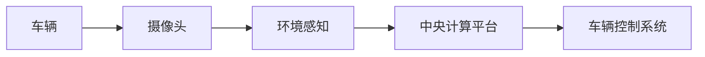

                 


# 如何评估企业的高级驾驶辅助系统

## 关键词：高级驾驶辅助系统（ADAS）、系统评估、汽车安全技术、传感器融合、自动驾驶、系统架构设计

## 摘要：高级驾驶辅助系统（ADAS）作为现代汽车技术的核心组成部分，其评估对企业的产品研发和市场竞争力具有重要意义。本文从ADAS的核心概念、评估方法、系统架构设计、项目实战等多个维度，详细阐述了如何全面、科学地评估企业的高级驾驶辅助系统。文章内容涵盖了ADAS的基本原理、传感器融合算法、系统架构设计、实际案例分析等，旨在为企业技术决策者和研发人员提供实用的评估方法和工具。

---

## 第一部分: 高级驾驶辅助系统（ADAS）概述

### 第1章: 高级驾驶辅助系统（ADAS）背景介绍

#### 1.1 ADAS的概念与定义
- **什么是高级驾驶辅助系统（ADAS）？**
  - ADAS是指通过各种先进的传感器、摄像头、雷达、激光雷达等设备，辅助驾驶员进行驾驶操作的系统。
  - 它能够实现自动泊车、车道保持、自适应巡航、紧急制动等功能。
- **ADAS的核心功能与作用**
  - 提高驾驶安全性
  - 提升驾驶效率
  - 为自动驾驶技术奠定基础
- **ADAS的边界与外延**
  - 边界：仅限于辅助驾驶，不完全替代驾驶员
  - 外延：从L1到L5的自动驾驶技术

#### 1.2 ADAS的核心要素与组成结构
- **感知系统**
  - 摄像头：用于视觉感知
  - 雷达：用于距离和速度检测
  - 激光雷达：用于高精度三维感知
- **车辆控制系统**
  - 制动系统
  - 转向系统
  - 加速系统
- **中央计算平台与算法**
  - 数据融合、决策算法
- **人机交互界面（HMI）**
  - 提供驾驶员反馈和交互

### 第2章: ADAS的核心概念与联系

#### 2.1 ADAS的核心概念原理
- **多传感器融合原理**
  - 单一传感器的局限性
  - 通过融合多种传感器数据提高准确性
  - 常用算法：卡尔曼滤波、图优化、深度学习融合
- **环境感知算法**
  - 目标检测与识别（如YOLO、Faster R-CNN）
  - 场景分割（如U-Net）
  - 路径规划（如A*算法）
- **车辆运动规划与控制**
  - 基于模型的控制算法（PID控制）
  - 基于经验的控制算法（模糊控制）
  - 基于深度学习的控制算法（强化学习）

#### 2.2 ADAS核心概念属性特征对比表
| 特性 | 摄像头 | 雷达 | 激光雷达 |
|------|--------|------|----------|
| 优缺点 | 高精度，易受光线影响 | 全天候，精度较低 | 高精度，成本高 |

#### 2.3 ADAS实体关系图


### 第3章: ADAS评估的核心算法原理

#### 3.1 多传感器融合算法
- **卡尔曼滤波原理**
  - 预测状态：$$ \hat{x}_{k} = A \hat{x}_{k-1} + B u_{k-1} $$
  - 更新状态：$$ \hat{x}_{k} = \hat{x}_{k} + K(y_{k} - C \hat{x}_{k}) $$
- **图优化方法**
  - 使用图论中的最短路径算法优化传感器数据
- **深度学习融合方法**
  - 使用神经网络融合多模态数据

#### 3.2 环境感知算法
- **目标检测与识别**
  - YOLO算法流程图：
  ```mermaid
  graph TD
  A[输入图像] --> B[特征提取]
  B --> C[预测边界框和类别]
  C --> D[输出结果]
  ```
- **场景分割**
  - 使用U-Net网络进行像素级分割
- **路径规划**
  - A*算法步骤：
  1. 构建地图
  2. 生成候选路径
  3. 选择最优路径

#### 3.3 车辆控制算法
- **基于模型的控制算法**
  - PID控制：$$ u = K_p e + K_i \int e dt + K_d \frac{de}{dt} $$
- **基于经验的控制算法**
  - 模糊控制：根据经验规则进行控制
- **基于深度学习的控制算法**
  - 强化学习：通过奖励机制优化控制策略

### 第4章: ADAS评估的数学模型与公式

#### 4.1 多传感器融合模型
- **卡尔曼滤波公式**
  - 预测状态方程：$$ \hat{x}_{k} = A \hat{x}_{k-1} + B u_{k-1} $$
  - 更新状态方程：$$ \hat{x}_{k} = \hat{x}_{k} + K(y_{k} - C \hat{x}_{k}) $$
  - 误差协方差更新：$$ P_{k} = (I - K C) P_{k-1} $$

#### 4.2 环境感知模型
- **目标检测概率**
  - 使用贝叶斯公式计算检测概率：$$ P(\text{目标存在} | \text{检测信号}) = \frac{P(\text{检测信号} | \text{目标存在}) P(\text{目标存在})}{P(\text{检测信号})} $$

---

## 第二部分: 高级驾驶辅助系统的评估方法

### 第5章: 功能评估方法

#### 5.1 功能完整性评估
- **评估标准**
  - 功能覆盖范围
  - 功能之间的协同性
- **测试用例设计**
  - 正常情况测试
  - 边缘情况测试

#### 5.2 功能实现的正确性评估
- **逻辑正确性**
  - 通过代码审查和测试验证逻辑
- **用户体验**
  - 驾驶员的反馈和感受

### 第6章: 性能评估方法

#### 6.1 系统响应时间评估
- **指标定义**
  - 传感器数据处理延迟
  - 决策系统响应时间
- **测试方法**
  - 使用高性能计算平台进行压力测试
  - 实际道路测试

#### 6.2 系统处理能力评估
- **负载测试**
  - 多线程/多进程测试
  - 高并发场景测试

### 第7章: 安全性评估方法

#### 7.1 系统安全性评估
- **安全性指标**
  - 系统误操作率
  - 系统故障恢复时间
- **安全性测试**
  - 模拟极端天气条件测试
  - 模拟传感器故障测试

#### 7.2 用户安全性评估
- **驾驶员的安全性感知**
  - 用户调研和问卷调查
  - 驾驶模拟器测试

### 第8章: 可靠性评估方法

#### 8.1 系统可靠性评估
- **可靠性指标**
  - 平均无故障时间（MTBF）
  - 系统故障率
- **测试方法**
  - 长期运行测试
  - 环境测试（高温、高湿、振动）

#### 8.2 数据可靠性评估
- **数据完整性**
  - 数据采集的准确性和一致性
  - 数据传输的可靠性

### 第9章: 用户体验评估方法

#### 9.1 用户界面（UI）评估
- **UI设计原则**
  - 简洁性
  - 可用性
  - 反馈及时性
- **用户体验测试**
  - 驾驶员主观评价
  - 用户行为分析

#### 9.2 交互设计评估
- **交互逻辑优化**
  - 减少误操作
  - 提高操作效率
- **用户反馈机制**
  - 收集用户反馈
  - 持续优化设计

---

## 第三部分: 高级驾驶辅助系统的系统架构设计

### 第10章: 系统架构设计

#### 10.1 系统功能设计
- **领域模型设计**
  ```mermaid
  classDiagram
  class 车辆状态 {
    speed: float
    position: (x, y)
    direction: float
  }
  class 传感器融合 {
    <ow(clock) 融合数据
  }
  class 决策系统 {
    <ow(clock) 执行决策
  }
  class 控制系统 {
    <ow(clock) 执行控制
  }
  车辆状态 --> 传感器融合
  传感器融合 --> 决策系统
  决策系统 --> 控制系统
  ```

#### 10.2 系统架构设计
- **分层架构**
  - 数据采集层
  - 数据处理层
  - 应用层
- **模块化设计**
  - 各模块之间的接口清晰
  - 模块化开发和测试

#### 10.3 系统接口设计
- **接口定义**
  - API接口
  - 数据格式
- **通信协议**
  - CAN总线
  - Ethernet

#### 10.4 系统交互设计
- **交互流程**
  - 传感器数据采集
  - 数据融合
  - 决策与控制
  - 用户反馈
- **交互时序图**
  ```mermaid
  sequenceDiagram
  participant 驾驶员 as D
  participant 传感器 as S
  participant 中央计算平台 as C
  participant 车辆控制系统 as V
  D -> S: 操作车辆
  S -> C: 传输数据
  C -> V: 发出控制指令
  V -> D: 提供反馈
  ```

---

## 第四部分: 高级驾驶辅助系统的项目实战

### 第11章: 项目实战

#### 11.1 项目介绍
- **项目目标**
  - 评估某企业ADAS系统
- **项目背景**
  - 当前市场需求
  - 技术发展趋势

#### 11.2 环境搭建
- **开发环境**
  - 操作系统：Linux
  - 开发工具：ROS（Robot Operating System）
  - 仿真平台：CARLA
- **硬件环境**
  - 传感器：摄像头、毫米波雷达
  - 计算平台：NVIDIA GPU

#### 11.3 核心实现
- **传感器数据采集**
  ```python
  import rospy
  from sensor_msgs.msg import Image

  def image_callback(msg):
      print("Received image data")

  rospy.init_node('image_subscriber')
  rospy.Subscriber('image_topic', Image, image_callback)
  rospy.spin()
  ```
- **数据融合算法实现**
  ```python
  import numpy as np

  def fuse_data(sensor_data):
      # 传感器数据融合算法
      return fused_data
  ```

#### 11.4 实际案例分析
- **案例分析**
  - 数据采集与处理
  - 算法优化与调整
  - 系统测试与验证

#### 11.5 项目小结
- **经验总结**
  - 系统设计的关键点
  - 项目管理的注意事项

---

## 第五部分: 高级驾驶辅助系统的未来展望与优化建议

### 第12章: 未来展望

#### 12.1 技术发展趋势
- **传感器技术**
  - 更高精度的激光雷达
  - 更智能的摄像头
- **算法优化**
  - 更高效的深度学习算法
  - 更精准的决策算法

#### 12.2 市场需求
- **自动驾驶普及**
  - L3/L4级别自动驾驶的需求增长
- **智能交通系统**
  - V2X（车路协同）的发展

### 第13章: 优化建议

#### 13.1 技术优化建议
- **传感器融合**
  - 提高算法的实时性和准确性
- **系统架构**
  - 优化系统架构设计，提高系统的可扩展性和可维护性

#### 13.2 项目管理建议
- **团队协作**
  - 强化跨部门协作
  - 提高开发效率
- **风险管理**
  - 建立完善的风险管理体系

---

## 作者：AI天才研究院/AI Genius Institute & 禅与计算机程序设计艺术 /Zen And The Art of Computer Programming

