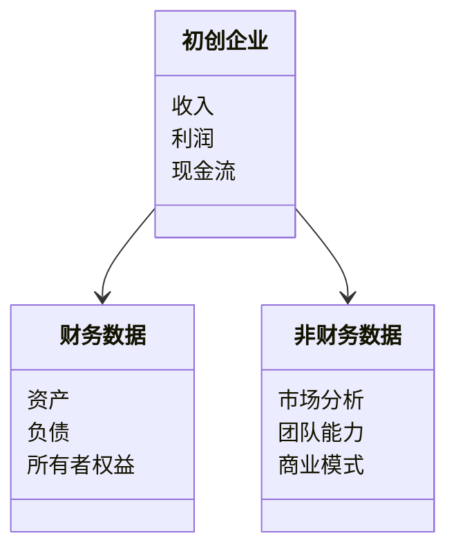
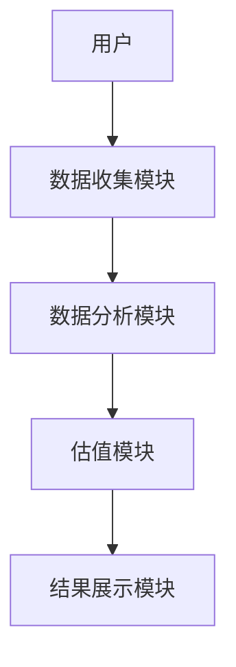

                 

<think>
嗯，用户需要我帮忙设计一本关于《如何评估初创企业的价值》的目录大纲。他们希望结构清晰，逻辑严密，覆盖所有相关主题。首先，我应该理解用户的需求，他们可能是一位创业者、投资者或者初创企业的顾问，希望通过这本书来系统地学习如何评估企业的价值。

我需要从背景开始，介绍为什么评估初创企业价值很重要，以及基本的评估方法。然后，深入讲解财务分析，因为财务数据是评估的重要部分。接着，考虑非财务因素，如市场、团队和商业模式，这些都是影响企业价值的关键因素。

接下来，我需要介绍具体的评估方法，比如DCF模型和创业投资的估值方法，这些都是评估初创企业的常用工具。然后，结合实际案例分析，帮助读者更好地理解如何应用这些方法。最后，总结整个评估过程，强调关键点和注意事项，并提供进一步的学习资源。

在结构上，我应该将内容分为几个主要部分，每个部分下再细分章节和小节，确保逻辑连贯，层次分明。同时，每个章节需要详细讲解核心概念，包括原理、公式、图表和实际应用，以满足用户对深度和技术细节的要求。

我需要确保每个章节都细化到三级目录，涵盖核心概念、原理、公式、图表和实际应用。同时，保持目录的简洁性和完整性，确保总字数在2000字以内，内容全面且易于理解。这样，用户就能有一本结构清晰、内容全面的书籍大纲了。
</think>

# 如何评估初创企业的价值

> 关键词：初创企业, 价值评估, 财务分析, 非财务因素, 创业投资, DCF模型

> 摘要：评估初创企业的价值是一个复杂但关键的过程，涉及财务和非财务多个方面。本文将从基础概念、方法论、系统架构、项目实战等角度，详细阐述如何全面评估初创企业的价值，帮助读者掌握核心技巧和最佳实践。

---

# 第一部分: 初创企业价值评估的背景与基础

## 第1章: 初创企业价值评估概述

### 1.1 初创企业价值评估的背景与意义
#### 1.1.1 初创企业的定义与特点
- 初创企业的定义：处于早期发展阶段的企业，通常具有高增长潜力。
- 初创企业的特点：资源有限、不确定性高、依赖创新。

#### 1.1.2 价值评估在初创企业中的重要性
- 投资决策：帮助投资者判断企业的潜在回报。
- 融资需求：评估企业价值以吸引投资者。
- 战略规划：指导企业制定合理的业务目标。

#### 1.1.3 价值评估的边界与外延
- 价值评估的边界：评估范围和适用场景。
- 价值评估的外延：长期价值与短期价值的平衡。

### 1.2 价值评估的核心概念与联系
#### 1.2.1 核心概念原理
- 价值评估的核心：通过数据和模型，将企业未来的现金流折现为当前价值。
- 初创企业的特殊性：高成长性与高风险并存。

#### 1.2.2 概念属性特征对比表格
| 概念       | 特性       |
|------------|------------|
| 初创企业   | 高不确定性 |
| 价值评估   | 数据驱动   |

#### 1.2.3 ER实体关系图架构
```mermaid
er
  实体: 初创企业
  属性: 名称、成立时间、行业
  关系: 参与者（投资者、团队）、财务数据（收入、利润）
```

---

## 第2章: 初创企业价值评估的财务分析

### 2.1 初创企业的财务报表分析
#### 2.1.1 利润表分析
- 收入来源：产品或服务的收入。
- 成本结构：直接成本和间接成本。
- 净利润：衡量企业盈利能力。

#### 2.1.2 资产负债表分析
- 资产：流动资产和非流动资产。
- 负债：短期负债和长期负债。
- 所有者权益：净资产价值。

#### 2.1.3 现金流量表分析
- 经营活动现金流：企业日常运营的现金流。
- 投资活动现金流：资本支出和投资活动。
- 筹资活动现金流：融资活动的现金流。

### 2.2 财务指标与估值方法
#### 2.2.1 常用财务指标
- 市盈率（P/E）：市价与每股收益的比率。
- 市净率（P/B）：市价与每股净资产的比率。
- 资产负债率：衡量企业的财务杠杆。

#### 2.2.2 常见估值方法
- DCF模型：通过未来现金流折现计算企业价值。
- 市盈率法：基于可比公司的市盈率进行估值。
- 市净率法：基于可比公司的市净率进行估值。

### 2.3 财务模型构建与应用
#### 2.3.1 财务模型构建步骤
1. 收集历史财务数据。
2. 预测未来现金流。
3. 确定合适的折现率。
4. 计算企业价值。

#### 2.3.2 财务模型应用实例
```python
# 示例代码：计算DCF模型
def discounted_cash_flow(cash_flows, discount_rate):
    present_value = sum(cash_flows[i] / (1 + discount_rate) ** i for i in range(len(cash_flows)))
    return present_value

cash_flows = [100, 200, 300, 400]
discount_rate = 0.1
value = discounted_cash_flow(cash_flows, discount_rate)
print(value)
```

---

## 第3章: 初创企业价值评估的非财务因素

### 3.1 市场分析与竞争环境
#### 3.1.1 行业分析
- 行业生命周期：初创企业所处行业的发展阶段。
- 市场规模：潜在客户数量和市场规模。

#### 3.1.2 竞争分析
- 竞争对手分析：主要竞争对手的优劣势。
- 市场定位：企业在市场中的独特地位。

### 3.2 团队能力与企业治理
#### 3.2.1 团队能力评估
- 核心团队经验：创始人和高管的行业经验。
- 团队结构：技术、市场、财务等团队的平衡。

#### 3.2.2 企业治理结构
- 股权结构：创始人、投资者的股权分配。
- 治理机制：董事会、决策流程的合理性。

### 3.3 商业模式与市场定位
#### 3.3.1 商业模式画布
- 客户细分：目标客户群体。
- 价值主张：企业为客户提供的独特价值。
- 渠道通路：产品或服务的销售渠道。

#### 3.3.2 市场定位策略
- 核心竞争力：企业的独特优势。
- 品牌定位：品牌形象和市场认知。

---

## 第4章: 初创企业价值评估的方法论

### 4.1 初创企业价值评估的常见方法
#### 4.1.1 DCF模型
- 现金流预测：未来5年现金流预测。
- 折现率：WACC（加权平均资本成本）。

#### 4.1.2 市盈率法
- 可比公司分析：选取行业内的可比公司。
- 市盈率倍数：计算目标企业的价值。

#### 4.1.3 市净率法
- 可比公司分析：选取行业内的可比公司。
- 市净率倍数：计算目标企业的价值。

### 4.2 创业投资的估值方法
#### 4.2.1 投资人视角的估值
- 投资回报率：预期的年化回报率。
- 折现率：基于风险的折现率。

#### 4.2.2 创业者视角的估值
- 企业未来增长潜力。
- 资源的可获得性。

### 4.3 估值模型的优缺点对比
| 方法       | 优点                     | 缺点                     |
|------------|--------------------------|--------------------------|
| DCF模型    | 精确性高                 | 对未来现金流预测敏感     |
| 市盈率法    | 简单易用                 | 受市场波动影响较大       |
| 市净率法    | 稳定性高                 | 适用于资产密集型企业     |

---

## 第5章: 初创企业价值评估的系统分析与架构

### 5.1 问题场景介绍
#### 5.1.1 评估目标
- 通过数据驱动的方法，评估初创企业的价值。

#### 5.1.2 评估范围
- 财务数据：收入、利润、现金流。
- 非财务数据：市场、团队、商业模式。

#### 5.1.3 评估步骤
1. 数据收集：整理企业的财务和非财务数据。
2. 数据分析：使用模型进行估值。
3. 结果验证：对比市场数据，调整模型。

### 5.2 系统功能设计
#### 5.2.1 领域模型


#### 5.2.2 系统架构设计


---

## 第6章: 初创企业价值评估的项目实战

### 6.1 环境安装与工具准备
#### 6.1.1 数据收集工具
- Excel：整理财务数据。
- CRM：收集市场和客户数据。

#### 6.1.2 分析工具
- Python：数据处理和建模。
- Excel：快速分析和可视化。

#### 6.1.3 估值工具
- DCF模型：使用Excel或Python进行计算。
- 可比公司分析：使用 financial 数据库。

### 6.2 核心实现源代码
#### 6.2.1 数据处理代码
```python
import pandas as pd

# 示例代码：读取财务数据
data = pd.read_csv('financial_data.csv')
print(data.head())
```

#### 6.2.2 财务模型代码
```python
def calculate_wacc(market_value, debt, equity, cost_of_debt, cost_of_equity):
    wacc = (debt / (debt + equity)) * cost_of_debt * (1 - tax_rate) + (equity / (debt + equity)) * cost_of_equity
    return wacc

market_value = 1000
debt = 300
equity = 700
cost_of_debt = 0.05
cost_of_equity = 0.10
tax_rate = 0.20
wacc = calculate_wacc(market_value, debt, equity, cost_of_debt, cost_of_equity)
print(wacc)
```

#### 6.2.3 估值算法代码
```python
def dcf_value(cash_flows, discount_rate):
    return sum(cash_flows[i] / (1 + discount_rate) ** i for i in range(len(cash_flows)))

cash_flows = [100, 200, 300, 400]
discount_rate = 0.10
value = dcf_value(cash_flows, discount_rate)
print(value)
```

### 6.3 代码应用解读与分析
#### 6.3.1 代码功能分析
- 数据处理代码：读取和整理数据。
- 财务模型代码：计算WACC（加权平均资本成本）。
- 估值算法代码：计算企业价值。

#### 6.3.2 代码优化建议
- 数据清洗：处理缺失值和异常值。
- 模型优化：引入更多财务指标和市场数据。

#### 6.3.3 代码实际案例分析
- 案例：某初创企业的财务数据和市场分析。

### 6.4 项目小结
#### 6.4.1 项目总结
- 成功完成初创企业的价值评估。
- 使用了多种方法和工具。

#### 6.4.2 经验教训
- 数据质量对结果影响重大。
- 模型的选择需结合实际情况。

#### 6.4.3 未来改进方向
- 引入更多非财务数据。
- 优化估值模型，提高准确性。

---

## 第7章: 初创企业价值评估的最佳实践与小结

### 7.1 最佳实践Tips
#### 7.1.1 数据收集与处理
- 确保数据的准确性和完整性。
- 使用工具自动化处理数据。

#### 7.1.2 模型选择与优化
- 根据实际情况选择合适的模型。
- 不断优化模型，提高估值准确性。

#### 7.1.3 结果验证与反馈
- 对比市场数据，验证结果。
- 根据反馈调整模型。

### 7.2 小结与注意事项
#### 7.2.1 价值评估的关键点
- 财务数据与非财务数据的结合。
- 模型的选择与优化。

#### 7.2.2 评估过程中的注意事项
- 数据的准确性和完整性。
- 模型的适用性和限制。

#### 7.2.3 评估结果的合理使用
- 结果作为决策参考。
- 结合市场变化和企业实际情况调整。

### 7.3 拓展阅读与学习资源
#### 7.3.1 推荐书籍
- 《创业企业的估值方法》。
- 《财务报表分析与企业估值》。

#### 7.3.2 推荐在线课程
- 初创企业估值与融资。
- 财务建模与数据分析。

#### 7.3.3 推荐工具
- Excel：数据处理和建模。
- Python：高级数据分析和建模。

---

# 作者：AI天才研究院/AI Genius Institute & 禅与计算机程序设计艺术 /Zen And The Art of Computer Programming

