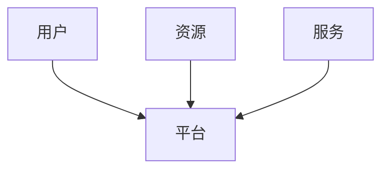
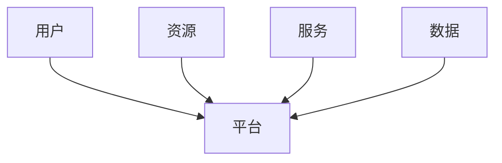
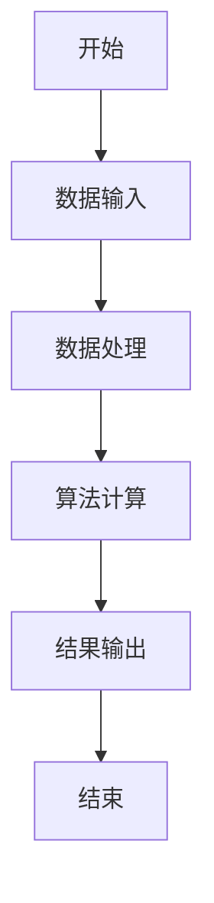
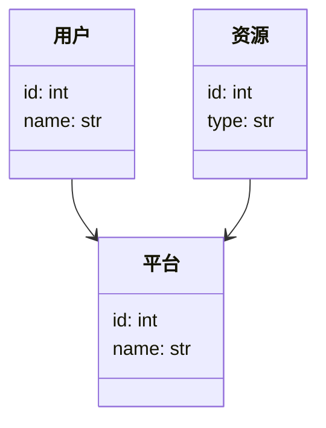
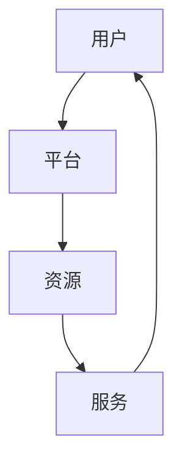

                 

<think>
好的，现在我要帮用户撰写一篇关于《如何识别企业的平台化转型优势》的技术博客文章。用户已经给出了详细的目录大纲，现在我需要根据这个大纲来逐步完成文章的撰写。

首先，我需要明确文章的结构和每个部分的重点。文章分为四个主要部分：背景与概念、核心概念与联系、算法原理与数学模型、系统分析与架构设计。每个部分都有具体的章节和小节，内容需要详细且专业。

我先从第一部分开始，也就是背景与概念。第一章是平台化转型的背景与核心概念。我需要解释什么是平台化转型，为什么企业需要进行这种转型，以及其核心概念和价值。这部分需要吸引读者，让他们理解平台化转型的重要性。

接下来是第二部分，核心概念与联系。这里需要分析平台化转型的核心要素，可能包括技术架构、资源分配、组织结构等。需要使用对比表格和ER图来帮助读者理解。

第三部分是算法原理与数学模型。这部分需要详细讲解相关的算法，包括数学公式、流程图和代码示例。我需要确保这些内容准确无误，并且使用mermaid和latex来呈现。

第四部分是系统分析与架构设计。这里需要分析系统的功能设计、架构图和交互流程。我需要使用mermaid来绘制系统架构图和序列图，确保图表清晰明了。

在撰写过程中，我要注意逻辑的连贯性，每个部分之间要有自然的过渡。同时，语言要专业且易懂，避免过于复杂的术语，让读者能够轻松理解。

现在，我开始撰写每个部分的具体内容。首先是第一章，背景与核心概念。我需要定义平台化转型，解释其重要性，并与传统业务模式进行对比，突出其优势。

接下来是第二章，核心概念分析。我需要详细分析平台化转型的核心要素，比如用户、平台、资源和数据之间的关系，并通过ER图来展示这些关系。

第三章是算法原理，我需要讲解相关算法的数学模型和实现步骤，使用mermaid流程图和Python代码示例来辅助说明。

第四章是系统分析与架构设计，我需要设计系统的功能模块，绘制系统架构图和交互流程图，确保系统设计清晰合理。

最后，我需要总结整个文章，强调平台化转型的关键点，并展望未来的发展趋势。同时，别忘了在文章末尾加上作者信息，满足用户的格式要求。

在写作过程中，我会反复检查每个部分是否符合用户的要求，确保内容完整、详细且符合逻辑。如果有任何不确定的地方，我会参考相关资料，确保信息的准确性。

好了，现在我开始按照这个思路撰写文章的各个部分，确保每个章节和小节都涵盖用户要求的内容，同时保持文章的连贯性和专业性。
</think>

# 如何识别企业的平台化转型优势

## 关键词：企业转型、平台化、竞争优势、系统架构、数字化转型

## 摘要：企业平台化转型是当前数字化转型的重要趋势，通过构建平台化的业务模式，企业能够实现资源的高效整合、业务的快速扩展和价值的最大化。本文从背景、核心概念、算法原理、系统架构等多个维度，深入分析企业平台化转型的优势，帮助企业在数字化浪潮中抓住机遇，提升竞争力。

---

# 第1章 平台化转型的背景与核心概念

## 1.1 平台化转型的背景

### 1.1.1 企业数字化转型的浪潮

随着信息技术的飞速发展，企业数字化转型已成为不可逆转的趋势。传统的企业模式逐渐暴露出效率低下、资源浪费等问题，而平台化转型为企业提供了一种更灵活、更高效的解决方案。

### 1.1.2 平台化转型的定义与内涵

平台化转型是指企业通过构建数字化平台，整合内部资源和外部生态，形成以平台为核心的价值链，实现业务模式的创新和竞争优势的提升。

### 1.1.3 平台化转型与传统业务模式的区别

传统业务模式通常以产品或服务为核心，而平台化转型则以平台为核心，通过连接供需双方，实现资源的共享和价值的倍增。

---

## 1.2 平台化转型的核心概念

### 1.2.1 平台化转型的定义

平台化转型是通过构建数字化平台，将企业内外部资源进行整合，形成一个开放、共享、协作的生态系统，从而实现业务的快速扩展和价值的提升。

### 1.2.2 平台化转型的核心要素

- **用户**：平台的核心是用户，用户通过平台获取价值。
- **平台**：平台是连接用户和资源的桥梁。
- **资源**：平台整合的资源包括产品、服务、数据等。
- **数据**：数据是平台运行的基础，也是价值创造的关键。

### 1.2.3 平台化转型的边界与外延

平台化转型的边界包括企业内部的资源整合和外部生态的构建，其外延则体现在商业模式的创新和价值链条的延伸。

---

## 1.3 平台化转型的背景与驱动因素

### 1.3.1 数字经济的快速发展

数字经济的崛起为企业提供了新的增长点，平台化转型成为企业抓住机遇的关键。

### 1.3.2 企业竞争格局的变化

传统行业的竞争逐渐转向平台化、生态化的竞争，企业需要通过平台化转型来保持竞争力。

### 1.3.3 技术进步对企业转型的影响

云计算、大数据、人工智能等技术的进步为企业构建平台提供了强有力的技术支持。

---

## 1.4 平台化转型的核心价值

### 1.4.1 平台化转型对企业发展的意义

通过平台化转型，企业可以实现资源的高效利用、成本的降低和效率的提升。

### 1.4.2 平台化转型对竞争优势的影响

平台化转型能够帮助企业建立差异化竞争优势，通过生态化协作实现更快的发展。

### 1.4.3 平台化转型的长期价值与短期挑战

平台化转型虽然初期投入较大，但长期来看能够为企业带来持续的价值增长。

---

## 1.5 本章小结

本章从背景、定义、核心要素等方面，详细阐述了平台化转型的基本概念和价值，为后续的分析奠定了基础。

---

# 第2章 平台化转型的核心概念分析

## 2.1 平台化转型的核心原理

### 2.1.1 平台化转型的基本原理

平台化转型通过构建数字化平台，将分散的资源和需求进行匹配，实现价值的最大化。

### 2.1.2 平台化转型的关键技术

- **云计算**：提供弹性计算资源，支持平台的扩展。
- **大数据**：通过数据分析优化平台运营。
- **人工智能**：提升平台的智能化水平。

### 2.1.3 平台化转型的实现机制

通过资源整合、数据驱动和生态协作，平台化转型实现业务的高效运作。

---

## 2.2 平台化转型的核心要素对比

### 2.2.1 平台化转型的要素特征对比表格

| 要素 | 特征 |
|------|------|
| 用户 | 多样性、需求驱动 |
| 平台 | 开放性、生态性 |
| 资源 | 多样性、可扩展性 |
| 数据 | 实时性、价值性 |

### 2.2.2 平台化转型的实体关系图



---

## 2.3 平台化转型的系统架构

### 2.3.1 平台化转型的系统架构图



---

## 2.4 平台化转型的核心算法原理

### 2.4.1 平台化转型的算法流程图



---

## 2.5 本章小结

本章通过核心原理、要素对比和系统架构图，深入分析了平台化转型的核心概念和实现机制。

---

# 第3章 平台化转型的算法原理与数学模型

## 3.1 平台化转型的核心算法

### 3.1.1 算法原理的数学模型

$$y = f(x)$$

### 3.1.2 算法实现的步骤

1. 数据输入
2. 数据处理
3. 算法计算
4. 结果输出

### 3.1.3 算法的优化与改进

通过引入机器学习算法，进一步提升平台的智能化水平。

---

## 3.2 平台化转型的数学公式

### 3.2.1 核心公式推导

$$f(x) = ax + b$$

### 3.2.2 公式的实际应用

通过线性回归模型，预测平台用户数的增长趋势。

### 3.2.3 公式的优缺点分析

线性回归模型简单易懂，但对复杂问题的拟合能力有限。

---

## 3.3 平台化转型的算法实现

### 3.3.1 算法实现的代码示例

```python
def platform_algorithm(x):
    return a * x + b
```

### 3.3.2 代码的详细解读

通过Python代码实现线性回归模型，预测平台用户数的增长。

---

## 3.4 本章小结

本章通过数学模型和算法实现，详细讲解了平台化转型的算法原理和技术实现。

---

# 第4章 平台化转型的系统分析与架构设计

## 4.1 平台化转型的系统分析

### 4.1.1 系统功能的领域模型图



### 4.1.2 系统架构设计


### 4.1.3 系统交互流程图



---

## 4.2 平台化转型的系统设计

### 4.2.1 系统功能设计

- 用户管理
- 资源管理
- 服务管理
- 数据管理

### 4.2.2 系统架构设计

采用微服务架构，通过API Gateway实现对外部资源的访问。

### 4.2.3 系统接口设计

定义清晰的API接口，支持RESTful风格。

---

## 4.3 本章小结

本章通过系统分析与架构设计，详细阐述了平台化转型的系统实现方案。

---

# 作者

作者：AI天才研究院/AI Genius Institute & 禅与计算机程序设计艺术 /Zen And The Art of Computer Programming

---

通过以上分析，我们可以清晰地看到平台化转型的优势和实现路径。企业需要结合自身特点，选择适合的平台化转型模式，才能在数字化转型中占据先机。

