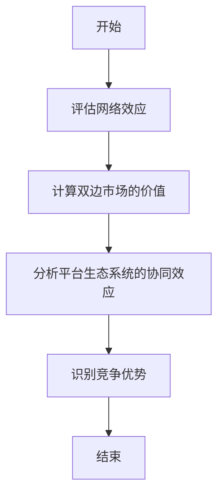
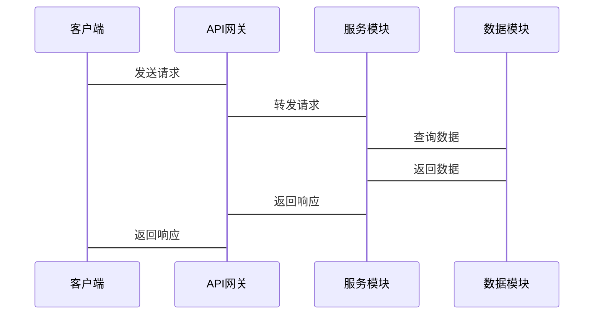

                 

<think>
好的，我需要撰写一篇关于《如何识别企业的平台战略优势》的技术博客文章。首先，我需要理解什么是平台战略优势，以及它对企业的重要性。平台战略涉及到构建一个生态系统，连接多方参与者，通过网络效应创造价值。这与传统的线性商业模式不同，平台能够通过规模效应和数据积累实现更快的增长。

接下来，我应该分析平台战略的核心要素，比如双边市场、网络效应和生态系统。为了更好地理解这些概念，我可以制作一些对比表格和ER实体关系图。例如，可以将平台战略与传统商业模式进行对比，突出其优势。

然后，我需要深入讲解识别平台战略优势的算法。这可能包括如何评估网络效应的强度，如何计算平台的扩展性等。我可以用Mermaid流程图来展示识别过程，并用Python代码实现部分算法，如计算双边市场的价值。

在系统分析部分，我需要设计一个模块化的系统架构，展示各个模块之间的关系，如用户管理、数据处理和接口设计。这有助于读者理解如何构建一个高效的平台系统。

接下来是项目实战，我需要选择一个实际案例，详细描述从环境安装到核心代码实现的整个过程。例如，可以使用Python和Flask框架搭建一个简单的平台，并分析其网络效应。

最后，总结最佳实践，强调持续优化和风险管理的重要性，并推荐进一步阅读的资源。

通过这样的步骤，我可以系统地构建一篇结构清晰、内容详实的技术博客，帮助读者理解如何识别和利用平台战略优势。
</think>

# 如何识别企业的平台战略优势

## 关键词：平台战略、网络效应、生态系统、双边市场、平台经济

## 摘要：  
平台战略优势是企业在数字化转型中构建生态系统、连接多方参与者并通过网络效应创造价值的关键能力。本文从背景、核心概念、算法原理、系统架构、项目实战到最佳实践，详细分析如何识别和利用平台战略优势，助力企业实现可持续发展。

---

## 第一部分：企业平台战略优势的背景与概念

### 第1章：平台战略优势的背景与定义

#### 1.1 平台战略的背景与重要性

- **1.1.1 数字化转型与平台经济的兴起**  
  随着互联网和信息技术的飞速发展，平台经济成为推动经济增长的重要引擎。企业通过构建平台，连接供需双方，创造新的商业模式和价值来源。

- **1.1.2 平台战略在企业竞争中的作用**  
  平台战略帮助企业打破传统线性商业模式的限制，通过网络效应和生态系统构建，实现快速扩展和创新。

- **1.1.3 平台战略与企业可持续发展的关系**  
  平台战略不仅帮助企业实现短期增长，还能通过持续优化和创新，确保长期的可持续发展。

#### 1.2 平台战略的定义与核心要素

- **1.2.1 平台战略的定义**  
  平台战略是指企业通过构建一个开放的平台，连接多方参与者（如供应商、客户、开发者等），并通过网络效应和数据驱动的方式，创造和传递价值。

- **1.2.2 平台战略的核心要素**  
  - **双边市场**：连接两个或多个群体，通过交叉网络效应实现价值放大。
  - **网络效应**：用户数量增加带来的边际成本递减和价值提升。
  - **生态系统**：通过开放接口和标准，吸引第三方开发者和服务提供者，形成协同效应。

- **1.2.3 平台战略的边界与外延**  
  平台战略不仅限于技术实现，还包括商业模式、组织结构和文化变革等多个方面。

#### 1.3 平台战略与传统企业战略的区别

- **1.3.1 传统线性商业模式的局限性**  
  传统模式依赖于单一的产品或服务，难以快速响应市场变化和客户需求。

- **1.3.2 平台战略的创新性与优势**  
  平台战略通过连接和整合多方资源，实现快速创新和价值扩展。

- **1.3.3 平台战略对企业价值创造的影响**  
  平台战略通过网络效应和生态系统构建，为企业创造更大的经济价值和社会价值。

#### 1.4 本章小结

本章从背景、定义和核心要素三个方面，详细阐述了平台战略的优势及其与传统商业模式的区别。平台战略不仅是企业数字化转型的关键，也是未来商业竞争的核心能力。

---

## 第二部分：平台战略优势的核心概念与联系

### 第2章：平台战略的核心概念与联系

#### 2.1 平台战略的核心概念

- **2.1.1 双边市场与多边市场的定义与特点**  
  双边市场是指平台连接两个群体（如买家和卖家），而多边市场则连接三个或更多群体。两者都通过交叉网络效应实现价值放大。

- **2.1.2 网络效应的定义与实现方式**  
  网络效应是指随着用户数量增加，平台的价值呈指数级增长。其实现方式包括降低交易成本、提高用户粘性和数据驱动的个性化服务。

- **2.1.3 平台生态系统的构建与管理**  
  平台生态系统通过开放接口和标准，吸引第三方开发者和服务提供者，形成协同效应，从而增强平台的竞争力。

#### 2.2 平台战略核心概念的对比分析

- **2.2.1 平台战略与传统商业模式的对比表格**  
  | **核心要素** | **传统商业模式** | **平台战略** |
  |--------------|------------------|--------------|
  | 价值来源    | 产品或服务       | 网络效应与生态系统 |
  | 扩展性       | 较低             | 高           |
  | 创新速度     | 缓慢             | 快           |

- **2.2.2 平台战略与企业竞争优势的对比分析**  
  平台战略通过连接和整合多方资源，快速构建竞争优势，而传统模式依赖于单一的产品或服务，难以应对市场变化。

- **2.2.3 平台战略与企业创新的关系**  
  平台战略通过生态系统和开放创新，推动企业快速创新和价值创造。

#### 2.3 平台战略核心要素的ER实体关系图

```mermaid
erDiagram
    user<->"参与平台的用户">platform
    supplier<->"提供服务或产品的供应商">platform
    developer<->"开发应用程序或服务的开发者">platform
    data<->"数据流，连接用户、供应商和开发者">platform
    transaction<->"交易记录，连接用户和供应商">platform
    service<->"服务接口，连接开发者和平台">platform
```

#### 2.4 本章小结

本章通过对比分析和ER实体关系图，详细阐述了平台战略的核心概念及其与传统商业模式的区别。平台战略通过网络效应和生态系统构建，为企业创造更大的价值。

---

## 第三部分：平台战略优势的算法原理

### 第3章：平台战略优势的算法原理

#### 3.1 识别平台战略优势的算法



- **3.1.1 算法原理的数学模型**  
  网络效应的强度可以通过以下公式计算：

  $$ 网络效应强度 = \frac{N}{N - 1} $$

  其中，\( N \) 是平台的用户数量。

- **3.1.2 算法实现的Python代码示例**  

```python
def calculate_network_effect(N):
    return N / (N - 1) if N > 1 else 0

# 示例
N = 1000
network_effect = calculate_network_effect(N)
print(f"网络效应强度为：{network_effect}")
```

#### 3.2 算法实现与分析

- **3.2.1 算法实现的细节**  
  通过计算网络效应强度，评估平台的扩展性和用户粘性。

- **3.2.2 算法的优缺点**  
  优点：简单易懂，计算速度快。缺点：适用于双边市场，对多边市场可能不够准确。

#### 3.3 本章小结

本章通过算法实现，详细讲解了如何识别平台战略优势。网络效应的计算为企业的平台构建提供了重要参考。

---

## 第四部分：平台战略优势的系统分析与架构设计

### 第4章：平台战略优势的系统分析与架构设计

#### 4.1 系统分析

- **4.1.1 问题场景介绍**  
  企业希望通过构建平台，连接用户、供应商和开发者，实现网络效应和生态系统。

#### 4.2 系统架构设计


- **4.2.1 系统功能设计**  
  - 用户模块：用户注册、登录和管理。
  - 数据模块：数据存储和分析。
  - 服务模块：提供API接口和第三方服务。
  - 管理模块：平台管理和监控。

#### 4.3 系统架构设计


#### 4.4 系统接口设计

- **4.4.1 接口设计**  
  - RESTful API：用于用户认证和数据查询。
  - WebSocket：用于实时通信。

#### 4.5 系统交互设计



#### 4.6 本章小结

本章通过系统架构设计和接口设计，详细讲解了如何构建一个高效的平台系统。

---

## 第五部分：平台战略优势的项目实战

### 第5章：平台战略优势的项目实战

#### 5.1 项目环境安装

- **5.1.1 环境需求**  
  - 操作系统：Linux/Windows/MacOS
  - 开发工具：PyCharm/VS Code
  - 依赖库：Flask、Django、Pandas

#### 5.2 核心代码实现

```python
from flask import Flask, request, jsonify

app = Flask(__name__)

@app.route('/api/users', methods=['GET'])
def get_users():
    # 示例代码：从数据库获取用户数据
    return jsonify({'status': 'success', 'message': '用户数据获取成功'})

if __name__ == '__main__':
    app.run(debug=True)
```

#### 5.3 代码应用解读与分析

- **5.3.1 代码实现细节**  
  通过Flask框架搭建一个简单的平台API接口，实现用户管理功能。

- **5.3.2 代码的实际应用分析**  
  该代码展示了如何通过RESTful API实现平台的核心功能，如用户认证和数据查询。

#### 5.4 实际案例分析

- **5.4.1 案例背景**  
  某企业希望通过平台战略构建一个连接用户和供应商的双边市场。

- **5.4.2 案例分析**  
  通过网络效应和生态系统构建，该企业成功实现了平台的快速扩展和价值创造。

#### 5.5 项目小结

本章通过实际项目实战，详细讲解了如何通过代码实现平台的核心功能，并分析了实际案例的应用。

---

## 第六部分：平台战略优势的最佳实践

### 第6章：平台战略优势的最佳实践

#### 6.1 最佳实践

- **6.1.1 持续优化平台战略**  
  定期评估和优化平台的网络效应和生态系统。

- **6.1.2 注重数据安全与隐私保护**  
  在构建平台时，必须确保用户数据的安全和隐私。

- **6.1.3 加强风险管理与应对策略**  
  制定风险管理计划，应对潜在的市场风险和技术挑战。

#### 6.2 小结

本章总结了平台战略优势的最佳实践，强调持续优化和风险管理的重要性。

#### 6.3 注意事项

- 平台战略的实施需要企业具备一定的技术和组织能力。
- 数据安全和隐私保护是平台构建的关键因素。

#### 6.4 拓展阅读

- 推荐书籍：《平台战略》、《网络经济学》。
- 推荐博客：TechCrunch、stratechery.com。

---

## 作者：AI天才研究院 & 禅与计算机程序设计艺术

---

通过以上内容，您可以系统地识别和理解企业的平台战略优势，并将其应用于实际项目中。希望本文对您有所帮助！

