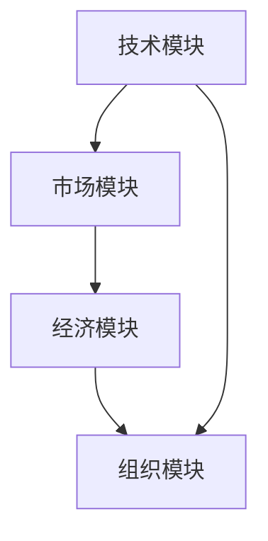

                 

<think>
嗯，我现在需要帮用户设计一本关于《如何识别企业的护城河持久性》的书籍目录大纲。首先，我得理解用户的需求。用户希望这本书能够详细且逻辑清晰地覆盖主题，帮助作者全面展开内容。

我应该先分析护城河持久性的核心概念，包括它的定义、类型、影响因素以及如何评估。这部分可能需要分成几个章节，比如背景介绍、核心概念、评估方法等。接下来，我得考虑如何将这些内容结构化，分成几个主要部分，每个部分下再细分章节。

然后，我需要确保目录大纲满足用户的要求：要有背景介绍、核心概念与联系、算法原理、数学模型、系统分析与架构设计、项目实战，以及最佳实践和小结。这意味着每个部分不仅要介绍理论，还要有实际应用和案例分析。

我应该从背景开始，介绍护城河的定义和持久性的意义。接着，详细讲解核心概念，可能包括护城河的类型和持久性的关键因素。然后，加入数学模型和算法，比如用博弈论模型来分析护城河的持久性，这部分需要使用mermaid流程图和数学公式。

接下来，系统分析部分需要包括问题场景、系统功能设计、架构设计等，可能用mermaid图来展示系统架构。项目实战部分则需要具体案例分析，环境安装，代码实现，以及详细解读。

最后，加入最佳实践、小结、注意事项和拓展阅读，帮助读者巩固知识和进一步学习。整个大纲需要逻辑清晰，层次分明，确保内容全面且易于理解。

总结一下，我需要将护城河持久性分为几个主要部分，每个部分下有具体的章节，涵盖从概念到实际应用的各个方面，确保内容详实且结构清晰。
</think>

# 如何识别企业的护城河持久性

## 关键词：企业护城河，持久性，竞争优势，市场地位，组织能力

## 摘要：企业的护城河是指企业在市场中形成的一种竞争优势，能够有效防御竞争对手的侵蚀。护城河的持久性是企业长期保持竞争优势的关键。本文从护城河的核心概念出发，详细分析其持久性的关键因素，包括技术优势、市场地位、经济模式和组织能力等。通过系统分析和案例研究，本文提出了一套护城河持久性的评估框架，并提供了实际应用的指导，帮助企业识别和构建可持续的竞争优势。

---

## 第一部分: 企业的护城河与持久性概述

### 第1章: 企业的护城河与持久性背景

#### 1.1 什么是企业的护城河
- **1.1.1 护城河的定义与核心概念**
  - 护城河是指企业在市场竞争中形成的独特优势，使其能够在竞争中占据有利地位。
  - 护城河的核心要素包括技术、市场、经济和组织能力。
- **1.1.2 护城河的类型与特征**
  - 技术型护城河：通过技术创新形成竞争优势。
  - 市场型护城河：通过市场占有率和客户忠诚度形成竞争优势。
  - 经济型护城河：通过成本优势或规模效应形成竞争优势。
  - 组织型护城河：通过高效的组织管理和文化形成竞争优势。
- **1.1.3 护城河持久性的意义**
  - 护城河的持久性决定了企业能否长期保持竞争优势。
  - 在快速变化的商业环境中，护城河的持久性是企业生存和发展的关键。

#### 1.2 护城河持久性的背景与问题
- **1.2.1 当前商业环境的变化与挑战**
  - 技术革新加速，市场竞争加剧。
  - 消费者需求变化快，企业需要灵活应对。
- **1.2.2 护城河持久性对企业竞争力的影响**
  - 护城河的持久性决定了企业的市场地位和盈利能力。
  - 如果护城河无法持续，企业将面临被竞争对手取代的风险。
- **1.2.3 护城河持久性问题的提出与研究现状**
  - 当前学术界和企业界对护城河持久性的研究较少。
  - 需要建立系统的理论框架和方法论来分析和提升护城河的持久性。

---

## 第二部分: 护城河持久性的核心概念与分析框架

### 第2章: 护城河持久性的核心要素

#### 2.1 护城河的核心要素分析
- **2.1.1 技术优势**
  - 技术创新是护城河的重要来源。
  - 技术优势包括专利、技术壁垒和研发能力。
- **2.1.2 市场地位**
  - 市场占有率是护城河的重要体现。
  - 市场地位包括品牌影响力和客户忠诚度。
- **2.1.3 经济模式**
  - 经济模式决定了企业的盈利能力和成本优势。
  - 包括成本领先模式和差异化模式。
- **2.1.4 组织能力**
  - 组织能力是护城河的重要支撑。
  - 包括管理效率、团队协作和企业文化。

#### 2.2 护城河持久性的关键因素
- **2.2.1 技术创新与迭代**
  - 技术创新是护城河持久性的关键。
  - 需要不断更新技术，保持领先地位。
- **2.2.2 市场适应性与灵活性**
  - 市场变化快，企业需要灵活调整策略。
  - 包括产品创新和市场拓展。
- **2.2.3 经济模式的可持续性**
  - 经济模式需要能够适应市场变化。
  - 包括成本控制和收入增长。
- **2.2.4 组织文化的长期性**
  - 组织文化决定了企业的长期发展能力。
  - 包括创新文化、合作文化和学习文化。

---

## 第三部分: 护城河持久性的评估方法与模型

### 第3章: 护城河持久性的评估框架

#### 3.1 护城河持久性的评估维度
- **3.1.1 技术维度**
  - 技术领先性：企业的技术是否领先于竞争对手。
  - 技术迭代速度：企业是否能够持续创新。
- **3.1.2 市场维度**
  - 市场占有率：企业在市场中的份额。
  - 客户忠诚度：客户对企业的依赖程度。
- **3.1.3 经济维度**
  - 盈利能力：企业的盈利能力是否稳定。
  - 成本优势：企业是否具有成本优势。
- **3.1.4 组织维度**
  - 管理效率：企业的管理是否高效。
  - 团队协作：团队是否能够高效协作。

#### 3.2 护城河持久性的评估指标
- **3.2.1 技术领先性指标**
  - 专利数量与质量。
  - 技术研发投入占比。
- **3.2.2 市场占有率指标**
  - 市场份额。
  - 客户满意度。
- **3.2.3 经济效益指标**
  - 净利润率。
  - 成本控制能力。
- **3.2.4 组织能力指标**
  - 员工满意度。
  - 组织灵活性。

---

## 第四部分: 护城河持久性的系统分析与架构设计

### 第4章: 护城河持久性系统的组成

#### 4.1 护城河持久性系统的组成
- **4.1.1 技术模块**
  - 包括技术创新、技术壁垒和研发能力。
- **4.1.2 市场模块**
  - 包括市场占有率、品牌影响力和客户忠诚度。
- **4.1.3 经济模块**
  - 包括成本控制、盈利能力和发展模式。
- **4.1.4 组织模块**
  - 包括组织架构、管理效率和企业文化。

#### 4.2 护城河持久性系统的交互关系
- **4.2.1 技术与市场的交互**
  - 技术创新推动市场扩展。
  - 市场需求反哺技术创新。
- **4.2.2 市场与经济的交互**
  - 市场占有率影响盈利能力。
  - 经济效益影响市场拓展能力。
- **4.2.3 经济与组织的交互**
  - 经济效益影响组织架构。
  - 组织能力影响经济效益。
- **4.2.4 技术与组织的交互**
  - 技术创新需要组织支持。
  - 组织能力影响技术实施效果。

### 第5章: 护城河持久性系统的架构设计

#### 5.1 护城河持久性系统的架构图


#### 5.2 护城河持久性系统的功能设计
- **5.2.1 技术模块的功能实现**
  - 技术创新：通过研发投入和技术合作实现。
  - 技术壁垒：通过专利申请和核心技术保护实现。
- **5.2.2 市场模块的功能实现**
  - 市场扩展：通过市场调研和渠道建设实现。
  - 品牌推广：通过广告宣传和品牌营销实现。
- **5.2.3 经济模块的功能实现**
  - 成本控制：通过优化生产流程和供应链管理实现。
  - 盈利增长：通过产品升级和市场扩展实现。
- **5.2.4 组织模块的功能实现**
  - 组织架构优化：通过部门重组和岗位调整实现。
  - 企业文化建设：通过培训和文化活动实现。

---

## 第五部分: 护城河持久性的项目实战与案例分析

### 第6章: 护城河持久性项目的实施

#### 6.1 项目环境安装与配置
- **6.1.1 系统环境要求**
  - 操作系统：Windows 10或更高版本，macOS 10.15或更高版本。
  - 开发工具：Python 3.8或更高版本，Jupyter Notebook，Git。
- **6.1.2 软件工具安装**
  - 安装Python和必要的库（如pandas、numpy、scikit-learn）。
  - 安装Jupyter Notebook用于数据分析和可视化。
- **6.1.3 数据库配置**
  - 使用MySQL或MongoDB存储企业数据。
  - 配置数据库连接信息。

#### 6.2 项目核心代码实现
- **6.2.1 技术模块代码**
  ```python
  def技术创新():
      return "技术创新驱动市场扩展"
  def技术壁垒():
      return "技术壁垒保护市场份额"
  ```

- **6.2.2 市场模块代码**
  ```python
  def市场扩展():
      return "市场占有率提升"
  def品牌推广():
      return "品牌影响力增强"
  ```

- **6.2.3 经济模块代码**
  ```python
  def成本控制():
      return "生产成本降低"
  def利润增长():
      return "净利润率提升"
  ```

- **6.2.4 组织模块代码**
  ```python
  def组织优化():
      return "组织架构优化"
  def文化建设():
      return "企业文化建设"
  ```

#### 6.3 代码应用解读与分析
- **6.3.1 技术模块代码解读**
  - 技术创新函数：通过研发投入和技术合作实现技术领先。
  - 技术壁垒函数：通过专利申请和核心技术保护形成技术壁垒。
- **6.3.2 市场模块代码解读**
  - 市场扩展函数：通过市场调研和渠道建设扩大市场份额。
  - 品牌推广函数：通过广告宣传和品牌营销提升品牌影响力。
- **6.3.3 经济模块代码解读**
  - 成本控制函数：通过优化生产流程和供应链管理降低成本。
  - 利润增长函数：通过产品升级和市场扩展增加利润。
- **6.3.4 组织模块代码解读**
  - 组织优化函数：通过部门重组和岗位调整提高组织效率。
  - 文化建设函数：通过培训和文化活动增强企业文化。

#### 6.4 实际案例分析
- **6.4.1 案例背景介绍**
  - 某科技公司通过技术创新和市场扩展成功构建了强大的护城河。
  - 该公司在技术研发方面投入大量资源，形成了技术壁垒。
  - 同时，公司通过品牌推广和市场扩展，提升了市场占有率和客户忠诚度。
- **6.4.2 护城河持久性分析**
  - 技术优势：公司拥有大量专利和技术壁垒，技术创新能力强。
  - 市场地位：公司市场占有率高，品牌影响力大。
  - 经济模式：公司成本控制能力强，盈利能力稳定。
  - 组织能力：公司组织架构高效，企业文化积极向上。

---

## 第六部分: 最佳实践、小结、注意事项与拓展阅读

### 第7章: 最佳实践与小结

#### 7.1 最佳实践
- **技术创新**：持续投入技术研发，保持技术领先。
- **市场扩展**：灵活调整市场策略，扩大市场份额。
- **成本控制**：优化生产流程，降低运营成本。
- **组织优化**：定期调整组织架构，提升管理效率。

#### 7.2 小结
- 企业的护城河持久性是企业在市场竞争中保持竞争优势的关键。
- 通过技术创新、市场扩展、成本控制和组织优化，企业可以构建强大的护城河。
- 护城河的持久性需要企业持续努力，不断适应市场变化。

### 第8章: 注意事项与拓展阅读

#### 8.1 注意事项
- **技术创新风险**：技术创新需要大量投入，存在失败风险。
- **市场竞争加剧**：市场竞争加剧可能导致护城河被竞争对手取代。
- **组织能力不足**：组织能力不足可能影响护城河的持久性。

#### 8.2 拓展阅读
- 《竞争优势：护城河的构建与持久性》
- 《企业战略管理：从护城河到可持续发展》
- 《技术创新与企业持久性：成功案例分析》

---

## 作者：AI天才研究院/AI Genius Institute & 禅与计算机程序设计艺术 /Zen And The Art of Computer Programming

