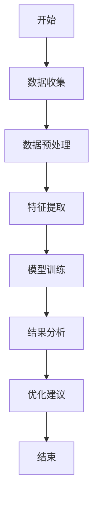
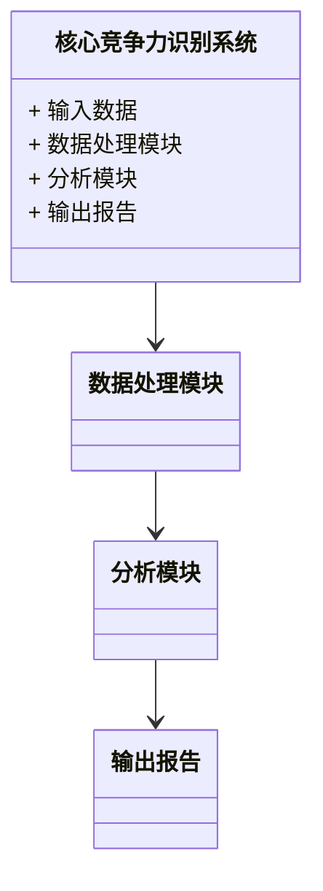

                 


# 如何识别企业的核心竞争力

> 关键词：核心竞争力，企业战略，算法原理，系统分析，项目实战，企业价值

> 摘要：本文系统地探讨了如何识别企业的核心竞争力，从概念理解、算法原理到实际应用，结合丰富的案例和详细的代码实现，帮助读者全面掌握这一关键能力。

---

## 第一部分：企业核心竞争力的背景与概念

### 第1章：企业核心竞争力的背景介绍

#### 1.1 核心竞争力的定义与内涵

- **1.1.1 核心竞争力的定义**
  核心竞争力是企业在市场中能够持续为客户创造价值的独特能力。它不仅包括技术、产品创新等显性能力，还包括品牌影响力、成本优势等隐性能力。

- **1.1.2 核心竞争力的内涵与外延**
  内涵：核心竞争力是企业内部资源与能力的整合，能够使企业在市场中保持竞争优势。  
  外延：它涉及企业的技术、管理、文化等多个方面，是企业长期发展的基石。

- **1.1.3 核心竞争力与企业战略的关系**
  核心竞争力是企业战略的核心，决定了企业的市场定位和发展方向。通过优化核心竞争力，企业可以在激烈的市场竞争中占据优势。

#### 1.2 核心竞争力的重要性

- **1.2.1 核心竞争力对企业生存与发展的意义**
  核心竞争力是企业区别于竞争对手的关键，决定了企业的市场地位和盈利能力。

- **1.2.2 核心竞争力在行业竞争中的作用**
  在同质化严重的市场中，核心竞争力能够帮助企业在价格战中脱颖而出，吸引更多的客户。

- **1.2.3 核心竞争力与企业价值创造的关系**
  核心竞争力直接关系到企业能否为客户提供独特价值，是企业创造超额利润的重要来源。

#### 1.3 核心竞争力的识别方法

- **1.3.1 企业内部资源与能力分析**
  通过分析企业的技术储备、管理能力、人力资源等内部资源，识别出具有竞争优势的部分。

- **1.3.2 企业外部环境与市场需求分析**
  结合市场趋势、客户需求、行业动态等外部因素，评估企业核心竞争力的可行性和潜力。

- **1.3.3 核心竞争力的评估指标与工具**
  使用SWOT分析、波特五力模型等工具，系统地评估企业的核心竞争力。

#### 1.4 核心竞争力的动态变化

- **1.4.1 技术进步对企业核心竞争力的影响**
  技术创新可以提升企业的核心竞争力，但也可能使其过时，因此需要持续关注技术动态。

- **1.4.2 市场变化对企业核心竞争力的影响**
  市场需求的变化要求企业不断调整其核心竞争力，以适应新的市场环境。

- **1.4.3 企业自身能力的动态调整**
  企业应定期审视和优化其核心竞争力，确保其在市场中的领先地位。

### 第2章：核心竞争力的核心概念与联系

#### 2.1 核心竞争力的核心要素

- **2.1.1 技术能力**
  技术能力是核心竞争力的重要组成部分，包括研发能力、技术创新能力等。

- **2.1.2 产品创新能力**
  能否持续推出符合市场需求的新产品，是企业竞争力的关键。

- **2.1.3 品牌影响力**
  强大的品牌可以帮助企业在市场中建立信任，吸引更多的客户。

- **2.1.4 成本优势**
  成本优势使企业能够在价格上具有竞争力，扩大市场份额。

#### 2.2 核心竞争力与非核心竞争力的对比

| **特征**          | **核心竞争力**       | **非核心竞争力**     |
|-------------------|----------------------|----------------------|
| **重要性**        | 对企业生存至关重要   | 辅助性，可替代性强    |
| **独特性**        | 独一无二             | 可能在多个企业中存在  |
| **战略影响**      | 决定企业战略         | 影响局部策略         |

#### 2.3 核心竞争力的ER实体关系图

```mermaid
er
actor: 企业核心竞争力
rectangle 核心竞争力要素 {
  技术能力
  产品创新能力
  品牌影响力
  成本优势
}
actor --> 核心竞争力要素: 包含关系
```

### 第3章：核心竞争力识别的算法原理

#### 3.1 核心竞争力识别的算法概述

- **算法的基本原理**
  通过数据挖掘和机器学习技术，识别企业内部和外部的关键因素，评估其核心竞争力。

- **算法的输入与输出**
  输入：企业资源数据、市场需求数据。  
  输出：核心竞争力评估结果、优化建议。

- **算法的优缺点**
  优点：能够量化评估，提供科学依据。  
  缺点：需要大量数据支持，且模型需不断更新。

#### 3.2 核心竞争力识别的流程图



#### 3.3 核心竞争力识别的数学模型

- **因子分析模型**
  使用因子分析法提取关键因素，公式如下：
  $$ F = \sum_{i=1}^{n} \lambda_i x_i $$
  其中，\( \lambda_i \) 是因子载荷，\( x_i \) 是原始变量。

- **层次分析法（AHP）**
  通过构建层次结构模型，计算各因素的权重，公式为：
  $$ A = \sum_{j=1}^{m} w_j x_j $$
  其中，\( w_j \) 是权重，\( x_j \) 是指标。

### 第4章：系统分析与架构设计

#### 4.1 系统分析

- **问题场景介绍**
  假设一家制造企业希望识别其核心竞争力，优化生产流程。

- **系统功能设计**
  使用领域模型类图，展示系统的核心功能模块。



#### 4.2 系统架构设计

- **架构图展示**


### 第5章：项目实战

#### 5.1 环境安装

- **工具选择**
  使用Python和scikit-learn库进行分析。

#### 5.2 核心代码实现

```python
import numpy as np
from sklearn.decomposition import PCA

# 示例数据
data = np.array([[2, 3, 4], [5, 6, 7], [8, 9, 10]])

# 数据预处理
from sklearn.preprocessing import StandardScaler
scaler = StandardScaler()
scaled_data = scaler.fit_transform(data)

# 特征提取
pca = PCA(n_components=2)
principal_components = pca.fit_transform(scaled_data)

print(principal_components)
```

#### 5.3 案例分析

- **案例背景**
  某汽车制造企业希望识别其核心竞争力，提升市场份额。

- **分析过程**
  使用层次分析法评估技术能力、品牌影响力等因素。

- **结果解读**
  技术能力和品牌影响力是核心竞争力的关键因素，企业应持续投资技术研发和品牌建设。

## 第六章：最佳实践与小结

### 6.1 最佳实践 tips

- 定期评估核心竞争力，保持竞争优势。
- 培养创新能力，适应市场变化。
- 结合内外部因素，制定合理的战略。

### 6.2 小结

识别企业核心竞争力是一个系统工程，需要结合内部资源和外部环境，通过科学的方法和工具进行分析。本文从理论到实践，详细介绍了识别核心竞争力的步骤和方法，为企业提供切实可行的指导。

---

**作者：AI天才研究院 & 禅与计算机程序设计艺术**

---

以上是《如何识别企业的核心竞争力》的详细目录和内容结构，结合理论与实践，帮助读者全面理解并掌握如何识别和优化企业的核心竞争力。

