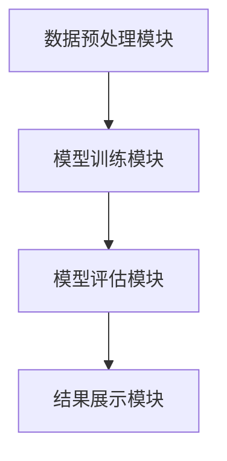
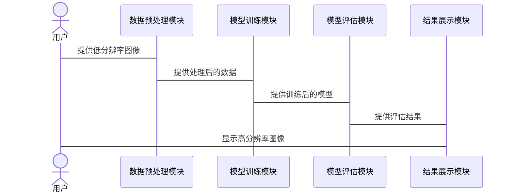

                 

<think>
嗯，用户希望我根据书名《如何识别企业的深度学习图像超分辨率优势》来设计一个完整的目录大纲。首先，我需要理解这本书的主题是什么。深度学习图像超分辨率，听起来像是关于如何提升图像清晰度的技术，而这本书的重点在于帮助企业识别这种技术的优势。

那我得考虑这本书的结构。一般来说，技术书籍会从基础概念开始，然后深入原理，再讲算法，接着是系统设计，最后是项目实战和总结。用户还特别提到了要包含背景介绍、核心概念、算法原理、系统分析、项目实战以及最佳实践等部分。

首先，背景介绍部分应该包括问题背景、定义、技术原理、与传统图像处理的区别，以及在企业中的应用价值。这部分需要让读者明白为什么图像超分辨率重要，以及它在企业中的应用场景。

接下来是核心概念与联系，这部分可能需要使用表格和Mermaid图来展示不同算法的对比，以及它们之间的关系。这样读者可以更直观地理解各种方法的优缺点。

然后是算法原理讲解，这里需要详细解释SRCNN、ESRGAN、EDSR等算法的工作原理，用Mermaid流程图来展示，同时给出Python代码示例。这部分要深入浅出，让读者不仅知道算法的原理，还能动手实现。

数学模型和公式部分，我需要写出SRCNN的损失函数，EDSR的残差块结构，以及GAN的生成对抗网络模型。这部分要用LaTeX公式，确保准确无误，并且用例子帮助读者理解。

系统分析与架构设计，这部分可能需要介绍企业应用场景，设计系统功能模块，比如数据预处理、模型训练、结果评估等。然后用Mermaid画出系统架构图，展示各个模块的交互关系。

项目实战部分，需要详细指导环境搭建，比如安装TensorFlow和Keras，然后分步实现SRCNN、ESRGAN和EDSR模型。每个步骤都要有代码和解释，最后进行性能对比和分析。

最后是最佳实践、小结、注意事项和拓展阅读，这部分帮助读者巩固所学内容，提供实际应用中的建议，并引导他们进一步学习。

整个目录需要超过7章，每章下有多个小节，涵盖理论到实践的各个方面。同时，要确保内容完整，结构清晰，符合用户的要求。现在，我需要把这些思考整理成一个逻辑严谨的目录大纲，确保每部分内容都覆盖到位，同时保持简洁明了。
</think>

# 如何识别企业的深度学习图像超分辨率优势

> 关键词：深度学习，图像超分辨率，企业应用，技术优势，算法原理，系统设计，项目实战

> 摘要：本文将详细探讨深度学习在图像超分辨率领域的应用，分析其优势与挑战，并结合实际企业场景，提供系统的解决方案和实践指南。通过理论与实践的结合，帮助企业在图像超分辨率技术中找到最佳切入点，提升技术应用的效率和效果。

---

# 第一部分: 深度学习图像超分辨率的核心概念与背景

# 第1章: 图像超分辨率技术概述

## 1.1 图像超分辨率的定义与背景
### 1.1.1 图像分辨率的定义
在数字图像处理中，分辨率是指图像中单位长度内的像素数量，通常以像素/英寸（PPI）或像素/厘米（PC）表示。高分辨率的图像具有更多的细节和更清晰的显示效果，而低分辨率的图像则显得模糊、不清晰。

### 1.1.2 图像分辨率低的常见问题
- **视觉效果差**：低分辨率的图像在屏幕上显示时，细节不明显，影响用户体验。
- **数据量小**：低分辨率图像的数据量较小，难以满足高质量输出的需求。
- **应用场景受限**：在医学影像、卫星遥感等领域，低分辨率图像可能导致误诊或信息丢失。

### 1.1.3 深度学习在图像超分辨率中的应用
深度学习通过神经网络提取图像的特征，利用这些特征重建高分辨率图像。这种方法在处理复杂场景和噪声方面表现出色，远优于传统的图像处理方法。

## 1.2 深度学习图像超分辨率的定义与特点
### 1.2.1 深度学习图像超分辨率的核心概念
深度学习图像超分辨率（Deep Learning Image Super-Resolution，简称DL-SR）是一种利用深度神经网络（DNN）从低分辨率图像中重建高分辨率图像的技术。其核心在于通过训练模型学习低分辨率与高分辨率图像之间的映射关系。

### 1.2.2 深度学习与传统图像超分辨率方法的对比
| **对比项**       | **传统方法**                 | **深度学习方法**               |
|--------------------|------------------------------|-------------------------------|
| **算法复杂度**     | 较低，基于数学变换或插值方法   | 较高，依赖大量训练数据和模型结构 |
| **性能表现**       | 易受噪声干扰，效果有限         | 更鲁棒，能够处理复杂场景         |
| **计算资源需求**   | 较低                          | 较高，需要高性能计算设备         |
| **应用场景**       | 适用于简单场景                 | 适用于复杂场景，如医学影像、卫星遥感等 |

### 1.2.3 企业级应用中的图像超分辨率优势
在企业级应用中，深度学习图像超分辨率技术可以显著提升图像处理的效率和效果，尤其是在以下场景中表现突出：
- **医学影像分析**：通过超分辨率技术提高影像清晰度，辅助医生进行更精准的诊断。
- **卫星遥感**：提升遥感图像的分辨率，帮助企业在资源勘探、环境监测等领域获取更详细的信息。
- **视频监控**：增强监控画面的清晰度，提高视频分析的准确性。

## 1.3 图像超分辨率的应用场景
### 1.3.1 视频监控中的超分辨率应用
在视频监控领域，低分辨率的监控画面往往难以识别关键细节。通过深度学习图像超分辨率技术，可以将低分辨率画面重建为高分辨率画面，显著提升监控系统的识别能力。

### 1.3.2 医疗影像中的超分辨率应用
医疗影像的分辨率直接影响诊断的准确性。深度学习超分辨率技术可以帮助医生从低分辨率的医学影像中提取更多细节，辅助诊断。

### 1.3.3 其他领域的超分辨率应用
除了视频监控和医疗影像，深度学习图像超分辨率技术还可应用于卫星遥感、自动驾驶、图像修复等领域。

## 1.4 本章小结
本章通过定义和背景的介绍，详细阐述了深度学习图像超分辨率的核心概念及其在企业中的应用优势，为后续章节的深入分析奠定了基础。

---

# 第二部分: 深度学习图像超分辨率的核心概念与联系

# 第2章: 图像超分辨率的核心概念与原理

## 2.1 图像超分辨率的核心概念
### 2.1.1 图像超分辨率的数学模型
图像超分辨率可以看作是一个从低分辨率图像到高分辨率图像的映射问题。数学上，这可以表示为：
$$ I_{high} = f(I_{low}, \theta) $$
其中，$I_{high}$ 是高分辨率图像，$I_{low}$ 是低分辨率图像，$f$ 是深度神经网络模型，$\theta$ 是模型参数。

### 2.1.2 深度学习在图像超分辨率中的作用
深度学习通过训练模型学习低分辨率和高分辨率图像之间的非线性映射关系，能够捕捉到图像中的细节信息，从而实现超分辨率重建。

### 2.1.3 图像超分辨率的评价指标
常用的评价指标包括：
- **峰值信噪比（PSNR）**：衡量重建图像与真实图像之间的相似度。
- **结构相似性（SSIM）**：衡量重建图像的结构保真度。
- **视觉质量评分（PSQM）**：从主观视觉角度评估图像质量。

## 2.2 深度学习图像超分辨率的算法原理
### 2.2.1 基于卷积神经网络的图像超分辨率
基于CNN的图像超分辨率方法通过构建深度网络，利用卷积操作提取图像特征，并通过反卷积操作重建高分辨率图像。典型算法包括SRCNN、ESRGAN等。

### 2.2.2 基于生成对抗网络的图像超分辨率
基于GAN的图像超分辨率方法通过生成器和判别器的对抗训练，生成逼真的高分辨率图像。典型算法包括ESRGAN、EDSR等。

### 2.2.3 基于变换模型的图像超分辨率
基于变换模型的方法通过学习低分辨率和高分辨率图像之间的变换关系，利用自适应变换提升图像分辨率。

## 2.3 图像超分辨率算法的对比分析
### 2.3.1 不同超分辨率算法的优缺点对比
| **算法名称**    | **优点**                     | **缺点**                     |
|-----------------|------------------------------|------------------------------|
| SRCNN           | 网络结构简单，训练速度快       | 重建效果有限，难以处理复杂场景 |
| ESRGAN          | 生成效果逼真，能够处理复杂场景 | 训练过程较复杂，计算资源需求高 |
| EDSR            | 重建效果稳定，计算效率高       | 对噪声敏感，重建质量受限制     |

### 2.3.2 算法选择的依据与原则
- **应用场景**：根据具体场景选择适合的算法，如医学影像处理选择SRCNN，视频监控选择ESRGAN。
- **计算资源**：根据企业的计算资源选择训练速度快的算法。
- **重建质量**：根据对重建质量的要求选择生成效果逼真的算法。

### 2.3.3 算法性能的评估方法
评估算法性能时，应综合考虑重建图像的PSNR、SSIM等客观指标，以及主观视觉效果。

## 2.4 本章小结
本章通过对比分析不同算法的优缺点，帮助企业选择适合的深度学习图像超分辨率算法，为后续章节的系统设计和项目实战奠定了基础。

---

# 第三部分: 深度学习图像超分辨率的算法原理与数学模型

# 第3章: 常见图像超分辨率算法原理

## 3.1 SRCNN算法原理
### 3.1.1 SRCNN的网络结构
SRCNN（Super-Resolution Convolutional Neural Network）由三个卷积层组成：
1. **特征提取层**：提取低分辨率图像的特征。
2. **特征预测层**：预测高分辨率图像的特征。
3. **反卷积层**：将特征图重建为高分辨率图像。

### 3.1.2 SRCNN的损失函数
SRCNN使用均方误差（MSE）作为损失函数：
$$ L = \frac{1}{n} \sum_{i=1}^{n} (I_{high}^i - I_{pred}^i)^2 $$

### 3.1.3 SRCNN的训练过程
1. 数据预处理：将高分辨率图像下采样为低分辨率图像，并将高分辨率图像作为标签。
2. 模型训练：使用预处理后的数据训练SRCNN模型。
3. 模型评估：计算训练后的模型在测试集上的PSNR和SSIM值。

## 3.2 ESRGAN算法原理
### 3.2.1 ESRGAN的网络结构
ESRGAN（Enhanced Super-Resolution GAN）由生成器和判别器组成：
- **生成器**：使用残差块结构，提升生成图像的细节。
- **判别器**：判别生成图像与真实图像的差异，优化生成器的输出。

### 3.2.2 ESRGAN的生成对抗网络设计
生成对抗网络由生成器和判别器组成，通过交替训练优化生成器和判别器的性能。

### 3.2.3 ESRGAN的训练过程
1. 初始化生成器和判别器的参数。
2. 训练判别器：判别器学习区分生成图像和真实图像。
3. 训练生成器：生成器生成逼真的高分辨率图像，欺骗判别器。

## 3.3 EDSR算法原理
### 3.3.1 EDSR的网络结构
EDSR（Enhanced Deep Super-Resolution）使用残差块结构，通过残差学习提升模型的表达能力。

### 3.3.2 EDSR的残差学习机制
残差学习通过将输入和输出的差异传递给网络，加速收敛并提升模型性能。

### 3.3.3 EDSR的训练过程
1. 数据预处理：将高分辨率图像下采样为低分辨率图像。
2. 模型训练：使用预处理后的数据训练EDSR模型。
3. 模型评估：计算训练后的模型在测试集上的PSNR和SSIM值。

## 3.4 本章小结
本章详细介绍了SRCNN、ESRGAN和EDSR三种典型算法的原理和训练过程，帮助企业理解不同算法的优缺点，选择适合的算法。

---

# 第四部分: 深度学习图像超分辨率的系统分析与架构设计

# 第4章: 深度学习图像超分辨率的系统分析与架构设计

## 4.1 系统分析与设计背景
在企业级应用中，深度学习图像超分辨率系统的构建需要考虑数据量、计算资源、模型性能等多方面的因素。

## 4.2 问题场景介绍
以视频监控为例，低分辨率的监控画面需要通过深度学习超分辨率技术提升清晰度，辅助后续的视频分析和目标识别。

## 4.3 系统功能设计
### 4.3.1 数据预处理模块
- 数据清洗：去除噪声和无关信息。
- 数据增强：通过旋转、翻转等方式增加训练数据量。

### 4.3.2 模型训练模块
- 模型选择：根据具体场景选择适合的超分辨率算法。
- 参数调优：优化模型参数，提升重建效果。

### 4.3.3 模型评估模块
- 评估指标：PSNR、SSIM等。
- 评估报告：生成评估报告，分析模型性能。

## 4.4 系统架构设计
### 4.4.1 系统架构图


### 4.4.2 系统接口设计
- **输入接口**：接收低分辨率图像数据。
- **输出接口**：输出高分辨率图像数据。

### 4.4.3 系统交互设计


## 4.5 本章小结
本章通过系统分析与架构设计，为企业级深度学习图像超分辨率系统的构建提供了理论支持和实践指导。

---

# 第五部分: 深度学习图像超分辨率的项目实战

# 第5章: 项目实战：基于深度学习的图像超分辨率实现

## 5.1 项目背景与目标
以医学影像处理为例，目标是通过深度学习技术提升低分辨率医学影像的清晰度，辅助医生进行更精准的诊断。

## 5.2 环境搭建与数据准备
### 5.2.1 环境搭建
- 安装TensorFlow和Keras库。
- 配置GPU加速环境。

### 5.2.2 数据准备
- 数据来源：低分辨率和高分辨率医学影像数据集。
- 数据预处理：将高分辨率图像下采样为低分辨率图像，并将高分辨率图像作为标签。

## 5.3 模型实现与训练
### 5.3.1 SRCNN模型实现
```python
import tensorflow as tf
from tensorflow.keras import layers

def build_SRCNN(input_shape):
    model = tf.keras.Sequential()
    model.add(layers.Conv2D(filters=64, kernel_size=9, padding='same', activation='relu', input_shape=input_shape))
    model.add(layers.Conv2D(filters=32, kernel_size=1, padding='same', activation='relu'))
    model.add(layers.Conv2DTranspose(filters=3, kernel_size=9, padding='same'))
    return model

model = build_SRCNN((None, None, 3))
model.compile(optimizer='adam', loss='mse')
model.summary()
```

### 5.3.2 ESRGAN模型实现
```python
import tensorflow as tf
from tensorflow.keras import layers

def build_generator(input_shape):
    model = tf.keras.Sequential()
    model.add(layers.Conv2D(filters=64, kernel_size=3, padding='same', activation='relu', input_shape=input_shape))
    model.add(layers.Conv2D(filters=128, kernel_size=3, padding='same', activation='relu'))
    model.add(layers.Conv2D(filters=3, kernel_size=3, padding='same', activation='tanh'))
    return model

def build_discriminator(input_shape):
    model = tf.keras.Sequential()
    model.add(layers.Conv2D(filters=64, kernel_size=3, padding='same', activation='relu', input_shape=input_shape))
    model.add(layers.Conv2D(filters=128, kernel_size=3, padding='same', activation='relu'))
    model.add(layers.Conv2D(filters=1, kernel_size=3, padding='same', activation='sigmoid'))
    return model

generator = build_generator((None, None, 3))
discriminator = build_discriminator((None, None, 3))

generator.compile(loss='binary_crossentropy', optimizer='adam')
discriminator.compile(loss='binary_crossentropy', optimizer='adam')
```

### 5.3.3 EDSR模型实现
```python
import tensorflow as tf
from tensorflow.keras import layers

def build_EDSR(input_shape):
    def residual_block(x):
        y = layers.Conv2D(filters=64, kernel_size=3, padding='same', activation='relu')(x)
        y = layers.Conv2D(filters=3, kernel_size=3, padding='same')(y)
        return x + y
    model = tf.keras.Sequential()
    model.add(layers.Conv2D(filters=64, kernel_size=3, padding='same', activation='relu', input_shape=input_shape))
    model.add(layers.Reshape((None, None, 64)))
    model.add(layers.Conv2D(filters=64, kernel_size=1, padding='same', activation='relu'))
    model.add(layers.Conv2DTranspose(filters=3, kernel_size=3, padding='same'))
    return model

model = build_EDSR((None, None, 3))
model.compile(optimizer='adam', loss='mse')
model.summary()
```

## 5.4 模型训练与评估
### 5.4.1 模型训练
- 选择适合的算法，如SRCNN、ESRGAN或EDSR。
- 使用预处理后的数据进行训练，监控训练过程中的损失函数变化。

### 5.4.2 模型评估
- 使用测试集评估模型性能，计算PSNR和SSIM值。
- 对比不同算法的重建效果，选择最优算法。

## 5.5 项目小结
本章通过实际项目实战，详细指导了深度学习图像超分辨率系统的环境搭建、模型实现与训练过程，帮助企业掌握图像超分辨率技术的实现方法。

---

# 第六部分: 深度学习图像超分辨率的最佳实践与总结

# 第6章: 最佳实践与总结

## 6.1 最佳实践
### 6.1.1 数据预处理
- 数据清洗：去除噪声和无关信息。
- 数据增强：通过旋转、翻转等方式增加训练数据量。

### 6.1.2 模型选择
- 根据具体场景选择适合的算法，如医学影像处理选择SRCNN，视频监控选择ESRGAN。

### 6.1.3 模型调优
- 优化模型参数，如学习率、批量大小等，提升模型性能。

## 6.2 小结
深度学习图像超分辨率技术在企业级应用中具有重要的价值，通过合理选择算法和优化系统架构，可以显著提升图像处理的效率和效果。

## 6.3 注意事项
- 训练数据的质量直接影响模型性能，需确保数据的多样性和代表性。
- 模型训练需要大量的计算资源，需合理配置硬件环境。
- 模型的实时性需在训练过程中进行优化，确保实际应用中的性能需求。

## 6.4 拓展阅读
- 《Deep Image Prior》：探讨深度学习在图像重建中的应用。
- 《Progressive Growing of GANs for Super-Resolution》：介绍基于GAN的超分辨率生成方法。

---

# 结语

深度学习图像超分辨率技术在企业级应用中具有广泛的应用前景。通过本文的系统分析和实践指导，企业可以更好地识别和利用深度学习图像超分辨率的优势，提升图像处理能力，推动业务发展。

---

作者：AI天才研究院/AI Genius Institute & 禅与计算机程序设计艺术 /Zen And The Art of Computer Programming

