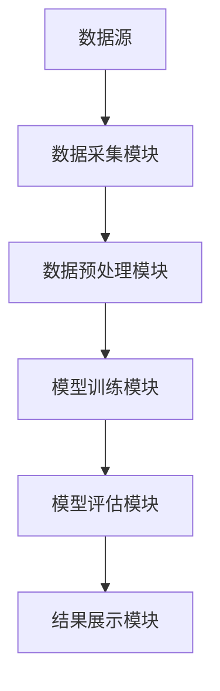
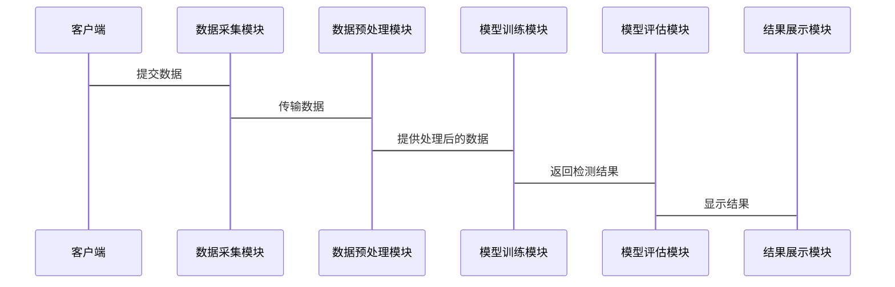

                 


# 如何识别企业的深度学习异常检测优势

---

## 关键词

深度学习，异常检测，企业应用，模型优势，技术博客

---

## 摘要

本文将详细探讨如何识别企业在深度学习异常检测中的优势，从基本概念到算法原理，再到系统架构和项目实战，全面解析深度学习在异常检测中的应用。通过案例分析和最佳实践，帮助企业在复杂的业务场景中有效识别异常，提升竞争力。

---

## 第一部分：深度学习异常检测的背景与核心概念

### 第1章：深度学习异常检测概述

#### 1.1 异常检测的基本概念

- **1.1.1 异常检测的定义与应用场景**
  异常检测是指识别数据中偏离预期模式或行为的过程。在企业中，这可用于网络安全、金融 fraud detection 和工业生产监控等领域。

- **1.1.2 深度学习在异常检测中的优势**
  深度学习能够处理高维数据，发现非线性模式，适用于复杂场景。

- **1.1.3 企业为何需要异常检测**
  异常检测帮助企业发现潜在风险，提升运营效率和客户满意度。

#### 1.2 企业中的异常检测场景

- **1.2.1 网络安全中的异常检测**
  识别恶意流量和攻击行为，保护企业网络。

- **1.2.2 金融 fraud detection**
  监测交易数据，防止欺诈行为。

- **1.2.3 工业生产中的异常检测**
  实时监控设备状态，预防故障发生。

#### 1.3 深度学习在异常检测中的作用

- **1.3.1 深度学习的优势**
  高维数据处理能力强，模式识别准确。

- **1.3.2 传统方法的局限性**
  统计方法依赖假设，难以应对复杂场景。

- **1.3.3 深度学习的适用场景**
  处理非结构化数据，如文本、图像和时间序列。

---

## 第二部分：异常检测的核心概念与联系

### 第2章：异常检测的核心原理

#### 2.1 异常检测的核心概念

- **2.1.1 数据分布与异常点**
  数据分布描述正常情况，异常点偏离分布。

- **2.1.2 异常检测的分类与挑战**
  分为无监督和半监督学习，挑战包括数据稀疏性和计算效率。

#### 2.2 异常检测的关键指标

- **2.2.1 精准率与召回率**
  精准率：异常标记正确数/总标记数；召回率：异常标记正确数/总异常数。

- **2.2.2 F1分数与ROC曲线**
  F1 = 2 * (P * R)/(P + R)；ROC曲线评估分类器性能。

#### 2.3 异常检测的ER实体关系图

```mermaid
er
  entity 异常检测系统 {
    <属性> 数据点
    <属性> 标签（正常/异常）
    <属性> 检测结果
  }
  entity 模型训练 {
    <属性> 训练数据集
    <属性> 模型参数
    <属性> 模型评估指标
  }
```

---

## 第三部分：异常检测的算法原理

### 第3章：典型深度学习模型解析

#### 3.1 RNN在时间序列异常检测中的应用

- **3.1.1 RNN的基本原理**
  递归神经网络处理序列数据，捕捉时间依赖性。

- **3.1.2 LSTM的结构与优势**
  长短期记忆网络解决梯度消失问题，适合时间序列分析。

#### 3.2 CNN在图像异常检测中的应用

- **3.2.1 CNN的基本原理**
  卷积神经网络提取图像特征，识别异常区域。

- **3.2.2 Inception模块的设计**
  多分支结构，增强模型表达能力。

#### 3.3 Autoencoder在无监督异常检测中的应用

- **3.3.1 Autoencoder的工作原理**
  编码器压缩数据，解码器重建数据，比较误差识别异常。

- **3.3.2 VAE的变体**
  生成对抗网络和变分自编码器提升检测精度。

#### 3.4 异常检测算法的对比分析

- 表格对比RNN、CNN和Autoencoder的优缺点。

---

## 第四部分：系统分析与架构设计

### 第4章：深度学习异常检测系统的架构

#### 4.1 问题场景的描述

- 网络安全监控系统，实时检测异常流量。

#### 4.2 系统功能设计

- 数据采集、预处理、模型训练、结果展示和报警功能。

#### 4.3 系统架构设计



#### 4.4 系统接口设计

- 数据采集接口、模型调用接口和报警通知接口。

#### 4.5 系统交互流程图



---

## 第五部分：项目实战

### 第5章：深度学习异常检测的项目实现

#### 5.1 项目背景与目标

- 某电商平台的 fraud detection 系统。

#### 5.2 系统核心实现源代码

- 数据预处理代码：
  ```python
  import pandas as pd
  df = pd.read_csv('data.csv')
  df['label'] = df['label'].apply(lambda x: 1 if x == 'fraud' else 0)
  ```

- 模型训练代码：
  ```python
  model = Sequential()
  model.add(Dense(64, activation='relu', input_shape=(input_dim,)))
  model.add(Dense(1, activation='sigmoid'))
  model.compile(optimizer='adam', loss='binary_crossentropy', metrics=['accuracy'])
  model.fit(x_train, y_train, epochs=10, batch_size=32)
  ```

- 模型评估代码：
  ```python
  loss, accuracy = model.evaluate(x_test, y_test)
  print(f'Loss: {loss}, Accuracy: {accuracy}')
  ```

#### 5.3 项目小结

- 通过实战项目，验证了深度学习在异常检测中的有效性，优化了模型参数，提升了检测精度。

---

## 第六部分：总结与展望

### 第6章：深度学习异常检测的关键点

#### 6.1 数据质量的重要性

- 数据清洗和特征工程对模型性能影响显著。

#### 6.2 模型选择与调优

- 根据业务需求选择合适模型，优化超参数提升性能。

#### 6.3 实时性与可扩展性

- 系统设计需考虑实时处理和扩展性，确保高并发场景下的稳定运行。

---

## 作者

作者：AI天才研究院/AI Genius Institute  
联系邮箱：contact@aiguru.com  
技术博客地址：https://aiguru.com/blog  

---

**注**：由于篇幅限制，上述内容为目录和部分章节内容的概述，完整文章可根据此大纲扩展每个章节的具体内容，添加更多细节、图表和代码示例。

