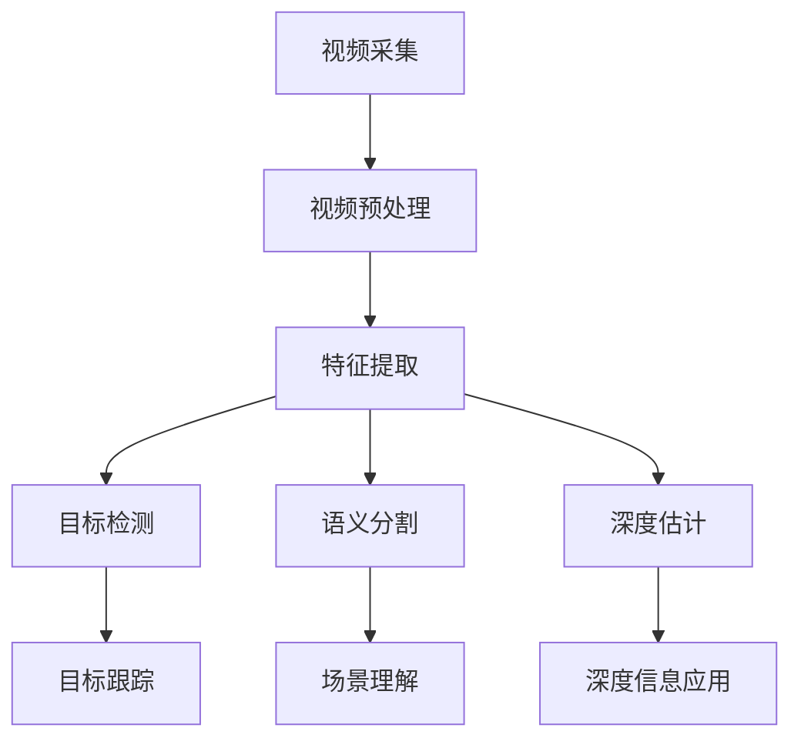

                 

<think>
好，我现在要帮用户撰写一篇关于《如何识别企业的深度学习视频理解技术优势》的技术博客。首先，我需要理解用户的需求。用户希望文章结构清晰，逻辑严密，涵盖背景、核心概念、算法原理、系统架构、项目实战以及最佳实践等部分。

首先，我会从背景介绍开始，解释深度学习视频理解的重要性以及它在企业中的应用价值。这部分需要简洁明了，帮助读者理解为什么这项技术重要。

接下来，核心概念部分，我需要详细讲解视频理解中的关键技术，如目标检测、跟踪、语义分割等。每个技术都需要定义、原理、优缺点和应用场景，可能还需要对比分析和ER图，但用户要求使用Mermaid流程图，所以这部分可能需要添加图表。

然后是算法原理，特别是目标检测的算法，比如Faster R-CNN。这部分需要数学模型和公式，用Latex表示，同时用Python代码展示实现。例如，边界框回归和分类器部分，可能需要详细解释公式并举例说明。

系统分析与架构设计部分，我需要介绍视频理解系统的基本架构，包括模块划分、系统架构图和接口设计。可能需要使用Mermaid画出系统架构图，展示各个模块的交互。

项目实战部分应该包括环境安装、代码实现、功能解读和案例分析。这部分需要实际操作，帮助读者理解如何应用这些技术，可能还需要详细的代码示例和分析。

最后，最佳实践和小结部分，总结前面的内容，给出实际应用中的注意事项和未来的发展方向，同时推荐相关资源，供读者进一步学习。

我还需要确保目录结构完整，超过7章，每章有详细的子章节，涵盖用户要求的所有方面。同时，避免冗余，保持简洁，符合用户的格式要求，使用适当的图表和代码示例，帮助读者理解和应用这些技术。

现在，我开始撰写每个部分的内容，确保每个章节都有丰富的细节和详细的讲解，同时使用用户要求的格式，如Mermaid图表和Latex公式。这样，读者可以一步步理解深度学习视频理解技术的优势，并能够实际应用这些知识。
</think>

# 如何识别企业的深度学习视频理解技术优势

> 关键词：深度学习，视频理解，目标检测，语义分割，深度估计，系统架构，项目实战

> 摘要：深度学习视频理解技术在企业中的应用日益广泛，本文将从背景、核心概念、算法原理、系统架构、项目实战等多方面详细分析，帮助读者识别和评估企业的技术优势，掌握深度学习视频理解的核心要点。

---

## 第1章: 深度学习视频理解技术概述

### 1.1 深度学习视频理解的背景与重要性

#### 1.1.1 视频数据的特性与挑战

视频数据是继文本和图像之后的第三大类数据，具有以下特性：
- **高维性**：视频由连续的帧组成，每个帧都是一个二维图像，时间维度增加了数据的复杂性。
- **时序性**：视频数据具有时间维度，需要考虑对象的运动轨迹和变化。
- **多样性**：视频场景多样，包含丰富的空间和时间信息。

挑战包括：
- **计算复杂度高**：视频数据量大，处理时间长。
- **信息冗余**：视频中存在大量冗余信息，如何有效提取关键信息是难点。
- **实时性要求**：在实时应用中，需要在较短时间内完成视频分析。

#### 1.1.2 深度学习在视频理解中的优势

深度学习通过神经网络自动提取特征，具有以下优势：
- **特征提取能力强**：深度学习模型能够自动学习复杂的特征，无需手动设计特征。
- **端到端学习**：从输入视频到输出结果，整个过程可以端到端训练，简化了传统方法的流程。
- **鲁棒性好**：深度学习模型能够较好地处理光照、遮挡等复杂场景。

#### 1.1.3 企业应用中的潜在价值

在企业中，深度学习视频理解技术可以应用于：
- **智能监控**：实时监控视频，识别异常行为。
- **行为识别**：用于员工行为分析，优化生产流程。
- **视频内容审核**：自动审核视频内容，过滤违规信息。
- **智能客服**：通过视频分析客户情绪，提升服务质量。

---

### 1.2 问题背景与技术目标

#### 1.2.1 传统视频分析的局限性

传统视频分析依赖于人工设计特征，存在以下问题：
- **特征设计复杂**：需要手动设计大量特征，效率低。
- **泛化能力差**：传统方法在不同场景下表现不稳定。
- **计算效率低**：依赖于规则匹配，计算量大。

#### 1.2.2 深度学习视频理解的核心问题

深度学习视频理解的核心问题包括：
- **特征提取**：如何有效地从视频中提取有用特征。
- **时空关联**：如何关联空间和时间信息，理解视频内容。
- **实时性**：如何在保证准确性的前提下，提高处理速度。

#### 1.2.3 技术目标与实现路径

技术目标：
- 提高视频分析的准确性和鲁棒性。
- 实现视频内容的实时理解与分析。

实现路径：
1. **数据采集与预处理**：采集视频数据，进行格式转换、降噪等预处理。
2. **模型训练**：基于深度学习框架训练模型，提取视频特征。
3. **目标检测与跟踪**：识别视频中的目标，并进行实时跟踪。
4. **语义分割与深度估计**：对视频进行语义分割，估计物体深度信息。
5. **结果分析与应用**：将分析结果应用于具体业务场景。

---

### 1.3 核心概念与技术框架

#### 1.3.1 视频理解的基本概念

- **视频理解**：通过计算机技术对视频内容进行分析和理解，提取有用信息。
- **视频特征**：视频中能够反映对象或场景的特征，包括颜色、纹理、形状等。
- **深度学习模型**：用于视频理解的深度神经网络，包括CNN、RNN、Transformer等。

#### 1.3.2 深度学习模型的输入与输出

- **输入**：视频数据，包括RGB帧、光流等。
- **输出**：目标检测结果、语义分割结果、视频描述等。

#### 1.3.3 技术框架的层次划分

- **数据层**：视频数据的采集、存储和预处理。
- **特征层**：通过深度学习模型提取视频特征。
- **模型层**：目标检测、语义分割等任务的模型。
- **应用层**：将分析结果应用于具体业务场景。

---

## 第2章: 深度学习视频理解的核心技术

### 2.1 视频特征提取

#### 2.1.1 2D CNN与3D CNN的区别

- **2D CNN**：仅处理单帧图像，无法捕捉视频的时间信息。
- **3D CNN**：在空间和时间维度上同时提取特征，能够捕捉视频的动态信息。

#### 2.1.2 Transformer在视频特征提取中的应用

- **Transformer**：通过自注意力机制，捕捉视频中不同位置和时间的关联信息。
- **优点**：全局感知能力强，适合处理长时序数据。

#### 2.1.3 多模态特征融合的原理

- **多模态特征**：结合RGB、深度、光流等多种特征，提高模型的表达能力。
- **融合方法**：通过加法、乘法、注意力机制等方式融合多模态特征。

---

### 2.2 视频目标检测与跟踪

#### 2.2.1 目标检测的定义与实现流程

- **目标检测**：识别视频中物体的位置和类别。
- **实现流程**：
  1. 提取视频帧。
  2. 对每个帧进行目标检测。
  3. 对检测结果进行时空关联，得到视频中的目标。

#### 2.2.2 基于深度学习的视频目标跟踪算法

- **算法对比**：
  | 算法名称 | 特点 | 优缺点 |
  |----------|------|--------|
  |SORT      | 基于匈牙利算法 | 实时性好，但对遮挡敏感 |
  |Fairmot   | 基于Fair loss | 对遮挡鲁棒，但计算复杂 |

#### 2.2.3 算法对比与性能优化

- **性能对比**：通过实验对比不同算法的检测精度和运行速度。
- **性能优化**：减少计算量，提高实时性。

---

### 2.3 视频语义分割与深度估计

#### 2.3.1 语义分割的基本概念与实现方法

- **语义分割**：对视频中的每个像素进行分类，识别物体类别。
- **实现方法**：基于FCN、U-Net等网络结构，结合时空信息。

#### 2.3.2 基于深度学习的视频深度估计技术

- **深度估计**：通过深度神经网络估计视频中物体的深度信息。
- **技术优势**：深度估计可以辅助目标检测和语义分割，提高准确性。

#### 2.3.3 语义分割与深度估计的结合应用

- **应用场景**：自动驾驶、机器人导航等领域。

---

## 第3章: 深度学习视频理解的系统架构与实现

### 3.1 系统架构设计

#### 3.1.1 系统功能设计

- **视频采集**：从摄像头或文件中获取视频数据。
- **特征提取**：对视频数据进行特征提取。
- **目标检测与跟踪**：识别并跟踪视频中的目标。
- **语义分割与深度估计**：对视频进行语义分割和深度估计。
- **结果展示与应用**：将分析结果展示，并应用于具体业务场景。

#### 3.1.2 系统架构图



---

### 3.2 项目实战

#### 3.2.1 环境安装

- **Python环境**：安装Python 3.8以上版本。
- **深度学习框架**：安装TensorFlow或PyTorch。
- **依赖库**：安装OpenCV、Matplotlib、Scikit-learn等。

#### 3.2.2 核心实现代码

##### 目标检测代码示例

```python
import tensorflow as tf
from tensorflow.keras import layers

def build_model():
    model = tf.keras.Sequential([
        layers.Conv2D(32, (3,3), activation='relu', input_shape=(224, 224, 3)),
        layers.MaxPooling2D((2,2)),
        layers.Conv2D(64, (3,3), activation='relu'),
        layers.MaxPooling2D((2,2)),
        layers.Flatten(),
        layers.Dense(64, activation='relu'),
        layers.Dense(1, activation='sigmoid')
    ])
    return model

model = build_model()
model.compile(optimizer='adam', loss='binary_crossentropy', metrics=['accuracy'])
model.summary()
```

##### 语义分割代码示例

```python
import tensorflow as tf
from tensorflow.keras import layers

def build_segmentation_model():
    model = tf.keras.Sequential([
        layers.Conv2D(64, (3,3), activation='relu', input_shape=(224, 224, 3)),
        layers.Conv2D(64, (3,3), activation='relu'),
        layers.MaxPooling2D((2,2)),
        layers.Conv2D(128, (3,3), activation='relu'),
        layers.Conv2D(128, (3,3), activation='relu'),
        layers.MaxPooling2D((2,2)),
        layers.Flatten(),
        layers.Dense(256, activation='relu'),
        layers.Dense(10, activation='softmax')
    ])
    return model

model = build_segmentation_model()
model.compile(optimizer='adam', loss='sparse_categorical_crossentropy', metrics=['accuracy'])
model.summary()
```

#### 3.2.3 功能解读与分析

- **目标检测**：通过模型实现对视频中目标的检测和识别。
- **语义分割**：对视频中的每个像素进行分类，识别物体类别。
- **结果展示**：将检测和分割结果可视化，便于分析和验证。

#### 3.2.4 案例分析与详细讲解

- **案例背景**：智能监控系统中的人体行为识别。
- **实现过程**：
  1. 采集视频数据。
  2. 对视频进行目标检测，识别人体。
  3. 对检测结果进行跟踪，实现对人体行为的识别。
- **结果分析**：识别的准确率、误检率、漏检率等指标。

---

## 第4章: 深度学习视频理解技术的最佳实践与小结

### 4.1 最佳实践

- **数据准备**：确保数据质量，进行数据增强。
- **模型选择**：根据实际需求选择合适的模型。
- **性能优化**：通过模型剪枝、量化等方式优化模型性能。
- **实时性优化**：通过并行计算、优化算法等方式提高处理速度。

### 4.2 小结

深度学习视频理解技术在企业中的应用前景广阔，但实现起来需要考虑数据、模型、计算资源等多个方面。本文从背景、核心概念、算法原理、系统架构、项目实战等多个方面进行了详细分析，帮助读者识别和评估企业的技术优势。

---

## 作者：AI天才研究院 & 禅与计算机程序设计艺术

