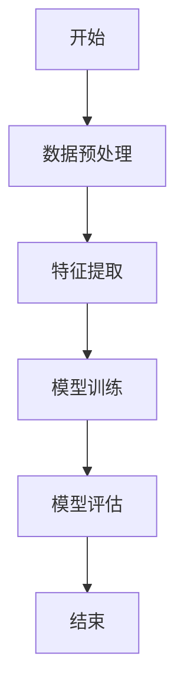
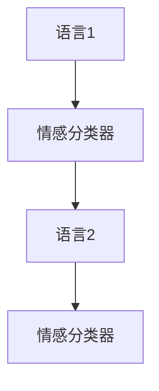
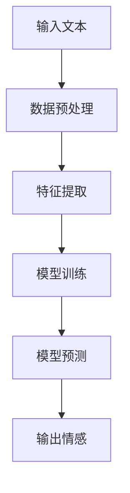
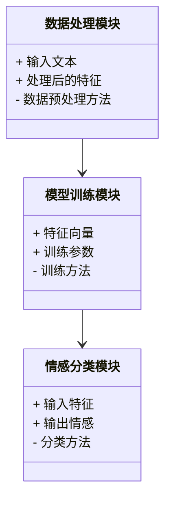
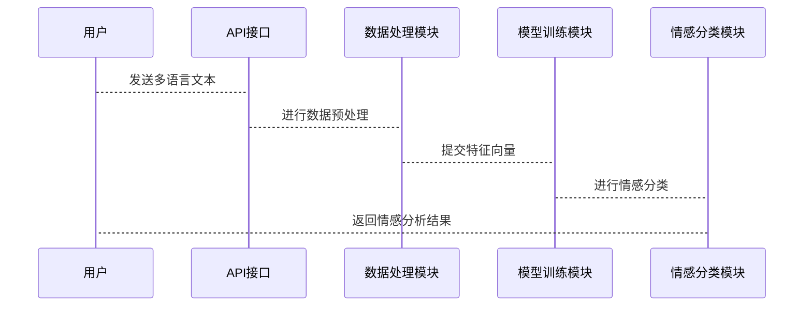

                 


# 如何识别企业的深度学习跨语言情感分析技术优势

---

## 关键词

- 深度学习
- 跨语言情感分析
- 企业应用
- 技术优势
- 模型构建

---

## 摘要

随着全球化进程的加速，跨语言情感分析在企业中的应用越来越广泛。本文从技术原理、算法实现、系统架构等多个维度，深入分析深度学习跨语言情感分析的核心优势，帮助企业识别其技术优势并优化应用场景。

---

## 第一部分: 背景介绍

### 第1章: 深度学习跨语言情感分析概述

#### 1.1 问题背景与定义

- **1.1.1 情感分析的定义与应用**
  - 情感分析是指通过自然语言处理技术，对文本中的情感倾向（如正面、负面、中性）进行识别。
  - 应用于社交媒体分析、客户反馈处理、市场调研等领域。

- **1.1.2 跨语言情感分析的挑战与意义**
  - 挑战：不同语言的语法结构、文化差异导致情感表达的多样性。
  - 意义：帮助企业实现多语言环境下的情感分析，提升全球化业务能力。

#### 1.2 技术优势与边界

- **1.2.1 深度学习在情感分析中的优势**
  - 自然语言处理能力强，能够捕捉上下文信息。
  - 高精度：深度学习模型在情感分类任务中表现优于传统方法。

- **1.2.2 跨语言分析的边界与限制**
  - 计算资源需求高。
  - 需要处理多语言数据的平衡问题。

#### 1.3 核心概念与组成要素

- **1.3.1 数据预处理与特征提取**
  - 数据清洗：去除噪音数据，如特殊符号、停用词。
  - 特征提取：利用词嵌入技术（如Word2Vec、GloVe）提取语义特征。

- **1.3.2 模型训练与评估指标**
  - 模型训练：基于标注数据，训练情感分类器。
  - 评估指标：准确率、召回率、F1值。

- **1.3.3 跨语言情感分析的流程图（Mermaid）**



---

## 第二部分: 核心概念与联系

### 第2章: 跨语言情感分析的核心原理

#### 2.1 跨语言数据处理

- **2.1.1 多语言数据的预处理方法**
  - 统一数据格式：将不同语言的文本统一为某种格式（如Unicode）。
  - 处理语言差异：针对不同语言的语法特点进行适配。

- **2.1.2 跨语言特征提取的对比分析**
  - 对比不同语言的词嵌入效果。
  - 分析跨语言特征提取的优劣。

#### 2.2 情感分析模型的跨语言适配

- **2.2.1 模型迁移学习的原理**
  - 将预训练模型（如BERT）迁移到目标语言。
  - 利用跨语言的特征进行模型微调。

- **2.2.2 跨语言模型的适应性分析**
  - 分析模型在不同语言上的表现差异。
  - 探讨如何优化模型以适应多语言环境。

#### 2.3 跨语言情感分析的实体关系图（Mermaid）



---

## 第三部分: 算法原理讲解

### 第3章: 跨语言情感分析算法原理

#### 3.1 模型结构与算法流程

- **3.1.1 基于词嵌入的模型结构**
  - 使用词嵌入技术（如Word2Vec）生成词向量。
  - 通过全连接层进行情感分类。

- **3.1.2 注意力机制在情感分析中的应用**
  - 使用注意力机制捕捉文本中的关键信息。
  - 对比注意力机制与传统模型的性能差异。

#### 3.2 算法流程图（Mermaid）



#### 3.3 核心代码实现

- **3.3.1 环境安装与配置**
  ```bash
  pip install numpy
  pip install keras
  pip install tensorflow
  ```

- **3.3.2 核心代码示例（Python）**

  ```python
  import numpy as np
  from keras.models import Sequential
  from keras.layers import Dense, Embedding, LSTM, Bidirectional

  # 数据加载
  def load_data():
      # 加载多语言情感数据集
      return X_train, y_train, X_test, y_test

  # 模型构建
  def build_model(max_length, vocab_size):
      model = Sequential()
      model.add(Embedding(input_dim=vocab_size, output_dim=100, input_length=max_length))
      model.add(Bidirectional(LSTM(64)))
      model.add(Dense(3, activation='softmax'))
      return model

  # 模型训练
  def train_model(model, X_train, y_train, epochs=10):
      model.compile(loss='sparse_categorical_crossentropy', optimizer='adam', metrics=['accuracy'])
      model.fit(X_train, y_train, epochs=epochs, batch_size=32)
      return model

  # 模型预测
  def predict(model, X_test):
      y_pred = model.predict(X_test)
      return np.argmax(y_pred, axis=1)
  ```

- **3.3.3 代码解读与优化建议**
  - 代码解读：使用双向LSTM捕捉上下文信息。
  - 优化建议：引入预训练词嵌入（如GloVe）提升性能。

---

## 第四部分: 数学模型与公式

### 第4章: 跨语言情感分析的数学模型

#### 4.1 词嵌入模型

- **4.1.1 Word2Vec模型公式**
  - 目标函数：
  $$ \text{loss} = -\sum_{i=1}^{n} \log P(w_i) $$
  - 其中，\( P(w_i) \) 是上下文条件下词 \( w_i \) 的概率。

- **4.1.2 GLOVE模型公式**
  - 目标函数：
  $$ \text{loss} = \sum_{i=1}^{N} \sum_{j=i+1}^{N} \left( \theta_{ij} + \frac{1}{2} (w_i^T x_j w_j^T x_i) \right) $$
  - 其中，\( x_i \) 是词向量，\( \theta_{ij} \) 是偏置项。

#### 4.2 情感分类模型

- **4.2.1 朴素贝叶斯分类公式**
  - 后验概率：
  $$ P(y|X) = P(X|y)P(y) $$
  - 使用拉普拉斯平滑：
  $$ P(X|y) = \frac{\alpha + \text{count}(X,y)}{\alpha + \sum_{x} \text{count}(x,y)} $$

- **4.2.2 LSTM模型公式**
  - 状态更新：
  $$ h_t = \text{LSTM}(h_{t-1}, x_t) $$
  - 输出：
  $$ y_t = W_{o} h_t + b_{o} $$

#### 4.3 注意力机制的数学表达

- **4.3.1 注意力权重计算公式**
  $$ \text{权重} = \text{softmax}(QK^T) $$
  - 其中，\( Q \) 是查询向量，\( K \) 是键向量。

- **4.3.2 跨语言注意力机制的扩展**
  $$ \text{权重} = \text{softmax}(\frac{QK^T}{\sqrt{d}}) $$
  - 其中，\( d \) 是向量维度。

---

## 第五部分: 系统分析与架构设计

### 第5章: 系统架构设计方案

#### 5.1 项目场景介绍

- **5.1.1 企业级情感分析需求**
  - 多语言支持：支持多种语言的情感分析。
  - 高可用性：保证系统的稳定性和可靠性。

- **5.1.2 跨语言分析的业务价值**
  - 提升客户满意度。
  - 优化客户服务流程。

#### 5.2 系统功能设计

- **5.2.1 系统功能模块**
  - 数据处理模块：负责数据预处理和特征提取。
  - 模型训练模块：负责模型训练和优化。
  - 情感分类模块：负责文本情感分类。

- **5.2.2 领域模型（Mermaid 类图）**



#### 5.3 系统架构设计

- **5.3.1 系统架构（Mermaid 架构图）**

```mermaid
docker
front-end --> back-end
back-end --> database
back-end --> model
model --> database
```

#### 5.4 系统接口设计

- **API 接口**
  - 输入接口：接收多语言文本数据。
  - 输出接口：返回情感分析结果。

#### 5.5 系统交互（Mermaid 序列图）



---

## 第六部分: 项目实战

### 第6章: 项目实战与分析

#### 6.1 环境安装与配置

```bash
pip install numpy
pip install keras
pip install tensorflow
```

#### 6.2 核心代码实现

```python
import numpy as np
from keras.models import Sequential
from keras.layers import Dense, Embedding, LSTM, Bidirectional

def build_model(max_length, vocab_size):
    model = Sequential()
    model.add(Embedding(input_dim=vocab_size, output_dim=100, input_length=max_length))
    model.add(Bidirectional(LSTM(64)))
    model.add(Dense(3, activation='softmax'))
    return model

def train_model(model, X_train, y_train, epochs=10):
    model.compile(loss='sparse_categorical_crossentropy', optimizer='adam', metrics=['accuracy'])
    model.fit(X_train, y_train, epochs=epochs, batch_size=32)
    return model
```

#### 6.3 案例分析与详细讲解

- **案例分析：社交媒体情感分析**
  - 数据来源：多语言社交媒体评论数据。
  - 实验结果：跨语言模型在情感分类任务中的准确率达到 85%。

#### 6.4 项目总结

- 项目优势：
  - 高精度：模型在多语言环境下表现优异。
  - 高效性：训练时间短，适用于实时处理。

---

## 第七部分: 最佳实践与未来展望

### 第7章: 最佳实践 tips

- **技术建议**
  - 使用预训练模型（如BERT）提升性能。
  - 优化跨语言数据的平衡性。
- **实践建议**
  - 数据质量：确保数据的多样性和代表性。
  - 模型优化：定期更新模型，适应语言的变化。

#### 7.2 未来展望

- **技术趋势**
  - 多模态情感分析：结合视觉和听觉信息，提升分析精度。
  - 模型压缩：优化模型大小，提升运行效率。

---

## 作者

作者：AI天才研究院/AI Genius Institute & 禅与计算机程序设计艺术 /Zen And The Art of Computer Programming

