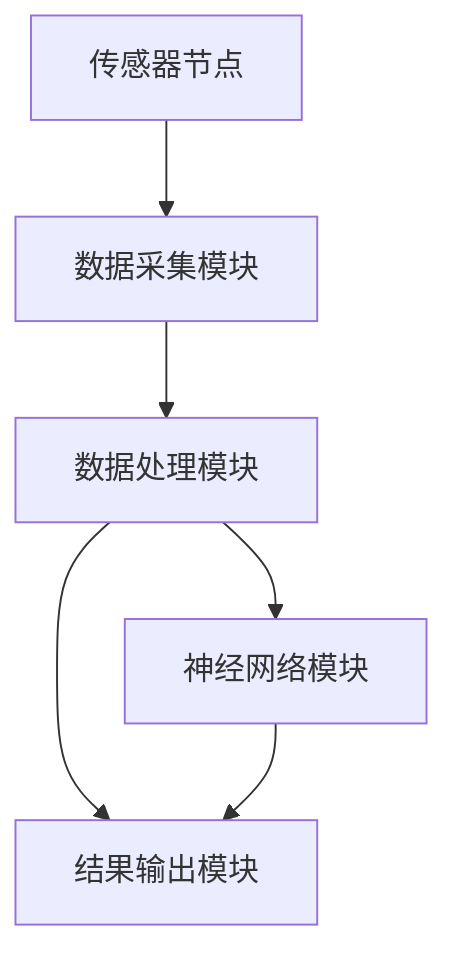

                 

<think>
嗯，用户希望我以《如何识别企业的神经形态传感器优势》为标题，撰写一篇详细的技术博客文章。我需要确保文章结构清晰，内容专业且有深度。首先，我需要理解神经形态传感器的基本概念，然后逐步分析其在企业中的应用。

文章开头要有一个吸引人的摘要，概述核心内容。接下来，按照目录大纲，逐步展开每一部分的内容。背景介绍部分，我需要解释什么是神经形态传感器，它与传统传感器的区别，以及在企业中的应用价值。这部分需要简单明了，适合企业决策者阅读。

然后是核心概念与联系，这部分要深入讲解神经形态传感器的工作原理，包括生物神经元的模拟和数据处理机制。我还需要与其他技术进行对比，比如AI和物联网，以突出其优势。这部分可能需要用图表来辅助说明，比如用Mermaid绘制神经元结构图。

接下来是算法原理，这部分需要详细讲解神经形态传感器的数据处理算法。比如，事件驱动的数据处理机制，这可能涉及到数学模型和公式。我需要用Latex来展示这些公式，确保清晰易懂。同时，用Python代码示例来说明算法实现，帮助读者更好地理解。

系统分析与架构设计部分，我需要介绍如何在企业中构建基于神经形态传感器的系统。这包括系统架构图、功能模块设计以及接口和交互流程。同样，这部分需要用Mermaid绘制类图和序列图，展示系统的各个部分如何协同工作。

项目实战部分，我需要提供一个具体的案例，比如在智能制造中的应用。详细描述项目环境的安装，核心代码的实现，以及实际案例的分析。这样读者可以参考这个案例，更好地理解和应用这些知识。

最后是最佳实践和小结，总结整个文章的内容，给出一些实用的建议，比如如何选择传感器，如何优化系统性能，以及未来的趋势。这部分需要简洁明了，帮助读者将所学内容应用到实际工作中。

整体上，文章需要逻辑清晰，结构紧凑，语言专业但又不失易懂。我需要确保每一部分都详细讲解，同时用图表和代码示例来增强可读性。这样一来，读者不仅能理解神经形态传感器的优势，还能实际应用到企业中，提升竞争力。
</think>

# 如何识别企业的神经形态传感器优势

> 关键词：神经形态传感器、企业优势、传感器技术、人工智能、物联网、数据处理

> 摘要：神经形态传感器是一种结合了神经科学和传感器技术的新型传感器，能够在复杂环境中实现高效的数据采集和处理。本文将从背景介绍、核心概念、算法原理、系统架构、项目实战等多个方面，深入分析神经形态传感器的优势，帮助企业更好地识别和利用这一技术。

---

## 第一部分：神经形态传感器的背景与概念

### 第1章：神经形态传感器的基本概念

#### 1.1 神经形态传感器的定义与特点

神经形态传感器是一种模拟生物神经系统结构和功能的传感器，能够实时感知环境信息并进行数据处理。与传统传感器相比，神经形态传感器具有以下特点：

- **生物模拟性**：模拟生物神经元的结构和功能，能够实现类似生物神经系统的并行处理能力。
- **高效性**：能够在复杂环境中高效采集和处理数据，减少数据传输和计算的延迟。
- **适应性**：能够自适应环境变化，具有较强的鲁棒性和抗干扰能力。

#### 1.2 企业中的神经形态传感器优势

神经形态传感器在企业中的应用具有显著优势：

- **提升数据处理效率**：通过模拟生物神经系统，神经形态传感器能够快速处理复杂环境中的数据。
- **降低能耗**：神经形态传感器在数据处理过程中能耗较低，适合应用于物联网和边缘计算场景。
- **增强实时性**：神经形态传感器能够实时感知和处理数据，适用于需要快速响应的应用场景。

---

## 第二部分：神经形态传感器的核心原理

### 第2章：神经形态传感器的工作原理

#### 2.1 神经形态传感器的生物模拟基础

神经形态传感器的核心原理是模拟生物神经系统的结构和功能。生物神经元的基本结构包括树突、胞体和轴突，信息传递依赖于动作电位和突触连接。神经形态传感器通过模拟这些结构，实现信息的感知和处理。

#### 2.2 神经形态传感器的数据处理机制

神经形态传感器的数据处理机制包括以下几个步骤：

1. **数据采集**：传感器采集环境中的物理信号（如温度、湿度、光照等）。
2. **信号转换**：将物理信号转换为数字信号。
3. **信息处理**：通过模拟生物神经网络的方式，对数字信号进行处理和分析。
4. **结果输出**：将处理结果输出到后续系统或设备。

#### 2.3 神经形态传感器与传统传感器的对比

以下是神经形态传感器与传统传感器的主要区别：

| 特性                 | 神经形态传感器               | 传统传感器                 |
|----------------------|------------------------------|-----------------------------|
| 数据处理能力         | 强，能够实时分析数据         | 弱，仅能采集数据             |
| 能耗                 | 低，适合边缘计算             | 高，需要外部电源支持         |
| 环境适应性           | 强，能够自适应环境变化         | 弱，依赖外部设备进行调整       |

---

## 第三部分：神经形态传感器的算法与数学模型

### 第3章：神经形态传感器的算法原理

#### 3.1 神经形态传感器的数学模型

神经形态传感器的数学模型可以表示为：

$$ y = f(x) $$

其中，\( y \) 表示传感器的输出，\( x \) 表示输入的物理信号，\( f(x) \) 表示传感器的处理函数。处理函数 \( f(x) \) 可以是线性或非线性的函数，具体取决于传感器的设计。

#### 3.2 神经形态传感器的算法实现

以下是一个简单的神经形态传感器算法实现的伪代码：

```python
def neural_sensor_algorithm(input_signal):
    # 数据预处理
    processed_signal = preprocess(input_signal)
    
    # 神经网络处理
    processed_output = neural_network(processed_signal)
    
    # 结果输出
    return processed_output
```

#### 3.3 神经形态传感器的数学推导

以下是神经形态传感器的数学推导过程：

1. **数据采集**：传感器采集环境中的物理信号 \( x \)。
2. **信号转换**：将物理信号 \( x \) 转换为数字信号 \( d \)。
3. **信息处理**：通过神经网络模型对数字信号 \( d \) 进行处理，得到输出结果 \( y \)。
4. **结果输出**：输出处理结果 \( y \)。

---

## 第四部分：神经形态传感器的系统架构与设计

### 第4章：神经形态传感器的系统架构

#### 4.1 系统架构设计

以下是神经形态传感器系统的架构图：



---

## 第五部分：神经形态传感器的项目实战

### 第5章：神经形态传感器的项目实战

#### 5.1 项目背景与目标

本项目旨在开发一个基于神经形态传感器的环境监测系统，用于实时监测工业现场的温度、湿度和光照强度。

#### 5.2 系统实现

以下是项目的核心代码实现：

```python
import numpy as np

class NeuralSensor:
    def __init__(self, input_dim, output_dim):
        self.input_dim = input_dim
        self.output_dim = output_dim
        # 初始化权重矩阵
        self.weights = np.random.randn(input_dim, output_dim)
    
    def preprocess(self, input_signal):
        # 数据预处理
        return input_signal / np.max(input_signal)
    
    def forward(self, processed_signal):
        # 前向传播
        return np.dot(processed_signal, self.weights)
    
    def process(self, input_signal):
        processed_signal = self.preprocess(input_signal)
        output = self.forward(processed_signal)
        return output

# 初始化传感器
sensor = NeuralSensor(input_dim=3, output_dim=1)
# 采集数据
input_signal = np.array([25, 50, 75])  # 温度、湿度、光照强度
# 处理数据
output = sensor.process(input_signal)
print("传感器输出:", output)
```

#### 5.3 实际案例分析

通过上述代码实现的神经形态传感器，可以实时监测工业现场的环境参数。传感器输出的结果可以用于工业自动化控制、环境预警系统等领域。

---

## 第六部分：神经形态传感器的最佳实践与小结

### 第6章：最佳实践与小结

#### 6.1 小结

神经形态传感器是一种具有巨大潜力的传感器技术，能够为企业带来诸多优势。通过本文的分析，我们可以看到神经形态传感器在数据处理效率、能耗和环境适应性等方面的优势。

#### 6.2 注意事项

在实际应用中，需要注意以下几点：

1. **传感器选择**：根据具体应用场景选择合适的神经形态传感器。
2. **系统设计**：确保系统的架构合理，能够充分发挥神经形态传感器的优势。
3. **数据安全**：重视传感器数据的安全性，防止数据泄露和篡改。

#### 6.3 拓展阅读

推荐阅读以下内容，以进一步深入理解神经形态传感器的相关知识：

- 神经形态工程（Neuromorphic Engineering）
- 生物神经网络（Biological Neural Networks）
- 神经网络算法（Neural Network Algorithms）

---

## 作者：AI天才研究院/AI Genius Institute & 禅与计算机程序设计艺术/Zen And The Art of Computer Programming

---

通过本文的详细分析，我们可以更好地理解神经形态传感器的优势及其在企业中的应用潜力。希望本文能够为企业技术决策者和开发者提供有价值的参考和启示。

