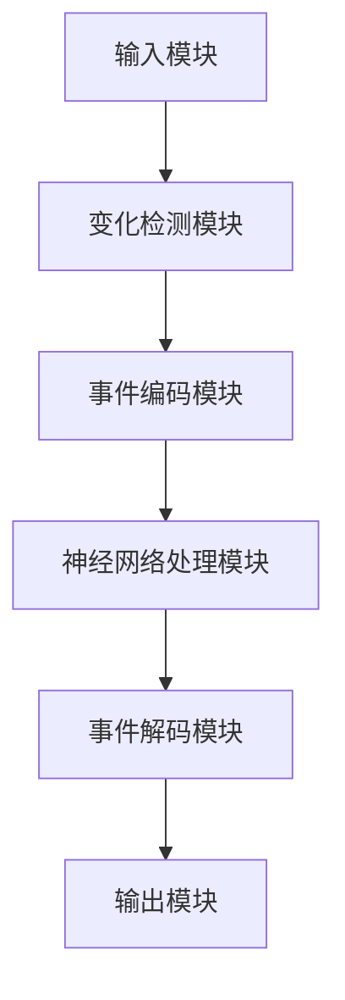
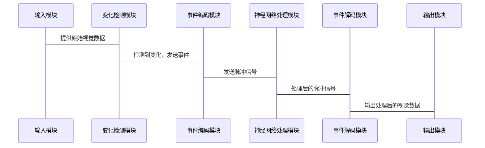

                 


# 如何识别企业的神经形态视觉处理器优势

> 关键词：神经形态视觉处理器、计算视觉、生物启发、神经计算、硬件实现

> 摘要：神经形态视觉处理器是一种结合了神经科学和计算机视觉技术的新型处理器，能够在低功耗和高能效下实现高效的视觉处理。本文将详细探讨神经形态视觉处理器的核心概念、算法原理、系统架构及实际应用，帮助读者识别企业在这一领域的优势。

---

## 第一部分: 神经形态视觉处理器的背景与概念

### 第1章: 神经形态视觉处理器概述

#### 1.1 神经形态视觉处理器的基本概念

神经形态视觉处理器（Neuromorphic Visual Processor）是一种基于神经形态计算（Neuromorphic Computing）的专用处理器，旨在模拟生物视觉系统的工作机制，以实现高效、低功耗的视觉信息处理。与传统处理器相比，神经形态视觉处理器通过模拟生物神经系统的特性，能够更高效地处理动态视觉信息，如实时视频流和事件驱动的视觉数据。

**1.1.1 传统视觉处理器的局限性**

传统视觉处理器（如GPU和CPU）在处理视觉任务时，通常依赖于帧率固定的图像数据，这种方式在处理高速动态场景或低光照环境时，效率较低，且功耗较高。此外，传统处理器的冯·诺依曼架构在处理并行数据时存在瓶颈，难以满足实时性和高能效的要求。

**1.1.2 神经形态计算的定义与特点**

神经形态计算是一种模拟生物神经系统信息处理方式的计算范式。其特点包括：

- **事件驱动**：仅在检测到变化时触发计算，减少不必要的计算量。
- **并行处理**：类似于生物神经元的并行通信和计算。
- **低功耗**：通过事件驱动和稀疏数据处理，显著降低功耗。
- **生物启发**：模拟生物视觉系统，如视网膜和视觉皮层的处理机制。

**1.1.3 神经形态视觉处理器的核心优势**

神经形态视觉处理器通过模拟生物视觉系统，能够在以下方面表现出色：

- **实时性**：能够快速响应动态视觉变化。
- **能效比高**：在低功耗下实现高效计算。
- **鲁棒性**：在复杂环境下具有较强的抗干扰能力。
- **并行处理能力**：能够同时处理大量视觉信息。

#### 1.2 神经形态视觉处理器的背景与问题背景

**1.2.1 计算视觉领域的挑战**

计算视觉领域面临的主要挑战包括：

- **实时性要求高**：需要快速处理和响应动态视觉数据。
- **数据量大**：高分辨率视频流的数据量巨大。
- **功耗限制**：在移动设备和嵌入式系统中，功耗是一个关键限制因素。

**1.2.2 传统视觉处理器的局限性**

传统视觉处理器在以下方面表现不足：

- **高功耗**：在处理高速视频流时，传统处理器的功耗较高。
- **处理延迟**：帧率固定的处理方式在动态场景中响应较慢。
- **计算效率低**：在处理稀疏数据时，计算资源浪费严重。

**1.2.3 神经形态计算的提出与应用**

神经形态计算的提出为解决上述问题提供了新的思路。通过模拟生物神经系统的事件驱动和并行处理特性，神经形态视觉处理器能够在低功耗下高效处理动态视觉信息，适用于实时性和功耗敏感的应用场景。

#### 1.3 神经形态视觉处理器的解决思路

**1.3.1 生物启发的视觉处理机制**

神经形态视觉处理器的设计灵感来源于生物视觉系统。例如，视网膜中的光感受器和视神经元在处理视觉信息时具有事件驱动和并行处理的特点。神经形态视觉处理器通过模拟这些机制，能够高效地处理动态视觉数据。

**1.3.2 神经形态视觉处理器的设计理念**

神经形态视觉处理器的设计理念包括：

- **事件驱动**：仅在检测到视觉变化时触发处理。
- **并行计算**：模拟生物神经元的并行通信和计算。
- **低功耗**：通过优化算法和硬件设计，降低功耗。

**1.3.3 神经形态视觉处理器的应用场景**

神经形态视觉处理器的应用场景包括：

- **实时视频处理**：如实时视频流的压缩和传输。
- **低光照环境**：在低光照条件下实现高效的视觉处理。
- **移动设备**：在手机、平板等移动设备上实现低功耗的视觉功能。

#### 1.4 神经形态视觉处理器的边界与外延

**1.4.1 神经形态视觉处理器的边界**

神经形态视觉处理器的边界主要体现在其处理范围和能力上。它专注于视觉信息的处理，不涉及其他类型的计算任务，如音频处理或文本分析。

**1.4.2 神经形态视觉处理器的外延**

神经形态视觉处理器的外延包括其在其他领域的应用潜力，如神经形态听觉处理器和神经形态触觉处理器。

**1.4.3 神经形态视觉处理器与其他计算视觉技术的关系**

神经形态视觉处理器与其他计算视觉技术（如深度学习视觉处理器）既有区别又有联系。区别主要在于处理机制和硬件实现，而联系则体现在它们都致力于提高视觉处理的效率和能效。

#### 1.5 神经形态视觉处理器的核心要素组成

**1.5.1 生物启发的视觉处理模型**

神经形态视觉处理器的核心是生物启发的视觉处理模型，如基于视网膜的事件驱动视觉处理模型。

**1.5.2 神经形态计算的核心算法**

神经形态计算的核心算法包括脉冲计算（Spike-based computation）和事件驱动视觉处理算法。

**1.5.3 神经形态视觉处理器的硬件实现**

硬件实现是神经形态视觉处理器的关键部分，包括事件驱动视觉处理电路和并行计算架构的设计。

---

### 第2章: 神经形态视觉处理器的核心概念与联系

#### 2.1 神经形态视觉处理器的核心原理

**2.1.1 神经形态计算的基本原理**

神经形态计算的基本原理是通过模拟生物神经元的电脉冲和突触的连接，实现信息的并行处理和事件驱动计算。

**2.1.2 神经形态视觉处理器的生物启发模型**

神经形态视觉处理器的生物启发模型包括视网膜模型和视觉皮层模型。视网膜模型负责将光信号转换为电信号，而视觉皮层模型负责对电信号进行高级处理。

**2.1.3 神经形态视觉处理器的数学模型**

神经形态视觉处理器的数学模型主要基于脉冲神经网络（SNN，Spiking Neural Networks）。SNN是一种模拟生物神经网络的计算模型，其核心是通过脉冲的产生和传播来实现信息处理。

$$ V(t) = V_{\text{rest}} + (V_{\text{max}} - V_{\text{rest}}) \cdot \frac{t}{\tau} $$

其中，$V(t)$ 表示膜电位随时间的变化，$V_{\text{rest}}$ 是静息电位，$V_{\text{max}}$ 是动作电位的幅度，$\tau$ 是时间常数。

#### 2.2 神经形态视觉处理器与传统视觉处理器的对比

**2.2.1 传统视觉处理器的特点**

传统视觉处理器的特点包括帧率固定的图像处理、高功耗、计算效率低。

**2.2.2 神经形态视觉处理器的特点**

神经形态视觉处理器的特点包括事件驱动、低功耗、并行处理能力强。

**2.2.3 两者的对比分析**

通过对比分析可以发现，神经形态视觉处理器在低功耗和实时性方面具有显著优势，而传统视觉处理器在处理静态图像和复杂视觉任务时表现更好。

#### 2.3 神经形态视觉处理器的核心概念属性特征对比

以下是神经形态视觉处理器和传统视觉处理器的核心概念属性特征对比：

| 特性                | 传统视觉处理器             | 神经形态视觉处理器       |
|---------------------|--------------------------|------------------------|
| 处理机制            | 帧率固定，串行处理         | 事件驱动，并行处理       |
| 功耗                | 高功耗                   | 低功耗                 |
| 实时性              | 较低                    | 高                    |
| 并行处理能力        | 较弱                    | 强                    |

#### 2.4 神经形态视觉处理器的ER实体关系图

以下是神经形态视觉处理器的ER实体关系图：

```mermaid
er
  entity 神经形态视觉处理器 {
    id
    名称
    核心算法
    硬件实现
    性能指标
  }
  entity 传统视觉处理器 {
    id
    名称
    核心算法
    硬件实现
    性能指标
  }
  entity 生物启发模型 {
    id
    名称
    核心原理
    应用场景
  }
  relation 神经形态视觉处理器与传统视觉处理器对比 {
    神经形态视觉处理器
    传统视觉处理器
    对比属性：事件驱动 vs 帧率固定
  }
  relation 神经形态视觉处理器与生物启发模型的关系 {
    神经形态视觉处理器
    生物启发模型
    基于模型的设计
  }
```

---

## 第三部分: 神经形态视觉处理器的算法原理

### 第3章: 神经形态视觉处理器的算法原理

#### 3.1 神经形态视觉处理器的算法概述

神经形态视觉处理器的核心算法是基于脉冲神经网络（SNN）的事件驱动视觉处理算法。

#### 3.2 脉冲计算原理

脉冲计算是神经形态视觉处理器的核心算法之一。以下是脉冲计算的基本原理：

- **脉冲生成**：当输入信号超过阈值时，触发脉冲。
- **脉冲传播**：脉冲通过突触传递到下一个神经元。
- **脉冲整合**：多个脉冲的整合结果决定下一个脉冲的生成。

$$ I(t) = \sum_{i} w_i \cdot S_i(t) $$

其中，$I(t)$ 是输入电流，$w_i$ 是突触权重，$S_i(t)$ 是输入脉冲。

#### 3.3 事件驱动视觉处理算法

事件驱动视觉处理算法通过仅处理视觉变化来减少计算量。以下是事件驱动视觉处理的基本步骤：

1. **变化检测**：检测视觉数据中的变化。
2. **事件编码**：将变化编码为脉冲信号。
3. **事件处理**：通过神经网络处理脉冲信号。
4. **事件解码**：将处理后的脉冲信号解码为视觉数据。

---

## 第四部分: 神经形态视觉处理器的系统架构

### 第4章: 神经形态视觉处理器的系统架构设计

#### 4.1 神经形态视觉处理器的系统功能设计

神经形态视觉处理器的系统功能设计包括：

- **事件驱动视觉处理**：实时检测和处理视觉变化。
- **低功耗硬件实现**：通过优化硬件设计降低功耗。
- **高效并行计算**：利用并行计算能力提高处理效率。

#### 4.2 神经形态视觉处理器的架构设计图

以下是神经形态视觉处理器的架构设计图：



#### 4.3 神经形态视觉处理器的接口设计

神经形态视觉处理器的主要接口包括：

- **输入接口**：接收原始视觉数据。
- **输出接口**：输出处理后的视觉数据。
- **控制接口**：控制处理过程的启动和停止。

#### 4.4 神经形态视觉处理器的交互序列图

以下是神经形态视觉处理器的交互序列图：



---

## 第五部分: 项目实战

### 第5章: 神经形态视觉处理器的项目实战

#### 5.1 环境安装

以下是神经形态视觉处理器项目所需的环境安装步骤：

1. **安装Python环境**：使用Anaconda或virtualenv创建虚拟环境。
2. **安装依赖库**：安装numpy、matplotlib、scikit-learn等依赖库。
3. **安装神经形态视觉处理器硬件**：安装所需的神经形态视觉处理器硬件和驱动程序。

#### 5.2 神经形态视觉处理器的核心代码实现

以下是神经形态视觉处理器的核心代码实现：

```python
import numpy as np

def detect_changes(input_data):
    # 输入数据为一维数组
    changes = np.zeros_like(input_data)
    for i in range(1, len(input_data)):
        if input_data[i] != input_data[i-1]:
            changes[i] = 1
    return changes

def encode_events(changes, threshold):
    # 事件编码
    events = []
    for i in range(len(changes)):
        if changes[i] == 1 and input_data[i] > threshold:
            events.append(1)
        else:
            events.append(0)
    return events

def process_events(events, weights):
    # 神经网络处理
    output = np.dot(events, weights)
    return output

def decode_events(output):
    # 事件解码
    decoded_output = []
    for val in output:
        decoded_output.append(val)
    return decoded_output
```

#### 5.3 神经形态视觉处理器的代码解读与分析

以上代码实现了一个简单的神经形态视觉处理器，包括变化检测、事件编码、神经网络处理和事件解码四个步骤。

#### 5.4 神经形态视觉处理器的案例分析与详细讲解

以下是一个简单的案例分析：

假设输入数据是一个高速视频流，我们需要检测视频中的运动物体。通过上述代码，我们可以实现事件驱动的视觉处理，仅在检测到运动时触发处理，从而降低计算量和功耗。

#### 5.5 神经形态视觉处理器的项目小结

通过本项目，我们了解了神经形态视觉处理器的核心算法和系统架构，掌握了其在实际应用中的实现方法。

---

## 第六部分: 最佳实践与总结

### 第6章: 神经形态视觉处理器的最佳实践

#### 6.1 神经形态视觉处理器的最佳实践 tips

- **硬件优化**：选择适合的硬件平台，降低功耗。
- **算法优化**：优化算法，提高处理效率。
- **数据优化**：选择适合的视觉数据，减少冗余。

#### 6.2 神经形态视觉处理器的小结

神经形态视觉处理器是一种高效、低功耗的视觉处理器，能够在实时性和能效比方面表现出色。

#### 6.3 神经形态视觉处理器的注意事项

- **硬件限制**：神经形态视觉处理器的硬件实现较为复杂。
- **算法限制**：目前的算法还不够成熟，需要进一步优化。
- **应用场景限制**：仅适用于特定类型的视觉任务。

#### 6.4 神经形态视觉处理器的拓展阅读

- **相关论文**：阅读相关领域的学术论文，了解最新的研究成果。
- **技术博客**：查阅相关技术博客，了解行业动态。
- **技术书籍**：阅读相关技术书籍，深入理解神经形态计算的原理。

---

## 结语

神经形态视觉处理器作为一种新兴的视觉处理器，具有广阔的应用前景。通过本文的详细讲解，我们了解了其核心概念、算法原理、系统架构及实际应用。希望本文能够帮助读者识别企业在神经形态视觉处理器领域的优势，并为其应用提供参考。

---

## 作者：AI天才研究院/AI Genius Institute & 禅与计算机程序设计艺术 /Zen And The Art of Computer Programming

---

本文版权归作者所有，转载请注明出处。

