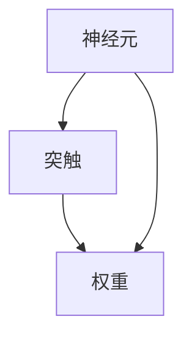
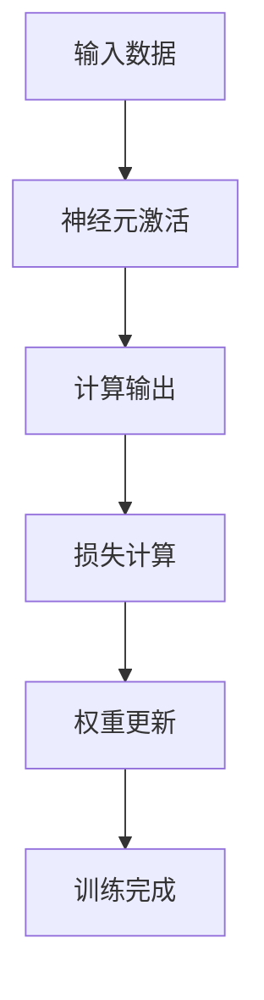
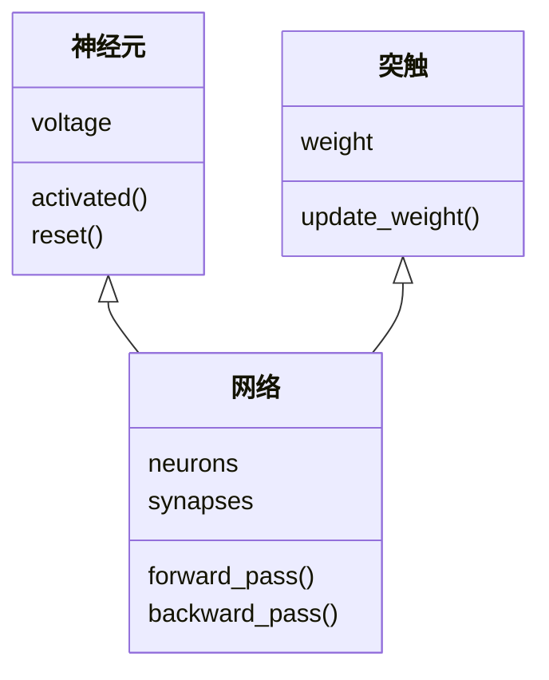
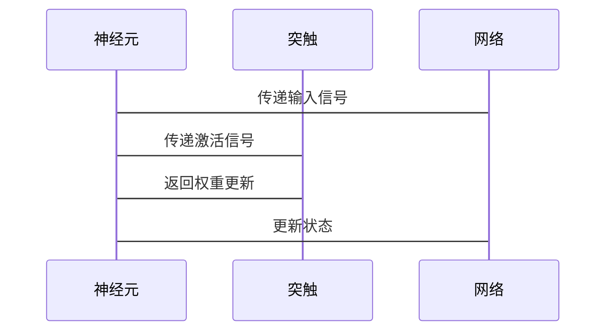

                 


# 如何识别企业的神经形态计算优势

## 文章关键词

神经形态计算，生物神经元，突触，权重，神经网络，系统架构，数学模型，事件驱动

## 摘要

神经形态计算作为一种新兴的计算范式，模拟生物神经系统的信息处理方式，为企业带来了前所未有的计算优势。本文将详细探讨神经形态计算的核心概念、算法原理、系统架构以及在企业中的应用场景，帮助企业识别和利用这一技术的优势，提升竞争力。

---

### 第一部分：神经形态计算的背景与概念

#### 第1章：神经形态计算的背景介绍

1.1 问题背景与描述

1.1.1 传统计算的局限性
传统计算机依赖二进制逻辑，处理线性问题效率高，但在处理复杂非线性问题时效率低下，且能耗较高。

1.1.2 神经形态计算的起源与发展
起源于对生物神经系统的模拟，旨在通过模拟人脑的神经网络结构，实现更高效的并行计算。

1.1.3 企业应用中的问题与挑战
企业面临数据爆炸、实时处理需求增加等问题，传统计算难以应对，而神经形态计算提供了一种更高效的解决方案。

1.2 问题解决与边界

1.2.1 神经形态计算的核心优势
- 高能效
- 强大的并行处理能力
- 适用于复杂模式识别

1.2.2 与传统计算的边界与外延
- 适用于模式识别、实时处理等领域
- 不适合需要严格顺序性处理的任务

1.3 核心概念与结构

1.3.1 神经元、突触与权重的关系
- 神经元：信息处理的基本单元
- 突触：神经元之间的连接，传递信号
- 权重：决定信号强度的参数

1.3.2 神经网络的层次结构
- 输入层、隐藏层、输出层
- 层间通过权重矩阵连接

1.3.3 神经形态计算的系统架构
- 硬件：专用芯片（如神经形态芯片）
- 软件：模拟神经网络的算法框架

1.4 本章小结

---

### 第二部分：神经形态计算的核心概念与联系

#### 第2章：神经形态计算的核心原理

2.1 生物神经元的模拟

2.1.1 神经元模型的数学表示
- 鲍温-霍奇金方程：描述神经元膜电位变化
$$ V(t) = V_{\text{rest}} + (V_{\text{max}} - V_{\text{rest}}) \cdot \frac{1}{1 + e^{-\Delta t}} $$

2.1.2 突触与权重的动态调整
- 突触权重更新公式（如反向传播算法）
$$ \Delta w = \eta (y - y_{\text{预测}}) x $$

2.1.3 神经信号的传递机制
- 动作电位的产生与传导
- 突触传递的化学递质释放

2.2 神经网络结构与学习机制

2.2.1 网络拓扑结构分析
- 卷积层、池化层、全连接层
- 深度神经网络的层次结构

2.2.2 监督与无监督学习的对比
- 监督学习：有标签数据
- 无监督学习：无标签数据

2.2.3 突触可塑性的实现
- 布洛赫定律：$$ w_{\text{new}} = w_{\text{old}} + \eta (y - y_{\text{预测}}) $$

2.3 计算模型与信息处理

2.3.1 神经形态计算的数学模型
- 神经元激活函数：$$ f(x) = \text{sigmoid}(w \cdot x + b) $$
- 网络损失函数：$$ L = \frac{1}{n} \sum_{i=1}^{n} (y_i - \hat{y}_i)^2 $$

2.3.2 事件驱动计算的优势
- 时间触发：仅在特定事件发生时处理数据
- 降低能耗，提高效率

2.3.3 网络训练与推理的流程
- 训练：通过反向传播更新权重
- 推理：利用训练好的模型进行预测

2.4 核心概念对比表

| 比较项         | 传统计算       | 神经形态计算     |
|----------------|----------------|------------------|
| 基本单元       | CPU核           | 神经元           |
| 数据处理方式   | 串行处理       | 并行处理         |
| 能效比         | 较低           | 较高             |

2.5 ER实体关系图



---

### 第三部分：神经形态计算的算法原理

#### 第3章：算法原理与数学模型

3.1 神经网络算法流程



3.2 感知器模型

3.2.1 感知器分类函数
$$ f(x) = \text{sign}(w \cdot x + b) $$

3.2.2 损失函数计算
$$ L = \frac{1}{2} (y - y_{\text{预测}})^2 $$

3.3 深度学习模型

3.3.1 多层感知器（MLP）结构
- 输入层、隐藏层、输出层
- 每层通过激活函数处理

3.3.2 卷积神经网络（CNN）的应用
- 卷积层提取特征
- 池化层降低维度

3.4 事件驱动计算

3.4.1 突触事件触发机制
- 当输入信号达到阈值时触发

3.4.2 神经元状态更新流程
- $$ V_{\text{new}} = V_{\text{old}} + \Delta V $$

3.5 代码实现示例

```python
import numpy as np

# 神经元激活函数
def activate(x):
    return 1 / (1 + np.exp(-x))

# 网络前向传播
def forward(input, weights, bias):
    return activate(np.dot(input, weights) + bias)

# 反向传播（简化版）
def backward(output, input, weights):
    return (output * (1 - output)) * input, output - y_true

# 示例代码
input = np.random.rand(1, 3)
weights = np.random.rand(3, 2)
bias = np.random.rand(2)
output = forward(input, weights, bias)
print(output)
```

---

### 第四部分：系统分析与架构设计方案

#### 第4章：系统分析与架构设计

4.1 问题场景介绍

4.1.1 应用场景
- 图像识别：识别产品缺陷
- 实时处理：股票市场实时分析

4.2 项目介绍

4.2.1 项目目标
- 实现图像分类任务
- 提升实时处理效率

4.3 系统功能设计

4.3.1 领域模型（Mermaid类图）


4.4 系统架构设计

4.4.1 系统架构图（Mermaid架构图）
```mermaid
dataclass SystemArchitecture {
    硬件层: 神经形态芯片
    软件层: 神经网络框架
    应用层: 图像识别应用
}
```

4.5 系统接口设计

4.5.1 神经网络接口
- 输入接口：接收原始数据
- 输出接口：返回处理结果

4.5.2 事件驱动接口
- 事件触发接口：接收触发信号
- 状态更新接口：更新神经元状态

4.6 系统交互设计（Mermaid序列图）



---

### 第五部分：项目实战

#### 第5章：项目实战

5.1 环境安装

5.1.1 神经网络框架安装
- 安装NEST或其它神经网络模拟工具

5.1.2 依赖项安装
```bash
pip install numpy matplotlib
```

5.2 系统核心实现源代码

5.2.1 神经元模拟代码
```python
import numpy as np

class Neuron:
    def __init__(self, weight):
        self.weight = weight
        self.voltage = 0

    def activate(self, input):
        return 1 / (1 + np.exp(-np.dot(input, self.weight)))

    def update(self, input):
        self.voltage += np.dot(input, self.weight)
        if self.voltage > 0:
            self.voltage = 0
```

5.2.2 突触权重更新代码
```python
class Synapse:
    def __init__(self, learning_rate):
        self.lr = learning_rate

    def update_weight(self, input, error):
        self.weight += self.lr * input * error
```

5.3 代码应用解读与分析

5.3.1 神经元激活函数
- 使用sigmoid函数进行激活
- 神经元状态更新基于输入和权重

5.3.2 突触权重更新
- 使用反向传播算法更新权重
- 学习率控制更新步长

5.4 实际案例分析和详细讲解剖析

5.4.1 案例：图像分类任务
- 使用神经形态计算训练卷积神经网络
- 对比传统方法的效率和准确率

5.4.2 结果分析
- 准确率提升
- 计算效率提高

5.5 项目小结

---

### 第六部分：最佳实践、小结、注意事项、拓展阅读

#### 第6章：总结与展望

6.1 最佳实践 tips
- 确定应用场景
- 选择合适的神经网络架构
- 调整学习率和参数

6.2 小结
神经形态计算为企业提供了高效处理复杂问题的能力，但需要结合具体场景选择合适的方法。

6.3 注意事项
- 确保硬件支持
- 数据质量影响结果
- 模型可解释性问题

6.4 拓展阅读
- 推荐书籍：《神经网络与深度学习》
- 推荐博客：https://neuromorphics.com

---

## 作者

作者：AI天才研究院/AI Genius Institute & 禅与计算机程序设计艺术 /Zen And The Art of Computer Programming

