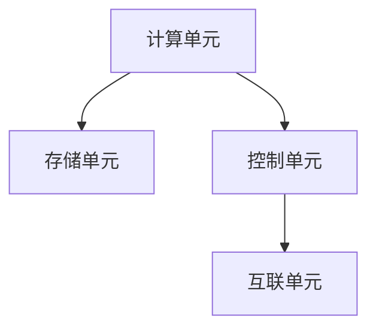
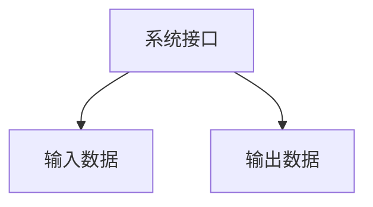
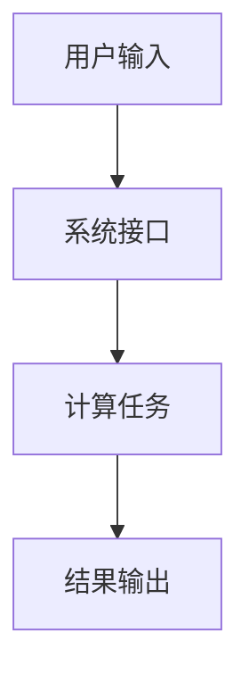

                 


# 如何识别企业的神经网络硬件加速器优势

> 关键词：神经网络硬件加速器、并行计算、矩阵运算优化、系统架构设计、企业AI应用

> 摘要：本文将详细探讨如何识别企业的神经网络硬件加速器优势，涵盖从基本概念到系统架构设计的全过程。通过分析神经网络硬件加速器的核心原理、系统架构设计、项目实战等内容，帮助读者全面理解如何在企业中有效利用神经网络硬件加速器的优势。

---

## 第一部分：神经网络硬件加速器背景与概念

### 第1章：神经网络硬件加速器概述

#### 1.1 神经网络硬件加速器的定义与背景

神经网络硬件加速器是一种专为加速神经网络计算设计的硬件设备，其核心目标是通过高效的并行计算和专用架构，显著提高神经网络模型的训练和推理速度。随着人工智能技术的快速发展，企业对高效计算的需求日益增长，神经网络硬件加速器在企业中的应用也逐渐普及。

**神经网络的基本概念**  
神经网络是一种模仿人脑结构和功能的计算模型，由多个神经元通过层次化结构进行信息处理。神经网络的核心运算包括矩阵乘法、激活函数和损失函数优化等。

**硬件加速器的定义与作用**  
硬件加速器是指通过专用硬件（如GPU、TPU等）来加速特定计算任务的设备。与通用CPU相比，硬件加速器在并行计算和专用指令集方面具有显著优势。

**神经网络硬件加速器的背景与发展趋势**  
随着深度学习模型的复杂化，传统的通用CPU难以满足高性能计算需求。神经网络硬件加速器通过优化硬件架构，显著提升了神经网络模型的训练和推理效率。

---

#### 1.2 神经网络硬件加速器的核心优势

**提高计算效率**  
神经网络硬件加速器通过并行计算和流水线处理，大幅提升了神经网络模型的计算速度。例如，GPU的并行计算能力可以将矩阵乘法的效率提升数十倍。

**降低能耗**  
相比通用CPU，神经网络硬件加速器在执行特定任务时的能耗更低。例如，TPU在处理大规模矩阵运算时，能效比显著优于GPU和CPU。

**支持大规模并行计算**  
神经网络硬件加速器通过高效的并行架构，支持大规模神经网络模型的训练和推理。例如，现代GPU可以通过多块GPU的并行计算，处理万亿参数的大型模型。

---

#### 1.3 企业应用中的神经网络硬件加速器

**企业级AI应用的需求**  
随着企业对AI技术的需求增加，神经网络硬件加速器在企业中的应用场景日益丰富，包括图像识别、自然语言处理、推荐系统等。

**硬件加速器在企业中的应用现状**  
目前，企业主要采用GPU、TPU等硬件加速器，部分企业也在探索自研专用加速芯片。

**硬件加速器对企业竞争力的影响**  
通过硬件加速器，企业可以显著提升AI模型的训练效率，加快产品迭代速度，从而在竞争中占据优势。

---

## 第二部分：神经网络硬件加速器的核心原理

### 第2章：神经网络硬件加速器的核心原理

#### 2.1 并行计算与流水线处理

**并行计算的基本概念**  
并行计算是指同时使用多种处理器核心对同一个问题进行计算，以提高计算效率。并行计算的核心思想是将任务分解为多个子任务，分别在多个核心上执行。

**流水线处理的原理与优势**  
流水线处理是一种通过时间分割和空间重叠来提高处理器效率的技术。在神经网络硬件加速器中，流水线处理可以显著提升矩阵运算的效率。

**并行计算与流水线处理在神经网络中的应用**  
神经网络的计算任务（如矩阵乘法）可以通过并行计算和流水线处理进行优化。例如，矩阵乘法可以通过并行分割矩阵块，然后通过流水线处理进行优化。

**数学模型与公式**  
矩阵乘法的并行计算可以通过以下公式表示：

$$
C = AB \quad \text{其中，} A \text{和} B \text{是矩阵}
$$

---

#### 2.2 矩阵运算优化

**矩阵运算在神经网络中的重要性**  
矩阵运算是神经网络的核心运算，包括权重矩阵与输入矩阵的乘法、激活函数的计算等。

**矩阵运算的优化方法**  
通过将矩阵分割为块矩阵，并利用并行计算和流水线处理，可以显著提高矩阵运算的效率。

**硬件加速器对矩阵运算的加速效果**  
例如，GPU通过SIMD（单指令多数据）指令和并行线程调度，可以显著提高矩阵运算的效率。

---

#### 2.3 硬件加速器的架构特点

**GPU的架构特点**  
GPU通过SIMD指令和多核并行计算，支持高效的矩阵运算。现代GPU（如NVIDIA的Ampere架构）通过引入多级缓存和高效的线程调度，进一步提升了计算效率。

**TPU的架构特点**  
TPU（张量处理单元）是一种专为深度学习设计的硬件加速器，通过高效的张量运算和流水线处理，显著提升了神经网络的训练效率。

**其他专用硬件加速器的架构特点**  
例如，NVIDIA的NVLINK技术通过高速互联实现多块GPU的协同计算，进一步提升了并行计算能力。

---

## 第三部分：神经网络硬件加速器的系统分析与架构设计

### 第3章：系统分析与架构设计

#### 3.1 神经网络硬件加速器的系统功能设计

**系统功能模块划分**  
神经网络硬件加速器的系统功能模块包括输入数据处理、矩阵运算加速、模型训练与推理、结果输出等。

**系统功能模块之间的关系**  
系统功能模块之间通过数据流和控制流进行交互。例如，输入数据处理模块将数据传递给矩阵运算加速模块，后者将结果传递给模型训练模块。

**系统功能模块的实现方式**  
通过并行计算和流水线处理，系统功能模块可以在硬件加速器上高效运行。

---

#### 3.2 神经网络硬件加速器的架构设计

**系统架构的总体设计**  
神经网络硬件加速器的架构设计包括计算单元、存储单元、控制单元和互联单元。计算单元负责矩阵运算，存储单元负责数据存储，控制单元负责任务调度，互联单元负责数据传输。

**系统架构的详细设计**  
通过Mermaid图表展示系统架构设计：



**系统架构的优化与改进**  
通过优化计算单元的并行能力、存储单元的缓存效率和互联单元的带宽，可以进一步提升系统架构的性能。

---

#### 3.3 神经网络硬件加速器的接口设计

**系统接口的设计原则**  
系统接口设计应遵循高效性、可扩展性和易用性原则。

**系统接口的具体实现**  
通过Mermaid图表展示系统接口设计：



**系统接口的测试与验证**  
通过接口测试用例和性能测试，验证系统接口的正确性和高效性。

---

#### 3.4 神经网络硬件加速器的交互设计

**系统交互的设计原则**  
系统交互设计应注重用户友好性、任务调度效率和资源利用率。

**系统交互的具体实现**  
通过Mermaid图表展示系统交互设计：



**系统交互的优化与改进**  
通过优化任务调度算法和资源分配策略，可以进一步提升系统交互的效率。

---

## 第四部分：神经网络硬件加速器的项目实战

### 第4章：项目实战

#### 4.1 项目背景与目标

**项目背景**  
本项目旨在通过神经网络硬件加速器优化一个典型的深度学习模型（如卷积神经网络）的训练和推理效率。

**项目目标**  
通过硬件加速器实现深度学习模型的高效训练和推理，验证硬件加速器的性能优势。

---

#### 4.2 环境安装与配置

**环境安装步骤**  
1. 安装Linux操作系统（如Ubuntu 20.04）。
2. 安装NVIDIA驱动和CUDA toolkit（如CUDA 11.0）。
3. 安装TensorFlow框架（支持GPU加速）。

**硬件配置要求**  
- CPU：多核处理器（如Intel i7或i9）。
- GPU：NVIDIA显卡（如NVIDIA Tesla V100或RTX 3090）。
- 内存：至少16GB DDR4内存。

---

#### 4.3 系统核心实现

**核心代码实现**  
以下是优化后的矩阵乘法代码示例：

```python
import numpy as np
import tensorflow as tf

def matrix_mult(A, B):
    with tf.device('/gpu:0'):
        C = tf.matmul(A, B)
    return C.numpy()

A = np.random.randn(1024, 1024)
B = np.random.randn(1024, 1024)

result = matrix_mult(A, B)
print(result)
```

**代码应用解读与分析**  
上述代码通过TensorFlow框架实现了矩阵乘法的GPU加速。`tf.matmul`函数会自动利用GPU的并行计算能力，显著提高计算效率。

---

#### 4.4 项目案例分析与详细讲解

**案例分析**  
假设我们训练一个卷积神经网络模型，使用硬件加速器可以将训练时间从数小时缩短到数分钟。

**详细讲解**  
通过硬件加速器的并行计算和流水线处理，我们可以显著提高神经网络模型的训练效率。例如，通过将矩阵运算分解为多个并行任务，并利用GPU的SIMD指令进行加速。

---

#### 4.5 项目小结

**项目总结**  
通过本项目，我们验证了神经网络硬件加速器在实际应用中的性能优势。硬件加速器的并行计算能力和专用架构显著提高了神经网络模型的训练和推理效率。

**性能优化经验总结**  
硬件加速器的性能优化需要结合具体的任务需求，合理选择硬件架构和优化算法。

---

## 第五部分：总结与展望

### 第5章：总结与展望

#### 5.1 总结

通过本文的详细讲解，我们全面探讨了如何识别企业的神经网络硬件加速器优势。从基本概念到系统架构设计，再到项目实战，我们展示了神经网络硬件加速器在企业中的广泛应用和显著优势。

---

#### 5.2 展望

未来，随着AI技术的不断发展，神经网络硬件加速器将在企业中发挥更重要的作用。我们期待硬件加速器在以下方面取得进一步突破：

- 更高效的并行计算架构。
- 更低能耗的硬件设计。
- 更智能化的系统管理与优化。

---

## 作者信息

**作者：AI天才研究院/AI Genius Institute & 禅与计算机程序设计艺术 /Zen And The Art of Computer Programming**

---

以上是《如何识别企业的神经网络硬件加速器优势》的技术博客文章的完整大纲和内容。希望对您有所帮助！

