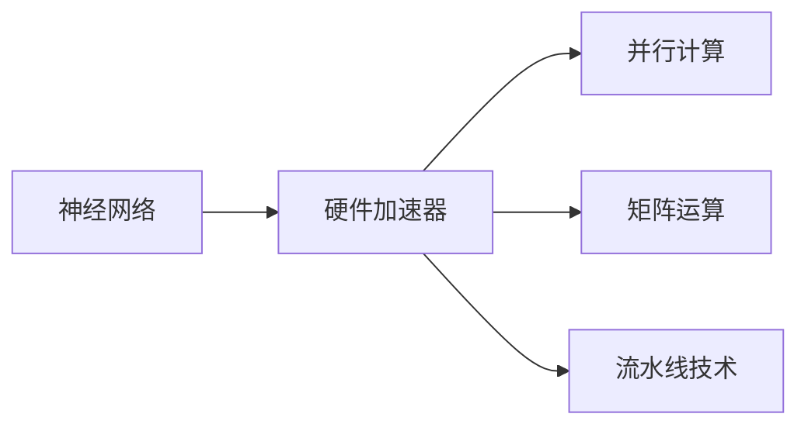

                 

<think>
嗯，用户希望我写一篇关于如何识别企业神经网络硬件加速器优势的技术博客。我需要按照他们的要求来，先理解他们的需求，然后一步步构建文章的结构。

首先，用户已经给出了一个详细的大纲，包括摘要、关键词和各个章节的内容。看起来他们希望文章结构清晰，逻辑严密，每个部分都要深入讲解。

接下来，我需要考虑每个章节的具体内容。例如，在背景介绍部分，我应该先解释神经网络硬件加速器的基本概念，然后讨论为什么企业需要这些加速器，接着分析它们与传统计算的区别。

然后是核心概念部分，我需要用表格对比不同加速器的特点，比如GPU、TPU、NPU等，这样读者可以清楚地看到它们的优缺点。可能还需要用Mermaid图来展示实体关系，帮助读者理解结构。

在算法原理部分，我需要详细讲解加速器如何优化神经网络计算，包括并行计算、矩阵运算和流水线技术。这部分可能需要使用数学公式和流程图来辅助说明。

系统分析与架构设计部分，我应该介绍企业中的应用场景，比如训练和推理的不同需求，然后设计一个系统架构，用Mermaid图展示数据流和接口设计。这可能有点复杂，需要分步骤解释。

项目实战部分，我需要指导读者如何搭建环境，编写代码实现加速器功能，并分析性能提升。这部分应该包括代码示例和性能分析，让读者能够实际操作。

最后是最佳实践和小结，总结全文，给出实用建议，比如如何选择合适的加速器，以及未来的发展趋势。这部分需要简明扼要，帮助读者巩固所学内容。

现在，我需要确保每个部分都详细且覆盖所有要求，同时保持文章结构的紧凑和逻辑的清晰。可能还需要检查是否有遗漏的关键点，比如数学模型的详细解释或实际案例分析。

总的来说，我需要按照用户的大纲，逐步扩展每个部分的内容，确保每个章节都详细且有深度，同时使用正确的格式和工具，如Mermaid图和数学公式，来增强文章的表现力。
</think>

# 如何识别企业的神经网络硬件加速器优势

> 关键词：神经网络硬件加速器，企业应用，性能优化，算法原理，系统架构

> 摘要：本文详细介绍了如何识别企业中神经网络硬件加速器的优势，从背景介绍、核心概念、算法原理、系统架构到项目实战和最佳实践，层层深入，为企业技术人员提供实用的指导和参考。

---

## 第一部分: 背景介绍

### 第1章: 神经网络硬件加速器概述

#### 1.1 神经网络硬件加速器的基本概念

神经网络硬件加速器是一种专门用于加速神经网络计算的硬件设备，通过并行计算和专用指令集优化，显著提升了神经网络模型的训练和推理效率。常见的硬件加速器包括GPU、TPU（张量处理单元）和NPU（神经网络处理单元）等。

#### 1.2 神经网络硬件加速器的背景与问题背景

随着人工智能技术的快速发展，神经网络模型的复杂度和规模不断提高，传统的CPU计算在处理大规模神经网络任务时显得力不从心。计算效率低下、资源消耗过大和响应时间过长等问题成为企业应用中的痛点。硬件加速器的出现为企业解决了这些难题，显著提升了计算效率和性能。

#### 1.3 神经网络硬件加速器的边界与外延

神经网络硬件加速器的边界主要集中在加速神经网络计算的核心功能上，如并行计算、矩阵运算和流水线技术。外延部分则包括与之相关的软件框架、算法优化和系统集成等内容。

---

## 第二部分: 核心概念与联系

### 第2章: 神经网络硬件加速器的核心原理

#### 2.1 神经网络硬件加速器的核心原理

神经网络硬件加速器的核心原理包括并行计算、矩阵运算和流水线技术。通过并行计算，硬件加速器能够同时处理多个计算任务，显著提升计算效率；矩阵运算是神经网络的核心操作，硬件加速器通过专用指令集优化矩阵运算，进一步提升性能；流水线技术则通过流水线处理多个任务，减少计算资源的空闲时间。

#### 2.2 神经网络硬件加速器的核心属性特征对比

| 硬件加速器 | 并行计算能力 | 矩阵运算能力 | 功耗 | 可扩展性 |
|------------|--------------|--------------|------|----------|
| GPU        | 高           | 中           | 较高 | 高        |
| TPU        | 高           | 高           | 较低 | 中        |
| NPU        | 中           | 高           | 较低 | 高        |

#### 2.3 神经网络硬件加速器的ER实体关系图



---

## 第三部分: 算法原理讲解

### 第3章: 神经网络硬件加速器的算法原理

#### 3.1 神经网络硬件加速器的算法原理

神经网络硬件加速器通过并行计算和矩阵运算优化，显著提升了神经网络模型的训练和推理效率。以下是具体的算法原理：

1. 并行计算：通过并行处理多个计算任务，减少计算时间。
2. 矩阵运算：矩阵运算是神经网络的核心操作，通过专用指令集优化矩阵乘法和加法。
3. 流水线技术：通过流水线处理多个任务，减少计算资源的空闲时间。

#### 3.2 神经网络硬件加速器的算法流程


#### 3.3 神经网络硬件加速器的数学模型

矩阵乘法是神经网络的核心操作，其数学模型可以表示为：

$$ C = A \times B $$

其中，$A$ 和 $B$ 是输入矩阵，$C$ 是输出矩阵。

---

## 第四部分: 系统分析与架构设计

### 第4章: 神经网络硬件加速器的系统架构

#### 4.1 神经网络硬件加速器的系统架构

神经网络硬件加速器的系统架构包括数据流、计算单元和缓存管理三个主要部分。以下是具体的系统架构设计：


---

## 第五部分: 项目实战

### 第5章: 神经网络硬件加速器的项目实战

#### 5.1 环境搭建

以下是搭建神经网络硬件加速器环境的步骤：

1. 安装硬件加速器驱动。
2. 安装相关软件框架（如TensorFlow、PyTorch）。

#### 5.2 系统核心实现源代码

以下是神经网络硬件加速器的核心实现代码示例：

```python
import numpy as np

def matrix_mult(A, B):
    return np.dot(A, B)

A = np.array([[1, 2], [3, 4]])
B = np.array([[5, 6], [7, 8]])
result = matrix_mult(A, B)
print(result)
```

#### 5.3 性能分析与优化

通过性能分析和优化，神经网络硬件加速器可以显著提升计算效率。以下是性能分析的步骤：

1. 计算任务分解。
2. 并行计算优化。
3. 矩阵运算加速。

---

## 第六部分: 最佳实践与小结

### 第6章: 神经网络硬件加速器的最佳实践

#### 6.1 神经网络硬件加速器的注意事项

在使用神经网络硬件加速器时，需要注意以下几点：

1. 硬件兼容性问题。
2. 软件框架的选择。
3. 计算任务的优化。

#### 6.2 神经网络硬件加速器的未来趋势

未来，神经网络硬件加速器将朝着更高的并行计算能力、更低的功耗和更高的可扩展性方向发展。

---

## 作者信息

作者：AI天才研究院/AI Genius Institute & 禅与计算机程序设计艺术 /Zen And The Art of Computer Programming

---

# END

