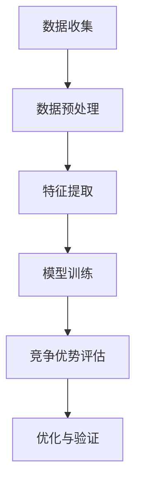
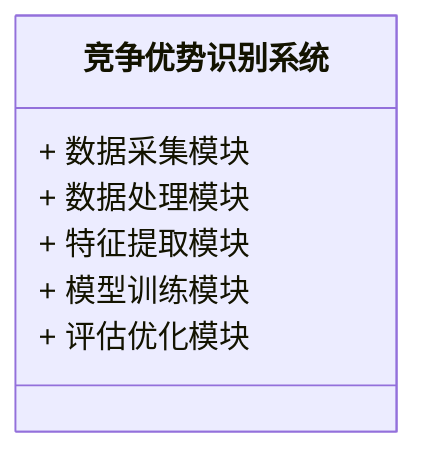
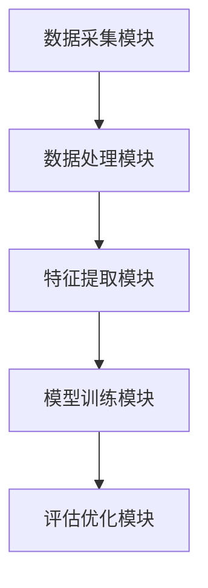

                 


# 如何识别企业的竞争优势

> 关键词：企业竞争优势、竞争优势识别、企业资源基础观、核心竞争力、价值链分析、数学模型、系统架构

> 摘要：本文详细探讨了如何识别企业的竞争优势，从背景与核心概念、算法原理、系统分析与架构设计、项目实战到最佳实践，系统地介绍了竞争优势识别的全过程。通过结合理论与实践，本文为读者提供了识别和利用企业竞争优势的深度分析和实用指导。

---

# 第一部分：企业竞争优势识别的背景与核心概念

## 第1章：企业竞争优势的背景与问题描述

### 1.1 什么是企业的竞争优势
#### 1.1.1 企业竞争优势的定义
企业的竞争优势是指企业在市场中相对于竞争对手所具有的独特优势，包括资源、能力、品牌、技术、成本结构等。竞争优势能够使企业在市场中获得更高的市场份额、客户满意度和利润率。

#### 1.1.2 竞争优势的核心要素
竞争优势的核心要素包括：
1. **资源**：企业的财务资源、人力资源、技术资源、信息资源等。
2. **能力**：企业的研发能力、生产效率、创新能力等。
3. **品牌**：品牌的知名度、美誉度和客户忠诚度。
4. **成本结构**：企业的生产成本、运营成本和管理成本。
5. **客户关系**：客户满意度、客户忠诚度和客户保留率。

#### 1.1.3 竞争优势的边界与外延
竞争优势不仅限于企业内部资源，还包括外部环境因素，如市场需求、行业趋势、政策法规等。竞争优势的外延包括企业的生态系统，如供应链、合作伙伴、客户网络等。

### 1.2 企业竞争优势的重要性
#### 1.2.1 竞争优势对企业生存与发展的意义
竞争优势是企业生存和发展的关键因素。竞争优势能够使企业更好地应对市场变化，抓住市场机会，抵御竞争对手的威胁。

#### 1.2.2 竞争优势在不同行业中的表现
不同行业中的竞争优势表现不同。例如，制造业的竞争优势可能体现在生产效率和成本控制，而科技行业则可能体现在技术创新和研发能力。

#### 1.2.3 竞争优势的动态变化与可持续性
竞争优势并非一成不变，随着市场环境的变化，竞争优势也会随之调整。企业需要持续关注市场变化，及时调整战略，保持竞争优势的可持续性。

### 1.3 竞争优势识别的挑战与机遇
#### 1.3.1 竞争优势识别的常见问题
竞争优势识别的常见问题包括信息不完整、数据不足、竞争对手分析困难等。

#### 1.3.2 技术进步对企业竞争优势识别的影响
技术进步为企业竞争优势识别提供了新的工具和方法，如大数据分析、人工智能等。

#### 1.3.3 数据驱动竞争优势识别的潜力
通过数据驱动的方法，企业可以更准确地识别竞争优势，优化资源配置，提高竞争优势的可持续性。

### 1.4 本章小结
本章从背景与问题描述的角度，介绍了企业竞争优势的定义、核心要素、边界与外延，以及竞争优势识别的挑战与机遇。竞争优势是企业在市场中生存和发展的关键，识别竞争优势需要结合内部资源与外部环境。

---

## 第2章：竞争优势识别的核心概念与联系

### 2.1 核心概念原理
#### 2.1.1 企业资源基础观（RBV）模型
企业资源基础观（Resource-Based View, RBV）模型认为，企业的竞争优势来源于内部资源的配置和利用。企业应通过优化资源配置，增强核心竞争力。

#### 2.1.2 核心竞争力理论
核心竞争力理论认为，企业的竞争优势来源于其独特的核心能力，这种能力是竞争对手难以模仿的。核心竞争力包括技术、知识、管理等方面。

#### 2.1.3 价值链分析模型
价值链分析模型将企业看作一个价值创造的过程，通过优化价值链的各个环节，提升企业的竞争优势。

### 2.2 核心概念属性特征对比
#### 2.2.1 竞争优势与核心竞争力的对比分析
竞争优势是企业整体的能力，而核心竞争力是企业竞争优势的核心部分。竞争优势可以是暂时的，而核心竞争力是持久的。

#### 2.2.2 企业资源与竞争优势的关系
企业资源是竞争优势的来源，竞争优势是企业资源的外在表现。企业应通过优化资源配置，提升竞争优势。

#### 2.2.3 价值链与竞争优势的关联
价值链分析模型帮助企业识别竞争优势的关键环节，优化资源配置，提升整体竞争优势。

### 2.3 ER实体关系图
以下是竞争优势识别的ER实体关系图：

```mermaid
er
    actor 企业 {
        [资源]
        [能力]
        [品牌]
    }
    actor 竞争环境 {
        [竞争对手]
        [客户]
        [供应商]
    }
    竞争优势 --> 资源
    竞争优势 --> 能力
    竞争优势 --> 品牌
    竞争优势 --> 竞争环境
```

### 2.4 本章小结
本章从核心概念与联系的角度，介绍了企业资源基础观（RBV）模型、核心竞争力理论和价值链分析模型，并通过ER实体关系图展示了竞争优势识别的核心概念之间的关系。

---

## 第3章：竞争优势识别的算法原理与数学模型

### 3.1 竞争优势识别的算法流程
以下是竞争优势识别的算法流程图：



### 3.2 数学模型与公式
#### 3.2.1 竞争优势评分模型
$$ \text{竞争优势评分} = \sum_{i=1}^{n} w_i x_i $$
其中，$w_i$ 是第 $i$ 个特征的权重，$x_i$ 是第 $i$ 个特征的值。

#### 3.2.2 竞争优势预测模型
$$ P = \beta_0 + \beta_1 X_1 + \beta_2 X_2 + \dots + \beta_k X_k $$
其中，$P$ 是竞争优势预测值，$\beta_i$ 是回归系数，$X_i$ 是自变量。

### 3.3 本章小结
本章从算法原理与数学模型的角度，介绍了竞争优势识别的算法流程，包括数据收集、预处理、特征提取、模型训练和评估优化，并给出了竞争优势评分模型和预测模型的公式。

---

## 第4章：系统分析与架构设计

### 4.1 问题场景介绍
竞争优势识别系统需要解决的问题包括数据收集、特征提取、模型训练和评估优化。

### 4.2 系统功能设计
以下是竞争优势识别系统的功能模块：



### 4.3 系统架构设计
以下是竞争优势识别系统的架构图：



### 4.4 系统接口设计
竞争优势识别系统的接口包括数据输入接口、模型训练接口和结果输出接口。

### 4.5 本章小结
本章从系统分析与架构设计的角度，介绍了竞争优势识别系统的功能模块、架构设计和接口设计。

---

## 第5章：项目实战

### 5.1 环境安装
以下是竞争优势识别系统的环境安装步骤：

1. 安装Python和相关库（如NumPy、Pandas、Scikit-learn）。
2. 安装Jupyter Notebook用于数据分析和可视化。

### 5.2 核心代码实现
以下是竞争优势评分模型的Python代码：

```python
import numpy as np
import pandas as pd

# 数据预处理
data = pd.read_csv('data.csv')
X = data.drop('label', axis=1)
y = data['label']

# 特征提取
from sklearn.feature_selection import SelectKBest
selector = SelectKBest(k=5)
selector.fit(X, y)
X_selected = selector.transform(X)

# 模型训练
from sklearn.linear_model import LinearRegression
model = LinearRegression()
model.fit(X_selected, y)

# 竞争优势评分
def calculate_competitive_advantage(company_data):
    X_company = selector.transform(company_data)
    prediction = model.predict(X_company)
    return prediction[0]

# 示例数据
company_data = pd.DataFrame({
    'feature1': [0.5],
    'feature2': [0.7],
    'feature3': [0.6],
    'feature4': [0.8],
    'feature5': [0.9]
})

# 计算竞争优势评分
score = calculate_competitive_advantage(company_data)
print("竞争优势评分：", score)
```

### 5.3 案例分析
以一家制造企业为例，分析其竞争优势。通过数据收集、特征提取和模型训练，得出该企业的竞争优势评分，并提出优化建议。

### 5.4 项目小结
本章通过项目实战，详细讲解了竞争优势识别系统的环境安装、核心代码实现、案例分析和项目小结。

---

## 第6章：最佳实践与注意事项

### 6.1 最佳实践
1. **持续监测竞争优势**：定期收集数据，更新模型，确保竞争优势的持续性。
2. **关注行业趋势**：及时了解行业动态，调整竞争优势识别策略。
3. **利用技术工具**：借助大数据分析和人工智能技术，提高竞争优势识别的效率和准确性。

### 6.2 注意事项
1. **数据隐私与安全**：确保竞争优势识别过程中数据的安全性。
2. **模型优化**：定期优化模型，提高竞争优势识别的准确性。
3. **团队协作**：竞争优势识别需要跨部门协作，确保信息的准确传递。

### 6.3 拓展阅读
推荐阅读《竞争优势：企业战略管理》和《资源基础观：企业竞争优势的理论与实践》。

### 6.4 本章小结
本章从最佳实践与注意事项的角度，提出了竞争优势识别的最佳实践，包括持续监测、关注行业趋势和利用技术工具，并给出了注意事项和拓展阅读内容。

---

## 作者：AI天才研究院/AI Genius Institute & 禅与计算机程序设计艺术/Zen And The Art of Computer Programming

---

**本文总结**：通过系统的分析与实践，本文详细介绍了如何识别企业的竞争优势，包括背景与核心概念、算法原理与数学模型、系统分析与架构设计、项目实战和最佳实践。希望本文能够为读者提供识别和利用企业竞争优势的深度分析和实用指导。

