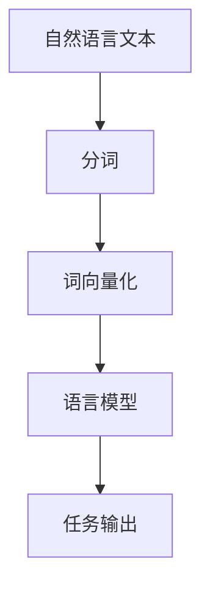
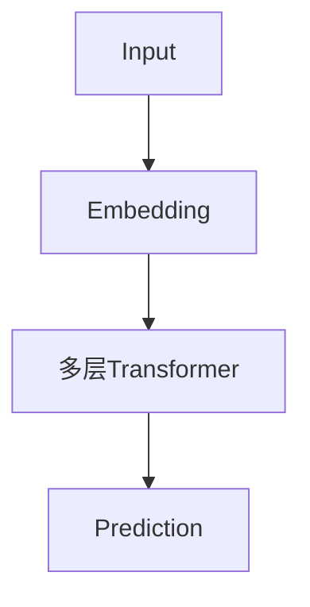
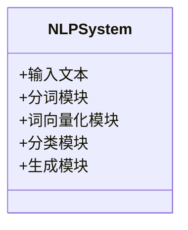
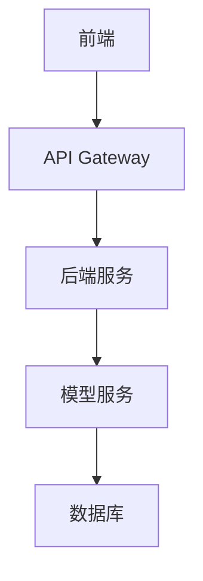
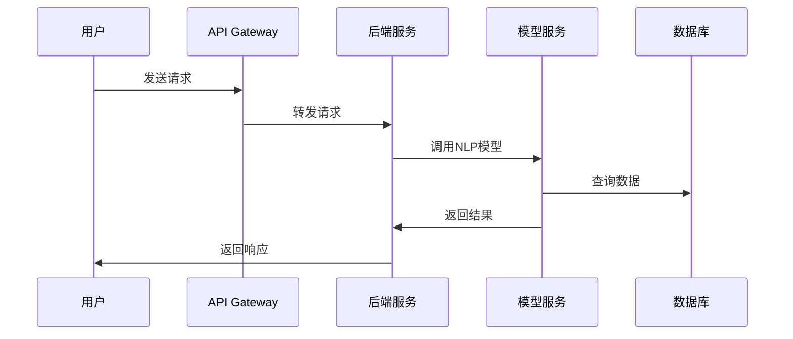

                 


# 如何识别企业的自然语言处理优势

> 关键词：自然语言处理、企业优势、技术分析、模型应用、行业洞察

> 摘要：本文将详细分析如何识别企业在自然语言处理（NLP）方面的优势，涵盖从NLP基础概念到企业应用场景的各个方面，结合实际案例和技术实现，帮助读者理解并应用这些优势。

---

# 第一部分: 自然语言处理（NLP）基础与企业应用背景

## 第1章: 自然语言处理（NLP）概述

### 1.1 自然语言处理的定义与核心概念

#### 1.1.1 自然语言处理的定义
自然语言处理（Natural Language Processing, NLP）是计算机科学与人工智能领域中的一个重要分支，旨在研究如何让计算机能够理解、生成和处理人类的自然语言。NLP的目标是让计算机能够像人类一样理解和处理文本，从而实现人机交互、信息提取、文本生成等任务。

#### 1.1.2 NLP的核心概念与关键术语
在NLP中，有一些核心概念和术语需要了解，例如：
- **分词（Tokenization）**：将连续的文本分割成单词、短语或符号的过程。
- **句法分析（Syntactic Analysis）**：分析文本的语法结构，识别句子中的主语、谓语等成分。
- **语义分析（Semantic Analysis）**：理解文本的语义含义，提取文本中的实体、关系和事件。
- **文本分类（Text Classification）**：将文本按照预定义的类别进行分类，例如情感分析、垃圾邮件检测等。
- **生成任务（Generation Task）**：根据输入生成相应的文本，例如机器翻译、文本摘要等。

#### 1.1.3 NLP的三大核心任务
NLP的核心任务可以分为三类：
1. **文本理解（Text Understanding）**：包括文本分类、信息提取、问答系统等任务，旨在理解文本的含义。
2. **文本生成（Text Generation）**：包括机器翻译、文本摘要、对话生成等任务，旨在生成符合语义的文本。
3. **文本交互（Text Interaction）**：包括对话系统、智能助手等任务，旨在实现人机交互。

### 1.2 自然语言处理的历史与发展

#### 1.2.1 NLP的起源与早期发展
NLP的起源可以追溯到20世纪50年代，当时的研究主要集中在基于规则的NLP系统上。例如，早期的聊天机器人ELIZA就是基于简单的规则实现的。

#### 1.2.2 现代NLP技术的崛起
随着计算能力的提升和大数据的兴起，深度学习技术在NLP领域取得了突破性进展。2018年，Transformer模型的提出标志着NLP进入了一个新的发展阶段。预训练模型如BERT、GPT等的出现，使得NLP技术更加通用和强大。

#### 1.2.3 当前NLP技术的前沿领域
当前，NLP的前沿领域包括：
- **多模态NLP**：结合视觉、听觉等多模态信息进行处理。
- **小样本学习**：在数据量有限的情况下，依然能够实现高效的NLP任务。
- **可解释性NLP**：提高模型的可解释性，使其在实际应用中更加可信。

### 1.3 自然语言处理在企业中的应用价值

#### 1.3.1 企业级NLP应用的潜力
在企业中，NLP技术可以应用于多个领域，例如：
- **客户情感分析**：通过分析客户评论，帮助企业了解客户满意度。
- **智能客服**：利用NLP技术实现自动化的客服响应。
- **文档管理**：对大量文档进行自动分类和信息提取。

#### 1.3.2 NLP对企业竞争优势的影响
NLP技术可以帮助企业提高效率、降低成本，并增强客户体验。例如，通过自动化的信息提取和分析，企业可以更快地做出决策。

#### 1.3.3 企业NLP应用的常见场景
企业中常见的NLP应用场景包括：
- **文本分类**：将客户反馈分为正面、负面或中性。
- **实体识别**：从合同中提取公司名称、金额等关键信息。
- **问答系统**：为企业内部提供知识库支持。

---

## 第2章: 企业NLP优势识别的核心概念

### 2.1 自然语言处理的核心原理

#### 2.1.1 语言模型的构建原理
语言模型的核心目标是计算一个给定文本序列的概率。常用的语言模型包括n-gram模型和Transformer模型。

#### 2.1.2 预训练模型的迁移学习机制
预训练模型（如BERT、GPT）通过在大规模通用数据上进行预训练，然后通过迁移学习适应特定任务。这种方法可以显著提高模型的性能，尤其是在数据量有限的情况下。

#### 2.1.3 NLP任务的特征提取方法
特征提取是NLP中的关键步骤，常用的特征包括词袋模型、TF-IDF、词嵌入（如Word2Vec）等。

### 2.2 企业NLP优势识别的关键技术

#### 2.2.1 文本分类与情感分析
文本分类是将文本分为预定义类别的任务，情感分析是判断文本的情感倾向（如正面、负面、中性）。

#### 2.2.2 实体识别与关系抽取
实体识别（NER）是识别文本中的命名实体（如人名、地名、组织名等），关系抽取是识别实体之间的关系。

#### 2.2.3 语义理解与生成模型
语义理解是理解文本的深层含义，生成模型（如GPT）可以生成连贯的文本。

### 2.3 核心概念对比分析

#### 2.3.1 不同NLP模型的特征对比（表格）
| 模型     | 输入形式 | 输出形式 | 主要特点                     |
|----------|----------|----------|-----------------------------|
| BERT     | 文本序列 | 概率分布 | 预训练于掩码填充任务         |
| GPT      | 文本序列 | 文本序列 | 基于自回归的生成模型         |
| TF-IDF   | 文本     | 向量     | 基于词频-逆文档频率的特征提取 |

#### 2.3.2 NLP任务的实体关系图（Mermaid流程图）


---

## 第3章: 自然语言处理的数学模型与算法原理

### 3.1 NLP任务的数学模型

#### 3.1.1 词嵌入模型（Word Embedding）
词嵌入模型（如Word2Vec）通过将词映射到高维向量空间，捕捉词语之间的语义关系。

#### 3.1.2 语言模型的概率计算
语言模型的目标是计算一个给定文本序列的概率，常用的模型包括n-gram和Transformer模型。

#### 3.1.3 注意力机制（Attention）
注意力机制通过计算输入序列中每个位置的重要性，从而提高模型的语义理解能力。

### 3.2 常见NLP算法的实现原理

#### 3.2.1 BERT模型的架构解析（Mermaid流程图）


#### 3.2.2 GPT模型的生成机制
GPT模型通过自回归的方式生成文本，每个位置的生成概率基于前面已生成的文本。

#### 3.2.3 TF-IDF的文本特征提取方法
TF-IDF（Term Frequency-Inverse Document Frequency）是一种常用的文本特征提取方法，通过计算每个词的权重，反映其在文本中的重要性。

### 3.3 算法实现与代码示例

#### 3.3.1 词嵌入模型的Python实现
```python
from gensim.models import Word2Vec
sentences = ["apple is a fruit", "banana is a fruit"]
model = Word2Vec(sentences, vector_size=100, window=2, min_count=1, workers=2)
vector = model.wv['apple']
```

#### 3.3.2 注意力机制的数学公式推导
注意力机制的计算公式如下：
$$
\alpha_{i,j} = \frac{\exp(s_{i,j})}{\sum_{k} \exp(s_{i,k})}
$$
其中，$s_{i,j}$是查询与候选键的相似度分数。

#### 3.3.3 情感分析任务的代码实现
```python
from sklearn.feature_extraction.text import TfidfVectorizer
from sklearn.svm import SVC
vectorizer = TfidfVectorizer()
model = SVC()
model.fit(vectorizer.fit_transform(texts), labels)
```

---

## 第4章: 企业NLP系统分析与架构设计方案

### 4.1 企业NLP系统的功能设计

#### 4.1.1 问题场景介绍
假设我们正在设计一个智能客服系统，需要实现文本分类、实体识别和对话生成等功能。

#### 4.1.2 系统功能设计（领域模型Mermaid类图）


### 4.2 系统架构设计

#### 4.2.1 系统架构设计（Mermaid架构图）


#### 4.2.2 系统接口设计
系统接口设计包括API接口定义（如RESTful API）和数据格式规范（如JSON）。

#### 4.2.3 系统交互（Mermaid序列图）


---

## 第5章: 项目实战

### 5.1 环境安装

#### 5.1.1 Python安装
安装Python和必要的库：
```bash
pip install python3
pip install -r requirements.txt
```

### 5.2 系统核心实现源代码

#### 5.2.1 文本分类代码
```python
from sklearn.feature_extraction.text import TfidfVectorizer
from sklearn.svm import SVC
vectorizer = TfidfVectorizer()
model = SVC()
model.fit(vectorizer.fit_transform(train_texts), train_labels)
```

#### 5.2.2 实体识别代码
```python
from spacy.lang.zh import Chinese
nlp = Chinese()
doc = nlp("苹果是一家科技公司")
for ent in doc.ents:
    print(ent.text, ent.label_)
```

### 5.3 代码应用解读与分析

#### 5.3.1 代码解读
上述代码展示了如何使用TF-IDF和SVM进行文本分类，以及如何使用spaCy进行实体识别。

#### 5.3.2 实际案例分析
以智能客服系统为例，展示如何实现客户情感分析和自动响应生成。

### 5.4 项目小结

---

## 第6章: 最佳实践

### 6.1 小结
本文详细介绍了如何识别企业的自然语言处理优势，从基础概念到实际应用，帮助读者全面理解NLP技术。

### 6.2 注意事项
在实际应用中，需要注意数据质量、模型选择和可解释性等问题。

### 6.3 拓展阅读
推荐阅读以下书籍和论文：
- 《深度学习入门：基于Python的卷积神经网络和循环神经网络实战》
- “BERT: Pre-training of Deep Bidirectional Transformers for Natural Language Processing”

---

作者：AI天才研究院/AI Genius Institute & 禅与计算机程序设计艺术 /Zen And The Art of Computer Programming

---

以上就是《如何识别企业的自然语言处理优势》的完整目录和内容框架。希望这篇文章能为您提供清晰的思路和实际的指导，帮助您识别和利用企业的NLP优势。

