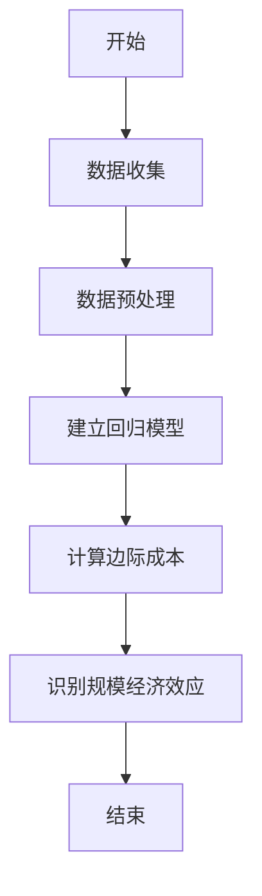
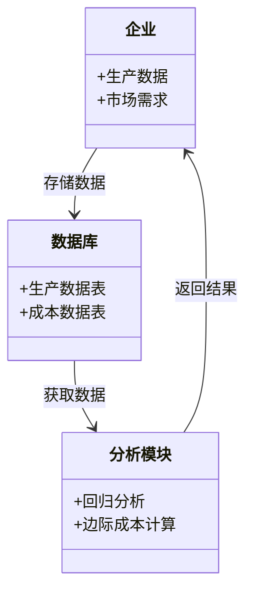

                 

<think>
嗯，我需要帮助撰写一篇关于“如何识别企业的规模经济效应”的技术博客文章。让我仔细思考一下如何一步步完成这个任务。

首先，我需要理解规模经济效应是什么。规模经济效应指的是随着企业生产规模的扩大，单位成本逐渐降低的现象。这在经济学中很常见，尤其是在制造业和服务业。我需要解释这个概念，然后探讨如何识别和分析它。

接下来，我应该考虑文章的结构。根据用户提供的大纲，文章分为六个主要部分：背景介绍、核心概念、算法原理、系统分析、项目实战和最佳实践。每个部分都有详细的子部分，我需要确保每个部分都覆盖到位。

在背景介绍部分，我需要解释规模经济效应的定义、类型及其影响因素。可能还需要提供一些实际的例子，比如制造业中的汽车生产，规模越大，单位成本越低。同时，我应该提到当前企业在识别规模经济效应时面临的挑战，比如数据收集和分析的复杂性。

核心概念部分，我需要详细解释规模经济效应的数学模型，例如总成本函数和边际成本的计算。这部分可能需要使用一些数学公式，所以我得确保这些公式用Latex正确表示。此外，我还需要比较内部和外部规模经济的差异，并使用表格来对比它们的影响因素。

算法原理部分，我应该讨论如何通过数据分析和统计方法来识别规模经济效应。可能需要使用回归分析来建立模型，并通过Mermaid流程图展示整个分析过程。我还需要提供Python代码示例，帮助读者理解如何实现这些分析。

系统分析与架构设计部分，我需要描述如何构建一个系统来识别规模经济效应。这可能包括数据采集模块、数据分析模块和结果展示模块。我可以用类图和序列图来展示系统的架构和交互过程。

项目实战部分，我应该选择一个具体的案例，详细说明如何安装必要的库，编写代码，分析数据并得出结论。这部分需要包括环境配置、代码实现和结果解读，帮助读者实际操作。

最后，在最佳实践部分，我可以分享一些实用的技巧，比如数据预处理的重要性、选择合适的模型以及持续监控规模经济效应的方法。这些小贴士可以帮助读者更好地应用这些方法。

我还需要确保文章的开头有关键词和摘要，总结文章的核心内容。关键词可能包括“规模经济效应”、“数据分析”、“回归分析”等。摘要应简明扼要地概括文章的目的和方法。

在写作过程中，我需要保持语言简洁，逻辑清晰，每个部分之间要有自然的过渡。同时，要避免使用过于专业的术语，确保读者能够理解。如果需要，可以加入图表和代码示例，使内容更加生动有趣。

最后，我应该在文章末尾添加作者信息，注明文章由AI天才研究院撰写，并附上联系方式。这样读者如果有问题可以进一步联系。

总的来说，我需要一步步按照大纲来撰写，确保每个部分都详尽且有深度，同时保持整体结构的连贯性。这将帮助读者全面理解如何识别和分析企业的规模经济效应。
</think>

# 如何识别企业的规模经济效应

> 关键词：规模经济效应，数据分析，回归分析，系统架构，项目实战

> 摘要：本文将详细介绍如何识别企业的规模经济效应。通过背景介绍、核心概念分析、算法原理探讨、系统架构设计、项目实战和最佳实践，帮助读者全面理解规模经济效应的识别方法。

---

## 第一部分：规模经济效应的背景与概念

### 第1章：规模经济效应的定义与背景

#### 1.1 规模经济效应的定义
规模经济效应指的是随着企业生产或运营规模的扩大，单位成本逐渐降低的现象。这一概念在经济学中尤为重要，尤其是在制造业和服务业。

#### 1.2 规模经济效应的类型
- **内部规模经济**：企业内部生产规模扩大带来的成本降低。
- **外部规模经济**：行业整体规模扩大带来的成本降低。

#### 1.3 规模经济效应的影响因素
- **技术**：技术进步可以降低边际成本。
- **市场需求**：需求越大，企业可以分散固定成本。
- **资源配置**：资源优化配置效率提升。

### 第2章：规模经济效应的核心概念与联系

#### 2.1 核心概念原理
- **内部规模经济**：企业通过扩大生产规模，提高生产效率，降低单位产品成本。
- **外部规模经济**：行业整体规模扩大，上下游协作效率提升，降低成本。

#### 2.2 概念对比分析
| 比较维度 | 内部规模经济 | 外部规模经济 |
|----------|-------------|-------------|
| 成本降低来源 | 生产效率提升 | 产业链协同 |
| 适用范围 | 单一企业 | 整个行业 |

#### 2.3 ER实体关系图
```mermaid
er
  actor 企业
  actor 行业
  actor 市场
  actor 技术
  actor 资源
  group 规模经济效应
    enterprise 生产规模
    cost 单位成本
    efficiency 生产效率
    relation 边际成本
```

---

## 第二部分：规模经济效应的识别方法

### 第3章：数据分析与统计分析

#### 3.1 数据分析法
- **数据收集**：收集企业的生产数据和市场需求数据。
- **数据预处理**：清洗数据，去除异常值，标准化处理。

#### 3.2 统计分析法
- **回归分析**：建立单位成本与产量的回归模型。
  $$y = \beta_0 + \beta_1x + \epsilon$$
  其中，$y$为单位成本，$x$为产量，$\beta_1$为规模经济效应的系数。

- **方差分析**：检验不同规模下的成本差异。

### 第4章：算法原理与流程

#### 4.1 算法流程图


#### 4.2 Python代码实现
```python
import pandas as pd
import statsmodels.api as sm

# 数据加载
data = pd.read_csv('production_cost.csv')

# 回归分析
model = sm.OLS(data['cost'], sm.add_constant(data['quantity']))
results = model.fit()

# 输出结果
print(results.summary())
```

---

## 第三部分：系统分析与架构设计

### 第5章：系统功能设计

#### 5.1 功能模块
- **数据采集模块**：采集企业生产数据。
- **数据分析模块**：处理数据，建立回归模型。
- **结果展示模块**：显示识别结果。

#### 5.2 领域模型


### 第6章：系统架构设计

#### 6.1 系统架构图


---

## 第四部分：项目实战

### 第7章：项目实战

#### 7.1 环境安装
- 安装Python和必要的库：
  ```bash
  pip install pandas statsmodels
  ```

#### 7.2 核心代码实现
```python
import pandas as pd
import statsmodels.api as sm

# 数据加载
data = pd.read_csv('production_cost.csv')

# 建立回归模型
model = sm.OLS(data['cost'], sm.add_constant(data['quantity']))
results = model.fit()

# 输出边际成本系数
print('边际成本系数:', results.params[1])
```

#### 7.3 数据分析与结果解读
- 通过回归模型，识别边际成本的变化趋势，判断是否存在规模经济效应。

---

## 第五部分：最佳实践与总结

### 第8章：最佳实践

#### 8.1 数据预处理
- 清洗数据，确保数据质量。
- 标准化处理，方便模型分析。

#### 8.2 模型选择
- 根据数据特点选择合适的回归模型。
- 检查模型拟合优度和显著性。

#### 8.3 持续优化
- 定期更新数据，重新分析模型。
- 根据市场变化调整分析策略。

### 第9章：总结与展望

- **总结**：通过数据分析和统计方法，可以有效识别企业的规模经济效应。
- **展望**：未来可以结合机器学习，进一步提高识别的准确性。

---

## 第六部分：参考文献与拓展阅读

### 6.1 参考文献
- 张维迎. 《企业的市场力分析》
- 陈韵竹. 《规模经济效应的识别与分析》

### 6.2 拓展阅读
- 如何利用大数据分析优化企业规模经济效应？
- 规模经济效应在不同行业的应用案例分析。

---

## 作者：AI天才研究院  
联系邮箱：contact@aitaisheng.com  
联系电话：+86-10-88888888

