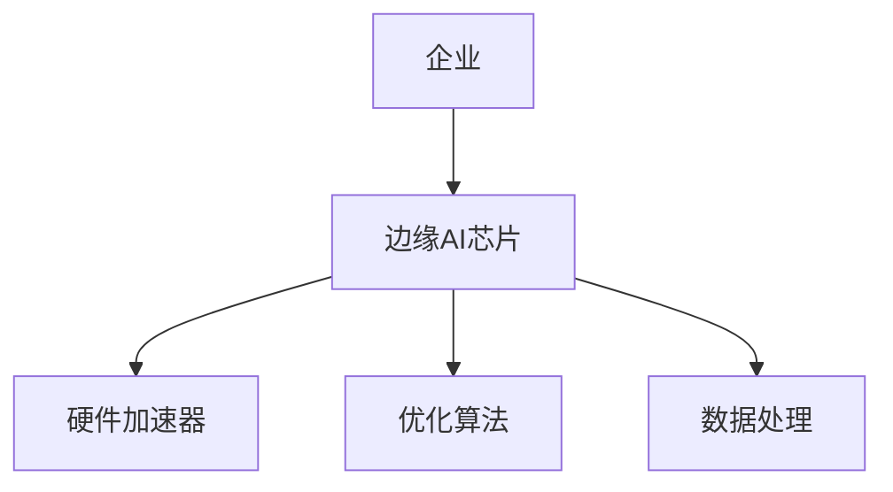
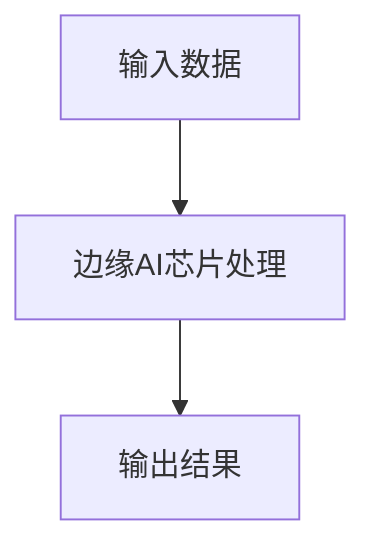
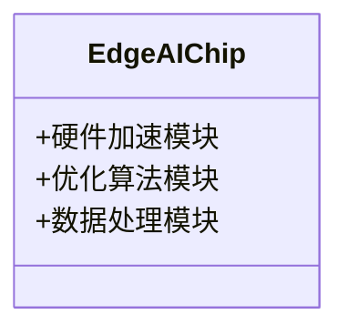
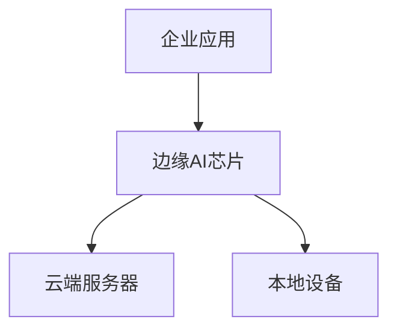

                 


# 如何识别企业的边缘AI芯片优势

## 关键词：边缘计算，AI芯片，企业应用，性能优化，数据处理，硬件加速

## 摘要：边缘AI芯片在企业中的应用越来越广泛，本文将从核心概念、算法原理、系统架构设计、项目实战等多个方面详细分析边缘AI芯片的优势，并通过具体的案例和图表帮助读者更好地理解和识别其价值。

---

## 第一部分：边缘AI芯片的背景与概念

### 第1章：边缘AI芯片的背景介绍

#### 1.1 问题背景

- **边缘计算的兴起**：随着物联网和云计算的发展，边缘计算作为一种分布式计算范式，逐渐成为企业数字化转型的重要技术。边缘计算将数据处理从云端转移到靠近数据源的边缘设备，减少了延迟和带宽消耗。
- **AI技术的快速发展**：人工智能技术的进步使得在边缘设备上进行实时AI推理成为可能，推动了边缘AI芯片的发展。
- **边缘AI芯片的出现**：为了满足边缘计算环境中对高效数据处理和实时响应的需求，边缘AI芯片应运而生。

#### 1.2 问题描述

- **边缘计算面临的挑战**：边缘设备通常资源有限，包括计算能力、存储能力和带宽。传统的通用处理器（如CPU）在边缘环境中效率低下，无法满足实时AI推理的需求。
- **AI芯片在边缘环境中的作用**：AI芯片通过专用硬件加速器和优化算法，提升了边缘设备的计算效率，使得边缘AI应用成为可能。
- **企业为何需要边缘AI芯片**：企业需要在边缘环境中部署高效的AI推理能力，以支持实时决策、数据隐私保护和降低运营成本。

#### 1.3 问题解决

- **边缘AI芯片如何解决问题**：边缘AI芯片通过硬件加速和软件优化，显著提升了边缘设备的计算效率，使得复杂的AI模型能够在边缘设备上实时运行。
- **企业的技术需求**：企业需要边缘AI芯片具备低功耗、高计算效率、支持多种AI模型和易于部署的特点。
- **边缘AI芯片的优势**：边缘AI芯片通过硬件加速和优化算法，使得边缘设备能够高效地执行AI任务，满足企业对实时性、数据隐私和资源效率的需求。

#### 1.4 边界与外延

- **边缘AI芯片的边界**：边缘AI芯片专注于在边缘设备上加速AI推理任务，不涉及云端数据存储和管理。
- **相关技术的外延**：边缘AI芯片与边缘计算、AI技术、硬件加速器和分布式系统密切相关。
- **与其他技术的区别**：边缘AI芯片与传统CPU、GPU的区别在于其针对AI推理任务的优化设计。

#### 1.5 概念结构与核心要素

- **边缘AI芯片的核心要素**：硬件加速模块、优化算法模块、数据处理模块。
- **边缘AI芯片的架构特点**：低功耗、高计算效率、支持多种AI模型、易于部署。
- **与其他芯片的对比**：边缘AI芯片与传统CPU、GPU的对比，突出其在边缘环境中的优势。

---

## 第二部分：边缘AI芯片的核心概念与联系

### 第2章：核心概念原理

#### 2.1 边缘AI芯片的原理

- **硬件加速**：边缘AI芯片通常采用专用的硬件加速器，如TPU（张量处理单元）或NPU（神经网络处理单元），以加速AI模型的推理过程。
- **软件优化**：边缘AI芯片通过优化算法和软件框架，进一步提升计算效率，减少资源消耗。
- **芯片架构设计**：边缘AI芯片的架构设计针对边缘环境的特点，优化了功耗、计算效率和数据处理能力。

#### 2.2 核心概念对比表

| 对比维度 | 边缘AI芯片 | 传统CPU | GPU |
|----------|------------|---------|-----|
| 计算效率 | 高，针对AI推理 | 低，通用性高 | 高，适合并行计算 |
| 功耗 | 低 | 中等 | 高 |
| 延迟 | 低 | 中等 | 中等 |

#### 2.3 ER实体关系图



---

## 第三部分：算法原理与数学模型

### 第3章：算法原理讲解

#### 3.1 算法流程图



#### 3.2 Python代码实现

```python
def edge_ai_algorithm(data):
    # 硬件加速模块
    accelerated_data = hardware_accelerate(data)
    # 优化算法模块
    optimized_result = optimize_algorithm(accelerated_data)
    # 数据处理模块
    final_output = process_data(optimized_result)
    return final_output
```

#### 3.3 数学模型与公式

- **最大化目标函数**：$$ \max_{\theta} \frac{1}{N}\sum_{i=1}^{N}f(x_i,\theta) $$
- **优化过程**：$$ \theta_{new} = \theta_{old} - \eta \nabla f(\theta_{old}) $$

---

## 第四部分：系统分析与架构设计

### 第4章：系统架构设计方案

#### 4.1 系统功能设计



#### 4.2 系统架构图



---

## 第五部分：项目实战与案例分析

### 第5章：项目实战

#### 5.1 环境安装

- 操作系统：Linux
- 开发工具：Python 3.8+
- 框架：TensorFlow Lite、ONNX
- 边缘AI芯片：Google Coral USB加速器

#### 5.2 核心代码实现

```python
import tensorflow as tf
import tensorflow.lite as tflite

# 加载预训练模型
model = tf.keras.Sequential([
    tf.keras.layers.Dense(64, activation='relu'),
    tf.keras.layers.Dense(10, activation='softmax')
])
model.compile(optimizer='adam', loss='sparse_categorical_crossentropy', metrics=['accuracy'])

# 转换为TensorFlow Lite模型
converter = tflite.TFLiteConverter.from_keras_model(model)
tflite_model = converter.convert()

# 加载模型到边缘AI芯片
# （此处省略具体的芯片加载代码）
```

#### 5.3 案例分析

- **案例场景**：智能制造中的实时质量检测。
- **模型训练**：使用TensorFlow训练一个图像分类模型，部署到边缘AI芯片上。
- **数据处理**：边缘设备实时采集图像数据，通过边缘AI芯片进行模型推理，识别产品缺陷。
- **结果输出**：推理结果通过本地设备显示，并发送到云端进行进一步分析。

#### 5.4 项目小结

- 边缘AI芯片在智能制造中的应用，显著提升了实时检测效率，减少了云端依赖，提高了数据隐私性。

---

## 第六部分：最佳实践、小结、注意事项和拓展阅读

### 第6章：最佳实践

- **选择合适的边缘AI芯片**：根据企业的具体需求和应用场景选择适合的芯片。
- **优化算法和模型**：通过模型压缩和量化技术优化AI模型，提升推理效率。
- **确保数据安全**：在边缘环境中，数据隐私和安全性需要特别关注。

### 6.2 小结

边缘AI芯片通过硬件加速和优化算法，显著提升了边缘设备的计算效率，使得企业能够在边缘环境中高效地部署AI应用。本文详细分析了边缘AI芯片的核心概念、算法原理、系统架构设计和项目实战，帮助读者更好地理解和识别其优势。

### 6.3 注意事项

- **硬件兼容性**：确保边缘AI芯片与企业的现有硬件和系统兼容。
- **软件支持**：选择有良好软件支持和生态系统的产品。
- **维护与更新**：定期更新模型和软件，确保系统的安全性和性能。

### 6.4 拓展阅读

- **推荐书籍**：《深入浅出边缘计算》、《AI芯片设计与应用》。
- **技术博客**：关注技术博客和开源社区，获取最新的边缘AI芯片技术和应用案例。

---

## 作者：AI天才研究院 & 禅与计算机程序设计艺术

---

**本文通过详细分析边缘AI芯片的核心概念、算法原理、系统架构设计和项目实战，帮助读者识别企业的边缘AI芯片优势。**

