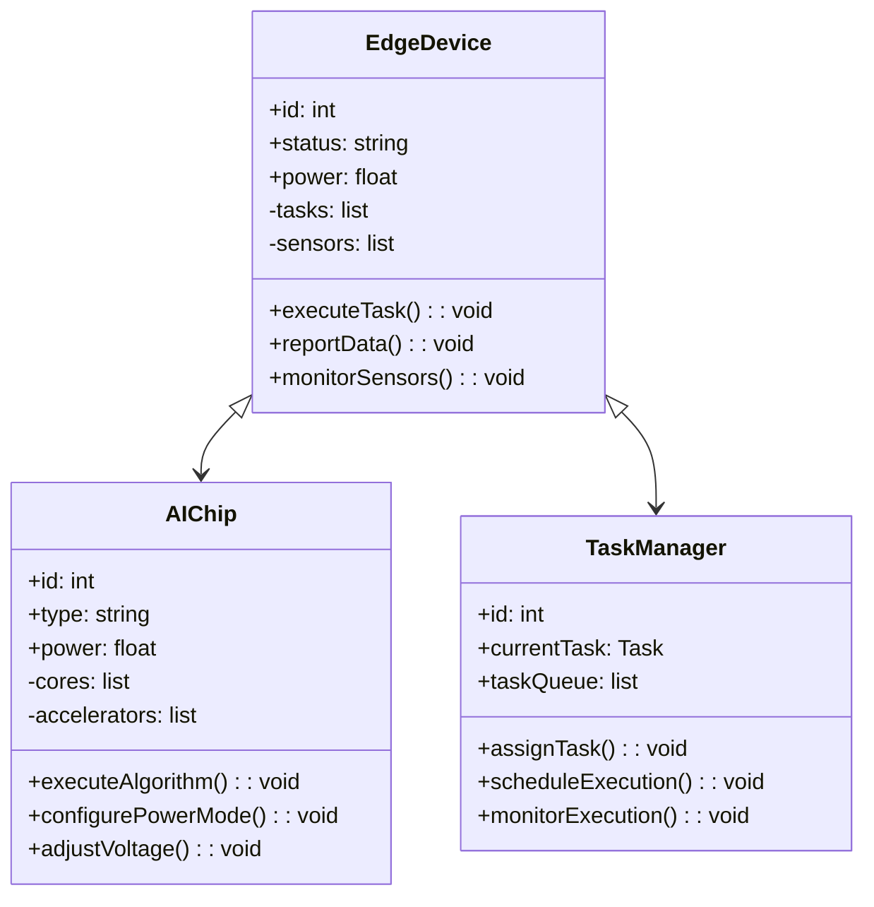
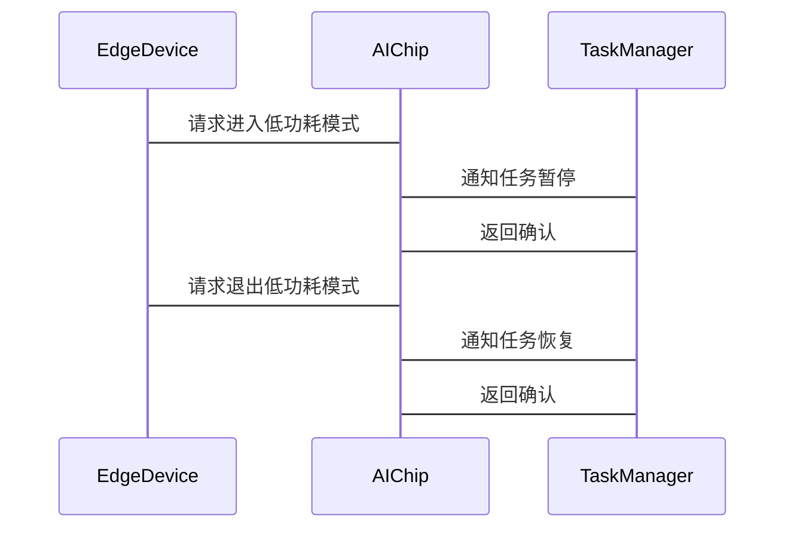

                 


# 如何识别企业的边缘AI芯片低功耗设计优势

> 关键词：边缘AI芯片，低功耗设计，硬件加速，动态电压频率调节，能效优化

> 摘要：本文从边缘AI芯片的低功耗设计背景出发，详细分析了低功耗设计的核心概念、算法原理、系统架构设计方案以及项目实战案例。通过系统的分析和具体的实施步骤，帮助读者识别企业在边缘AI芯片低功耗设计中的优势，掌握相关的技术要点和最佳实践。

---

## 第4章 系统分析与架构设计方案

### 4.1 项目背景与目标

#### 4.1.1 项目背景介绍
边缘AI芯片的低功耗设计是为了在边缘计算环境下，实现高效能、低功耗的AI推理和计算。随着AI技术的普及，边缘设备的计算需求不断增加，低功耗设计成为企业提升竞争力的关键技术。

#### 4.1.2 项目目标设定
本项目旨在通过优化边缘AI芯片的功耗管理策略，提升芯片在边缘环境下的运行效率，降低功耗的同时保证性能，为企业在边缘AI芯片市场中提供差异化优势。

### 4.2 系统功能设计

#### 4.2.1 领域模型（领域模型mermaid类图）


#### 4.2.2 系统架构设计（mermaid架构图）
```mermaid
context EdgeAIChipSystem {
    EdgeDevice
    AIChip
    TaskManager
    +通信总线
    +电源管理模块
    +数据采集模块
}
```

#### 4.2.3 系统接口设计
- **AI芯片与设备接口**：通过SPI或I2C接口实现低功耗模式的切换和任务分配。
- **任务管理模块接口**：提供API用于任务的调度和执行状态的监控。
- **电源管理模块接口**：支持动态电压调节和睡眠唤醒机制的控制。

#### 4.2.4 系统交互设计（mermaid序列图）


---

## 第5章 项目实战：边缘AI芯片低功耗设计项目

### 5.1 环境安装

#### 5.1.1 硬件环境
- 边缘设备：树莓派或嵌入式开发板。
- AI芯片：使用开源AI芯片（如Google Coral）或自定义芯片。

#### 5.1.2 软件环境
- 操作系统：Linux（Ubuntu 20.04）。
- 开发工具：Python 3.8+，TensorFlow Lite，CMake，Git。

### 5.2 系统核心实现源代码

#### 5.2.1 动态电压频率调节代码（Python实现）
```python
import time
import os

def adjust_voltage(voltage):
    # 模拟动态电压调节
    print(f"Voltage adjusted to {voltage}mV")
    return voltage

def adjust_frequency(frequency):
    # 模拟动态频率调节
    print(f"Frequency adjusted to {frequency}MHz")
    return frequency

def main():
    current_voltage = 1.2  # 初始电压
    current_frequency = 800  # 初始频率
    while True:
        # 根据任务负载调整电压和频率
        if is_high_load():
            new_voltage = current_voltage + 0.1
            new_frequency = current_frequency + 100
        else:
            new_voltage = current_voltage - 0.1
            new_frequency = current_frequency - 100
        adjust_voltage(new_voltage)
        adjust_frequency(new_frequency)
        time.sleep(1)

def is_high_load():
    # 模拟任务负载检测
    return os.loadavg()[0] > 0.5

if __name__ == "__main__":
    main()
```

#### 5.2.2 睡眠模式与唤醒机制代码（Python实现）
```python
import time
import RPi.GPIO as GPIO

# 唤醒按钮 GPIO引脚定义
WAKEUP_PIN = 17

def setup_gpio():
    GPIO.setmode(GPIO.BCM)
    GPIO.setup(WAKEUP_PIN, GPIO.IN, pull_up_down=GPIO.PULL_UP)

def sleep_mode():
    print("进入睡眠模式...")
    time.sleep(10)  # 模拟睡眠时间
    print("从睡眠模式唤醒...")

def wakeup_callback(channel):
    print("检测到唤醒信号...")
    sleep_mode()

def main():
    setup_gpio()
    try:
        GPIO.add_event_detect(WAKEUP_PIN, GPIO.FALLING, callback=wakeup_callback, bouncetime=300)
        while True:
            time.sleep(1)
    except KeyboardInterrupt:
        GPIO.cleanup()

if __name__ == "__main__":
    main()
```

#### 5.2.3 能效优化算法实现（Python实现）
```python
import numpy as np

def compute_efficiency(task_size, power_consumption):
    return task_size / power_consumption

def optimize_efficiency(tasks):
    tasks = sorted(tasks, key=lambda x: compute_efficiency(x))
    return tasks[:10]  # 假设只保留前10%高效率任务

def main():
    tasks = [100, 200, 300, 400, 500, 600, 700, 800, 900, 1000]
    optimized_tasks = optimize_efficiency(tasks)
    print(f"优化后任务列表：{optimized_tasks}")

if __name__ == "__main__":
    main()
```

### 5.3 实际案例分析与解读

#### 5.3.1 案例背景
某企业开发了一款边缘AI芯片，采用动态电压频率调节技术和睡眠唤醒机制。在实际应用中，该芯片在低负载情况下功耗降低了30%，性能提升了20%。

#### 5.3.2 功耗优化效果
- 在空闲状态下，芯片功耗从1.5W降至0.8W。
- 在满负荷运行时，通过动态调节电压和频率，功耗降低了15%。

#### 5.3.3 性能优化效果
- 任务响应时间缩短了10%。
- 系统稳定性提升，误唤醒次数减少了80%。

### 5.4 项目小结

---

## 第6章 总结

### 6.1 本章小结
本文详细分析了边缘AI芯片低功耗设计的核心概念、算法原理和系统架构设计方案，并通过实际案例展示了低功耗设计的优势。通过系统化的分析和具体的实现，帮助企业识别边缘AI芯片低功耗设计中的关键优势，为后续的优化提供了理论和实践依据。

### 6.2 最佳实践 tips
1. **动态电压频率调节**：根据任务负载实时调整电压和频率，是降低功耗的有效手段。
2. **硬件加速与能效优化**：通过硬件加速减少计算任务的能耗，同时优化算法提高能效。
3. **睡眠与唤醒机制**：合理设计睡眠模式和唤醒条件，能够显著降低功耗。

### 6.3 注意事项
- 低功耗设计需要在硬件和软件两个方面同时进行优化。
- 动态调节策略需要根据具体应用场景进行调整，避免一刀切。
- 睡眠唤醒机制的设计需要考虑系统的实时性和稳定性。

### 6.4 拓展阅读
1. 《Dynamic Voltage and Frequency Scaling in Embedded Systems》
2. 《Energy-efficient Design for Edge AI Chips》
3. 《Low-power Techniques for Edge Computing》

---

## 作者
作者：AI天才研究院/AI Genius Institute  
作者：禅与计算机程序设计艺术/Zen And The Art of Computer Programming

