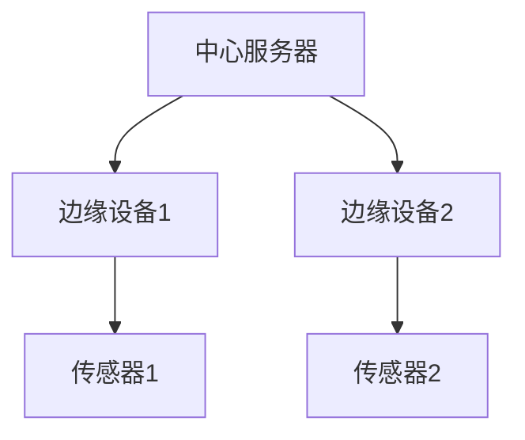

                 


# 如何识别企业的边缘计算5G优化优势

> 关键词：边缘计算，5G优化，企业优势，数据处理，通信协议

> 摘要：本文详细探讨了边缘计算与5G技术在企业中的结合与优化，分析了边缘计算的基本概念、技术原理、系统架构，并通过实际案例展示了如何在企业中识别和应用边缘计算5G优化的优势。文章还提供了相关的数学模型和算法流程图，帮助读者更好地理解技术细节。

---

## 第一部分: 边缘计算与5G优化的背景与概念

### 第1章: 边缘计算与5G技术概述

#### 1.1 边缘计算的基本概念

边缘计算（Edge Computing）是一种分布式计算范式，将计算能力从中心服务器迁移到数据生成的位置（如传感器、智能设备等），以减少延迟、带宽消耗和数据传输成本。边缘计算的核心优势在于实时处理数据，避免了将大量数据传输到云端的延迟和成本。

**边缘计算的关键特性：**

- **低延迟**：数据在靠近数据源的地方进行处理，减少了数据传输到云端的时间。
- **高带宽**：通过分布式计算，降低了对中心服务器的依赖，提高了网络带宽的利用率。
- **隐私与安全**：边缘计算可以在本地处理敏感数据，减少了数据传输过程中的隐私泄露风险。

**边缘计算与5G的结合优势：**

5G技术提供了高速、低延迟和大带宽的通信能力，与边缘计算的分布式计算能力结合，可以在企业中实现更高效的资源利用和更优的数据处理效率。

---

#### 1.2 企业边缘计算的应用场景

边缘计算在企业中的应用场景广泛，以下是几个典型场景：

1. **工业自动化**：通过边缘计算实时处理设备数据，实现设备的智能化控制和预测性维护。
2. **智慧城市**：在交通、能源等领域，边缘计算可以实时处理传感器数据，优化资源配置。
3. **企业数据优化**：通过边缘计算，企业可以在本地处理大量数据，减少对云端的依赖，提高数据处理效率。

---

#### 1.3 边缘计算与5G优化的核心优势

边缘计算与5G技术的结合，为企业带来了以下优势：

1. **低延迟与高带宽**：5G的低延迟和高带宽特性，使得边缘计算能够实时处理数据，满足企业对快速响应的需求。
2. **数据处理的实时性**：边缘计算可以在本地快速处理数据，避免了数据传输到云端的延迟。
3. **资源利用率的提升**：通过边缘计算与5G的结合，企业可以更高效地利用计算资源，降低运营成本。

---

## 第二部分: 边缘计算与5G优化的算法原理

### 第2章: 边缘计算中的数据处理算法

#### 2.1 边缘计算中的数据处理流程

数据处理流程是边缘计算的核心，以下是典型的处理流程：

1. **数据采集**：通过传感器或其他设备采集数据。
2. **数据预处理**：对数据进行清洗、压缩和加密，减少数据传输到云端的需求。
3. **数据分析**：在边缘设备上进行数据的实时分析，生成有用的信息。
4. **数据反馈**：将分析结果反馈给设备或系统，优化数据处理过程。

**数据处理流程的优化算法：**

- **数据压缩算法**：如哈夫曼编码，用于减少数据传输的带宽消耗。
- **数据加密算法**：如AES加密，用于保护数据的安全性。
- **数据分析算法**：如机器学习算法，用于实时数据分析和预测。

---

#### 2.2 边缘计算中的优化算法

边缘计算中的优化算法主要用于资源分配、负载均衡和动态调整等方面。以下是几个典型算法：

1. **资源分配算法**：基于边缘设备的资源利用率，动态分配计算任务。
2. **负载均衡算法**：通过负载均衡技术，确保边缘设备的计算资源得到合理分配。
3. **动态调整算法**：根据实时数据流量的变化，动态调整计算任务的分配策略。

---

## 第三部分: 边缘计算与5G优化的系统架构设计

### 第3章: 边缘计算与5G优化的系统架构

#### 3.1 边缘计算系统的功能模块设计

边缘计算系统的功能模块设计如下：

1. **数据采集模块**：负责采集传感器或其他设备的数据。
2. **数据处理模块**：对数据进行预处理、分析和反馈。
3. **通信模块**：负责与云端或其他边缘设备进行数据通信。
4. **资源管理模块**：对计算资源进行动态分配和管理。

**系统架构设计图：**



---

#### 3.2 5G优化中的边缘计算算法

5G优化中的边缘计算算法主要用于网络切片、信道编码优化和网络自适应优化等方面。以下是几个典型算法：

1. **网络切片技术**：通过网络切片，实现多个应用场景的独立网络资源分配。
2. **5G信道编码优化**：基于边缘计算的优化算法，提高5G信道编码效率。
3. **5G网络自适应优化**：根据实时网络状态，动态调整网络参数。

---

## 第四部分: 边缘计算与5G优化的项目实战

### 第4章: 边缘计算与5G优化的项目实战

#### 4.1 项目背景与目标

项目背景：某制造企业希望通过边缘计算与5G优化，实现生产设备的智能化控制和预测性维护。

项目目标：通过边缘计算实时处理设备数据，优化生产设备的运行效率。

---

#### 4.2 系统环境搭建

1. **硬件环境**：部署边缘计算设备（如树莓派）和5G通信模块。
2. **软件环境**：安装边缘计算框架（如Kafka）和5G通信协议栈。

---

#### 4.3 系统核心实现

以下是边缘计算与5G优化的核心实现代码示例：

```python
import socket
import struct

# 5G网络切片配置
def configure_slice(slice_id):
    # 配置网络切片参数
    pass

# 边缘计算数据处理
def process_data(data):
    # 数据预处理
    compressed_data = compress(data)
    # 数据分析
    result = analyze(compressed_data)
    return result

# 数据压缩函数
def compress(data):
    return data  # 示例代码，实际使用哈夫曼编码等算法

# 数据分析函数
def analyze(data):
    return data  # 示例代码，实际使用机器学习算法
```

---

#### 4.4 项目案例分析

通过边缘计算与5G优化，企业的生产设备实现了预测性维护，减少了设备故障率，提高了生产效率。

---

## 第五部分: 边缘计算与5G优化的最佳实践与总结

### 第5章: 边缘计算与5G优化的最佳实践

#### 5.1 小结

边缘计算与5G优化的结合，为企业带来了低延迟、高带宽和实时数据处理的优势。通过合理设计系统架构和优化算法，企业可以显著提升数据处理效率和资源利用率。

---

#### 5.2 注意事项

- **数据安全**：在边缘计算中，数据的安全性至关重要，需采用加密算法保护数据。
- **网络稳定性**：5G网络的稳定性直接影响边缘计算的性能，需确保网络的可靠性。
- **设备管理**：边缘设备的管理和维护是边缘计算成功实施的关键。

---

#### 5.3 未来趋势

随着5G技术的不断发展，边缘计算将在企业中发挥越来越重要的作用。未来，边缘计算与人工智能的结合，将进一步提升企业的智能化水平。

---

## 作者：AI天才研究院/AI Genius Institute & 禅与计算机程序设计艺术 /Zen And The Art of Computer Programming

