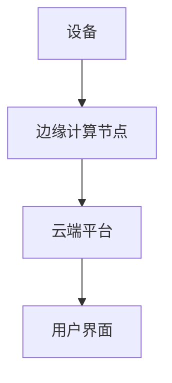
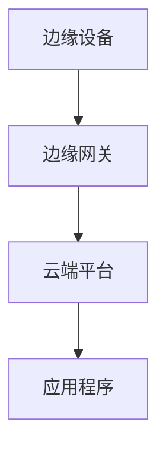
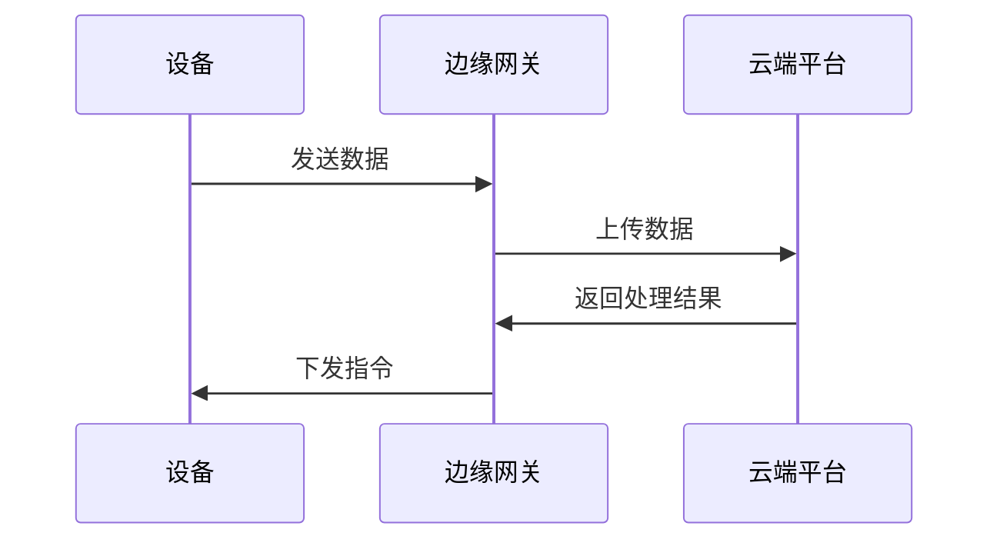

                 

<think>
好的，我现在需要撰写一篇关于“如何识别企业的边缘计算IoT平台优势”的技术博客文章。根据用户的要求，文章需要结构清晰、逻辑严谨，涵盖背景介绍、核心概念、算法原理、系统架构、项目实战以及最佳实践等方面。

首先，我会从背景介绍开始。边缘计算和物联网（IoT）是当前技术领域的热门话题，但很多企业可能还不清楚如何利用这些技术来提升自身的竞争力。我需要解释边缘计算和IoT的基本概念，以及它们在企业中的应用背景。

接下来是核心概念部分。这部分需要详细阐述边缘计算和IoT的核心原理，以及它们之间的联系。我可能会使用一些表格和Mermaid图来对比两者的优缺点，帮助读者更好地理解。

然后是算法原理部分。这里我需要选择一些关键的算法，比如数据处理算法和通信协议，用Mermaid流程图展示算法的执行步骤，并提供Python代码示例，以便读者能够实际操作和理解。

接下来是系统分析与架构设计。这部分需要介绍企业边缘计算IoT平台的系统架构，包括功能设计、架构图、接口设计和交互流程。使用Mermaid图来展示系统各个部分的组成和协作，使内容更加直观。

项目实战部分将包括环境安装、核心代码实现和案例分析。这部分需要详细说明如何在实际中部署和应用边缘计算IoT平台，提供具体的代码示例和应用解读，帮助读者掌握实际操作技能。

最后是最佳实践部分。这里我会总结前面的内容，提供一些实用的建议和注意事项，帮助读者在实际应用中避免常见问题，提升项目的成功率。同时，还会推荐一些拓展阅读材料，供读者进一步学习。

在撰写过程中，我会确保每一部分都涵盖必要的内容，同时保持整体结构的逻辑性和完整性。特别是要详细解释每个概念和技术，避免使用过于专业的术语，确保文章通俗易懂。此外，使用适当的代码示例和图表，可以帮助读者更好地理解和应用所学知识。

总之，我需要系统地分析和讲解边缘计算IoT平台的优势，帮助企业在数字化转型中找到合适的技术解决方案，提升竞争力。
</think>

# 如何识别企业的边缘计算IoT平台优势

## 关键词：边缘计算，物联网，IoT平台，企业优势，系统架构，算法原理，项目实战

## 摘要：  
随着企业数字化转型的推进，边缘计算和物联网（IoT）技术在企业中的应用日益广泛。本文将详细探讨如何识别企业的边缘计算IoT平台优势，包括核心概念、算法原理、系统架构设计、项目实战以及最佳实践等方面，帮助企业在数字化转型中更好地利用这些技术提升竞争力。

---

## 第1章: 边缘计算与IoT概述

### 1.1 边缘计算的定义与特点
#### 1.1.1 边缘计算的定义  
边缘计算是一种分布式计算范式，将计算能力从云端扩展到数据产生的边缘端，如传感器、设备或边缘服务器。其核心理念是减少数据传输延迟，提高实时处理能力。

#### 1.1.2 边缘计算的核心特点  
- **低延迟**：数据在边缘端实时处理，减少对云端的依赖。  
- **高实时性**：适用于需要快速响应的场景，如工业自动化、智能交通等。  
- **高可用性**：边缘设备具备本地计算能力，即使在网络断开时也能继续运行。  

#### 1.1.3 边缘计算与云计算的区别  
| 特性 | 边缘计算 | 云计算 |  
|------|----------|---------|  
| 数据处理 | 边缘端实时处理 | 云端集中处理 |  
| 延迟 | 低延迟 | 高延迟 |  
| 应用场景 | 工业自动化、智能设备 | 企业应用、数据存储 |  

### 1.2 物联网（IoT）的基本概念  
#### 1.2.1 物联网的定义  
物联网是指通过各种信息传感器、射频识别技术、全球定位系统、红外感应器等装置，按照约定的协议，把任何物品与互联网连接起来，进行信息交换和通信，以实现智能化识别、定位、跟踪、监控和管理。  

#### 1.2.2 物联网的核心组成部分  
1. **感知层**：包括传感器、RFID标签、摄像头等设备，用于采集数据。  
2. **网络层**：负责数据的传输，包括Wi-Fi、蓝牙、5G等通信技术。  
3. **应用层**：处理数据并提供服务，如智能监控、远程控制等。  

#### 1.2.3 物联网的应用场景  
- 智能家居  
- 智慧城市  
- 工业物联网（IIoT）  

### 1.3 企业边缘计算IoT平台的背景  
#### 1.3.1 企业数字化转型的背景  
随着企业对数据实时性、高效性要求的提高，传统的云计算模式逐渐暴露出延迟高、带宽占用大的问题。边缘计算作为一种补充技术，成为企业数字化转型的重要支撑。  

#### 1.3.2 边缘计算在企业中的应用趋势  
- **工业物联网**：实时监控生产线状态，减少停机时间。  
- **智能零售**：通过边缘设备实时分析顾客行为，优化服务体验。  
- **智慧城市**：边缘计算用于交通管理、环境监测等领域。  

#### 1.3.3 企业边缘计算IoT平台的优势  
- **降低延迟**：数据在边缘端实时处理，减少对云端的依赖。  
- **提高效率**：边缘设备能够快速响应，提升整体系统效率。  
- **降低成本**：通过边缘设备分担部分计算任务，降低云端资源消耗。  

---

## 第2章: 边缘计算与IoT的核心概念

### 2.1 边缘计算的关键技术
#### 2.1.1 边缘计算的计算模型  
边缘计算采用分布式计算模型，数据在边缘端进行处理，只有必要的数据才上传到云端。  

#### 2.1.2 边缘计算的数据处理机制  
- 数据采集：通过传感器或设备采集数据。  
- 数据过滤：在边缘端对数据进行初步筛选，减少无效数据的传输。  
- 数据分析：在边缘端进行实时分析，生成有用的信息。  

#### 2.1.3 边缘计算的通信协议  
常用的通信协议包括MQTT、HTTP、CoAP等，适用于不同的应用场景。  

### 2.2 IoT的核心技术
#### 2.2.1 IoT的感知层技术  
- **传感器技术**：用于采集环境数据，如温度、湿度等。  
- **RFID技术**：用于物品的标识和追踪。  

#### 2.2.2 IoT的网络层技术  
- **无线通信技术**：如Wi-Fi、蓝牙、5G等。  
- **网络管理技术**：包括网络配置、安全性管理等。  

#### 2.2.3 IoT的应用层技术  
- **数据存储技术**：如数据库管理、数据挖掘等。  
- **应用服务技术**：如远程监控、智能控制等。  

### 2.3 边缘计算与IoT的结合
#### 2.3.1 边缘计算与IoT的协同工作原理  
- 数据在边缘端采集、处理，然后上传到云端或直接作用于本地设备。  
- 云端负责数据分析、存储和决策支持。  

#### 2.3.2 边缘计算在IoT中的作用  
- 提高数据处理的实时性和响应速度。  
- 降低云端的计算负担，节省带宽成本。  

#### 2.3.3 边缘计算与IoT的优劣势对比  
| 特性 | 边缘计算优势 | IoT优势 |  
|------|---------------|----------|  
| 响应速度 | 实时性高 | 响应速度依赖网络 |  
| 成本 | 边缘设备分担计算任务，降低成本 | 云端成本较高 |  

---

## 第3章: 边缘计算IoT平台的核心优势

### 3.1 边缘计算IoT平台的优势
#### 3.1.1 低延迟优势  
边缘计算将数据处理从云端转移到边缘端，显著降低了数据传输的延迟。  

#### 3.1.2 高实时性优势  
边缘计算能够实时处理数据，适用于需要快速响应的场景，如工业自动化和智能交通。  

#### 3.1.3 高可用性优势  
边缘设备具备本地计算能力，即使在网络断开时也能继续运行，保证系统的高可用性。  

---

## 第4章: 边缘计算IoT平台的系统架构设计

### 4.1 系统功能设计
#### 4.1.1 领域模型设计  
- **设备管理**：包括设备的注册、配置和监控。  
- **数据采集**：从传感器或设备中采集数据。  
- **数据处理**：对采集的数据进行清洗、转换和分析。  
- **决策控制**：根据分析结果，进行相应的决策和控制。  

#### 4.1.2 系统架构图  


### 4.2 系统架构设计
#### 4.2.1 系统架构图  


#### 4.2.2 接口设计  
- **设备与边缘网关的接口**：如HTTP API、MQTT协议。  
- **边缘网关与云端的接口**：如RESTful API、Kafka消息队列。  

#### 4.2.3 交互流程  


---

## 第5章: 边缘计算IoT平台的项目实战

### 5.1 环境安装
#### 5.1.1 系统需求  
- 操作系统：Linux或Windows。  
- 硬件需求：支持边缘计算的设备，如树莓派、工业计算机。  
- 软件需求：安装边缘计算框架，如Kubernetes、Docker。  

#### 5.1.2 安装步骤  
1. 安装必要的软件包，如Docker、Kubernetes组件。  
2. 配置网络和通信协议。  
3. 部署边缘计算平台。  

### 5.2 核心代码实现
#### 5.2.1 数据采集代码  
```python
import serial

ser = serial.Serial('COM3', 9600)
data = ser.readline().decode()
print(data)
```

#### 5.2.2 数据处理代码  
```python
import pandas as pd

data_frame = pd.read_csv('data.csv')
filtered_data = data_frame[data_frame['status'] == 'active']
print(filtered_data)
```

#### 5.2.3 通信协议实现  
```python
import paho.mqtt.client as mqtt

client = mqtt.Client()
client.connect('localhost', 1883)
client.publish('topic', 'message')
client.disconnect()
```

### 5.3 案例分析  
以工业物联网为例，边缘计算平台可以实时监控生产线设备的状态，及时发现并解决问题，减少停机时间。  

---

## 第6章: 边缘计算IoT平台的最佳实践

### 6.1 总结
边缘计算IoT平台的优势在于其低延迟、高实时性和高可用性。企业可以通过部署边缘计算平台，提升数据处理效率，降低成本，并在数字化转型中获得竞争优势。

### 6.2 小结
本文详细探讨了边缘计算IoT平台的核心优势，包括低延迟、高实时性和高可用性，并通过系统架构设计和项目实战展示了如何在企业中实现这些优势。  

### 6.3 注意事项
- 在部署边缘计算平台时，需考虑设备的兼容性、网络的稳定性以及数据的安全性。  
- 定期维护和更新系统，确保平台的高效运行。  

### 6.4 拓展阅读
- 《边缘计算：原理与实践》  
- 《物联网技术与应用》  

---

## 作者：AI天才研究院/AI Genius Institute & 禅与计算机程序设计艺术 /Zen And The Art of Computer Programming

---

通过本文的详细讲解，读者可以全面了解边缘计算IoT平台的优势，并掌握如何在企业中识别和利用这些优势，为企业的数字化转型提供有力支持。

