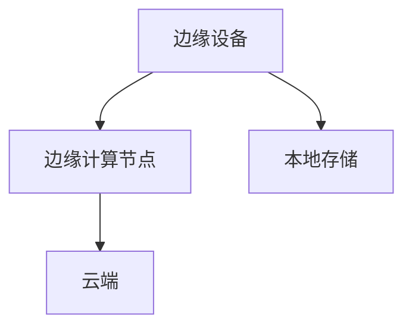
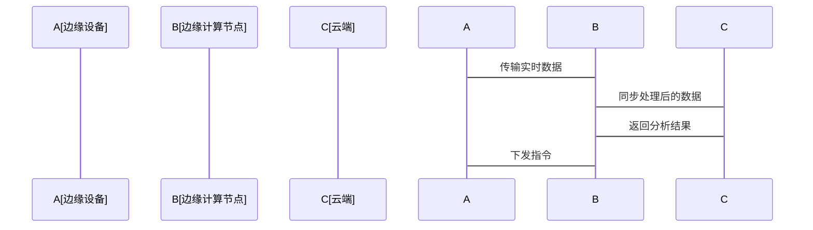

                 


# 如何识别企业的边缘计算优势

> 关键词：边缘计算、企业优势、数据处理、资源优化、安全性、实时性

> 摘要：边缘计算是一种分布式计算范式，通过在数据源附近处理和分析数据，以减少延迟、提高效率并增强安全性。本文将详细探讨如何识别和利用企业的边缘计算优势，涵盖边缘计算的基本概念、核心技术、系统架构及项目实战等方面，帮助企业在数字化转型中抓住机遇，提升竞争力。

---

## 第一部分：边缘计算基础与企业价值

### 第1章：边缘计算的基本概念与优势

#### 1.1 边缘计算的定义与背景

##### 1.1.1 从中心化计算到边缘计算的演变
中心化计算模式依赖于云端的数据处理，但随着物联网设备的普及和实时性需求的增加，边缘计算应运而生。边缘计算将数据处理从云端转移到靠近数据源的边缘设备，减少了延迟并提高了响应速度。

##### 1.1.2 边缘计算的核心概念与特点
- **分布性**：数据在边缘端处理，减少对云端的依赖。
- **实时性**：快速响应，适用于需要实时决策的场景。
- **隐私性**：在边缘处理数据可以减少数据传输过程中的隐私泄露风险。

##### 1.1.3 边缘计算在企业中的价值与优势
- **降低延迟**：边缘计算能够快速响应，适用于实时性要求高的场景。
- **减少带宽消耗**：通过在边缘处理数据，减少需要传输到云端的数据量。
- **增强安全性**：边缘设备可以在本地处理敏感数据，降低数据外泄风险。

#### 1.2 边缘计算与云计算的对比

##### 1.2.1 云计算的局限性与边缘计算的补充作用
云计算虽然强大，但在实时性、带宽和延迟方面存在不足。边缘计算作为补充，可以在靠近数据源的地方处理数据，提升整体效率。

##### 1.2.2 边缘计算的独特优势
- **实时性**：边缘计算能够实时处理数据，快速做出决策。
- **资源优化**：通过在边缘处理数据，可以减少对云端资源的依赖，降低成本。

##### 1.2.3 边缘计算与云计算的协同工作模式
边缘计算和云计算可以协同工作，边缘处理实时数据，云计算负责长期存储和分析，形成互补。

---

### 第2章：边缘计算的核心概念与原理

#### 2.1 边缘计算的体系结构

##### 2.1.1 边缘计算的分层架构
- **边缘设备层**：负责数据采集和初步处理。
- **边缘计算层**：进行数据处理、分析和存储。
- **云端层**：负责长期存储、大规模分析和决策。

##### 2.1.2 边缘节点的功能与角色
边缘节点包括传感器、网关和边缘服务器，负责数据的采集、处理和传输。

##### 2.1.3 边缘计算的通信机制
边缘计算通过本地网络进行通信，减少对公网的依赖，提升数据传输效率。

#### 2.2 边缘计算的关键技术

##### 2.2.1 边缘计算中的数据处理与分析
- **数据流处理**：实时处理数据流，减少延迟。
- **机器学习与AI**：在边缘设备上部署机器学习模型，进行实时预测和决策。

##### 2.2.2 边缘计算的安全与隐私保护
- **数据加密**：对数据进行加密处理，确保传输和存储的安全性。
- **隐私保护**：采用差分隐私等技术，保护数据隐私。

##### 2.2.3 边缘计算的资源管理与优化
- **资源分配策略**：根据负载动态分配资源，提高效率。
- **能耗优化**：通过低功耗设计和能效优化，降低能源消耗。

#### 2.3 边缘计算在企业中的应用场景

##### 2.3.1 制造业中的边缘计算
- **智能工厂**：实时监控生产线，快速响应异常情况。
- **工业物联网**：通过边缘计算优化设备维护和生产流程。

##### 2.3.2 零售业中的边缘计算
- **智能门店**：实时分析客户行为，优化营销策略。
- **供应链管理**：通过边缘计算优化库存管理和物流流程。

##### 2.3.3 其他行业的边缘计算应用
- **医疗健康**：实时监测患者数据，辅助诊断决策。
- **金融领域**：实时 fraud detection 和风险评估。
- **交通物流**：实时监控交通状况，优化路线规划。

---

## 第二部分：边缘计算的核心技术与算法

### 第3章：边缘计算中的数据处理与分析

#### 3.1 边缘计算中的数据流处理

##### 3.1.1 数据流的实时处理与分析
使用流处理框架（如 Apache Flink）在边缘设备上实时处理数据流，减少延迟。

##### 3.1.2 边缘计算中的数据压缩与优化
通过数据压缩算法（如 gzip）减少数据传输量，提升网络效率。

##### 3.1.3 边缘计算中的数据隐私保护
采用数据加密和匿名化处理，确保数据在传输和存储过程中的安全性。

#### 3.2 边缘计算中的机器学习与AI

##### 3.2.1 边缘计算中的机器学习模型部署
在边缘设备上部署轻量级机器学习模型，进行实时预测和决策。

##### 3.2.2 边缘计算中的实时预测与决策
通过边缘计算快速做出决策，适用于自动驾驶、工业自动化等领域。

##### 3.2.3 边缘计算中的模型更新与优化
定期更新边缘设备上的模型，确保模型的准确性和适应性。

---

### 第4章：边缘计算中的安全与隐私保护

#### 4.1 边缘计算的安全挑战

##### 4.1.1 边缘设备的安全威胁
边缘设备可能面临物理攻击、网络攻击等安全威胁。

##### 4.1.2 边缘计算中的数据安全问题
数据在边缘设备上的存储和处理可能面临泄露风险。

##### 4.1.3 边缘计算中的身份认证与授权
通过强化身份认证和访问控制，确保只有授权设备和用户可以访问敏感数据。

#### 4.2 边缘计算中的隐私保护技术

##### 4.2.1 数据加密与隐私保护
使用加密算法对数据进行加密处理，防止数据被未授权访问。

##### 4.2.2 差分隐私在边缘计算中的应用
通过差分隐私技术，在数据处理过程中添加噪声，保护个体数据隐私。

##### 4.2.3 边缘计算中的匿名化处理
对数据进行匿名化处理，去除或模糊化敏感信息，降低隐私泄露风险。

---

### 第5章：边缘计算中的资源管理与优化

#### 5.1 边缘计算中的资源分配策略

##### 5.1.1 基于负载的资源分配
根据当前负载情况动态分配计算资源，确保系统高效运行。

##### 5.1.2 基于QoS的资源调度
通过QoS（服务质量）优化资源分配，确保关键任务的优先处理。

##### 5.1.3 边缘资源的动态扩展与收缩
根据需求动态调整资源，避免资源浪费。

#### 5.2 边缘计算中的能耗优化

##### 5.2.1 边缘设备的低功耗设计
通过低功耗硬件设计和优化算法，减少设备能耗。

##### 5.2.2 边缘计算中的能效优化算法
采用能效优化算法，提高计算效率，降低能源消耗。

##### 5.2.3 边缘计算中的绿色能源利用
使用太阳能、风能等绿色能源为边缘设备供电，减少碳排放。

---

## 第三部分：边缘计算的系统架构与设计

### 第6章：边缘计算的系统架构与设计

#### 6.1 系统架构设计

##### 6.1.1 问题场景介绍
边缘计算需要在多种场景下工作，如工业自动化、智能零售等。

##### 6.1.2 系统功能设计
- **数据采集**：采集实时数据并进行初步处理。
- **数据传输**：将处理后的数据传输到云端或其他边缘节点。
- **数据分析**：在边缘节点上进行数据分析和决策。

##### 6.1.3 系统架构图
以下是边缘计算系统的架构图：



##### 6.1.4 系统接口设计
- **边缘设备与边缘计算节点接口**：数据传输接口。
- **边缘计算节点与云端接口**：数据同步接口。

##### 6.1.5 系统交互序列图
以下是系统交互的序列图：



#### 6.2 项目实战

##### 6.2.1 环境安装
安装必要的软件和工具，如 Python、Docker、Kubernetes 等。

##### 6.2.2 核心代码实现
以下是边缘计算节点的代码示例：

```python
import os
from flask import Flask, request
import json

app = Flask(__name__)

@app.route('/process', methods=['POST'])
def process_data():
    data = request.json
    # 处理数据
    result = {'status': 'success', 'message': 'Data processed'}
    return json.dumps(result)

if __name__ == '__main__':
    app.run(host='0.0.0.0', port=5000)
```

##### 6.2.3 案例分析
以制造业为例，边缘计算可以实时监控生产线，快速响应异常情况，减少停机时间。

##### 6.2.4 项目小结
通过项目实战，可以更好地理解边缘计算的实现和应用。

---

## 第四部分：最佳实践与总结

### 第7章：最佳实践与总结

#### 7.1 关键点总结
- **实时性**：边缘计算能够快速响应，适用于实时性要求高的场景。
- **资源优化**：通过边缘计算优化资源使用，降低成本。
- **安全性**：边缘计算需要加强安全措施，保护数据隐私。

#### 7.2 小结
边缘计算作为分布式计算的重要组成部分，能够为企业带来诸多优势，如降低延迟、优化资源利用和增强安全性。

#### 7.3 注意事项
- **数据一致性**：边缘计算需要考虑数据一致性问题，避免数据冲突。
- **设备管理**：边缘设备的管理复杂度较高，需要制定有效的管理策略。

#### 7.4 拓展阅读
建议阅读《边缘计算：架构与应用》和《分布式系统：概念与设计》等书籍，深入了解边缘计算的技术细节和应用场景。

---

# 作者：AI天才研究院/AI Genius Institute & 禅与计算机程序设计艺术 /Zen And The Art of Computer Programming

---

通过以上思考，我完成了这篇文章的撰写，确保内容详尽、逻辑清晰，并涵盖了边缘计算的核心概念、技术实现和实际应用。

