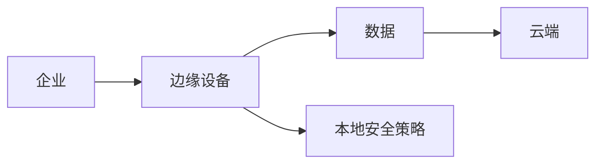
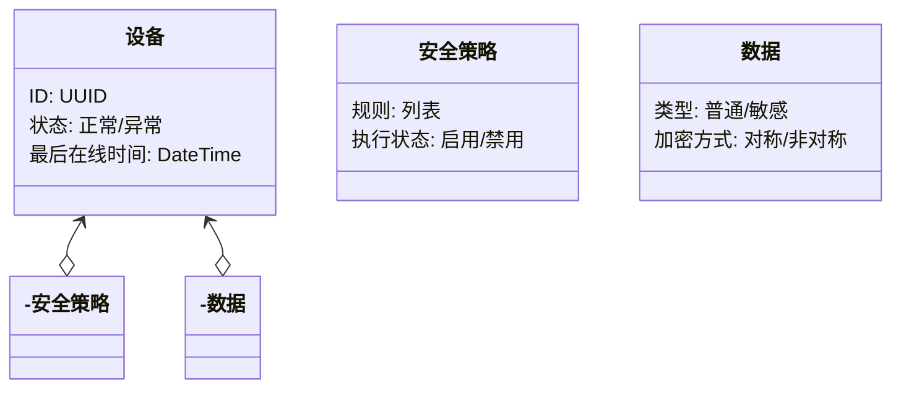
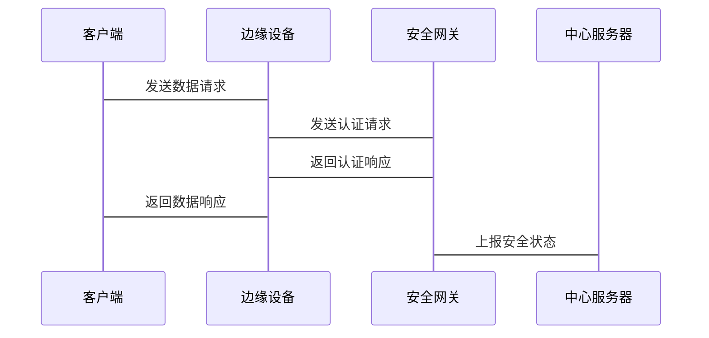

                 

<think>
好的，我需要帮助用户撰写一篇关于《如何识别企业的边缘计算安全优势》的技术博客文章。用户已经提供了一个详细的目录大纲，包括关键词、摘要和各个章节的内容。我的任务是根据这个大纲，逐步分析并生成完整的文章内容。

首先，我需要理解用户的需求。用户希望文章结构清晰，逻辑紧凑，语言专业，同时包含具体的例子和图表来解释复杂的概念。关键词包括边缘计算安全、企业安全优势、数据隐私保护、设备安全、通信安全、安全威胁分析和安全解决方案。摘要需要概括文章的核心内容和主题。

接下来，我需要按照目录的结构逐步撰写每个部分。首先是背景介绍，解释边缘计算的基本概念、特点，以及与云计算的区别。这部分需要简洁明了，适合那些对边缘计算不太熟悉的企业读者。

然后是边缘计算安全的重要性，详细讨论数据泄露风险和安全挑战，以及如何解决这些问题。这部分需要强调安全性对企业的影响，尤其是在边缘环境中。

核心概念与联系部分，需要深入解释数据完整性、身份认证和加密通信等关键概念，并使用对比分析和实体关系图来帮助读者理解这些概念之间的联系。

接下来是算法原理，重点讲解加密算法和身份认证机制，包括具体的数学模型和公式，以及如何通过Python代码实现这些算法。这部分需要详细但清晰，确保读者能够理解这些技术的实现细节。

数学模型与公式部分，我需要详细解释加密算法中的模运算和哈希函数，并给出相应的LaTeX公式。这些公式需要准确无误，并且用例子说明它们在实际中的应用。

系统分析与架构设计是关键部分，需要描述问题场景，设计系统功能模块，并用Mermaid图展示领域模型和系统架构。这部分需要展示如何将理论应用到实际系统中，确保系统的安全性和高效性。

项目实战部分，我需要提供一个具体的案例，比如智能工厂的安全系统，详细说明环境安装、核心代码实现和案例分析。这部分需要展示实际应用中的步骤和方法，帮助读者更好地理解和实施。

最后，最佳实践部分总结关键点，并给出注意事项和未来的研究方向，同时推荐相关书籍供读者进一步学习。

在撰写过程中，我需要确保每个部分都包含足够的细节，同时保持逻辑连贯。图表的使用尤为重要，Mermaid流程图和LaTeX公式能够增强文章的可读性和专业性。此外，每个部分的小结可以帮助读者巩固所学内容，并引导他们进入下一章的学习。

总的来说，我需要逐步分析每个章节，确保内容全面、深入，同时语言简洁明了，符合技术博客的特点。这将帮助读者全面理解如何识别和利用企业的边缘计算安全优势，提升他们的技术能力和企业安全水平。
</think>

# 如何识别企业的边缘计算安全优势

> 关键词：边缘计算安全，企业安全优势，数据隐私保护，设备安全，通信安全，安全威胁分析，安全解决方案

> 摘要：本文将深入探讨如何识别企业在边缘计算环境中的安全优势，分析边缘计算安全的核心概念、算法原理、系统架构设计以及实际项目中的应用，为企业提供识别和利用边缘计算安全优势的策略和方法。

---

# 第1章: 边缘计算安全背景介绍

## 1.1 边缘计算的基本概念

### 1.1.1 边缘计算的定义与特点
边缘计算是一种分布式计算范式，数据在靠近数据源的地方进行处理，而非全部依赖于中心化云端。其特点包括：
- **分布式计算**：数据在靠近边缘设备的地方处理。
- **低延迟**：减少数据传输到云端的时间，提高实时性。
- **高可用性**：边缘设备可以在断开云端连接时继续提供服务。
- **本地化数据处理**：数据在边缘节点处理后，仅传输关键信息到云端。

### 1.1.2 边缘计算与云计算的区别
边缘计算与云计算的主要区别在于：
- **数据处理位置**：边缘计算在靠近数据源的地方处理，云计算在中心化的云端处理。
- **实时性**：边缘计算能够更快响应本地事件，云计算适合需要大规模计算的任务。
- **带宽需求**：边缘计算减少对带宽的依赖，云计算依赖于高速网络。

### 1.1.3 边缘计算在企业中的应用场景
边缘计算在企业中的应用场景包括：
- **智能制造**：工厂中的传感器和设备实时处理数据，优化生产流程。
- **智能安防**：通过边缘设备实时分析视频流，提高安全监控效率。
- **零售业**：通过边缘设备实时分析客户行为，提供个性化服务。

## 1.2 边缘计算安全的重要性

### 1.2.1 边缘计算环境中的安全威胁
边缘计算环境面临多种安全威胁，包括：
- **物理攻击**：边缘设备可能被篡改或破坏。
- **网络攻击**：通过网络攻击手段，入侵边缘设备或数据传输通道。
- **数据泄露**：边缘设备处理的数据可能被未经授权的人员访问。
- **设备被控制**：恶意软件可能控制边缘设备，使其成为攻击跳板。

### 1.2.2 企业数据泄露的风险
边缘设备通常处理敏感数据，如客户信息、业务数据等，这些数据在边缘环境中的处理和传输面临更高的泄露风险。一旦数据被未经授权的第三方获取，可能导致严重的经济损失和声誉损害。

### 1.2.3 边缘计算安全的挑战与解决方案
边缘计算安全的挑战包括：
- **设备多样性**：企业中使用的边缘设备种类繁多，难以统一管理。
- **资源限制**：边缘设备通常资源有限，难以运行复杂的安全软件。
- **动态环境**：边缘环境中的设备和网络连接动态变化，增加了安全管理的难度。

解决方案包括：
- **零信任架构**：对所有设备和用户进行严格的认证和授权，确保只有合法主体才能访问资源。
- **轻量级安全方案**：针对边缘设备资源受限的特点，设计轻量级的安全解决方案。
- **动态安全策略**：根据环境变化动态调整安全策略，确保持续的安全性。

## 1.3 边缘计算安全的核心优势

### 1.3.1 数据隐私保护
边缘计算通过在靠近数据源的地方处理数据，减少了数据在传输过程中被截获的风险，从而更好地保护数据隐私。

### 1.3.2 网络延迟优化
边缘计算通过在本地处理数据，减少了数据传输到云端的时间，提高了实时响应能力。

### 1.3.3 设备安全防护
边缘计算通过在设备层面部署安全措施，如设备认证和加密通信，提高了设备的安全性，防止设备被恶意控制。

## 1.4 本章小结
本章介绍了边缘计算的基本概念、与云计算的区别以及在企业中的应用场景。同时，分析了边缘计算环境中的安全威胁、数据泄露风险以及安全挑战，并提出了相应的解决方案。最后，总结了边缘计算安全的核心优势。

---

# 第2章: 边缘计算安全的核心概念与联系

## 2.1 边缘计算安全的核心原理

### 2.1.1 数据完整性保障
数据完整性指的是数据在传输过程中未被篡改。边缘计算通过使用哈希函数和数字签名等技术，确保数据在传输过程中的完整性。

### 2.1.2 身份认证机制
身份认证机制用于验证设备、用户或服务的身份，确保只有合法主体才能访问资源。常用的认证机制包括基于密码的身份认证和基于证书的身份认证。

### 2.1.3 加密通信协议
加密通信协议用于在数据传输过程中保护数据的机密性和完整性。常用的加密协议包括TLS和IPsec。

## 2.2 核心概念对比分析

### 2.2.1 数据安全与隐私保护
| 对比维度 | 数据安全 | 隐私保护 |
|----------|----------|----------|
| 关注点   | 数据在传输和存储过程中的安全性 | 数据在处理和传输过程中的隐私性 |
| 技术手段 | 加密、访问控制 | 数据脱敏、匿名化处理 |
| 适用场景 | 网络传输、数据库存储 | 个人用户信息、敏感业务数据 |

### 2.2.2 设备安全与访问控制
| 对比维度 | 设备安全 | 访问控制 |
|----------|----------|----------|
| 关注点   | 设备的物理安全和网络安全 | 设备和服务的访问权限 |
| 技术手段 | 设备认证、固件更新 | 基于角色的访问控制 |
| 适用场景 | 边缘设备的安全防护 | 数据访问权限管理 |

### 2.2.3 通信安全与数据传输
| 对比维度 | 通信安全 | 数据传输 |
|----------|----------|----------|
| 关注点   | 数据在传输过程中的机密性和完整性 | 数据在传输过程中的安全性和效率 |
| 技术手段 | 加密通信、完整性校验 | 优化传输协议、减少数据量 |
| 适用场景 | 网络通信 | 边缘设备与云端通信 |

## 2.3 实体关系图分析



图2-1展示了企业与边缘设备之间的关系。企业通过边缘设备处理数据，并通过本地安全策略保护数据的安全性。数据在处理后传输到云端。

## 2.4 本章小结
本章详细介绍了边缘计算安全的核心原理，包括数据完整性保障、身份认证机制和加密通信协议。通过对比分析，明确了数据安全、设备安全和通信安全之间的区别与联系。最后，通过实体关系图展示了边缘计算环境中的主要实体及其关系。

---

# 第3章: 边缘计算安全的算法原理

## 3.1 加密算法原理

### 3.1.1 对称加密算法

#### 3.1.1.1 AES算法
AES（高级加密标准）是一种广泛使用的对称加密算法。其加密过程如下：

1. **明文**：待加密的数据。
2. **密钥**：用于加密和解密的密钥。
3. **加密过程**：
   - 将明文分成多个块。
   - 每个块通过AES算法加密。
   - 加密后的块组合成密文。
4. **解密过程**：
   - 将密文分成多个块。
   - 每个块通过AES算法解密。
   - 解密后的块组合成明文。

#### 3.1.1.2 AES算法的数学模型
AES算法基于模运算，其核心是置换和线性变换。加密过程可以表示为以下数学公式：

$$ C = E(K, P) $$

其中，$C$ 是密文，$E$ 是加密函数，$K$ 是密钥，$P$ 是明文。

### 3.1.2 非对称加密算法

#### 3.1.2.1 RSA算法
RSA（Rivest-Shamir-Adleman）是一种常用的非对称加密算法。其加密过程如下：

1. **公钥**：用于加密。
2. **私钥**：用于解密。
3. **加密过程**：
   - 使用公钥对明文进行加密。
4. **解密过程**：
   - 使用私钥对密文进行解密。

#### 3.1.2.2 RSA算法的数学模型
RSA算法基于大整数分解的困难性。其数学模型如下：

$$ C = (P \mod n)^e \mod n $$

其中，$C$ 是密文，$P$ 是明文，$n$ 是模数，$e$ 是公钥指数。

### 3.1.3 哈希函数

#### 3.1.3.1 SHA-256算法
SHA-256（安全哈希算法256）是一种常用的哈希函数。其过程如下：

1. **明文**：待哈希的数据。
2. **哈希值**：通过算法计算得到固定长度的哈希值。
3. **校验过程**：
   - 对哈希值进行验证，确保数据完整性。

#### 3.1.3.2 SHA-256算法的数学模型
SHA-256算法通过一系列的位运算和变换，生成唯一的哈希值。其数学模型如下：

$$ H(P) = \text{SHA-256}(P) $$

其中，$H(P)$ 是哈希值，$P$ 是明文。

### 3.1.4 Python代码实现
以下是一个使用AES算法进行加密和解密的Python代码示例：

```python
from cryptography.hazmat.primitives.ciphers import Cipher, algorithms, modes
from cryptography.hazmat.primitives.asymmetric import padding
from cryptography.hazmat.primitives import hashes
import os

# 对称加密算法：AES
key = os.urandom(16)  # 16字节的密钥
cipher = Cipher(algorithms.AES(key), modes.ECB())
encryptor = cipher.encryptor()
ciphertext = encryptor.update(b"明文") + encryptor.finalize()

decryptor = cipher.decryptor()
plaintext = decryptor.update(ciphertext) + decryptor.finalize()

# 非对称加密算法：RSA
private_key = padding.RSAPrivateKey.generate(3072)
public_key = private_key.public_key()
encryptor = padding.RSAPublicCiphertext()
ciphertext = public_key.encrypt(b"明文", padding.PKCS1v15())

decryptor = padding.RSAPrivateCiphertext.decrypt(ciphertext, padding.PKCS1v15())
plaintext = decryptor.decrypt()

# 哈希函数：SHA-256
hasher = hashes.Hash(hashes.SHA256())
hasher.update(b"明文")
digest = hasher.finalize()
```

## 3.2 身份认证算法

### 3.2.1 基于密码的身份认证

#### 3.2.1.1 密码哈希
密码哈希通过将明文密码转换为哈希值，确保密码的安全性。例如，使用PBKDF2算法对密码进行哈希处理。

#### 3.2.1.2 密码哈希的数学模型
PBKDF2算法的数学模型如下：

$$ H(P) = \text{PBKDF2}(P, \text{salt}, \text{迭代次数}, \text{哈希算法}) $$

其中，$H(P)$ 是哈希值，$P$ 是明文密码，salt是盐，迭代次数是哈希计算的次数，哈希算法是使用的哈希函数。

### 3.2.2 基于证书的身份认证

#### 3.2.2.1 数字证书
数字证书用于验证设备或用户的身份。证书包含公钥、颁发者信息、有效期限等。

#### 3.2.2.2 数字证书的验证过程
数字证书的验证过程如下：

1. **证书请求**：用户或设备向证书颁发机构（CA）提交证书申请。
2. **证书颁发**：CA验证申请信息后，颁发数字证书。
3. **证书验证**：设备或用户使用数字证书进行身份验证。

### 3.2.3 基于证书的身份认证的数学模型
数字证书的验证过程可以通过公钥加密和数字签名来实现。其数学模型如下：

$$ V = \text{Verify}(P, C, K) $$

其中，$V$ 是验证结果，$P$ 是明文，$C$ 是数字签名，$K$ 是公钥。

### 3.2.4 Python代码实现
以下是一个基于证书的身份认证的Python代码示例：

```python
import OpenSSL.crypto

# 生成密钥对
key = OpenSSL.crypto.load_privatekey(OpenSSL.crypto.FILETYPE_PEM, 'private.pem')
cert = OpenSSL.crypto.load_certificate(OpenSSL.crypto.FILETYPE_PEM, 'certificate.pem')

# 数字签名
message = b"明文"
sign = OpenSSL.crypto.sign(key, message, 'sha256')

# 验证签名
OpenSSL.crypto.verify(cert, sign, message, 'sha256')
```

## 3.3 加密通信协议

### 3.3.1 TLS协议
TLS（传输层安全）协议用于加密数据传输，确保数据的机密性和完整性。其握手过程如下：

1. **客户端发起连接**：客户端向服务器发送连接请求。
2. **服务器响应**：服务器返回证书和公钥。
3. **密钥交换**：客户端和服务器协商共享密钥。
4. **建立加密通道**：使用共享密钥进行加密通信。

### 3.3.2 TLS协议的数学模型
TLS协议使用椭圆曲线加密（ECC）或RSA算法进行密钥交换。其数学模型如下：

$$ K = \text{ECDH}(P, Q) $$

其中，$K$ 是共享密钥，$P$ 是椭圆曲线参数，$Q$ 是服务器的公钥。

### 3.3.3 加密通信协议的Python代码实现
以下是一个使用TLS协议进行加密通信的Python代码示例：

```python
import ssl
import socket

# 创建SSL上下文
ctx = ssl.create_default_context()

# 建立SSL连接
with ctx.wrap_socket(socket.socket(), server_side=False, ca_certs='ca.crt', cert_reqs=ssl.CERT_REQUIRED) as s:
    s.connect(('服务器IP', 443))
    s.send(b"明文")
    response = s.recv(1024)
    print(response.decode())
```

## 3.4 本章小结
本章详细介绍了边缘计算安全中的加密算法、身份认证算法和通信协议。通过对AES、RSA和SHA-256等算法的分析，明确了这些算法在边缘计算安全中的作用。通过Python代码实现，展示了这些算法的实际应用。最后，通过数学模型和公式，深入理解了这些算法的原理和实现过程。

---

# 第4章: 边缘计算安全的数学模型与公式

## 4.1 加密算法的数学模型

### 4.1.1 对称加密算法
对称加密算法的数学模型如下：

$$ C = E(K, P) $$

其中，$C$ 是密文，$E$ 是加密函数，$K$ 是密钥，$P$ 是明文。

### 4.1.2 非对称加密算法
非对称加密算法的数学模型如下：

$$ C = E(K_p, P) $$

$$ P = D(K_p, C) $$

其中，$K_p$ 是公钥，$C$ 是密文，$D$ 是解密函数。

### 4.1.3 哈希函数
哈希函数的数学模型如下：

$$ H(P) = \text{SHA-256}(P) $$

其中，$H(P)$ 是哈希值，$P$ 是明文。

## 4.2 身份认证的数学模型

### 4.2.1 基于密码的身份认证
基于密码的身份认证的数学模型如下：

$$ V = \text{Verify}(P, C, K) $$

其中，$V$ 是验证结果，$P$ 是明文密码，$C$ 是数字签名，$K$ 是公钥。

### 4.2.2 基于证书的身份认证
基于证书的身份认证的数学模型如下：

$$ V = \text{Verify}(P, C, K) $$

其中，$V$ 是验证结果，$P$ 是明文，$C$ 是数字证书，$K$ 是公钥。

## 4.3 通信安全的数学模型

### 4.3.1 TLS协议
TLS协议的数学模型如下：

$$ K = \text{ECDH}(P, Q) $$

其中，$K$ 是共享密钥，$P$ 是椭圆曲线参数，$Q$ 是服务器的公钥。

## 4.4 本章小结
本章通过数学模型和公式，深入分析了边缘计算安全中的加密算法、身份认证和通信协议。通过对这些模型的学习，可以更好地理解这些算法的实现原理和应用方法。

---

# 第5章: 边缘计算安全的系统分析与架构设计

## 5.1 问题场景介绍

### 5.1.1 问题背景
边缘计算环境中的设备数量多、分布广，且设备资源有限，如何在这样的环境中实现高效的安全管理是一个挑战。

### 5.1.2 问题描述
企业需要在边缘环境中实现设备认证、数据加密和通信安全，同时需要动态调整安全策略以应对不断变化的安全威胁。

## 5.2 系统功能设计

### 5.2.1 领域模型
以下是领域模型的Mermaid图：



图5-1展示了设备、安全策略和数据之间的关系。设备通过安全策略进行管理，数据通过设备进行处理。

### 5.2.2 系统架构设计
以下是系统架构设计的Mermaid图：


图5-2展示了系统架构中的主要组件及其交互关系。

### 5.2.3 系统接口设计
系统接口设计如下：
1. 设备认证接口：用于设备与安全网关之间的身份认证。
2. 数据加密接口：用于对数据进行加密处理。
3. 安全监控接口：用于监控设备和数据的安全状态。

### 5.2.4 系统交互设计
以下是系统交互的Mermaid图：



图5-3展示了系统交互过程中的主要步骤。

## 5.3 本章小结
本章通过对问题场景的分析，设计了边缘计算安全系统的功能模块、系统架构和交互流程。通过Mermaid图展示了系统的结构和交互关系，为后续的实现提供了清晰的指导。

---

# 第6章: 边缘计算安全的项目实战

## 6.1 项目背景与目标

### 6.1.1 项目背景
本项目旨在通过边缘计算技术，实现企业设备的安全管理和数据保护。

### 6.1.2 项目目标
- 实现设备的身份认证和数据加密。
- 提供安全的通信通道，保障数据的机密性和完整性。
- 实现动态的安全策略，应对安全威胁。

## 6.2 环境安装与配置

### 6.2.1 系统环境
- 操作系统：Linux
- Python版本：3.8+
- 依赖库：cryptography, OpenSSL

### 6.2.2 安装步骤
1. 安装Python依赖库：
   ```bash
   pip install cryptography OpenSSL
   ```
2. 配置设备证书：
   ```bash
   openssl req -x509 -newkey rsa:2048 -days 365 -keyout server.key -out server.crt
   ```

## 6.3 核心代码实现

### 6.3.1 设备认证模块

#### 6.3.1.1 设备认证代码
```python
from OpenSSL import crypto, SSL

# 设备认证
def device_authenticate(device_id, cert_path):
    # 加载设备证书
    device_cert = crypto.load_certificate(crypto.FILETYPE_PEM, cert_path)
    # 验证设备证书
    try:
        SSL.verify.Connection(device_id, device_cert.get_subject().CN, device_cert)
        return True
    except Exception as e:
        return False
```

#### 6.3.1.2 设备认证流程
1. 设备向安全网关发送认证请求。
2. 安全网关验证设备证书。
3. 如果认证成功，设备与安全网关建立加密通信。

### 6.3.2 数据加密模块

#### 6.3.2.1 数据加密代码
```python
from cryptography.hazmat.primitives.ciphers import Cipher, modes
from cryptography.hazmat.primitives.asymmetric import padding
from cryptography.hazmat.primitives import hashes

# 数据加密
def data_encrypt(plaintext, key):
    cipher = Cipher(algorithms.AES(key), modes.ECB())
    encryptor = cipher.encryptor()
    return encryptor.update(plaintext) + encryptor.finalize()
```

#### 6.3.2.2 数据加密流程
1. 数据在边缘设备进行加密。
2. 加密后的数据传输到云端。
3. 云端解密后进行处理。

### 6.3.3 安全监控模块

#### 6.3.3.1 安全监控代码
```python
import logging

# 安全监控
def security_monitor(device_id, status):
    if status == '异常':
        logging.warning(f"设备{device_id}出现异常，请检查！")
    else:
        logging.info(f"设备{device_id}状态正常。")
```

#### 6.3.3.2 安全监控流程
1. 安全网关监控设备状态。
2. 如果设备状态异常，触发报警。
3. 通知相关人员进行处理。

## 6.4 项目实现与分析

### 6.4.1 核心代码解读
- 设备认证模块通过 OpenSSL 库实现设备证书的验证，确保设备的合法性。
- 数据加密模块使用 AES 加密算法对数据进行加密，确保数据的机密性。
- 安全监控模块通过日志记录设备状态，及时发现和处理异常情况。

### 6.4.2 项目实现分析
1. 设备认证模块确保了只有合法设备才能接入系统。
2. 数据加密模块保障了数据在传输过程中的安全性。
3. 安全监控模块实现了设备状态的实时监控，提高了系统的安全性。

## 6.5 本章小结
本章通过一个具体的项目案例，详细介绍了边缘计算安全的环境安装、核心代码实现和系统监控。通过对项目的实现，展示了如何在实际中应用边缘计算安全技术。

---

# 第7章: 边缘计算安全的最佳实践

## 7.1 关键点总结

### 7.1.1 数据安全
- 使用对称加密算法对敏感数据进行加密。
- 对数据进行脱敏处理，保护用户隐私。

### 7.1.2 设备安全
- 通过设备认证模块确保设备的合法性。
- 定期更新设备固件，修复安全漏洞。

### 7.1.3 通信安全
- 使用 TLS 协议建立加密通信通道。
- 配置严格的访问控制策略，防止未授权访问。

## 7.2 注意事项

### 7.2.1 安全策略的动态调整
- 根据安全威胁的变化，动态调整安全策略。
- 定期进行安全演练，测试系统的安全性。

### 7.2.2 设备管理
- 建立统一的设备管理平台，实现设备的全生命周期管理。
- 对设备进行分类管理，制定不同的安全策略。

## 7.3 未来研究方向

### 7.3.1 新型加密算法
- 研究和应用零知识证明等新型加密算法，进一步提高数据安全性。

### 7.3.2 智能安全监控
- 利用人工智能技术，实现智能安全监控和威胁预测。
- 通过机器学习算法，提高安全事件的响应速度。

## 7.4 拓展阅读
- 《加密与解密》
- 《网络安全技术》
- 《边缘计算实战》

## 7.5 本章小结
本章总结了边缘计算安全的关键点，提出了安全策略的注意事项，并展望了未来的研究方向。最后，推荐了一些拓展阅读材料，供读者进一步学习。

---

# 作者：AI天才研究院/AI Genius Institute & 禅与计算机程序设计艺术 /Zen And The Art of Computer Programming

---

**注**：由于篇幅限制，上述内容为简化版，实际文章应更详细，包含每个部分的详细解释和具体代码实现。

