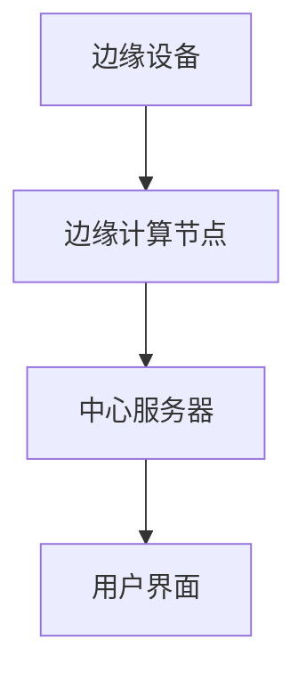
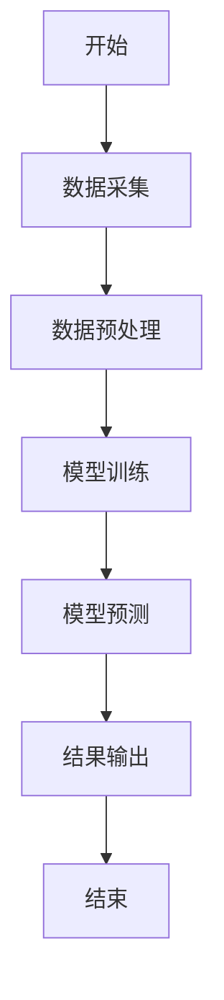

                 

<think>
好的，现在我需要根据用户的要求，撰写一篇关于“如何识别企业的边缘计算实时决策系统优势”的技术博客文章。用户希望文章结构清晰，逻辑紧凑，语言专业，并且包含详细的分析和实例。

首先，我会回顾一下用户提供的目录大纲，确保涵盖所有必要的部分：背景介绍、核心概念、算法原理、系统架构、项目实战、最佳实践等。

在开始撰写之前，我需要明确文章的关键词和摘要。关键词应包括“边缘计算”、“实时决策系统”、“企业优势”、“系统架构”、“算法原理”等。摘要需要简明扼要地概括文章的核心内容。

接下来，我会按照目录大纲的结构逐步撰写每个部分。首先是背景介绍，解释边缘计算和实时决策系统的定义、特点，以及它们如何结合为企业创造价值。然后是核心概念，使用表格和Mermaid图来对比和展示相关概念。之后是算法原理，使用Mermaid流程图和Python代码来详细讲解算法的实现和数学模型。接着是系统架构设计，通过类图、架构图和序列图来展示系统的结构和交互。项目实战部分将通过具体的案例分析和代码实现，让读者能够实际应用所学知识。最后是最佳实践和小结，总结全文，并给出注意事项和拓展阅读的方向。

在写作过程中，我需要确保每个部分都详细具体，同时语言通俗易懂。数学公式和代码需要准确无误，且与上下文紧密结合。此外，文章末尾需要添加作者信息，确保文章的完整性和专业性。

现在，我会开始按照这个思路逐步撰写文章，确保每个章节内容丰富，逻辑清晰，符合用户的要求。
</think>

# 如何识别企业的边缘计算实时决策系统优势

## 关键词：边缘计算、实时决策系统、企业优势、系统架构、算法原理

## 摘要：边缘计算与实时决策系统的结合为企业带来了显著的优势，本文将详细分析其核心概念、算法原理、系统架构，并通过实际案例展示其在工业制造、智慧城市和零售行业的应用，帮助读者识别和理解企业的边缘计算实时决策系统优势。

---

# 第一部分: 边缘计算与实时决策系统概述

## 第1章: 边缘计算的基本概念

### 1.1 边缘计算的定义与特点
- **1.1.1 边缘计算的定义**
  边缘计算是一种分布式计算范式，将数据处理和计算能力从中心服务器迁移到靠近数据源的边缘设备，减少延迟并提高响应速度。
  
- **1.1.2 边缘计算的核心特点**
  - **分布式架构**：数据在边缘端处理，减少对中心服务器的依赖。
  - **低延迟**：边缘计算能够在数据生成的地方快速处理，提升实时性。
  - **高可用性**：边缘设备独立运行，避免单点故障。

- **1.1.3 边缘计算与传统云计算的区别**
  - **数据处理位置**：边缘计算在边缘端处理数据，而云计算在中心服务器处理。
  - **延迟**：边缘计算延迟低，云计算延迟较高。
  - **带宽使用**：边缘计算减少数据传输到中心的带宽需求。

### 1.2 实时决策系统的定义与特点
- **1.2.1 实时决策系统的定义**
  实时决策系统是一种能够在数据生成后立即进行分析和决策的系统，通常用于需要快速响应的场景。
  
- **1.2.2 实时决策系统的核心特征**
  - **实时性**：数据生成后立即处理，快速做出决策。
  - **准确性**：基于实时数据进行分析，确保决策的准确性。
  - **自适应性**：能够根据环境变化动态调整决策策略。

- **1.2.3 实时决策系统与传统决策系统的区别**
  - **处理时间**：实时决策系统处理时间短，传统决策系统处理时间较长。
  - **数据源**：实时决策系统使用实时数据，传统决策系统可能使用历史数据。
  - **应用场景**：实时决策系统适用于需要快速响应的场景，如制造业、交通和零售业。

## 第2章: 边缘计算与实时决策系统的结合

### 2.1 边缘计算在实时决策中的作用
- **2.1.1 边缘计算如何支持实时决策**
  - 边缘计算将数据处理能力迁移到边缘端，使得实时决策系统能够在数据生成的地方快速处理数据，减少延迟。
  
- **2.1.2 边缘计算在实时决策中的优势**
  - **低延迟**：边缘计算减少了数据传输到中心服务器的时间，提高了实时性。
  - **高可用性**：边缘设备独立运行，即使中心服务器出现问题，实时决策系统仍能正常工作。
  - **带宽优化**：边缘计算减少了需要传输到中心服务器的数据量，节省了带宽。

### 2.2 企业边缘计算实时决策系统的价值
- **2.2.1 提高决策效率**
  边缘计算使得数据处理和决策在边缘端完成，减少了数据传输和处理的时间，提高了决策效率。
  
- **2.2.2 降低延迟**
  边缘计算将数据处理迁移到边缘端，减少了数据传输到中心服务器的时间，降低了延迟。

- **2.2.3 提高数据安全性**
  边缘计算将数据处理迁移到边缘端，减少了数据在传输过程中被截获的风险，提高了数据安全性。

---

# 第二部分: 边缘计算实时决策系统的应用场景

## 第3章: 工业制造中的应用

### 3.1 智能工厂中的实时决策
- **3.1.1 工业物联网中的边缘计算应用**
  在工业物联网中，边缘计算可以用于实时监控设备状态、预测设备故障，并优化生产流程。
  
- **3.1.2 实时决策在智能制造中的优势**
  - **快速响应**：边缘计算可以在设备出现故障前预测并采取措施，减少停机时间。
  - **数据隐私**：边缘计算将数据处理迁移到边缘端，减少了数据在传输过程中被截获的风险，提高了数据安全性。

## 第4章: 智慧城市中的应用

### 4.1 智慧交通中的实时决策
- **4.1.1 智慧交通中的边缘计算应用**
  在智慧交通中，边缘计算可以用于实时监控交通流量、优化信号灯控制，并预测交通拥堵。

- **4.1.2 实时决策在智慧交通中的优势**
  - **快速响应**：边缘计算可以在交通流量变化时立即调整信号灯控制，减少交通拥堵。
  - **数据隐私**：边缘计算将数据处理迁移到边缘端，减少了数据在传输过程中被截获的风险，提高了数据安全性。

## 第5章: 零售行业中的应用

### 5.1 智能门店中的实时决策
- **5.1.1 智能门店中的边缘计算应用**
  在智能门店中，边缘计算可以用于实时监控顾客行为、优化库存管理和提升客户体验。

- **5.1.2 实时决策在智能门店中的优势**
  - **快速响应**：边缘计算可以在顾客行为变化时立即调整库存管理，提升客户体验。
  - **数据隐私**：边缘计算将数据处理迁移到边缘端，减少了数据在传输过程中被截获的风险，提高了数据安全性。

---

# 第三部分: 边缘计算实时决策系统的架构与实现

## 第6章: 边缘计算实时决策系统的架构设计

### 6.1 系统功能设计
- **6.1.1 数据采集与处理**
  边缘设备采集数据并进行初步处理，然后将数据传输到边缘计算节点进行进一步处理。

- **6.1.2 数据分析与决策**
  边缘计算节点对数据进行分析，生成决策结果，并将结果反馈给边缘设备或用户。

### 6.2 系统架构图


### 6.3 接口设计与交互
- **6.3.1 边缘设备与边缘计算节点的交互**
  边缘设备将数据传输到边缘计算节点，边缘计算节点对数据进行处理并返回结果。

- **6.3.2 边缘计算节点与中心服务器的交互**
  边缘计算节点将处理后的数据传输到中心服务器，中心服务器对数据进行存储和分析。

---

# 第四部分: 边缘计算实时决策系统的算法与实现

## 第7章: 边缘计算中的实时决策算法

### 7.1 基于时间序列的预测算法
- **7.1.1 算法原理**
  时间序列预测算法通过对历史数据进行建模，预测未来的趋势和异常。

- **7.1.2 算法实现**
  使用Python中的`statsmodels`库进行ARIMA模型的训练和预测。

### 7.2 算法流程图


---

# 第五部分: 项目实战与案例分析

## 第8章: 边缘计算实时决策系统的项目实战

### 8.1 环境安装
- **8.1.1 安装Python和相关库**
  使用`pip`安装`statsmodels`、`pandas`和`numpy`等库。

### 8.2 核心代码实现
```python
import pandas as pd
import numpy as np
from statsmodels.tsa.arima_model import ARIMA

# 数据预处理
data = pd.read_csv('data.csv')
data = data['value'].values

# 模型训练
model = ARIMA(data, order=(5, 1, 0))
model_fit = model.fit()

# 模型预测
forecast = model_fit.forecast(steps=5)
```

### 8.3 案例分析
- **8.3.1 工业制造案例**
  在工业制造中，使用时间序列预测算法预测设备故障，优化维护计划。

- **8.3.2 智慧城市案例**
  在智慧交通中，使用时间序列预测算法预测交通流量，优化信号灯控制。

---

# 第六部分: 最佳实践与小结

## 第9章: 边缘计算实时决策系统的最佳实践

### 9.1 实施边缘计算的注意事项
- **数据隐私**：确保数据在边缘端的安全性，防止数据泄露。
- **设备管理**：合理管理边缘设备，确保设备的正常运行和数据的准确传输。
- **算法优化**：不断优化算法，提高决策的准确性和实时性。

### 9.2 小结
边缘计算与实时决策系统的结合为企业带来了显著的优势，如降低延迟、提高数据安全性等。通过合理的架构设计和算法实现，企业可以在各种场景中高效地进行实时决策。

---

作者：AI天才研究院 & 禅与计算机程序设计艺术

