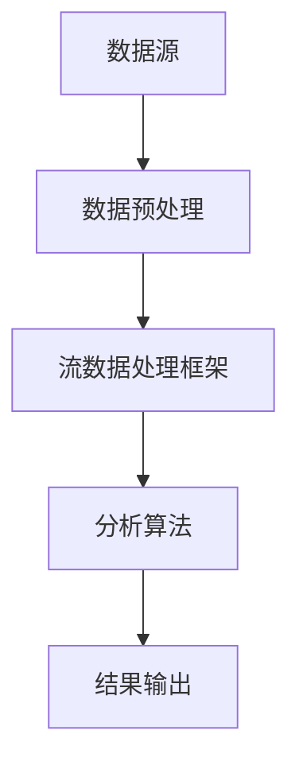
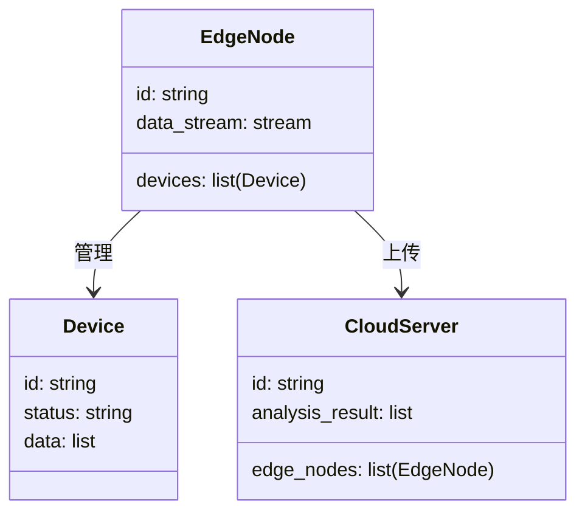
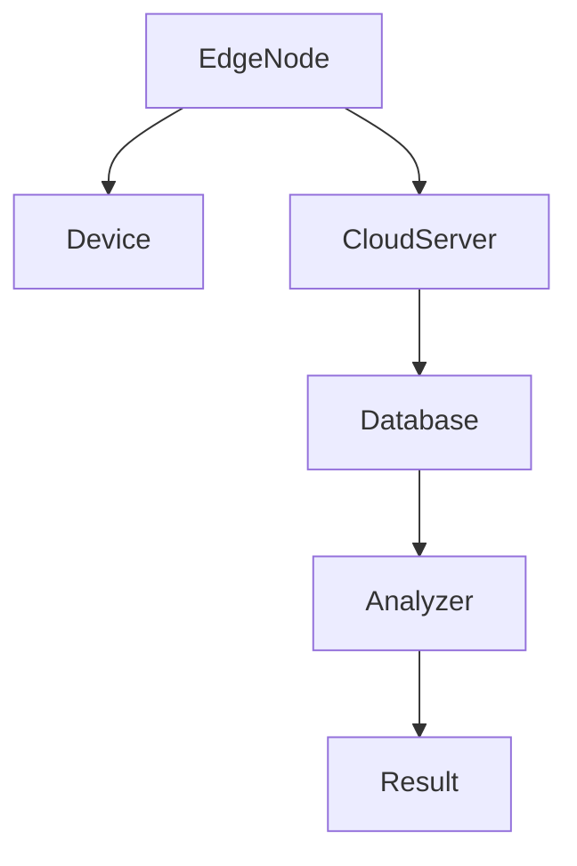

                 


# 如何识别企业的边缘计算实时数据分析优势

> 关键词：边缘计算，实时数据分析，企业优势，技术优势，算法原理，系统架构，项目实战

> 摘要：本文将详细探讨如何识别企业的边缘计算实时数据分析优势。首先介绍边缘计算与实时数据分析的基本概念及其重要性，然后深入分析其核心技术和应用场景。接下来，详细讲解其技术优势，包括低延迟计算、高数据吞吐量和数据本地化处理。随后，通过具体的算法原理和系统架构设计，展示边缘计算在实时数据分析中的协同优化。最后，结合实际项目案例，分析其实施过程和最佳实践。

---

# 第一部分: 边缘计算与实时数据分析概述

# 第1章: 边缘计算与实时数据分析概述

## 1.1 边缘计算的基本概念

### 1.1.1 边缘计算的定义与特点

边缘计算是一种分布式计算范式，将计算能力从传统的中心化云端扩展至网络的边缘，靠近数据源进行处理。其特点包括低延迟、高实时性、本地化数据处理和高效资源利用。

$$\text{边缘计算} = \text{分布式计算} \cap \text{本地数据处理}$$

### 1.1.2 实时数据分析的核心概念

实时数据分析是指在数据生成的瞬间对其进行处理和分析，以快速获取洞察并做出实时决策。其核心在于数据流的实时处理和快速响应。

## 1.2 边缘计算与实时数据分析的重要性

### 1.2.1 企业数字化转型中的边缘计算角色

在企业数字化转型中，边缘计算提供了将数据处理能力推向边缘的能力，减少了对中心服务器的依赖，提高了系统的响应速度和可靠性。

### 1.2.2 实时数据分析在企业中的价值

实时数据分析能够帮助企业快速响应市场变化、优化业务流程、提升客户体验，并在实时监控、预测性维护等领域发挥重要作用。

## 1.3 本章小结

通过本章，我们了解了边缘计算和实时数据分析的基本概念及其在企业中的重要性。边缘计算的分布式特性与实时数据分析的高效性相结合，为企业提供了新的技术优势。

---

# 第二部分: 边缘计算实时数据分析的核心概念

# 第2章: 边缘计算与实时数据分析的核心概念

## 2.1 边缘计算的关键技术

### 2.1.1 分布式计算

分布式计算将数据和计算任务分散到多个边缘节点，通过并行处理提高整体效率。

### 2.1.2 流数据处理

流数据处理是指对连续的数据流进行实时处理，通常采用流处理框架（如Kafka、Flink）。

### 2.1.3 边缘计算的优势与劣势对比

| 优势 | 劣势 |
|------|------|
| 低延迟 | 资源受限 |
| 高实时性 | 管理复杂性 |
| 数据本地化 | 数据隐私风险 |

## 2.2 实时数据分析的原理

### 2.2.1 数据流的实时处理流程

1. 数据采集：从边缘设备获取实时数据。
2. 数据预处理：清洗、转换数据。
3. 数据分析：使用算法进行实时计算。
4. 结果输出：将结果反馈给应用或存储。

### 2.2.2 数据存储与计算的结合

通过边缘节点的本地存储和计算能力，减少数据传输到云端的延迟。

## 2.3 边缘计算与实时数据分析的场景分析

### 2.3.1 工业物联网中的应用

在工业物联网中，边缘计算可以实时监控设备状态，预测设备故障，优化生产流程。

### 2.3.2 智慧城市中的应用

在智慧城市中，边缘计算可以实时处理交通流量、环境监测等数据，提供实时决策支持。

### 2.3.3 企业内部实时监控系统的应用

在企业内部，边缘计算可以实时监控生产流程、供应链管理等，提升企业运营效率。

## 2.4 本章小结

本章详细探讨了边缘计算与实时数据分析的核心概念，分析了其在不同场景中的应用，为后续的技术优势分析奠定了基础。

---

# 第三部分: 边缘计算实时数据分析的技术优势

# 第3章: 边缘计算实时数据分析的技术优势

## 3.1 边缘计算在实时数据分析中的技术特点

### 3.1.1 低延迟计算

边缘计算将数据处理转移到靠近数据源的边缘节点，减少了数据传输到云端的延迟。

### 3.1.2 高数据吞吐量

通过分布式计算和并行处理，边缘计算能够处理大量的实时数据，提高数据吞吐量。

### 3.1.3 数据的本地化处理

边缘计算将数据处理任务分配到边缘节点，减少了数据传输到云端的带宽占用。

## 3.2 实时数据分析的核心技术

### 3.2.1 流数据处理框架

流数据处理框架（如Kafka、Flink）在边缘计算中被广泛应用，用于实时数据的高效处理。

### 3.2.2 分布式计算框架

分布式计算框架（如Spark、Hadoop）为边缘计算提供了高效的分布式计算能力。

### 3.2.3 数据一致性保障

通过一致性哈希和分布式锁机制，边缘计算能够保障实时数据分析中的数据一致性。

## 3.3 边缘计算与实时数据分析的协同优化

### 3.3.1 计算资源的优化分配

通过动态资源分配和负载均衡技术，优化计算资源的使用效率。

### 3.3.2 数据传输的优化

通过压缩技术和本地存储，减少数据传输到云端的带宽占用。

### 3.3.3 系统容错与高可用性设计

通过冗余设计和故障恢复机制，提高边缘计算系统的容错能力和高可用性。

## 3.4 本章小结

本章重点分析了边缘计算在实时数据分析中的技术优势，包括低延迟计算、高数据吞吐量和数据本地化处理。同时，探讨了如何通过协同优化提高系统的整体性能。

---

# 第四部分: 边缘计算实时数据分析的算法原理

# 第4章: 边缘计算实时数据分析的算法原理

## 4.1 数据流处理的算法框架

### 4.1.1 流数据处理流程图



### 4.1.2 流数据处理算法实现

以下是一个简单的流数据处理算法的Python实现示例：

```python
import time
from collections import deque

class StreamProcessor:
    def __init__(self, window_size=5):
        self.window = deque(maxlen=window_size)
    
    def process_data(self, data_point):
        self.window.append(data_point)
        # 简单的平均值计算
        average = sum(self.window) / len(self.window)
        return average

# 示例用法
processor = StreamProcessor(window_size=5)
stream_data = [10, 20, 30, 40, 50, 60, 70]

for data in stream_data:
    result = processor.process_data(data)
    print(f"当前窗口平均值：{result}")
```

### 4.1.3 数据一致性保障算法

通过一致性哈希算法，确保数据在边缘节点之间的分布一致性。

$$\text{一致性哈希} = \text{哈希函数} \circ \text{节点标识}$$

---

# 第五部分: 边缘计算实时数据分析的系统架构

# 第5章: 边缘计算实时数据分析的系统架构

## 5.1 项目背景介绍

本项目旨在设计一个基于边缘计算的实时数据分析系统，用于实时监控工业设备的运行状态。

## 5.2 系统功能设计

### 5.2.1 领域模型类图



### 5.2.2 系统架构图



### 5.2.3 接口设计和系统交互

通过RESTful API实现设备数据的上传和分析结果的获取。

## 5.3 本章小结

本章通过项目背景介绍和系统架构设计，展示了边缘计算在实时数据分析中的实际应用。

---

# 第六部分: 边缘计算实时数据分析的项目实战

# 第6章: 边缘计算实时数据分析的项目实战

## 6.1 环境安装

安装必要的软件和框架，如Python、Kafka、Flink等。

## 6.2 系统核心实现

### 6.2.1 边缘节点数据处理代码

```python
from kafka import KafkaConsumer
import json

def consume_data():
    consumer = KafkaConsumer('edge_data_topic', bootstrap_servers='localhost:9092')
    for message in consumer:
        data = json.loads(message.value)
        # 数据预处理
        processed_data = data['value'] * 2
        print(f"Processed data: {processed_data}")

consume_data()
```

### 6.2.2 云计算结果展示代码

```python
from kafka import KafkaProducer
import json

def produce_data(value):
    producer = KafkaProducer(bootstrap_servers='localhost:9092')
    producer.send('cloud_result_topic', json.dumps({'result': value}))
    producer.flush()

produce_data(100)
```

## 6.3 代码应用解读与分析

通过上述代码，展示了边缘节点如何消费数据、处理数据，并将结果发送到云端进行进一步分析。

## 6.4 实际案例分析

以工业设备实时监控为例，分析边缘计算在实时数据分析中的应用效果。

## 6.5 项目小结

本章通过实际项目案例，展示了边缘计算在实时数据分析中的具体实现和应用效果。

---

# 第七部分: 边缘计算实时数据分析的最佳实践

# 第7章: 边缘计算实时数据分析的最佳实践

## 7.1 小结

边缘计算与实时数据分析的结合为企业提供了显著的技术优势，包括低延迟、高实时性和数据本地化处理。

## 7.2 注意事项

- 确保数据一致性
- 优化数据传输
- 提高系统容错能力

## 7.3 拓展阅读

推荐阅读以下内容，以深入了解边缘计算与实时数据分析：

1. Apache Kafka 官方文档
2. Apache Flink 官方文档
3. 边缘计算白皮书

---

# 作者

作者：AI天才研究院/AI Genius Institute & 禅与计算机程序设计艺术/Zen And The Art of Computer Programming

---

通过以上详细的文章结构，我们可以系统地识别企业的边缘计算实时数据分析优势，并通过实际案例和技术分析，为企业提供有效的解决方案。

