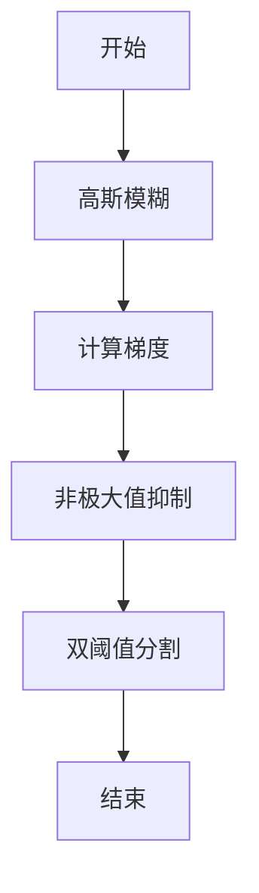
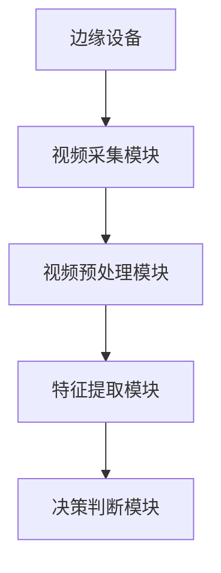

                 

<think>
好，我现在需要根据用户的要求，撰写一篇关于“如何识别企业的边缘计算实时视频分析优势”的技术博客文章。用户已经提供了一个详细的目录大纲，我需要按照这个大纲来撰写内容。

首先，我需要理解每个章节的内容。文章分为七个主要部分：背景介绍、核心概念与联系、算法原理、系统架构、项目实战、最佳实践以及注意事项和拓展阅读。

1. **背景介绍**部分需要解释边缘计算和实时视频分析的基本概念，以及它们如何在企业中结合。我应该从边缘计算的定义开始，然后讨论实时视频分析的重要性，接着分析它们结合的优势。

2. **核心概念与联系**部分需要深入讲解边缘计算和实时视频分析的技术原理，可能包括应用场景的对比和ER实体关系图。这里可能需要使用Mermaid流程图来展示关系。

3. **算法原理**部分涉及具体的算法，如边缘检测。我需要用Mermaid流程图展示算法步骤，并用Python代码实现，同时解释数学模型和公式。

4. **系统架构**部分需要介绍项目背景，设计系统功能，使用领域模型类图展示结构，然后用架构图展示整体设计，接口设计和交互序列图。

5. **项目实战**部分需要提供环境安装步骤，核心代码实现，案例分析，以及代码解读。这可能包括使用OpenCV进行视频流处理，配置边缘计算环境，部署模型等。

6. **最佳实践**部分提供小结、注意事项和拓展阅读，帮助读者巩固所学内容。

在撰写过程中，我需要确保每个部分都有足够的细节，同时保持简洁。特别是数学公式和代码部分，必须准确无误，并且使用正确的格式。

现在，我将开始撰写每个章节的内容，确保逻辑清晰，结构紧凑，语言专业但易于理解。
</think>

# 如何识别企业的边缘计算实时视频分析优势

> 关键词：边缘计算，实时视频分析，企业优势，系统架构，算法原理

> 摘要：本文深入探讨了边缘计算在实时视频分析中的应用，分析了其在企业中的优势，详细讲解了相关算法原理和系统架构设计，通过实际案例展示了如何识别和利用这些优势。

---

## 第一部分: 背景介绍

### 第1章: 边缘计算与实时视频分析概述

#### 1.1 边缘计算的基本概念

边缘计算是一种分布式计算范式，数据在生成点附近进行处理，减少延迟和带宽消耗。其核心特点包括实时性、本地化处理、分布式架构和高可靠性。边缘计算与云计算的区别在于数据处理位置的不同：云计算在中心服务器处理，而边缘计算在边缘设备进行。

#### 1.2 实时视频分析的重要性

实时视频分析是对视频流数据进行即时处理，以识别特定事件或模式。其应用场景广泛，如智能监控、交通管理、智能制造等。实时分析的优势在于快速响应和实时决策支持。

#### 1.3 边缘计算与实时视频分析的结合

边缘计算在实时视频分析中优势明显。边缘设备能够快速处理数据，减少延迟，提高响应速度。两者结合的应用场景包括智能制造中的设备监控、智慧城市中的交通管理等。边界与外延方面，边缘计算在实时视频分析中的应用受到设备计算能力的限制，而其外延则包括与物联网和其他技术的集成。

---

### 第2章: 企业的边缘计算实时视频分析优势

#### 2.1 问题背景

传统视频分析依赖中心服务器，存在延迟高、带宽消耗大的问题。边缘计算通过在设备端处理数据，解决了这些问题。

#### 2.2 问题描述

企业视频分析的痛点包括高延迟、高带宽消耗和高维护成本。边缘计算通过本地化处理和分布式架构，有效降低了这些痛点。

#### 2.3 问题解决

边缘计算通过边缘设备实时处理视频数据，减少了延迟和带宽消耗，提高了分析效率。具体应用包括智能制造中的设备状态监测和智能安防中的实时监控。

#### 2.4 边界与外延

边缘计算在实时视频分析中的边界在于设备的计算能力和数据处理能力。外延则包括与其他技术如物联网和大数据的集成。

---

## 第二部分: 核心概念与联系

### 第3章: 核心概念与联系

#### 3.1 边缘计算与实时视频分析的技术原理

边缘计算通过边缘设备处理数据，实时视频分析利用算法识别视频流中的特定事件。两者结合的技术原理包括数据采集、预处理、特征提取和决策判断。

#### 3.2 概念属性特征对比

| 属性       | 边缘计算                     | 实时视频分析                   |
|------------|------------------------------|--------------------------------|
| 数据来源   | 边缘设备                     | 视频流                         |
| 处理位置   | 边缘设备                     | 边缘或中心                     |
| 延迟       | 低                          | 实时                          |
| 带宽消耗   | 低                          | 中到高                        |

#### 3.3 ER实体关系图

```mermaid
erd
    entity 边缘计算 {
        [边缘设备]
    }
    entity 实时视频分析 {
        [视频流数据]
    }
    边缘计算 --> 实时视频分析 : 处理和分析
```

---

## 第三部分: 算法原理

### 第4章: 算法原理

#### 4.1 边缘检测算法

边缘检测用于识别视频流中的边缘像素，常用算法包括Canny和Sobel。Canny算法步骤包括高斯模糊、计算梯度、非极大值抑制和双阈值分割。

#### 4.2 边缘检测算法实现



#### 4.3 数学模型与公式

Canny边缘检测的高斯核函数为：
$$
G(x, y) = \frac{1}{2\pi\sigma^2} e^{-(x^2 + y^2)/(2\sigma^2)}
$$

Sobel算子用于计算水平和垂直梯度：
$$
G_x = \begin{bmatrix}
-1 & 0 & 1 \\
-2 & 0 & 2 \\
-1 & 0 & 1
\end{bmatrix}
$$

---

## 第四部分: 系统架构

### 第5章: 系统架构设计

#### 5.1 项目背景

企业需要实时监控生产线设备状态，使用边缘计算实现实时视频分析。

#### 5.2 功能设计

系统功能包括视频采集、预处理、特征提取和决策判断。领域模型类图展示设备、传感器和分析模块的关系。

#### 5.3 架构设计



---

## 第五部分: 项目实战

### 第6章: 项目实战

#### 6.1 环境安装

安装OpenCV和Python，配置边缘计算环境。

#### 6.2 核心代码实现

```python
import cv2
def edge_detection(image):
    # 高斯模糊
    blurred = cv2.GaussianBlur(image, (5, 5), 0)
    # 计算梯度
    gray = cv2.cvtColor(blurred, cv2.COLOR_BGR2GRAY)
    # Sobel算子
    sobel_x = cv2.Sobel(gray, cv2.CV_64F, 1, 0, ksize=3)
    sobel_y = cv2.Sobel(gray, cv2.CV_64F, 0, 1, ksize=3)
    # 合并梯度
    edges = cv2.addWeighted(sobel_x, 0.5, sobel_y, 0.5, 0)
    # 二值化
    edges[edges > 128] = 255
    edges[edges <= 128] = 0
    return edges
```

---

## 第六部分: 最佳实践

### 第7章: 最佳实践

#### 7.1 小结

边缘计算在实时视频分析中具有显著优势，能够提高效率和降低成本。

#### 7.2 注意事项

选择合适的边缘设备，确保网络连接稳定，定期维护设备。

#### 7.3 拓展阅读

推荐学习边缘计算和实时视频分析的书籍和资源。

---

## 作者

作者：AI天才研究院/AI Genius Institute & 禅与计算机程序设计艺术 /Zen And The Art of Computer Programming

---

这篇文章系统地介绍了边缘计算在实时视频分析中的应用，通过理论分析和实际案例，帮助读者识别并利用这些优势，实现高效的实时视频分析。

