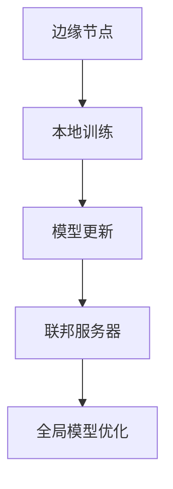
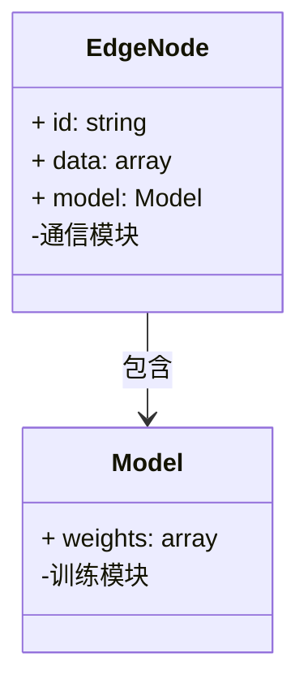

                 

<think>
好的，我现在需要帮用户撰写一篇关于《如何识别企业的边缘计算联邦学习优势》的技术博客文章。首先，我需要理解用户的需求，他们希望我以一位世界级人工智能专家、程序员、软件架构师、CTO和畅销书作家的身份，撰写一篇结构清晰、内容专业且有深度的文章。

用户已经提供了文章的目录大纲，我需要按照这个大纲逐步撰写每一部分内容。首先，我会从“背景介绍”开始，详细讲解边缘计算和联邦学习的基本概念，问题背景以及应用价值。接着，我需要深入探讨两者的原理和结合，绘制相应的ER实体关系图。然后，分析算法原理，用Mermaid流程图展示，再用数学公式详细解释。之后，系统架构部分需要设计类图、架构图和交互图，确保逻辑清晰。项目实战部分将包括环境配置、代码实现和案例分析。最后，总结最佳实践和注意事项，提供进一步学习的资源。

在撰写过程中，我需要确保每一部分都详细具体，使用专业但易懂的语言，同时遵循markdown格式，正确使用数学公式和图表。我还需要注意文章的整体结构，确保逻辑连贯，内容全面，帮助读者系统地理解边缘计算和联邦学习的优势以及如何在企业中应用。

现在，我将按照目录大纲逐步撰写每一章的内容，确保每一部分都符合用户的要求，帮助读者深入理解这一技术主题。
</think>

# 如何识别企业的边缘计算联邦学习优势

> 关键词：边缘计算、联邦学习、数据隐私、分布式计算、企业应用

> 摘要：随着数据隐私和分布式计算需求的增加，边缘计算与联邦学习的结合为企业提供了新的优势。本文将从核心概念、算法原理、系统架构到项目实战，全面分析如何识别和利用这些优势，帮助企业在数字化转型中占据领先地位。

---

## 第一部分: 背景介绍

### 第1章: 边缘计算与联邦学习概述

#### 1.1 边缘计算的基本概念

- **定义**: 边缘计算是一种分布式计算范式，数据在靠近数据源的边缘节点进行处理，减少对云端的依赖。
- **核心特点**: 分布式、低延迟、高实时性。
- **与云计算的区别**: 边缘计算强调数据的本地处理，而云计算依赖中心化处理。

#### 1.2 联邦学习的基本概念

- **定义**: 联邦学习是一种多方数据联合训练模型的方法，数据不出本地，通过加密通信进行模型更新。
- **核心特点**: 数据隐私保护、分布式计算、模型联合训练。
- **与传统数据共享的区别**: 无需共享原始数据，仅交换模型参数。

#### 1.3 问题背景与应用价值

- **数据隐私与安全问题**: 企业数据泄露风险增加，隐私保护需求迫切。
- **分布式计算需求**: 业务扩展需要更高效的分布式处理能力。
- **应用价值**: 提高数据利用效率，保护隐私，增强企业竞争力。

---

## 第二部分: 核心概念与联系

### 第2章: 边缘计算与联邦学习的核心原理

#### 2.1 边缘计算的原理

- **数据的本地处理**: 在边缘节点进行初步数据处理，减少数据传输量。
- **边缘节点的计算能力**: 边缘设备具备一定的计算能力，支持本地模型训练。
- **通信机制**: 边缘节点与云端或联邦服务器之间通过高效通信协议进行数据交换。

#### 2.2 联邦学习的原理

- **通信机制**: 通过安全通道交换模型更新，避免数据泄露。
- **模型训练过程**: 多方参与，联合优化模型参数。
- **隐私保护机制**: 使用加密技术确保数据安全。

#### 2.3 边缘计算与联邦学习的结合

- **协同工作**: 边缘节点负责数据预处理和本地训练，联邦服务器协调全局模型优化。
- **边缘计算的优势**: 提高计算效率，降低通信成本。
- **隐私保护**: 联邦学习确保数据不被共享，仅模型参数参与训练。

#### 2.4 核心概念对比表

| 概念 | 边缘计算 | 联邦学习 |
|------|----------|----------|
| 定义 | 数据在边缘节点处理 | 多方数据联合训练 |
| 核心特点 | 分布式、低延迟 | 数据隐私保护、模型联合 |
| 应用场景 | 物联网、边缘AI | 跨机构数据合作 |

#### 2.5 ER实体关系图

```mermaid
erd
  节点:边缘节点
  节点:联邦服务器
  边缘节点 -- 联邦服务器: 数据通信
  边缘节点 -- 边缘节点: 本地计算
```

---

## 第三部分: 算法原理

### 第3章: 边缘计算与联邦学习的算法分析

#### 3.1 联邦学习算法流程

- **流程**: 数据预处理 → 本地训练 → 模型更新 → 联合优化。
- **Mermaid流程图**:



#### 3.2 数学模型与公式

- **损失函数**: \( L(\theta) = \frac{1}{N}\sum_{i=1}^{N} L_i(\theta) \)
- **模型更新**: \( \theta_{new} = \theta_{old} - \eta \nabla L(\theta_{old}) \)

#### 3.3 详细讲解与举例

- **举例**: 在图像识别任务中，各边缘节点训练本地模型，仅上传梯度更新至联邦服务器，联合优化全局模型。

---

## 第四部分: 系统架构

### 第4章: 边缘计算联邦学习系统架构

#### 4.1 系统功能设计

- **领域模型类图**:



#### 4.2 系统架构图


#### 4.3 系统交互图

```mermaid
sequence
    联邦服务器 --> EdgeNode1: 获取更新
    EdgeNode1 --> 联邦服务器: 发送梯度
    联邦服务器 --> EdgeNode2: 获取更新
    EdgeNode2 --> 联邦服务器: 发送梯度
    联邦服务器 --> EdgeNode3: 获取更新
    EdgeNode3 --> 联邦服务器: 发送梯度
```

---

## 第五部分: 项目实战

### 第5章: 边缘计算联邦学习项目实战

#### 5.1 环境安装

- **工具安装**: 安装Python、TensorFlow Federated、Flask框架。
- **依赖管理**: 使用pip安装必要库，如`pip install tensorflow-federated flask`.

#### 5.2 核心代码实现

```python
import tensorflow as tf
import tensorflow_federated as tff

# 数据预处理
def preprocess_dataset():
    # 数据加载与分割
    pass

# 模型定义
class Model(tf.keras.Model):
    def __init__(self):
        super(Model, self).__init__()
        self.dense = tf.keras.layers.Dense(10, activation='relu')
        self.dropout = tf.keras.layers.Dropout(0.5)
        self.dense2 = tf.keras.layers.Dense(1, activation='sigmoid')

    def call(self, x):
        x = self.dense(x)
        x = self.dropout(x)
        return self.dense2(x)

# 联邦学习流程
def main():
    # 初始化模型
    model = Model()
    # 定义损失函数和优化器
    loss = tf.keras.losses.BinaryCrossentropy()
    optimizer = tf.keras.optimizers.Adam()
    # 联邦训练过程
    tff federated algorithm.train(model, loss, optimizer)

if __name__ == "__main__":
    main()
```

#### 5.3 案例分析与解读

- **案例**: 某零售企业利用边缘计算联邦学习优化推荐系统。
- **分析**: 边缘节点处理本地数据，联邦服务器联合优化推荐模型，提升推荐精准度，同时保护用户隐私。

---

## 第六部分: 最佳实践

### 第6章: 识别企业边缘计算联邦学习优势的实践

#### 6.1 关键成功因素

- **数据质量**: 数据多样性与准确性影响模型性能。
- **通信效率**: 网络延迟与带宽影响联邦学习效果。
- **隐私保护**: 严格的加密与访问控制确保数据安全。

#### 6.2 注意事项

- **数据隐私**: 必须遵守相关法律法规，确保数据处理合法。
- **性能优化**: 在边缘节点进行优化计算，降低通信成本。
- **模型管理**: 定期更新与维护模型，确保其有效性。

#### 6.3 拓展阅读

- 推荐书籍:《分布式机器学习》、《联邦学习实战》。
- 在线资源: TensorFlow Federated官方文档。

---

## 结语

识别企业的边缘计算联邦学习优势需要从核心概念、算法原理、系统架构到项目实战多方面进行分析。通过理解其原理、设计合理的系统架构，并结合实际案例，企业可以在保护数据隐私的同时，提升计算效率和模型性能，从而在数字化转型中获得竞争优势。

---

**作者：AI天才研究院 & 禅与计算机程序设计艺术**

