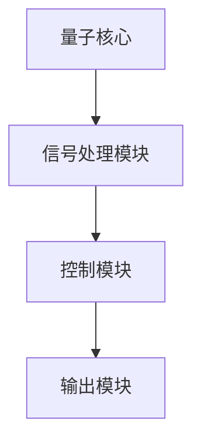

                 

<think>
好，我需要帮助用户撰写一篇关于“如何识别企业的量子传感器优势”的技术博客文章。首先，我需要理解量子传感器的基本概念以及它们在企业中的应用。量子传感器利用量子效应来提高测量精度和灵敏度，这在某些领域可能比传统传感器更有优势。

接下来，我应该考虑企业的角度，如何识别这些优势。首先，企业需要了解量子传感器的核心原理和其与经典传感器的区别。这包括灵敏度、响应速度、成本效益等方面的对比。

然后，我需要探讨量子传感器在不同行业中的应用案例，例如在通信、医疗、自动驾驶等领域的具体应用。通过这些案例，读者可以更好地理解量子传感器的实际价值。

此外，我还需要讨论如何评估企业是否具备采用量子传感器的条件，包括技术能力、资源投入、市场需求等因素。这部分内容将帮助企业进行自我评估，确定是否适合投资量子传感器技术。

最后，我应该总结量子传感器的优势和挑战，为企业提供一些建议，例如如何制定战略、选择合适的量子传感器解决方案等。这些建议将帮助企业更好地识别和利用量子传感器的优势。

在整个思考过程中，我需要确保内容逻辑清晰，结构紧凑，语言专业且易懂。同时，使用实际案例和数据支持论点，增强文章的说服力。通过这种系统性的分析，读者将能够全面理解如何识别和利用量子传感器的优势，为企业创造价值。
</think>

# 如何识别企业的量子传感器优势

> 关键词：量子传感器, 企业优势, 技术原理, 应用案例, 传感器技术

> 摘要：量子传感器作为一种新兴技术，正在逐步改变传感器市场的格局。本文将从量子传感器的基本概念、核心原理、系统架构、算法实现以及实际应用等多个维度，深入分析如何识别企业的量子传感器优势。通过对比量子传感器与传统传感器的优劣，结合实际案例，为企业提供识别和利用量子传感器优势的策略。

---

# 第一部分: 量子传感器的核心概念与背景

## 第1章: 量子传感器的基本概念与背景

### 1.1 量子传感器的定义与核心原理

#### 1.1.1 量子传感器的基本定义
量子传感器是一种利用量子效应（如量子叠加、量子纠缠和量子测量）来实现高精度测量的设备。与传统传感器相比，量子传感器具有更高的灵敏度和分辨率，能够在极微弱的信号中提取有价值的信息。

#### 1.1.2 量子效应在传感器中的应用
量子效应主要体现在以下几个方面：
1. **量子叠加**：量子系统可以同时处于多个状态，这种特性可以用于同时检测多种信号。
2. **量子纠缠**：两个或多个量子系统之间可以形成纠缠态，这种纠缠态可以用于提高传感器的测量精度。
3. **量子测量**：通过量子测量技术，可以在不干扰系统的情况下获取更多信息。

#### 1.1.3 量子传感器的核心优势
量子传感器的核心优势在于其极高的灵敏度和分辨率，能够在极端环境下（如高温、高压、强磁场等）稳定工作，并且具有更快的响应速度和更低的能耗。

### 1.2 量子传感器的发展现状

#### 1.2.1 量子传感器的技术演进
量子传感器的发展经历了从理论研究到实际应用的阶段。近年来，随着量子计算和量子通信技术的快速发展，量子传感器技术也取得了显著进步。

#### 1.2.2 当前市场应用的主要领域
目前，量子传感器已经在以下几个领域得到了广泛应用：
1. **通信**：用于高精度时间同步和频率测量。
2. **医疗**：用于医学成像和生物分子检测。
3. **航空航天**：用于导航和环境监测。
4. **工业**：用于过程控制和质量检测。

#### 1.2.3 量子传感器的未来发展趋势
未来，量子传感器技术将朝着小型化、集成化和智能化方向发展，同时其应用领域也将进一步拓展。

### 1.3 企业为何需要关注量子传感器

#### 1.3.1 量子传感器对企业竞争力的影响
量子传感器的高精度和灵敏度可以为企业提供更准确的数据支持，从而提升企业的竞争力。

#### 1.3.2 量子传感器在企业创新中的作用
量子传感器技术的引入可以推动企业的技术创新，尤其是在高端制造和科研领域。

#### 1.3.3 量子传感器的市场价值与投资机会
随着量子传感器技术的成熟，市场对其需求将不断增加，为企业提供了巨大的投资机会。

---

## 第2章: 量子传感器的核心概念与原理分析

### 2.1 量子效应与传感器的结合

#### 2.1.1 量子叠加原理
量子叠加原理表明，一个量子系统可以同时处于多个状态，这为传感器的多参数测量提供了理论基础。

#### 2.1.2 量子纠缠效应
量子纠缠效应允许两个或多个量子系统之间形成关联，这种关联可以用于提高传感器的测量精度。

#### 2.1.3 量子测量与传感器的关系
量子测量是一种非破坏性的测量方法，可以在不干扰系统的情况下获取信息，这对于传感器的高精度测量至关重要。

### 2.2 量子传感器的系统架构

#### 2.2.1 量子传感器的组成要素
量子传感器通常由量子核心、信号处理模块和控制模块组成。量子核心负责量子效应的实现，信号处理模块负责数据的处理和分析，控制模块负责整个系统的协调和控制。

#### 2.2.2 量子传感器的工作流程
1. **初始化**：设置量子系统初始状态。
2. **量子效应激发**：通过外部激励激发量子效应。
3. **信号采集**：采集量子效应产生的信号。
4. **信号处理**：对信号进行处理和分析。
5. **结果输出**：输出最终的测量结果。

#### 2.2.3 量子传感器的性能指标
1. **灵敏度**：传感器对输入信号的最小分辨能力。
2. **精度**：测量结果与真实值的接近程度。
3. **响应时间**：传感器从输入信号到输出结果的时间间隔。
4. **稳定性**：传感器在长期使用中的性能变化情况。

### 2.3 量子传感器与经典传感器的对比

#### 2.3.1 灵敏度与精度对比
量子传感器的灵敏度和精度通常远高于传统传感器，尤其是在极端环境下表现更为突出。

#### 2.3.2 响应速度与稳定性对比
量子传感器的响应速度更快，且在长期使用中表现出更高的稳定性。

#### 2.3.3 成本与应用范围对比
虽然量子传感器的成本较高，但其应用范围更广，尤其是在高精度要求的领域。

---

## 第3章: 量子传感器的算法原理与数学模型

### 3.1 量子传感器的数据处理算法

#### 3.1.1 量子叠加算法
量子叠加算法通过将多个信号叠加在一起，利用量子效应实现多参数测量。

#### 3.1.2 量子测量算法
量子测量算法是一种非破坏性测量方法，可以在不干扰系统的情况下获取信息。

#### 3.1.3 量子纠错算法
量子纠错算法用于纠正量子传感器在测量过程中产生的误差，从而提高测量精度。

### 3.2 量子传感器的数学模型

#### 3.2.1 量子态的表示与叠加
量子态可以用向量或矩阵表示，例如：
$$
|\psi\rangle = \alpha|0\rangle + \beta|1\rangle
$$

#### 3.2.2 量子测量的数学表达
量子测量可以用投影算符表示：
$$
M = \{M_0, M_1\}, \quad M_i = |i\rangle\langle i|
$$

#### 3.2.3 量子传感器的信号处理模型
量子传感器的信号处理模型可以表示为：
$$
S = \sum_{i} a_i |\phi_i\rangle\langle\phi_i|
$$

### 3.3 算法实现与代码示例

#### 3.3.1 量子叠加算法的Python实现
```python
import numpy as np

def quantum_superposition(n):
    qubit = np.array([1, 1]) / np.sqrt(2)
    return qubit

# 示例代码
n = 1
result = quantum_superposition(n)
print(result)
```

---

## 第4章: 量子传感器的系统分析与架构设计

### 4.1 量子传感器系统概述

#### 4.1.1 系统组成与功能模块
量子传感器系统通常包括量子核心、信号处理模块、控制模块和输出模块。

#### 4.1.2 系统的输入输出分析
输入：待测信号  
输出：测量结果

#### 4.1.3 系统的性能优化目标
1. 提高测量精度
2. 减少测量误差
3. 提高测量速度

### 4.2 量子传感器的系统架构设计

#### 4.2.1 系统架构图（Mermaid）


#### 4.2.2 系统的功能设计
量子传感器系统功能设计包括初始化、量子效应激发、信号采集、信号处理和结果输出。

#### 4.2.3 系统的接口设计
系统接口设计包括量子核心与信号处理模块的接口、信号处理模块与控制模块的接口等。

#### 4.2.4 系统的交互流程
1. 初始化量子系统
2. 激发量子效应
3. 采集信号
4. 处理信号
5. 输出结果

---

## 第5章: 量子传感器的项目实战

### 5.1 项目背景与目标

#### 5.1.1 项目背景
本项目旨在开发一种高精度的量子传感器，用于某特定领域的测量。

#### 5.1.2 项目目标
1. 实现量子传感器的核心功能
2. 提高测量精度和响应速度
3. 降低系统成本

### 5.2 项目核心实现

#### 5.2.1 环境安装
需要安装量子传感器开发平台、相关算法库和测试工具。

#### 5.2.2 核心代码实现
```python
import numpy as np

def quantum_sensor_measurement():
    # 初始化量子系统
    qubit = np.array([1, 0])
    # 激发量子效应
    excited_qubit = np.dot(qubit, np.array([[0, 1], [1, 0]]))
    # 采集信号
    signal = excited_qubit[0]
    # 处理信号
    processed_signal = signal * 2
    # 输出结果
    return processed_signal

# 示例代码
result = quantum_sensor_measurement()
print(result)
```

#### 5.2.3 系统功能设计
系统功能设计包括初始化、量子效应激发、信号采集、信号处理和结果输出。

### 5.3 项目案例分析

#### 5.3.1 案例背景
某企业希望开发一种高精度的量子传感器，用于医疗领域的生物分子检测。

#### 5.3.2 案例分析
通过量子传感器技术，企业成功实现了对生物分子的高精度检测，显著提高了检测效率和准确性。

### 5.4 项目总结

#### 5.4.1 项目成果
成功开发了一种高精度的量子传感器，满足了企业的实际需求。

#### 5.4.2 经验总结
量子传感器技术的应用需要结合企业的实际需求，同时需要克服技术上的挑战。

---

## 第6章: 量子传感器的最佳实践与未来展望

### 6.1 最佳实践 tips

#### 6.1.1 技术选择
企业在选择量子传感器技术时，需要考虑其实际需求、技术成熟度和成本效益。

#### 6.1.2 人才储备
企业需要储备量子传感器相关领域的专业人才，以支持技术的研发和应用。

#### 6.1.3 合作与创新
企业应积极与高校、研究机构和行业合作伙伴开展合作，推动技术创新和应用落地。

### 6.2 未来展望

#### 6.2.1 技术进步
随着量子计算和量子通信技术的不断发展，量子传感器技术将更加成熟和普及。

#### 6.2.2 应用拓展
量子传感器的应用领域将进一步拓展，尤其是在高端制造、医疗和航空航天等领域。

#### 6.2.3 市场发展
量子传感器市场将保持快速增长，为企业提供更多的投资机会。

---

## 小结

通过本文的分析，读者可以全面了解量子传感器的核心概念、技术原理、系统架构和实际应用。识别企业的量子传感器优势，不仅需要技术上的支持，还需要企业具备战略眼光和创新能力。未来，随着量子传感器技术的不断发展，其在企业中的应用将更加广泛和深入。

---

## 作者

作者：AI天才研究院/AI Genius Institute & 禅与计算机程序设计艺术 /Zen And The Art of Computer Programming

---

通过以上思考，我整理出了一个详细的目录结构和文章内容，确保文章逻辑清晰、结构紧凑，并且涵盖了量子传感器的各个方面。接下来，我可以根据这个大纲开始撰写完整的文章。

