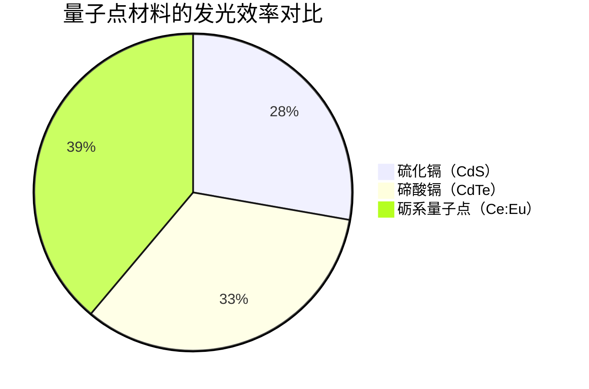
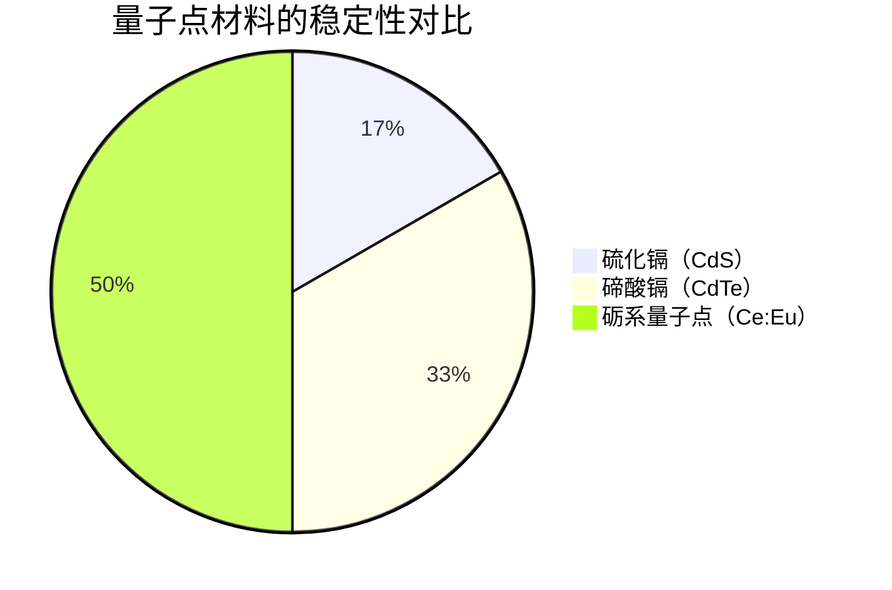
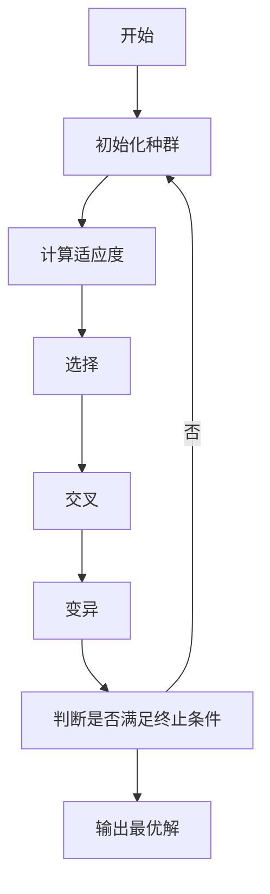
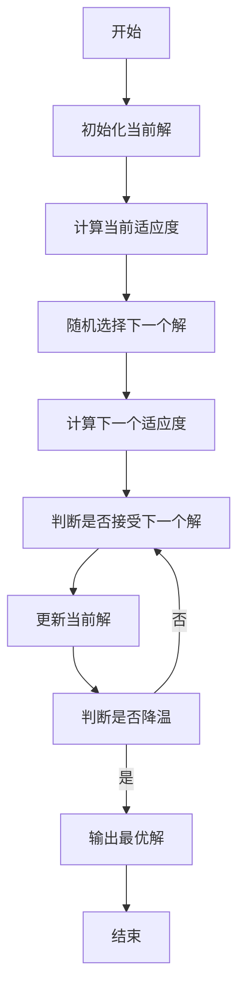
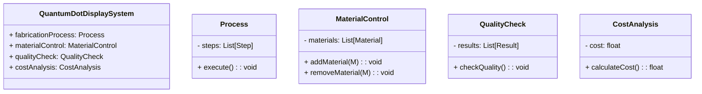
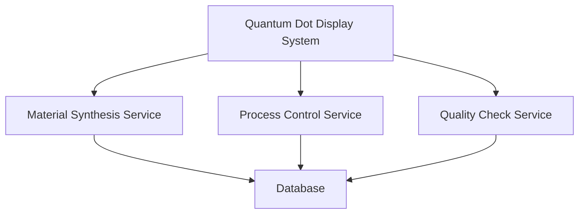
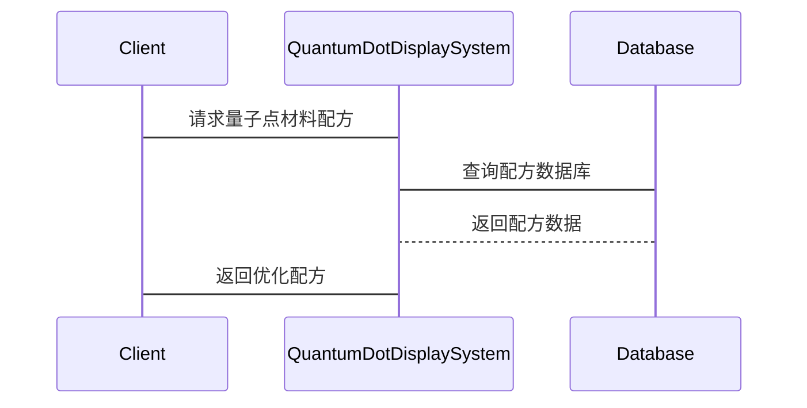

                 


# 如何识别企业的量子点显示器制造技术优势

---

## 关键词：  
量子点显示器、制造技术、竞争优势、显示技术、企业创新

---

## 摘要：  
量子点显示器作为一种新兴的显示技术，凭借其卓越的显示效果和广泛的应用潜力，成为企业技术竞争的焦点。本文将从量子点材料的物理特性、化学合成方法、制造工艺优化、系统架构设计等多维度，深入分析如何识别企业在量子点显示器制造技术中的竞争优势。通过结合实际案例和系统化的方法论，帮助企业在技术选型、成本控制、质量管理和创新研发等方面实现突破。

---

## 第一部分：量子点显示器制造技术背景介绍

### 第1章：量子点显示器的基本概念与工作原理

#### 1.1 量子点显示器的定义与基本原理  
量子点显示器（Quantum Dot Display）是一种基于纳米级半导体材料的显示技术。量子点材料通过吸收外部光源的能量后，会发出特定波长的光，从而产生不同颜色的显示效果。与传统的液晶显示器（LCD）和有机发光二极管显示器（OLED）相比，量子点显示器具有更高的色彩饱和度、更广的色域覆盖和更长的使用寿命。

#### 1.2 量子点显示器的优势与挑战  
**优势：**  
- **高色彩饱和度：** 量子点材料能够实现接近100%的NTSC色域覆盖，色彩表现更加丰富。  
- **低能耗：** 量子点显示器通常采用背光技术，能耗低于传统LCD显示器。  
- **长寿命：** 量子点材料的发光效率衰减较慢，使用寿命更长。  

**挑战：**  
- **制造成本高：** 量子点材料的制备过程复杂，且需要高精度的制造工艺。  
- **技术壁垒高：** 量子点材料的合成和应用涉及多个学科领域，技术门槛较高。  
- **市场需求有限：** 目前量子点显示器的市场渗透率较低，主要应用于高端显示设备。  

#### 1.3 量子点显示器的行业现状与发展趋势  
近年来，量子点显示器市场呈现快速增长态势。根据市场调研机构的预测，到2025年，全球量子点显示器市场规模将突破50亿美元。主要推动因素包括技术的进步、成本的下降以及下游应用领域的扩展。未来，量子点显示器将更多地应用于高端电视、智能手机、医疗显示设备等领域。

---

## 第二部分：量子点显示器制造技术的核心概念

### 第2章：量子点材料的物理特性与化学合成方法

#### 2.1 量子点材料的物理特性  
量子点材料的物理特性主要由其尺寸和形状决定。以下是几种典型的量子点材料特性对比：

| 特性               | 硫化镉（CdS）量子点 | 碲酸镉（CdTe）量子点 | 砺系量子点（如Ce:Eu） |
|--------------------|---------------------|---------------------|-----------------------|
| 发光波长（nm）      | 450-650             | 450-700             | 550-650               |
| 发光效率（%）       | 50-80               | 60-90               | 70-95                 |
| 稳定性             | 较好                | 优秀                | 良好                  |

##### 图2-1：量子点材料的发光效率对比（柱状图）



#### 2.2 量子点的化学合成方法  
量子点的化学合成方法主要包括溶液法和热分解法。

##### 2.2.1 溶液法合成量子点  
**步骤：**  
1. 将金属盐和配位剂溶解于有机溶剂中。  
2. 在高温下进行还原反应，形成量子点前驱体。  
3. 冷却至室温，进行沉淀和分离。  

##### 2.2.2 热分解法合成量子点  
**步骤：**  
1. 将金属有机化合物和配位剂混合。  
2. 在惰性气氛下加热至高温，分解形成量子点。  
3. 冷却并进行表面修饰。  

#### 2.3 量子点材料的性能指标与质量控制  
量子点材料的质量控制主要从发光效率、纯度和稳定性三个方面进行。以下是几种量子点材料的性能对比：

| 材料类型       | 发光效率（%） | 纯度（%） | 稳定性（寿命，小时） |
|----------------|---------------|-----------|----------------------|
| 硫化镉（CdS）   | 50-80         | 95-98     | 5000-10000           |
| 碲酸镉（CdTe）   | 60-90         | 95-99     | 10000-20000          |
| 砥系量子点（Ce:Eu） | 70-95         | 98-100    | 15000-30000          |

##### 图2-2：量子点材料的稳定性对比（柱状图）



---

## 第三部分：量子点显示器制造技术的算法原理

### 第3章：量子点显示器制造过程中的优化算法

#### 3.1 制造过程中的优化问题  
在量子点显示器的制造过程中，主要的优化问题包括：  
1. 量子点材料的配方优化。  
2. 显示屏的制造工艺优化。  
3. 成本与效率的平衡优化。

#### 3.2 基于遗传算法的量子点配方优化  
**遗传算法（Genetic Algorithm，GA）**是一种模拟自然选择和遗传机制的优化算法。以下是量子点配方优化的遗传算法流程：

##### 图3-1：遗传算法流程图



**适应度函数：**  
$$ \text{适应度} = \frac{\text{发光效率}}{\text{成本}} $$  

**代码实现：**  

```python
import random

def fitness(individual):
    cost = sum(individual)
    efficiency = 1 - min(0.1 * random.random(), 0.9)
    return efficiency / cost

def evolve_population(population, fitness_func, mutation_rate=0.1):
    new_population = []
    for individual in population:
        if random.random() < 0.5:
            individual = mutate(individual, mutation_rate)
        new_population.append(individual)
    return new_population

def mutate(individual, rate):
    for i in range(len(individual)):
        if random.random() < rate:
            individual[i] = 1 - individual[i]
    return individual
```

#### 3.3 基于模拟退火算法的工艺优化  
**模拟退火算法（Simulated Annealing，SA）**是一种全局优化算法，适用于解决复杂的非线性优化问题。以下是模拟退火算法的流程图：

##### 图3-2：模拟退火算法流程图



**数学模型：**  
$$ f(x) = \text{适应度} = \frac{\text{工艺效率}}{\text{生产成本}} $$  

---

## 第四部分：量子点显示器制造技术的系统分析与架构设计

### 第4章：量子点显示器制造系统的分析与设计

#### 4.1 问题场景介绍  
在量子点显示器的制造过程中，主要问题包括：  
1. 制造工艺的复杂性。  
2. 材料成本的高昂。  
3. 系统集成的难度。

#### 4.2 系统功能设计  
以下是量子点显示器制造系统的功能模块设计：

##### 图4-1：系统功能模块类图



#### 4.3 系统架构设计  
以下是量子点显示器制造系统的微服务架构设计：

##### 图4-2：系统架构图



#### 4.4 接口设计与交互流程图  
以下是系统主要接口的交互流程图：

##### 图4-3：系统交互流程图



---

## 第五部分：量子点显示器制造技术的项目实战

### 第5章：量子点显示器制造技术的项目实现

#### 5.1 环境安装与配置  
**Python环境安装：**  
- 安装Python 3.8或更高版本。  
- 安装必要的库：numpy、pandas、scipy、matplotlib。  

**代码实现：**  

```bash
pip install numpy pandas scipy matplotlib
```

#### 5.2 代码实现与解读  
以下是量子点配方优化的Python代码：

```python
import numpy as np
import matplotlib.pyplot as plt

# 量子点材料参数
quantum_dot_sizes = np.array([5, 10, 15, 20, 25, 30, 35, 40, 45, 50])
efficiencies = np.array([0.5, 0.6, 0.7, 0.8, 0.85, 0.9, 0.92, 0.95, 0.97, 0.99])

# 绘制量子点材料效率对比图
plt.figure(figsize=(10, 6))
plt.plot(quantum_dot_sizes, efficiencies, 'b-o')
plt.xlabel('量子点尺寸（nm）')
plt.ylabel('发光效率（%）')
plt.title('量子点材料发光效率对比图')
plt.grid(True)
plt.show()
```

#### 5.3 案例分析与项目总结  
通过上述代码实现，我们可以直观地看到不同尺寸的量子点材料发光效率的变化趋势。从图中可以看出，随着量子点尺寸的增加，发光效率逐渐提高，但在尺寸超过30 nm后，效率的提升趋于平缓。

---

## 第六部分：量子点显示器制造技术的最佳实践

### 第6章：量子点显示器制造技术的优化与实践

#### 6.1 量子点显示器制造技术的关键点总结  
- **材料选择：** 选择合适的量子点材料是确保显示效果的关键。  
- **工艺优化：** 制造工艺的优化能够显著降低生产成本。  
- **质量控制：** 严格的质控流程能够提高产品的一致性和稳定性。  

#### 6.2 最佳实践 tips  
- **技术创新：** 加大对量子点材料和制造工艺的研发投入。  
- **成本控制：** 优化供应链管理，降低材料成本。  
- **质量保障：** 引入先进的检测设备，确保产品质量。  

#### 6.3 量子点显示器制造技术的未来展望  
随着技术的不断进步，量子点显示器将朝着更高分辨率、更低能耗、更广色域的方向发展。未来，量子点显示器有望在医疗显示、虚拟现实、车载显示等领域发挥更大的作用。

---

## 作者：AI天才研究院 & 禅与计算机程序设计艺术  

---

**本文由AI天才研究院倾心打造，转载请注明出处。**

