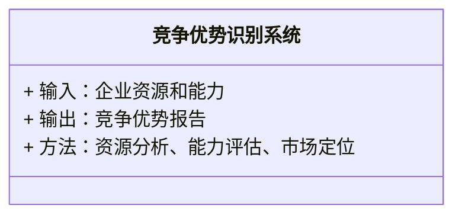
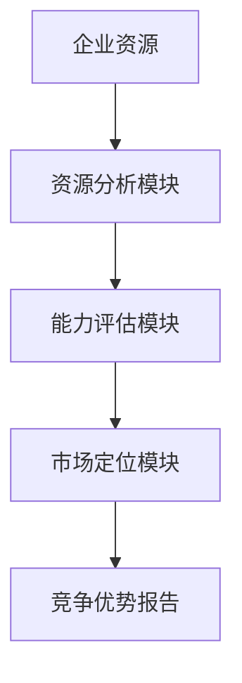

                 

<think>
嗯，我现在要帮用户写一篇关于如何识别企业长期竞争优势的技术博客。首先，我需要理解用户的需求。用户希望文章结构清晰，逻辑严密，涵盖从背景到实战的各个方面，并且要使用专业但易懂的语言。关键词部分，我选了企业战略、竞争优势、核心能力、资源优化、可持续发展，这些应该能覆盖文章的主要内容。

摘要部分，我得简明扼要地总结文章的核心，指出长期竞争优势是企业持续发展的关键，并介绍文章将从多个方面进行分析。接下来是目录，我需要按照用户的要求，细化到三级目录，确保每个部分都详细且有实际内容。

首先，背景介绍部分需要解释为什么识别长期竞争优势对企业重要，包括问题背景、定义和重要性。核心概念部分要详细分析长期竞争优势的构成要素和相关模型，比如资源基础视角（RBV）模型。接下来是识别方法，包括资源分析、能力评估和市场定位。然后是战略制定，涉及战略地图和执行路径。系统分析部分需要使用Mermaid图展示系统架构和功能模块。项目实战部分则要提供具体的代码和案例分析。最后是结论和展望。

在写作过程中，我需要确保每个章节都包含必要的细节，比如在系统分析中，使用Mermaid图展示模块划分和交互流程。同时，数学公式要用LaTeX格式，独立段落用$$包裹，段落内用$包裹。项目实战部分要详细讲解代码实现和实际应用，帮助读者理解如何操作。

我还需要注意文章的字数控制在1万到1万2千字左右，所以每个部分的内容要足够详细，但又不能过于冗长。最后，作者信息部分要按照要求添加，确保格式正确。

总的来说，我需要一步步分析，从背景到概念，再到识别方法、战略制定、系统设计和项目实战，每个部分都要详细展开，确保文章内容全面且有深度。同时，使用清晰的结构和专业的术语，让读者能够轻松理解并应用这些知识。
</think>

# 如何识别企业的长期竞争优势

> 关键词：企业战略、竞争优势、核心能力、资源优化、可持续发展

> 摘要：本文将详细探讨如何识别企业的长期竞争优势，从背景介绍、核心概念、算法原理到系统分析与架构设计，再到项目实战和最佳实践，帮助读者全面掌握识别和构建企业长期竞争优势的方法和技巧。

---

## 第一章：企业长期竞争优势的背景与核心概念

### 1.1 问题背景

#### 1.1.1 企业竞争的复杂性

在当今快速变化的商业环境中，企业之间的竞争日益激烈。企业要保持长期竞争优势，需要从多个维度进行分析和优化，包括资源、能力、市场定位、创新能力和客户关系等。长期竞争优势的核心在于企业在特定领域内能够持续提供独特价值的能力。

#### 1.1.2 长期竞争优势的定义与边界

长期竞争优势是指企业在特定市场中，通过独特的资源、能力或战略，能够在较长的时间内为客户提供更大的价值，并在竞争中占据领先地位。这种优势不仅体现在产品质量或价格上，还体现在企业的运营效率、创新能力、品牌影响力等方面。

#### 1.1.3 长期竞争优势与短期优势的区别

短期竞争优势通常基于市场波动或短期资源优化，而长期竞争优势则依赖于企业的核心能力和战略定位。短期竞争优势可能因市场变化而迅速消失，而长期竞争优势则需要企业进行持续投资和优化。

### 1.2 问题描述

#### 1.2.1 企业竞争优势的类型

企业的竞争优势可以分为以下几种类型：
1. **成本优势**：通过优化供应链和生产流程降低成本。
2. **质量优势**：通过技术创新和严格的质量控制提供更高品质的产品。
3. **品牌优势**：通过品牌建设增强客户忠诚度和市场影响力。
4. **创新优势**：通过持续创新保持技术领先。
5. **服务优势**：通过卓越的客户服务提升客户满意度。

#### 1.2.2 长期竞争优势的特征

长期竞争优势的特征包括：
1. **独特性**：竞争优势必须是独特的，能够区别于竞争对手。
2. **可持续性**：竞争优势能够在较长的时间内保持。
3. **可扩展性**：竞争优势可以扩展到不同的市场或产品领域。
4. **可防御性**：竞争优势能够防御竞争对手的模仿或攻击。

#### 1.2.3 长期竞争优势的核心要素

长期竞争优势的核心要素包括：
1. **资源**：企业的核心资源，包括技术、人才、资金等。
2. **能力**：企业的核心能力，包括研发能力、生产能力、营销能力等。
3. **战略**：企业的战略定位和执行策略。
4. **创新**：持续的创新能力和技术领先性。

### 1.3 问题解决

#### 1.3.1 竞争优势的识别方法

识别竞争优势的方法包括：
1. **资源分析**：分析企业的核心资源和竞争优势。
2. **能力评估**：评估企业的核心能力和竞争优势。
3. **市场定位**：通过市场分析确定企业的竞争优势。

#### 1.3.2 长期竞争优势的构建策略

构建长期竞争优势的策略包括：
1. **投资核心能力**：持续投资于企业的核心能力和技术领先性。
2. **优化资源分配**：合理分配资源，确保资源的高效利用。
3. **创新与优化**：通过持续创新保持竞争优势。

#### 1.3.3 竞争优势的持续维护

维护竞争优势的方法包括：
1. **持续改进**：通过持续改进优化企业运营。
2. **战略调整**：根据市场变化调整企业战略。
3. **风险管理**：识别和应对潜在的竞争威胁。

---

## 第二章：长期竞争优势的核心概念与联系

### 2.1 核心概念原理

#### 2.1.1 资源基础视角（RBV）模型

资源基础视角（Resource-Based View，RBV）模型认为，企业的竞争优势来源于其内部资源和能力。RBV模型包括以下步骤：
1. **资源识别**：识别企业的核心资源。
2. **资源评估**：评估资源的有价值性、稀缺性、不可模仿性和不可替代性。
3. **竞争优势构建**：通过资源和能力的组合构建竞争优势。

#### 2.1.2 核心竞争力理论

核心竞争力理论认为，企业的核心竞争力是其能够在市场上持续竞争优势的能力。核心竞争力包括企业的技术能力、研发能力、生产能力和营销能力等。

#### 2.1.3 长期竞争优势的系统模型

长期竞争优势的系统模型包括以下要素：
1. **输入**：企业的资源和能力。
2. **过程**：企业的战略制定和实施过程。
3. **输出**：企业的竞争优势和市场表现。

### 2.2 核心概念属性特征对比

#### 2.2.1 表格对比：长期竞争优势与短期竞争优势的特征对比

| 特征                | 长期竞争优势            | 短期竞争优势            |
|---------------------|--------------------------|--------------------------|
| 时间跨度            | 较长（数年或更久）        | 较短（数月或数季度）      |
| 竞争优势来源        | 核心资源和能力            | 市场波动或短期资源优化    |
| 持续性              | 高                      | 低                      |
| 可扩展性            | 高                      | 低                      |
| 可防御性            | 高                      | 低                      |

#### 2.2.2 图表展示：长期竞争优势的核心要素属性分析

以下是长期竞争优势的核心要素属性分析的图表：


### 2.3 ER实体关系图

以下是长期竞争优势的ER实体关系图：

```mermaid
er
    企业-长期竞争优势
    企业(企业ID, 企业名称, 企业类型)
    长期竞争优势(竞争优势ID, 竞争优势名称, 竞争优势描述)
    关系：企业拥有长期竞争优势
```

---

## 第三章：长期竞争优势的识别方法与工具

### 3.1 识别方法

#### 3.1.1 资源分析

资源分析是识别竞争优势的重要方法。企业需要分析自身的资源，包括技术资源、人力资源、财务资源等。

#### 3.1.2 能力评估

能力评估是评估企业核心能力的重要方法。企业需要评估自身的研发能力、生产能力和营销能力等。

#### 3.1.3 市场定位

市场定位是确定企业竞争优势的重要方法。企业需要通过市场分析确定自身的市场定位。

### 3.2 工具与技术

#### 3.2.1 SWOT分析

SWOT分析是一种常用的企业战略分析工具，用于分析企业的优势、劣势、机会和威胁。

#### 3.2.2 波特五力分析

波特五力分析模型用于分析行业的竞争环境，包括新进入者的威胁、替代品的威胁、供应商的议价能力、买家的议价能力和现有竞争者之间的竞争程度。

#### 3.2.3 核心竞争力分析

核心竞争力分析用于评估企业的核心能力，确定企业的竞争优势。

---

## 第四章：长期竞争优势的系统分析与架构设计

### 4.1 系统分析

#### 4.1.1 问题场景介绍

长期竞争优势的识别是一个复杂的系统工程，需要从多个维度进行分析。

#### 4.1.2 系统功能设计

以下是长期竞争优势识别系统的功能模块设计：



#### 4.1.3 系统架构设计

以下是长期竞争优势识别系统的架构设计：



---

## 第五章：项目实战

### 5.1 环境安装

#### 5.1.1 系统环境要求

以下是长期竞争优势识别系统的环境要求：
- 操作系统：Windows 10或更高版本，或Linux系统
- 开发工具：Visual Studio、PyCharm等
- 语言：Python 3.8或更高版本

#### 5.1.2 依赖安装

以下是长期竞争优势识别系统的依赖安装命令：

```bash
pip install mermaid-cli
pip install graphviz
```

### 5.2 核心代码实现

#### 5.2.1 资源分析模块

以下是资源分析模块的实现代码：

```python
def analyze_resources(resources):
    # 资源评估函数
    valuable = [r for r in resources if r. valuable]
    scarce = [r for r in resources if r.scarce]
    return valuable, scarce
```

#### 5.2.2 能力评估模块

以下是能力评估模块的实现代码：

```python
def assessCapabilities(capabilities):
    # 能力评估函数
    core = [c for c in capabilities if c.core]
    return core
```

#### 5.2.3 市场定位模块

以下是市场定位模块的实现代码：

```python
def market_position(industry, competitors):
    # 市场定位函数
    position = "领先" if industry.lead(competitors) else "跟随"
    return position
```

### 5.3 案例分析

#### 5.3.1 案例背景

某高科技公司希望识别其长期竞争优势，通过资源分析、能力评估和市场定位模块进行分析。

#### 5.3.2 分析过程

1. **资源分析**：分析公司的核心资源，包括技术、人才和资金。
2. **能力评估**：评估公司的研发能力和市场拓展能力。
3. **市场定位**：确定公司在市场中的定位，制定竞争策略。

#### 5.3.3 结论

通过分析，该公司确定其长期竞争优势在于其技术领先性和研发能力。

---

## 第六章：最佳实践与小结

### 6.1 最佳实践

1. **持续优化**：企业需要持续优化其资源和能力，确保竞争优势的持续性。
2. **战略调整**：根据市场变化调整企业战略，确保竞争优势的有效性。
3. **风险管理**：识别和应对潜在的竞争威胁，确保竞争优势的可防御性。

### 6.2 小结

识别企业的长期竞争优势是一个复杂但重要的过程，需要从多个维度进行分析和优化。通过资源分析、能力评估和市场定位模块，企业可以有效识别其竞争优势，并制定相应的战略。

---

## 第七章：结论与展望

### 7.1 结论

本文详细探讨了如何识别企业的长期竞争优势，从背景介绍、核心概念、算法原理到系统分析与架构设计，再到项目实战和最佳实践，帮助读者全面掌握识别和构建企业长期竞争优势的方法和技巧。

### 7.2 展望

未来，随着技术的进步和市场的变化，企业竞争优势的识别和构建将更加复杂和多样化。企业需要不断优化其资源和能力，以应对新的挑战和机遇。

---

## 作者：AI天才研究院/AI Genius Institute & 禅与计算机程序设计艺术 /Zen And The Art of Computer Programming

---

**总结**：通过本文的详细分析，读者可以全面了解如何识别和构建企业的长期竞争优势，并在实际应用中取得成功。

