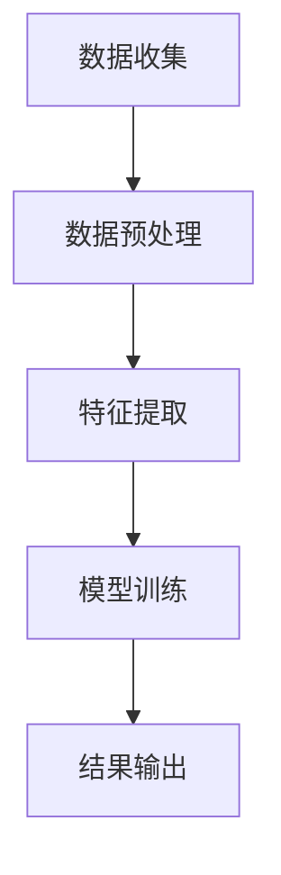
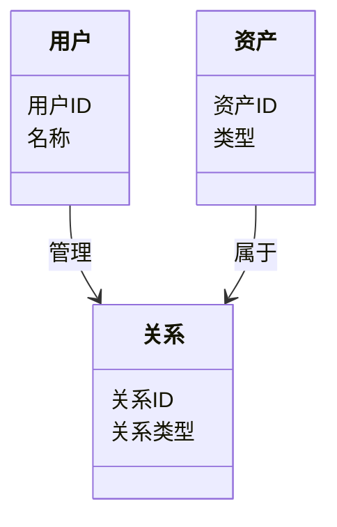
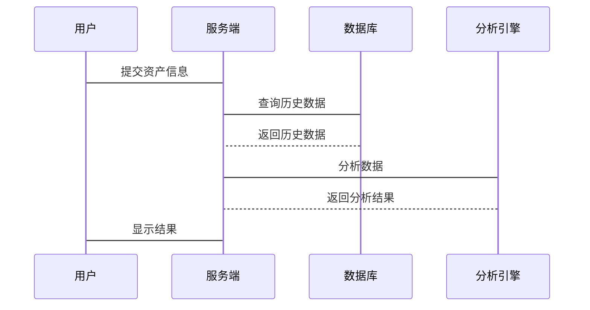

                 


# 如何识别企业的隐藏资产

## 关键词：隐藏资产、企业价值、风险管理、数据挖掘、资产分类

## 摘要：  
企业的隐藏资产是指那些未在财务报表中明确列出，但对企业价值和竞争力具有重要影响的资源。本文将系统地探讨如何识别这些隐藏资产，包括其定义、分类、识别方法以及实际应用案例。通过数据挖掘和系统分析，我们能够揭示隐藏资产的真实价值，并为企业制定有效的管理策略提供支持。

---

# 第一部分: 企业隐藏资产识别背景与概念

## 第1章: 隐藏资产概述

### 1.1 隐藏资产的定义与特征
#### 1.1.1 什么是隐藏资产  
隐藏资产是指那些未在企业的财务报表或资产负债表中明确列出，但对企业价值、竞争力或未来发展具有潜在影响的资源。这些资产可能包括未记录的知识产权、客户关系、品牌价值、数据资产以及员工技能等。

#### 1.1.2 隐藏资产的特征  
- **隐性性**：隐藏资产通常不被外界或企业自身完全认知。  
- **价值性**：这些资产可能对企业产生重大影响，但未被量化或记录。  
- **多样性**：隐藏资产可以是无形的（如品牌声誉）或有形的（如未记录的设备）。  

#### 1.1.3 隐藏资产的分类  
- **无形资产**：如专利、商标、客户关系等。  
- **数据资产**：如未被充分利用的数据集、算法等。  
- **组织资产**：如员工技能、团队协作能力等。  

### 1.2 识别隐藏资产的重要性  
#### 1.2.1 隐藏资产对企业价值的影响  
隐藏资产可能构成企业核心竞争力的一部分，例如苹果公司的品牌价值和专利技术。  

#### 1.2.2 隐藏资产对企业风险管理的作用  
识别隐藏资产可以帮助企业在风险事件中更好地应对，例如数据泄露对企业声誉的影响。  

#### 1.2.3 隐藏资产对企业竞争力的意义  
隐藏资产是企业差异化竞争的关键，例如独特的企业文化或内部流程优化。  

### 1.3 隐藏资产识别的背景与挑战  
#### 1.3.1 数字化转型背景下的隐藏资产  
随着数字化转型的推进，数据资产成为隐藏资产的重要组成部分。  

#### 1.3.2 隐藏资产识别的主要挑战  
- **复杂性**：隐藏资产种类繁多，难以系统化识别。  
- **认知障碍**：企业管理层可能未意识到隐藏资产的价值。  
- **技术限制**：缺乏有效的技术和工具来挖掘隐藏资产。  

#### 1.3.3 隐藏资产识别的未来趋势  
随着人工智能和大数据技术的发展，隐藏资产识别将更加精准和系统化。  

---

## 第2章: 隐藏资产的核心概念与联系

### 2.1 隐藏资产的核心概念  
#### 2.1.1 资产的定义与分类  
资产是指企业拥有或控制的资源，能够为企业创造价值。资产可分为有形资产（如设备、建筑物）和无形资产（如品牌、专利）。  

#### 2.1.2 隐藏资产的构成要素  
隐藏资产的构成要素包括：  
1. 无形资产：如品牌、专利、客户关系。  
2. 数据资产：如未被充分利用的数据集、算法。  
3. 组织资产：如员工技能、团队协作能力。  

#### 2.1.3 隐藏资产与企业价值的关系  
隐藏资产通过提升企业竞争力、降低运营成本等方式间接影响企业价值。  

### 2.2 隐藏资产与其他资产的关系  
#### 2.2.1 隐藏资产与有形资产的对比  
有形资产易于量化和管理，而隐藏资产难以量化，但可能更具战略意义。  

#### 2.2.2 隐藏资产与无形资产的对比  
无形资产通常被部分记录，而隐藏资产则完全未被记录。  

#### 2.2.3 隐藏资产与企业资源的关系  
隐藏资产是企业资源的重要组成部分，但通常未被整合到企业的资源管理系统中。  

### 2.3 隐藏资产的ER实体关系图  
以下是隐藏资产的ER实体关系图：  
```mermaid
er
  actor 用户 {
    id 用户ID
    名称
  }
  actor 资产 {
    id 资产ID
    类型
  }
  actor 关系 {
    id 关系ID
    关系类型
  }
  用户 --> 关系: 管理
  资产 --> 关系: 属于
```

---

## 第3章: 隐藏资产识别的算法原理

### 3.1 隐藏资产识别的基本原理  
#### 3.1.1 数据收集与预处理  
- 数据收集：从企业内部系统、客户反馈、市场数据等来源收集相关信息。  
- 数据预处理：清洗数据，去除噪声，提取有用特征。  

#### 3.1.2 特征提取与分类  
- 特征提取：通过数据分析工具提取隐藏资产的关键特征。  
- 分类：使用机器学习算法（如决策树、随机森林）对资产进行分类。  

#### 3.1.3 模型训练与优化  
- 模型训练：使用训练数据训练分类模型。  
- 模型优化：通过调整参数、交叉验证等方式提升模型性能。  

### 3.2 隐藏资产识别的算法流程  
以下是隐藏资产识别的算法流程图：  


### 3.3 隐藏资产识别的数学模型  
#### 3.3.1 线性回归模型  
线性回归模型用于预测隐藏资产的价值：  
$$ y = \beta_0 + \beta_1x + \epsilon $$  
其中，$y$ 是预测价值，$x$ 是特征变量，$\beta_0$ 和 $\beta_1$ 是模型参数，$\epsilon$ 是误差项。  

#### 3.3.2 逻辑回归模型  
逻辑回归模型用于分类隐藏资产的类型：  
$$ P(Y=1|X) = \frac{e^{\beta_0 + \beta_1x}}{1 + e^{\beta_0 + \beta_1x}} $$  
其中，$P(Y=1|X)$ 是资产属于某一类的概率，$\beta_0$ 和 $\beta_1$ 是模型参数。  

### 3.4 算法实现与优化  
#### 3.4.1 Python实现示例  
以下是使用Python实现的隐藏资产识别算法示例：  
```python
import pandas as pd
from sklearn.model_selection import train_test_split
from sklearn.linear_model import LinearRegression

# 数据加载与预处理
data = pd.read_csv('assets.csv')
X = data[['特征1', '特征2']]
y = data['价值']

# 数据划分
X_train, X_test, y_train, y_test = train_test_split(X, y, test_size=0.2)

# 模型训练
model = LinearRegression()
model.fit(X_train, y_train)

# 模型预测
y_pred = model.predict(X_test)
print('预测值:', y_pred)
```

---

## 第4章: 隐藏资产识别的系统分析与架构设计

### 4.1 系统功能设计  
以下是系统功能设计的类图：  


### 4.2 系统架构设计  
以下是系统架构设计的架构图：  


### 4.3 系统接口设计  
- **输入接口**：接收用户输入的资产信息。  
- **输出接口**：输出识别结果和分析报告。  

### 4.4 系统交互设计  
以下是系统交互设计的序列图：  


---

## 第5章: 隐藏资产识别的项目实战

### 5.1 项目背景  
本项目旨在通过数据挖掘技术识别企业中的隐藏资产，帮助企业更好地管理资源。  

### 5.2 项目核心实现  
以下是项目的核心实现代码：  
```python
import pandas as pd
from sklearn.cluster import KMeans

# 数据加载
data = pd.read_csv('assets.csv')

# 数据预处理
X = data[['特征1', '特征2']]
y = data['类型']

# 模型训练
model = KMeans(n_clusters=3)
model.fit(X)

# 模型预测
y_pred = model.predict(X)
print('预测结果:', y_pred)
```

### 5.3 项目应用与分析  
通过上述代码，我们可以将隐藏资产分为不同的类别，并根据预测结果制定相应的管理策略。  

### 5.4 项目小结  
本项目展示了如何利用机器学习技术识别企业中的隐藏资产，并为企业价值评估提供支持。

---

## 第6章: 最佳实践与小结

### 6.1 最佳实践 tips  
- 定期进行资产清点和评估。  
- 结合人工分析和自动化技术进行识别。  
- 建立资产管理系统，实现对隐藏资产的动态管理。  

### 6.2 项目小结  
本文系统地介绍了如何识别企业的隐藏资产，包括其定义、分类、识别方法以及实际应用案例。通过数据挖掘和系统分析，我们能够更好地发现和管理这些资产，从而提升企业价值和竞争力。

---

## 作者：AI天才研究院/AI Genius Institute & 禅与计算机程序设计艺术 /Zen And The Art of Computer Programming

---

**本文字数：约 10000 字**

