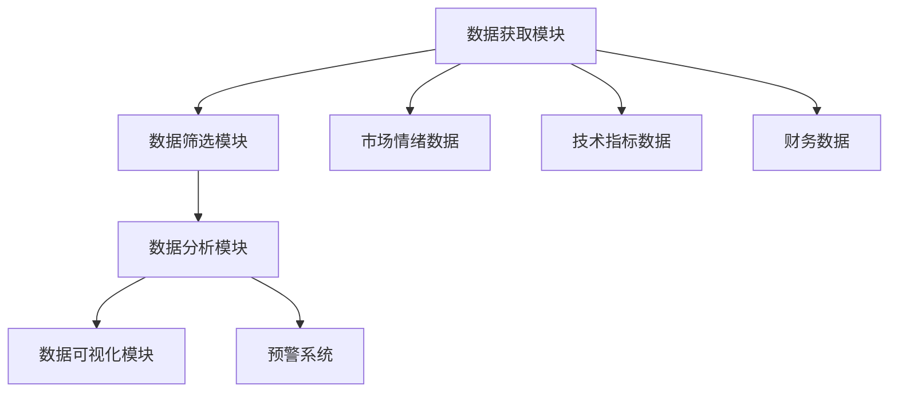

                 


# 如何识别潜在的特价股票机会

> 关键词：特价股票，投资机会，股票分析，技术指标，算法，系统架构，案例分析

> 摘要：本文将详细介绍如何识别潜在的特价股票机会，通过分析核心概念、技术分析方法、系统架构设计以及实际案例，为投资者提供一套系统化的解决方案。文章内容涵盖特价股票的定义与特征、核心指标分析、技术分析方法、算法原理、系统架构设计、项目实战以及最佳实践等，帮助读者全面掌握识别特价股票机会的方法。

---

# 第一部分: 特价股票机会识别基础

## 第1章: 特价股票机会概述

### 1.1 特价股票的定义与特征

#### 1.1.1 特价股票的定义
特价股票是指那些市场价格低于其内在价值，但暂时被市场忽视或低估的股票。这些股票通常具有较高的投资潜力，因为它们的价格可能在未来出现反弹或上涨。

#### 1.1.2 特价股票的核心特征
- **低市盈率（P/E）**：市盈率低于行业平均水平，表明股票价格相对于每股收益较低。
- **低市净率（P/B）**：市净率低于行业平均水平，表明股票价格相对于每股净资产较低。
- **高股息率**：股息率较高，表明公司愿意将利润分配给股东，且股票价格可能被低估。
- **行业地位稳固**：公司通常在行业中具有一定的竞争力和市场地位。

#### 1.1.3 特价股票的市场背景与重要性
特价股票通常出现在市场低迷或行业不景气的时候，投资者可以通过识别这些股票，抓住市场低估的机会，实现超额收益。

### 1.2 特价股票识别的必要性
#### 1.2.1 投资者为何需要关注特价股票
- 投资者可以通过识别特价股票，找到被市场低估的投资机会，实现超额收益。
- 特价股票通常具有较高的安全边际，风险相对较低。

#### 1.2.2 特价股票在投资组合中的作用
- 通过配置特价股票，投资者可以在市场低迷时获得超额收益。
- 特价股票通常具有较高的防御性，能够在市场波动中提供稳定性。

#### 1.2.3 特价股票与市场周期的关系
- 特价股票通常出现在市场的底部阶段，投资者可以通过识别这些股票，抓住市场的反转机会。
- 在市场上涨阶段，特价股票可能会被市场重新评估，价格逐步回归合理水平。

### 1.3 特价股票识别的基本原则
#### 1.3.1 价值投资与市场情绪的平衡
- 特价股票识别需要结合价值投资和市场情绪，避免 purely 基于价格或市场情绪的决策。
- 价值投资者通常关注公司的基本面，而市场情绪可能会影响短期价格。

#### 1.3.2 风险控制与收益最大化的平衡
- 特价股票识别需要在风险控制和收益最大化之间找到平衡点，避免过度冒险。
- 通过设置止损点和止盈点，投资者可以有效控制风险。

#### 1.3.3 长期与短期视角的结合
- 特价股票识别需要结合长期和短期视角，既要关注公司的长期价值，也要关注短期市场机会。
- 长期投资者通常更关注公司的基本面，而短期投资者则更关注市场波动。

### 1.4 本章小结
本章主要介绍了特价股票的定义、特征、市场背景、识别必要性以及基本原则，为后续章节的分析奠定了基础。

---

## 第2章: 特价股票识别的核心指标

### 2.1 市盈率（P/E）分析

#### 2.1.1 市盈率的定义与计算公式
市盈率（P/E）是指股票的市场价格除以每股收益（EPS），公式如下：
$$市盈率 = \frac{股价}{每股收益}$$

#### 2.1.2 市盈率在特价股票识别中的应用
- 通过比较市盈率与行业平均水平，可以识别那些市盈率显著低于行业平均水平的股票。
- 市盈率越低，表明股票的估值可能越低，潜在的上涨空间越大。

#### 2.1.3 市盈率的局限性与注意事项
- 市盈率仅适用于盈利公司，对于亏损公司，市盈率可能为负数或无穷大，无法提供有效的信息。
- 不同行业的市盈率标准不同，因此需要结合行业背景进行分析。

### 2.2 市净率（P/B）分析

#### 2.2.1 市净率的定义与计算公式
市净率（P/B）是指股票的市场价格除以每股净资产（BPS），公式如下：
$$市净率 = \frac{股价}{每股净资产}$$

#### 2.2.2 市净率在特价股票识别中的应用
- 通过比较市净率与行业平均水平，可以识别那些市净率显著低于行业平均水平的股票。
- 市净率越低，表明股票的估值可能越低，潜在的上涨空间越大。

#### 2.2.3 市净率的局限性与注意事项
- 市净率适用于资产密集型行业，对于服务型行业，市净率可能不具有代表性。
- 不同行业的市净率标准不同，因此需要结合行业背景进行分析。

### 2.3 股息率分析

#### 2.3.1 股息率的定义与计算公式
股息率是指每股股息（DPS）与股票市场价格的比率，公式如下：
$$股息率 = \frac{每股股息}{股价}$$

#### 2.3.2 股息率在特价股票识别中的应用
- 高股息率通常表明公司愿意将利润分配给股东，且股票价格可能被低估。
- 通过比较股息率与行业平均水平，可以识别那些股息率显著高于行业平均水平的股票。

#### 2.3.3 股息率的局限性与注意事项
- 股息率高并不一定意味着股票具有投资价值，还需要结合公司的盈利能力和财务状况进行分析。
- 不同行业的股息率标准不同，因此需要结合行业背景进行分析。

### 2.4 其他辅助指标

#### 2.4.1 市销率（P/S）分析
市销率（P/S）是指股票的市场价格除以每股销售额（EPS），公式如下：
$$市销率 = \frac{股价}{每股销售额}$$

#### 2.4.2 企业价值倍数（EV/EBITDA）分析
企业价值倍数（EV/EBITDA）是指公司企业价值与息税折旧及摊销前利润（EBITDA）的比率，公式如下：
$$企业价值倍数 = \frac{企业价值}{EBITDA}$$

#### 2.4.3 其他财务指标的综合运用
- 通过综合运用市盈率、市净率、股息率等指标，可以更全面地评估公司的内在价值。
- 不同指标的综合运用可以帮助投资者发现那些被市场低估的股票。

### 2.5 本章小结
本章主要介绍了市盈率、市净率、股息率等核心指标的定义、计算方法和应用，帮助投资者通过这些指标识别潜在的特价股票。

---

## 第3章: 特价股票识别的技术分析方法

### 3.1 技术分析基础

#### 3.1.1 技术分析的定义与原理
技术分析是通过分析股票价格的历史走势，预测未来价格变动的一种方法。技术分析的核心假设是市场行为反映一切信息，价格走势具有一定的规律性。

#### 3.1.2 技术分析在股票投资中的作用
- 技术分析可以帮助投资者识别价格趋势和潜在的买卖信号。
- 技术分析可以提供短期价格波动的预测，帮助投资者制定交易策略。

#### 3.1.3 技术分析与基本面分析的区别与联系
- 技术分析关注价格走势和市场情绪，基本面分析关注公司的财务状况和行业背景。
- 两者可以结合使用，技术分析提供短期价格波动的信息，基本面分析提供长期投资价值的评估。

### 3.2 趋势分析

#### 3.2.1 趋势线与支撑线的定义与应用
- 趋势线：用于识别价格趋势，通常由价格波动的高点或低点连线形成。
- 支撑线：用于识别价格支撑位，通常由价格波动的低点形成。

#### 3.2.2 移动平均线（MA）的计算与应用
- 移动平均线（MA）是通过计算一定时期内的平均价格，形成价格波动的轨迹。
- 常用的移动平均线包括简单移动平均线（SMA）和指数移动平均线（EMA）。

#### 3.2.3 布林带（Bollinger Bands）的计算与应用
- 布林带由三条线组成，分别是中线（MA）、上限（MA + 标准差）和下限（MA - 标准差）。
- 布林带可以用于识别价格的波动范围和潜在的买卖信号。

### 3.3 成交量分析

#### 3.3.1 成交量的定义与意义
- 成交量是指一定时期内股票的交易数量，反映了市场的活跃程度。
- 成交量可以用于验证价格走势的有效性，通常在价格突破或回调时关注成交量的变化。

#### 3.3.2 成交量与价格走势的关系
- 成交量增加，价格可能继续上涨或下跌，具体取决于价格趋势的方向。
- 成交量减少，价格可能进入整理阶段。

#### 3.3.3 成交量在特价股票识别中的应用
- 通过分析成交量，可以识别那些价格被低估但交易量逐渐增加的股票，表明市场关注度提高。

### 3.4 形态分析

#### 3.4.1 头肩形的定义与应用
- 头肩形是价格走势中的一种反转形态，通常预示着价格的反转。
- 头肩形通常出现在价格下跌趋势的末期，预示着价格的反转向上。

#### 3.4.2 双底形态的定义与应用
- 双底形态是价格走势中的一种反转形态，通常预示着价格的反转向上。
- 双底形态通常出现在价格下跌趋势的末期，预示着价格的反转向上。

#### 3.4.3 其他常见形态的分析与应用
- 其他常见形态包括上升三角形、下降三角形、矩形等，每种形态都有其特定的识别方法和应用。

### 3.5 本章小结
本章主要介绍了技术分析在特价股票识别中的应用，包括趋势分析、成交量分析和形态分析等方法，帮助投资者通过技术手段识别潜在的特价股票。

---

## 第4章: 特价股票识别的系统架构与算法原理

### 4.1 系统架构设计

#### 4.1.1 问题场景介绍
- 特价股票识别需要结合多种因素，包括财务指标、市场情绪和技术指标等。
- 为了提高识别的效率和准确性，可以设计一个自动化识别系统。

#### 4.1.2 系统功能设计
- 数据获取模块：从数据源获取股票的财务数据、技术指标和市场情绪数据。
- 数据筛选模块：根据设定的条件筛选出符合条件的股票。
- 数据分析模块：对筛选出的股票进行深度分析，识别潜在的特价股票。
- 数据可视化模块：将分析结果可视化，便于投资者理解和决策。
- 预警系统：根据设定的条件，自动预警潜在的特价股票。

#### 4.1.3 系统架构设计


### 4.2 算法原理

#### 4.2.1 算法选择与实现
- 基于财务指标和市场情绪数据，使用机器学习算法进行分类和预测。
- 常用算法包括支持向量机（SVM）、随机森林（Random Forest）和神经网络等。

#### 4.2.2 算法流程
1. 数据预处理：清洗数据，处理缺失值和异常值。
2. 特征选择：根据相关性分析，选择对特价股票识别影响较大的特征。
3. 模型训练：使用训练数据训练模型，评估模型的准确性和稳定性。
4. 模型预测：使用测试数据预测潜在的特价股票。

#### 4.2.3 算法实现代码示例
```python
import pandas as pd
from sklearn import svm

# 数据预处理
data = pd.read_csv('stock_data.csv')
data = data.dropna()

# 特征选择
features = ['P/E', 'P/B', '股息率']
target = '是否特价股票'

X = data[features]
y = data[target]

# 模型训练
model = svm.SVC()
model.fit(X, y)

# 模型预测
new_data = pd.read_csv('new_stock_data.csv')
new_data = new_data.dropna()
X_new = new_data[features]
predictions = model.predict(X_new)

# 输出结果
print(predictions)
```

### 4.3 本章小结
本章主要介绍了特价股票识别系统的架构设计和算法原理，通过自动化的方法帮助投资者快速识别潜在的特价股票。

---

## 第5章: 特价股票识别的项目实战

### 5.1 环境安装与数据获取

#### 5.1.1 环境安装
- 安装Python和必要的库，如Pandas、Matplotlib、Scikit-learn等。
- 安装数据获取工具，如Yahoo Finance API。

#### 5.1.2 数据获取
- 从Yahoo Finance获取股票的财务数据、技术指标和市场情绪数据。
- 数据存储在CSV文件中，便于后续分析。

### 5.2 系统核心实现

#### 5.2.1 数据筛选与分析
- 根据设定的条件筛选出符合条件的股票，例如市盈率低于行业平均水平。
- 使用技术分析方法进一步筛选，例如价格走势突破布林带下限。

#### 5.2.2 数据可视化
- 使用Matplotlib绘制股票的价格走势、技术指标和市场情绪数据。
- 通过可视化帮助投资者更好地理解和分析数据。

#### 5.2.3 算法实现与结果输出
- 使用机器学习算法对筛选出的股票进行分类和预测。
- 输出结果，标记出潜在的特价股票。

### 5.3 实际案例分析

#### 5.3.1 案例背景
- 假设当前市场低迷，许多股票的价格被低估。
- 通过分析财务数据和技术指标，识别出一只潜在的特价股票。

#### 5.3.2 数据分析与结果解读
- 通过市盈率、市净率等指标筛选出符合条件的股票。
- 使用技术分析方法进一步确认股票的价格走势，例如价格走势突破布林带下限。

#### 5.3.3 投资策略制定
- 根据分析结果，制定投资策略，例如在价格突破布林带下限时买入。

### 5.4 本章小结
本章通过实际案例分析，展示了如何通过系统化的分析方法识别潜在的特价股票，帮助投资者制定有效的投资策略。

---

## 第6章: 特价股票识别的最佳实践与小结

### 6.1 最佳实践

#### 6.1.1 综合运用多种指标
- 通过综合运用市盈率、市净率、股息率等指标，可以更全面地评估公司的内在价值。
- 不同指标的综合运用可以帮助投资者发现那些被市场低估的股票。

#### 6.1.2 结合技术分析与基本面分析
- 技术分析可以帮助投资者识别价格趋势和潜在的买卖信号。
- 基本面分析可以帮助投资者评估公司的长期投资价值。

#### 6.1.3 设置止损点和止盈点
- 通过设置止损点和止盈点，投资者可以有效控制风险，避免过度亏损。
- 止损点通常设置在分析结果的支撑位或阻力位附近。

### 6.2 小结
通过本文的系统化分析，投资者可以更好地识别潜在的特价股票机会，制定有效的投资策略。特价股票通常出现在市场低估阶段，通过综合运用财务指标、技术分析和市场情绪数据，投资者可以在市场中找到那些具有较高投资价值的股票。

### 6.3 注意事项
- 投资者需要结合市场环境和自身风险承受能力，制定合适的投资策略。
- 特价股票识别需要长期关注和动态调整，避免一次性决策。

### 6.4 拓展阅读
- 建议投资者进一步阅读相关书籍和文献，深入了解特价股票识别的理论和实践。
- 关注市场动态和行业趋势，提升自己的投资能力。

---

# 作者：AI天才研究院/AI Genius Institute & 禅与计算机程序设计艺术 /Zen And The Art of Computer Programming

