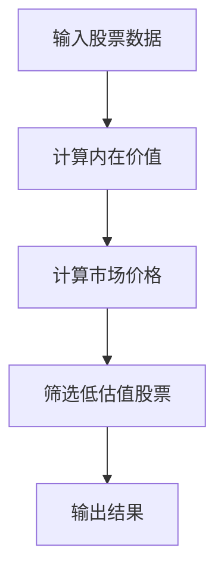

                 

<think>
好，我现在需要根据用户的要求，撰写一篇关于“如何运用格雷厄姆理念寻找低估值股票”的技术博客文章。首先，我需要明确文章的结构，包括背景介绍、核心概念、算法部分、系统分析、项目实战、最佳实践等部分。同时，每个部分都需要详细展开，确保内容专业且易于理解。

首先，背景介绍部分，我需要解释什么是价值投资，本杰明·格雷厄姆的贡献，以及低估值股票的基本概念。这部分要让读者对价值投资有一个初步的了解，同时明确文章的重点——寻找低估值股票。

接下来是核心概念，包括安全边际、内在价值和低估值股票的筛选标准。这部分需要详细解释每个概念，确保读者能够理解格雷厄姆的理念，并知道如何应用这些理论来寻找低估值股票。

然后是算法部分，这里可能需要讲解现金流折现法等计算内在价值的方法。我需要使用数学公式来描述，并提供一个详细的步骤说明和案例分析，帮助读者理解如何实际操作。

系统分析部分，我需要设计一个低估值股票筛选系统的架构，包括功能模块和系统架构图。这部分可能需要使用Mermaid图来展示系统结构，确保清晰明了。

项目实战部分，我会选择一个具体的股票进行案例分析，并提供Python代码实现筛选过程。这不仅展示了理论的应用，还让读者能够实际操作。

最后，最佳实践部分，我会总结寻找低估值股票的关键点，提醒读者注意的地方，并提供进一步学习的资源。

整个过程中，我需要确保语言专业但不晦涩，逻辑清晰，结构紧凑。同时，每个部分都要详细展开，避免遗漏关键点。可能还需要检查每个小节是否符合用户的要求，确保文章整体字数在10000到12000字之间，并且格式正确。

总的来说，我需要一步步地构建文章内容，从背景到理论，再到实际应用，确保读者能够系统地理解并掌握如何运用格雷厄姆理念寻找低估值股票。
</think>

# 如何运用格雷厄姆理念寻找低估值股票

> 关键词：价值投资、本杰明·格雷厄姆、低估值股票、内在价值、安全边际

> 摘要：本文深入探讨了如何运用本杰明·格雷厄姆的价值投资理念来寻找低估值股票。文章首先介绍了格雷厄姆的投资理论和低估值股票的基本概念，然后详细讲解了安全边际、内在价值等核心概念。接着，通过现金流折现法等数学模型，展示了如何计算内在价值，并结合具体案例分析了低估值股票的筛选标准。最后，本文提出了构建低估值股票筛选系统的思路，并通过Python代码实现了一个简单的筛选模型。

---

## 第一部分: 格雷厄姆投资理念与低估值股票概述

### 第1章: 价值投资与低估值股票的基本概念

#### 1.1 价值投资的定义与核心理念

##### 1.1.1 价值投资的起源与发展
价值投资是一种长期投资策略，起源于20世纪初，由本杰明·格雷厄姆和戴维德·多德共同提出。格雷厄姆是价值投资的奠基人，他的理念强调以低于内在价值的价格购买股票，以确保投资的安全性。

##### 1.1.2 价值投资的核心原则
格雷厄姆的价值投资理论基于以下核心原则：
1. **安全边际**：以低于内在价值的价格购买股票，确保投资的安全性。
2. **内在价值**：股票的真正价值是其未来现金流的现值，而非市场的市价。
3. **市场先生**：市场的波动性是投资机会的来源，而非投资决策的依据。

##### 1.1.3 低估值股票的定义与特点
低估值股票是指市场价格低于其内在价值的股票。这类股票通常具有以下特点：
- 市盈率（P/E）和市净率（P/B）低于行业平均水平。
- 股票价格在市场波动中被低估，具有较大的上涨潜力。

#### 1.2 本杰明·格雷厄姆的生平与贡献

##### 1.2.1 格雷厄姆的学术背景
格雷厄姆是哥伦比亚大学的教授，他的教学和研究为价值投资理论奠定了基础。

##### 1.2.2 格雷厄姆的投资理论
格雷厄姆提出了以下核心投资理论：
1. **安全边际**：买入价格低于内在价值的股票，以确保投资的安全性。
2. **内在价值计算**：通过现金流折现法计算股票的内在价值。

##### 1.2.3 格雷厄姆的学生与影响
格雷厄姆的学生包括沃伦·巴菲特等著名投资者，他的理论对全球投资界产生了深远影响。

#### 1.3 低估值股票的投资价值

##### 1.3.1 低估值股票的市场定位
低估值股票通常出现在市场低迷或行业不景气的时期，此时股票价格被市场低估。

##### 1.3.2 低估值股票的投资机会
通过寻找低估值股票，投资者可以在市场复苏时获得超额收益。

##### 1.3.3 低估值股票的风险与收益
低估值股票的风险在于其价格可能继续下跌，但长期来看，其潜在收益高于市场平均水平。

---

## 第二部分: 格雷厄姆投资理论的核心概念

### 第2章: 格雷厄姆投资理论的核心概念

#### 2.1 安全边际的概念

##### 2.1.1 安全边际的定义
安全边际是指股票的市场价格低于其内在价值的部分，确保投资的安全性。

##### 2.1.2 安全边际的重要性
安全边际的存在使得投资者在市场波动中能够避免重大损失。

##### 2.1.3 安全边际的计算方法
安全边际 = 内在价值 - 市场价格

#### 2.2 内在价值的计算

##### 2.2.1 内在价值的定义
内在价值是股票未来现金流的现值，是股票的真正价值。

##### 2.2.2 内在价值的计算公式
$$
\text{内在价值} = \sum_{t=1}^{n} \frac{\text{CF}_t}{(1+r)^t} + \frac{\text{TV}}{(1+r)^n}
$$
其中，CF_t是第t年的现金流，r是折现率，TV是终值。

##### 2.2.3 内在价值与市场价格的关系
当市场价格低于内在价值时，股票具有投资价值。

#### 2.3 股票估值的基本方法

##### 2.3.1 市盈率法
市盈率（P/E）= 股价 / 每股收益
- 低市盈率通常意味着股票被低估。

##### 2.3.2 市净率法
市净率（P/B）= 股价 / 每股净资产
- 低市净率通常意味着股票被低估。

##### 2.3.3 现金流折现法
现金流折现法通过将未来现金流折现到现值来计算股票的内在价值。

---

## 第三部分: 低估值股票的筛选标准

### 第3章: 低估值股票的筛选标准

#### 3.1 低估值股票的筛选指标

##### 3.1.1 市盈率
市盈率是衡量股票估值的重要指标，低市盈率通常意味着股票被低估。

##### 3.1.2 市净率
市净率是衡量股票估值的另一个重要指标，低市净率通常意味着股票被低估。

##### 3.1.3 股息率
股息率是衡量股票收益能力的指标，高股息率通常意味着股票具有较高的分红能力。

#### 3.2 格雷厄姆的选股标准

##### 3.2.1 低市盈率标准
格雷厄姆建议选择市盈率低于市场平均水平的股票。

##### 3.2.2 低市净率标准
格雷厄姆建议选择市净率低于市场平均水平的股票。

##### 3.2.3 高股息率标准
格雷厄姆建议选择股息率较高的股票。

#### 3.3 低估值股票的行业分布

##### 3.3.1 周期性行业的低估值机会
周期性行业的股票在市场低迷时通常被低估，具有较大的上涨潜力。

##### 3.3.2 非周期性行业的低估值机会
非周期性行业的股票通常较为稳定，具有较高的投资价值。

##### 3.3.3 不同行业的估值差异
不同行业的估值差异较大，投资者需要根据不同行业的特点选择合适的股票。

---

## 第四部分: 格雷厄姆投资理念在现代的应用

### 第4章: 格雷厄姆投资理念的现代应用

#### 4.1 格雷厄姆理念的现代发展

##### 4.1.1 现代价值投资的发展
现代价值投资在格雷厄姆的基础上不断发展，形成了多种投资策略。

##### 4.1.2 格雷厄姆理念的演变
格雷厄姆的理念在实践中不断演变，适应了市场的变化。

##### 4.1.3 格雷厄姆理念的局限性
格雷厄姆理念在实践中也存在一些局限性，如对市场的过度依赖。

#### 4.2 低估值股票的市场环境分析

##### 4.2.1 经济周期对低估值股票的影响
经济周期波动对低估值股票的影响较大，投资者需要根据经济周期调整投资策略。

##### 4.2.2 市场情绪对低估值股票的影响
市场情绪波动会影响股票价格，投资者需要理性应对市场波动。

##### 4.2.3 行业政策对低估值股票的影响
行业政策变化会影响股票估值，投资者需要关注相关政策变化。

#### 4.3 格雷厄姆理念与技术分析的结合

##### 4.3.1 技术分析的基本概念
技术分析是通过分析股票价格走势来预测未来价格变化的一种方法。

##### 4.3.2 格雷厄姆理念与技术分析的结合
格雷厄姆理念与技术分析的结合可以帮助投资者更好地把握投资机会。

##### 4.3.3 技术分析在低估值股票中的应用
技术分析可以用于识别低估值股票的投资机会。

---

## 第五部分: 项目实战

### 第5章: 低估值股票筛选系统的构建

#### 5.1 系统功能设计

##### 5.1.1 系统架构设计
- 输入模块：接收股票数据和筛选条件。
- 处理模块：计算股票的内在价值和市场价格。
- 输出模块：显示符合条件的低估值股票。

##### 5.1.2 系统功能模块
- 数据输入模块：输入股票数据和筛选条件。
- 数据处理模块：计算股票的内在价值和市场价格。
- 数据输出模块：显示符合条件的低估值股票。

##### 5.1.3 系统功能流程图


#### 5.2 系统实现

##### 5.2.1 环境安装
需要安装Python和Pandas库。

##### 5.2.2 核心实现代码
```python
import pandas as pd

def calculate_intrinsic_value(stock_data, discount_rate):
    cash_flows = stock_data['cash_flows'].tolist()
    terminal_value = stock_data['terminal_value']
    intrinsic_value = 0
    for t in range(len(cash_flows)):
        intrinsic_value += cash_flows[t] / (1 + discount_rate) ** t
    intrinsic_value += terminal_value / (1 + discount_rate) ** len(cash_flows)
    return intrinsic_value

def screen_low_valuation_stocks(stock_data, max_pe, max_pb):
    low_valuation_stocks = []
    for stock in stock_data:
        if (stock['pe'] <= max_pe) and (stock['pb'] <= max_pb):
            low_valuation_stocks.append(stock)
    return low_valuation_stocks

# 示例数据
stock_data = [
    {'name': '股票A', 'pe': 10, 'pb': 1.5, 'cash_flows': [100, 120, 140], 'terminal_value': 200},
    {'name': '股票B', 'pe': 12, 'pb': 1.8, 'cash_flows': [80, 90, 100], 'terminal_value': 150}
]

# 计算内在价值
discount_rate = 0.1
for stock in stock_data:
    iv = calculate_intrinsic_value(stock, discount_rate)
    print(f"{stock['name']}的内在价值为：{iv}")

# 筛选低估值股票
max_pe = 12
max_pb = 1.8
low_valuation_stocks = screen_low_valuation_stocks(stock_data, max_pe, max_pb)
print("低估值股票为：", [stock['name'] for stock in low_valuation_stocks])
```

##### 5.2.3 代码实现解读
上述代码展示了如何通过Python和Pandas库来计算股票的内在价值和筛选低估值股票。首先，定义了计算内在价值的函数，然后定义了筛选低估值股票的函数，最后通过示例数据展示了如何应用这些函数。

---

## 第六部分: 最佳实践与总结

### 第6章: 最佳实践与总结

#### 6.1 最佳实践

##### 6.1.1 选择低估值股票的注意事项
- 确保股票的基本面良好。
- 注意行业和市场的风险。

##### 6.1.2 长期投资的重要性
价值投资是一种长期投资策略，需要耐心等待市场复苏。

##### 6.1.3 持续学习与更新
市场环境不断变化，投资者需要持续学习和更新投资理念。

#### 6.2 小结
通过运用格雷厄姆的价值投资理念，投资者可以在市场中找到被低估的股票，实现长期稳定的收益。

#### 6.3 注意事项
- 避免盲目跟风。
- 注意市场的波动性。
- 确保股票的基本面良好。

#### 6.4 拓展阅读
建议阅读格雷厄姆的《证券分析》和巴菲特的《巴菲特致股东的信》。

---

## 作者

作者：AI天才研究院/AI Genius Institute & 禅与计算机程序设计艺术 /Zen And The Art of Computer Programming

