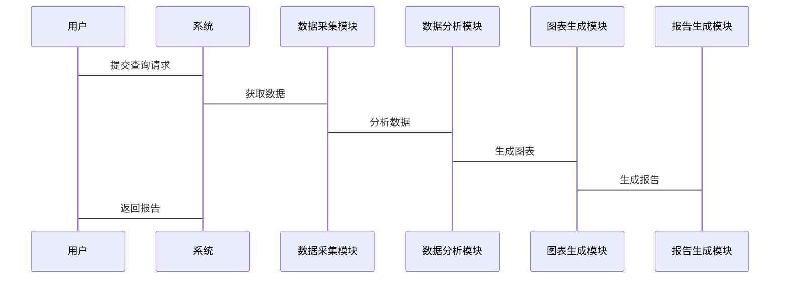

                 


# 威廉欧奈尔的图表分析技巧

## 关键词：图表分析，CANSLIM法则，威廉欧奈尔，股票分析，技术分析

## 摘要：本文详细解读威廉欧奈尔的CANSLIM法则，通过技术分析的方法，帮助投资者掌握图表分析的高级技巧。文章从背景与基础、CANSLIM法则详解、高级技巧、系统架构设计、项目实战等方面展开，结合实际案例和数学模型，为读者提供全面的指导。

---

# 第1章: 图表分析的背景与基础

## 1.1 什么是威廉欧奈尔的图表分析

### 1.1.1 图表分析的基本概念
图表分析是一种技术分析方法，通过研究股票价格和成交量的历史数据，预测未来的市场走势。威廉欧奈尔的CANSLIM法则是一种经典的图表分析策略，旨在帮助投资者识别高潜力股票并制定买卖决策。

### 1.1.2 威廉欧奈尔的CANSLIM法则
CANSLIM是威廉欧奈尔提出的一种股票筛选法则，共包含七个字母，每个字母代表一个关键因素：
- **C**：成交量（Volume）
- **A**：动作或形态（Action or Pattern）
- **N**：新型的股票或趋势（Newness of the stock or trend）
- **S**：支撑位（Support）
- **L**：成交量的相对强度（Relative Strength in Volume）
- **I**：机构投资者的动向（Institutional Interest）
- **M**：市场的整体走势（Market Trend）

### 1.1.3 图表分析在投资决策中的作用
图表分析帮助投资者识别市场趋势、股票强弱以及买卖时机，从而做出更明智的投资决策。

---

## 1.2 图表分析的核心要素

### 1.2.1 股价与成交量的关系
股价和成交量是图表分析的核心要素。高成交量通常意味着市场对该股票的关注度较高，可能是买入或卖出信号。

### 1.2.2 趋势线与支撑位
趋势线是价格波动的方向线，支撑位是价格下跌时的支撑点，通常被视为买入机会。

### 1.2.3 相对强度指数（RSI）
RSI用于衡量股票的超买或超卖状态，帮助投资者判断价格的短期走势。

---

## 1.3 图表分析的基本原理

### 1.3.1 技术分析与基本面分析的区别
技术分析侧重于价格和成交量，基本面分析侧重于公司财务状况和行业趋势。

### 1.3.2 图表模式的识别与分类
常见的图表模式包括头肩顶、双重底等，这些模式有助于预测价格走势。

### 1.3.3 市场情绪与图表形态的关系
市场情绪影响图表形态，例如恐慌性抛售可能导致价格大幅下跌。

---

## 1.4 图表分析的工具与方法

### 1.4.1 常用的技术分析工具
包括K线图、移动平均线、MACD等。

### 1.4.2 图表分析的基本步骤
1. 观察价格走势。
2. 分析成交量。
3. 识别支撑位和阻力位。
4. 使用技术指标辅助判断。

### 1.4.3 常用的技术指标
- **移动平均线（MA）**：用于平滑价格波动。
- **MACD**：用于判断价格趋势。

---

## 1.5 本章小结
本章介绍了图表分析的基本概念、核心要素和基本原理，为后续深入分析CANSLIM法则奠定了基础。

---

# 第2章: 威廉欧奈尔的CANSLIM法则详解

## 2.1 CANSLIM法则的构成

### 2.1.1 C代表成交量
成交量是判断股票强弱的重要指标。高成交量通常意味着趋势延续的可能性较大。

### 2.1.2 A代表动作或形态
动作或形态是指股票的价格走势，如上升趋势或下降趋势。

### 2.1.3 N代表新型的股票或趋势
新型股票或趋势指的是新出现的市场趋势或新上市的股票。

### 2.1.4 S代表支撑位
支撑位是价格下跌时的支撑点，通常被视为买入机会。

### 2.1.5 L代表成交量的相对强度
相对强度是指股票成交量相对于市场指数的表现。

### 2.1.6 I代表机构投资者的动向
机构投资者的动向通常预示着市场的短期走势。

### 2.1.7 M代表市场的整体走势
市场的整体走势是判断股票趋势的重要因素。

---

## 2.2 每个法则的详细解读

### 2.2.1 成交量分析的重要性
高成交量表明市场参与者对该股票的关注度较高。

### 2.2.2 动作或形态的识别技巧
通过识别上升趋势或下降趋势来判断股票走势。

### 2.2.3 新型股票的筛选标准
选择新上市的股票或新出现的市场趋势。

### 2.2.4 支撑位与阻力位的计算方法
支撑位是价格下跌时的支撑点，阻力位是价格上涨时的阻力点。

### 2.2.5 相对强度指数的计算公式
$$RSI = \frac{100 - \frac{\sum_{i=1}^{n} \text{上涨幅度}}{\sum_{i=1}^{n} (\text{上涨幅度} + \text{下跌幅度})} \times 100$$

### 2.2.6 机构投资者动向的判断依据
通过观察机构投资者的买卖行为来判断市场走势。

### 2.2.7 市场整体走势的分析方法
通过分析市场指数（如标普500）来判断整体走势。

---

## 2.3 CANSLIM法则的综合应用

### 2.3.1 如何结合多个法则进行分析
综合分析各个因素，如成交量、形态、支撑位等，以做出更准确的判断。

### 2.3.2 法则间的相互关系与影响
各个法则相互关联，共同影响股票走势。

### 2.3.3 实际案例中的综合应用
通过实际案例分析，展示如何综合运用CANSLIM法则进行股票分析。

---

## 2.4 本章小结
本章详细解读了CANSLIM法则的构成及其应用，帮助投资者更好地理解如何进行股票分析。

---

# 第3章: 图表分析的高级技巧

## 3.1 图表模式的高级识别

### 3.1.1 头肩顶与头肩底形态
- **头肩顶**：预示价格将下跌。
- **头肩底**：预示价格将上涨。

### 3.1.2 双重顶与双重底形态
- **双重顶**：价格在两个高点之间波动，预示下跌。
- **双重底**：价格在两个低点之间波动，预示上涨。

### 3.1.3 三角形形态
- **上升三角形**：预示价格上涨。
- **下降三角形**：预示价格下跌。

---

## 3.2 高级技术指标的使用

### 3.2.1 相对强弱指数（RSI）
$$RSI = \frac{100 - \frac{\sum_{i=1}^{n} \text{上涨幅度}}{\sum_{i=1}^{n} (\text{上涨幅度} + \text{下跌幅度})} \times 100$$

### 3.2.2 移动平均收敛散度（MACD）
MACD用于判断价格趋势，通常在零线上下穿越时产生信号。

### 3.2.3 威廉指标（WMS）
$$WMS = \frac{(H + L + C - L)}{ (H - L)}$$

---

## 3.3 图表分析的数学模型与算法

### 3.3.1 移动平均线算法
$$MA_n = \frac{\sum_{i=1}^{n} P_i}{n}$$

### 3.3.2 MACD算法
1. 计算短期和长期移动平均线。
2. 计算两条线的差值。
3. 绘制信号线。

---

## 3.4 本章小结
本章介绍了高级图表模式和技术指标的使用方法，帮助投资者更精确地进行股票分析。

---

# 第4章: 系统分析与架构设计

## 4.1 问题场景介绍
构建一个基于CANSLIM法则的股票分析系统，帮助投资者快速识别投资机会。

## 4.2 系统功能设计
- 数据采集：获取股票价格和成交量数据。
- 数据分析：计算技术指标。
- 图表生成：绘制价格和指标图表。
- 报告生成：生成投资报告。

## 4.3 系统架构设计


## 4.4 系统接口设计
- 数据接口：与数据源对接。
- 用户接口：供用户输入参数和查看结果。

## 4.5 系统交互流程


---

# 第5章: 项目实战

## 5.1 环境安装
安装Python、Pandas、Matplotlib等工具。

## 5.2 核心实现代码
```python
import pandas as pd
import matplotlib.pyplot as plt

# 数据采集模块
def get_data(ticker):
    # 从数据源获取数据
    pass

# 数据分析模块
def calculate_rsi(data, period=14):
    # 计算RSI
    pass

# 图表生成模块
def plot_chart(data, rsi):
    plt.plot(data['Close'], label='Price')
    plt.plot(rsi, label='RSI')
    plt.legend()
    plt.show()

# 报告生成模块
def generate_report(ticker, rsi_data):
    # 生成报告
    pass
```

## 5.3 代码解读与分析
解释代码的功能和实现逻辑，展示如何将CANSLIM法则应用于实际分析。

## 5.4 实际案例分析
通过具体股票案例，展示如何使用CANSLIM法则进行分析。

## 5.5 项目小结
总结项目实现过程中的经验教训，强调CANSLIM法则的实际应用价值。

---

# 第6章: 总结与展望

## 6.1 本章小结
总结本文的主要内容，强调图表分析的重要性。

## 6.2 注意事项
提醒投资者在实际操作中需谨慎，避免过度依赖技术分析。

## 6.3 拓展阅读
推荐进一步学习的技术分析书籍和资源。

---

# 作者：AI天才研究院 & 禅与计算机程序设计艺术

---

以上是《威廉欧奈尔的图表分析技巧》的文章内容，希望对您有所帮助。

