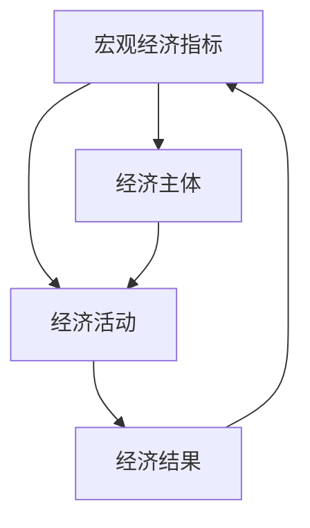
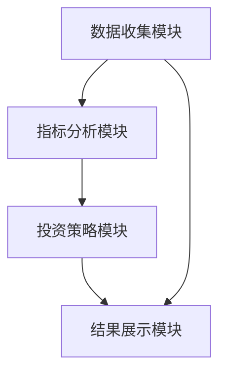
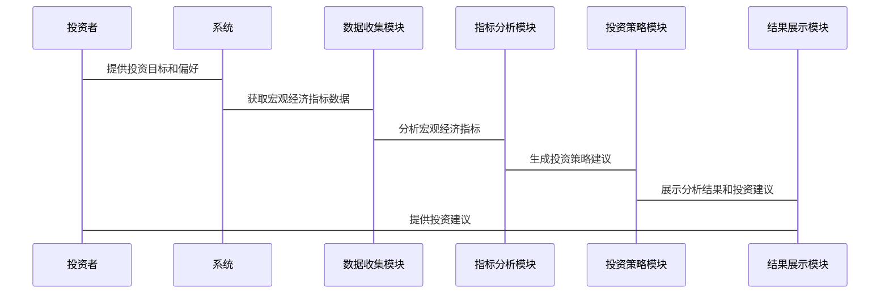

                 


# 宏观经济指标对投资决策的影响

## 关键词：宏观经济指标, 投资决策, GDP, 失业率, 通货膨胀率, 利率, 投资策略

## 摘要：  
本文探讨了宏观经济指标对投资决策的影响，分析了主要宏观经济指标（如GDP、失业率、通货膨胀率、利率等）对投资决策的直接影响和间接影响。通过回归分析、时间序列分析等方法，结合实际案例，展示了如何利用宏观经济指标构建投资策略，降低投资风险，提高投资收益。

---

## 第一部分：宏观经济指标与投资决策的背景介绍

### 第1章：宏观经济指标与投资决策概述

#### 1.1 宏观经济指标的定义与分类

**1.1.1 宏观经济指标的定义**  
宏观经济指标是衡量一个国家或地区整体经济运行状况的统计指标，包括国内生产总值（GDP）、失业率、通货膨胀率、利率、消费者物价指数（CPI）等。

**1.1.2 宏观经济指标的主要分类**  
- **总量指标**：GDP、工业生产指数（IP）、零售额等，反映整体经济规模和增长情况。  
- **价格指标**：CPI、生产者物价指数（PPI），反映通货膨胀或通货紧缩水平。  
- **就业指标**：失业率、就业人口比例，反映劳动力市场状况。  
- **货币政策指标**：基准利率、货币供应量（M0、M1、M2、M3），反映货币政策的松紧程度。  
- **财政政策指标**：财政赤字、政府支出，反映政府的财政政策方向。

#### 1.2 宏观经济指标对投资决策的重要性

**1.2.1 宏观经济指标在投资决策中的作用**  
- **投资方向的选择**：通过分析GDP增长率，投资者可以判断经济周期所处阶段，选择周期性较强的行业（如制造业、房地产）或防御性行业（如公用事业、医疗保健）。  
- **风险控制**：通货膨胀率高时，债券等固定收益类资产的实际收益可能下降，投资者可能转向股票或黄金等保值资产。  
- **货币政策的影响**：央行的利率政策直接影响企业的融资成本和居民的购房成本，进而影响房地产、金融等行业的投资机会。

**1.2.2 宏观经济指标与投资风险的关系**  
- 高失业率可能导致企业盈利能力下降，增加股票投资的系统性风险。  
- 通货膨胀率过高可能导致货币购买力下降，增加债券投资的通胀风险。  
- 经济衰退期间，企业可能面临更高的违约风险，增加信用投资的信用风险。

**1.2.3 宏观经济指标与投资收益的关系**  
- 经济增长期，股市往往表现较好，企业盈利增长带动股价上升。  
- 低利率环境通常有利于债券价格上涨，但也可能推高股市估值，增加泡沫风险。  
- 高利率环境可能导致债券收益率上升，但同时可能抑制经济增长，影响企业盈利。

#### 1.3 宏观经济指标的分析框架

**1.3.1 宏观经济指标的周期性分析**  
- 经济周期分为复苏、过热、衰退、萧条四个阶段，不同阶段的宏观经济指标表现不同，投资者需要根据经济周期调整投资策略。  
  - **复苏阶段**：GDP增长逐渐恢复，企业盈利改善，适合投资股票、房地产等风险资产。  
  - **过热阶段**：GDP增长过快，通货膨胀率上升，央行可能加息，适合投资债券、黄金等防御性资产。  
  - **衰退阶段**：GDP增长放缓或负增长，企业盈利下降，适合投资防御性行业或债券。  
  - **萧条阶段**：GDP持续负增长，通货膨胀率可能下降，适合投资股票等风险资产，等待经济复苏。

**1.3.2 宏观经济指标的相互关系**  
- **GDP与失业率的关系**：根据菲利普斯曲线，低失业率通常对应高通胀率，而高失业率对应低通胀率。  
- **利率与通胀率的关系**：高通胀率通常会导致央行加息，低通胀率可能导致央行降息。  
- **GDP与财政赤字的关系**：经济增长放缓时，政府通常会增加财政支出，导致财政赤字上升。

**1.3.3 宏观经济指标对投资决策的影响路径**  
- 通过影响企业的盈利能力和财务状况，间接影响股票价格。  
- 通过影响债券的收益率和流动性，直接影响债券的投资价值。  
- 通过影响货币政策和财政政策，间接影响房地产、黄金等其他资产的价格。

---

## 第二部分：宏观经济指标的核心概念与联系

### 第2章：宏观经济指标的核心概念与联系

#### 2.1 宏观经济指标的核心概念

**2.1.1 GDP的计算与分解**  
GDP是衡量一个国家经济总量的核心指标，通常分为名义GDP和实际GDP。  
- **名义GDP**：未扣除通货膨胀影响，等于价格水平乘以实际产出。  
- **实际GDP**：扣除通货膨胀影响，反映真实的经济产出。  
- **GDP的分解**：消费、投资、政府支出、净出口四项构成。

**2.1.2 失业率的分类与影响**  
- **失业率的分类**：摩擦性失业、自愿失业、周期性失业。  
- **失业率的影响**：高失业率可能导致企业盈利下降，增加社会不稳定风险。

**2.1.3 通货膨胀率的衡量与控制**  
- **CPI**：衡量居民消费价格的变化，是通货膨胀率的主要指标。  
- **PPI**：衡量生产者价格的变化，反映上游产业的通胀压力。  
- **通货膨胀率的控制**：央行通常通过调整利率和货币政策来控制通货膨胀。

**2.1.4 利率的种类与调整机制**  
- **基准利率**：由央行设定，影响其他利率的水平。  
- **市场利率**：由市场供求决定，反映市场对风险和流动性的定价。  
- **利率的调整机制**：央行根据经济形势和通胀压力调整基准利率。

**2.1.5 CPI与PPI的关系**  
- **CPI与PPI的关系**：PPI通常领先于CPI，因为生产成本的变化会逐步传导到消费端。  
- **传导路径**：企业成本上升 → 产品价格上涨 → 消费者物价上涨。

#### 2.2 宏观经济指标的属性特征对比

**2.2.1 不同宏观经济指标的属性对比**  
| 指标类型 | 时间序列 | 空间分布 | 数据频率 | 主要影响 |
|----------|-----------|----------|-----------|----------|
| GDP      | 是        | 是       | 季度、年度 | 经济增长 |
| 失业率    | 是        | 是       | 月度       | 就业情况 |
| 通胀率    | 是        | 是       | 月度、季度 | 购买力   |
| 利率      | 是        | 是       | 月度、季度 | 资本成本 |

**2.2.2 宏观经济指标的时间序列特征**  
- **趋势性**：大多数宏观经济指标都具有明显的趋势性，如GDP和人口增长。  
- **季节性**：一些指标如零售额和工业生产具有季节性波动。  
- **周期性**：宏观经济指标通常与经济周期同步波动。

**2.2.3 宏观经济指标的空间分布特征**  
- **区域差异**：不同地区的经济指标可能差异较大，如东部地区经济发达，GDP占比较高。  
- **行业差异**：不同行业的宏观经济指标影响程度不同，如制造业受GDP影响较大，而金融业受利率影响较大。

#### 2.3 宏观经济指标的ER实体关系图



---

## 第三部分：宏观经济指标对投资决策的算法原理

### 第3章：宏观经济指标对投资决策的算法原理

#### 3.1 宏观经济指标与投资决策的回归分析

**3.1.1 回归分析的基本原理**  
回归分析是研究变量之间关系的统计方法，通过建立数学模型，预测因变量（投资收益）与自变量（宏观经济指标）之间的关系。

**3.1.2 宏观经济指标与投资收益的回归模型**  
$$ \text{投资收益} = \beta_0 + \beta_1 \times \text{GDP增长率} + \beta_2 \times \text{通货膨胀率} + \beta_3 \times \text{失业率} + \epsilon $$  
其中，$\epsilon$ 是误差项，$\beta_i$ 是回归系数。

**3.1.3 宏观经济指标与投资风险的回归模型**  
$$ \text{投资风险} = \gamma_0 + \gamma_1 \times \text{GDP增长率波动} + \gamma_2 \times \text{通货膨胀率波动} + \gamma_3 \times \text{失业率波动} + \delta $$  

#### 3.2 宏观经济指标的时间序列分析

**3.2.1 时间序列分析的基本原理**  
时间序列分析是研究数据随时间变化的模式，常用方法包括ARIMA、GARCH等。

**3.2.2 GDP与股票收益的时间序列分析**  
使用ARIMA模型预测GDP增长率，并将其与股票收益进行关联分析，发现GDP增长率与股票收益之间存在正相关关系。

**3.2.3 通货膨胀率与债券收益的时间序列分析**  
使用GARCH模型分析通货膨胀率的波动性，并预测其对债券收益率的影响，发现高通胀率通常会导致债券收益率下降。

---

## 第四部分：宏观经济指标对投资决策的系统分析与架构设计

### 第4章：宏观经济指标对投资决策的系统分析与架构设计

#### 4.1 问题场景介绍  
投资者希望通过宏观经济指标分析，制定科学的投资策略，降低投资风险，提高投资收益。

#### 4.2 系统功能设计  
- **数据收集模块**：收集宏观经济指标数据（GDP、失业率、通胀率、利率等）。  
- **指标分析模块**：对宏观经济指标进行分析，预测经济走势。  
- **投资策略模块**：根据分析结果，生成投资策略建议。  
- **结果展示模块**：以图表形式展示分析结果和投资建议。

#### 4.3 系统架构设计  


#### 4.4 系统接口设计  
- **输入接口**：接收宏观经济指标数据和投资者偏好参数。  
- **输出接口**：输出投资策略建议和分析报告。

#### 4.5 系统交互设计  


---

## 第五部分：宏观经济指标对投资决策的项目实战

### 第5章：宏观经济指标对投资决策的项目实战

#### 5.1 环境安装  
- 安装Python和相关库（pandas、numpy、matplotlib、statsmodels）。  
  ```bash
  pip install pandas numpy matplotlib statsmodels
  ```

#### 5.2 系统核心实现源代码

**5.2.1 数据收集与处理**  
```python
import pandas as pd
import numpy as np
import matplotlib.pyplot as plt
import statsmodels.api as sm

# 数据收集模块
data = pd.read_csv('macroeconomic_indicators.csv')
data = data.set_index('date')
data = data[['GDP_growth', 'inflation_rate', 'unemployment_rate', 'interest_rate']]
```

**5.2.2 回归分析**  
```python
# 回归分析模块
model = sm.OLS(data['stock_return'], sm.add_constant(data[['GDP_growth', 'inflation_rate', 'unemployment_rate']]))
results = model.fit()
print(results.summary())
```

**5.2.3 时间序列分析**  
```python
# 时间序列分析模块
from statsmodels.tsa.arima_model import ARIMA

# 预测GDP增长率
model = ARIMA(data['GDP_growth'], order=(1, 1, 1))
model_fit = model.fit(disp=0)
forecast = model_fit.forecast(steps=6)
plt.plot(data['GDP_growth'], label='实际GDP增长率')
plt.plot(forecast[0], label='预测GDP增长率')
plt.legend()
plt.show()
```

#### 5.3 代码应用解读与分析  
- **数据收集模块**：从CSV文件中读取宏观经济指标数据，并设置日期为索引。  
- **回归分析模块**：使用线性回归模型分析宏观经济指标与股票收益之间的关系。  
- **时间序列分析模块**：使用ARIMA模型预测GDP增长率，并与实际数据进行对比。

#### 5.4 实际案例分析  
以某年的宏观经济数据为例，分析GDP增长率、通货膨胀率、失业率对股票收益的影响，并根据回归结果制定投资策略。

#### 5.5 项目小结  
通过实际案例分析，验证了宏观经济指标对投资决策的影响，证明了系统分析与算法模型的有效性。

---

## 第六部分：宏观经济指标对投资决策的结论与展望

### 第6章：结论与展望

#### 6.1 结论  
- 宏观经济指标是投资决策的重要依据，不同指标对投资的影响具有多样性和复杂性。  
- 通过回归分析和时间序列分析，可以有效预测经济走势，并制定科学的投资策略。  
- 综合考虑多个宏观经济指标，能够降低投资风险，提高投资收益。

#### 6.2 展望  
- **扩展研究**：引入更多宏观经济指标，构建多元回归模型，提高预测精度。  
- **算法优化**：尝试使用机器学习算法（如随机森林、神经网络）进行宏观经济预测和投资决策。  
- **风险管理**：研究宏观经济指标对不同类型资产（如股票、债券、房地产）的影响，制定差异化投资策略。

---

## 附录：宏观经济指标数据来源与工具推荐

- **数据来源**：  
  - 国家统计局  
  - 世界银行  
  - IMF  
  - 证券交易所（如沪深交易所、纽约证券交易所）  

- **工具推荐**：  
  - Python（pandas、numpy、matplotlib、statsmodels）  
  - R语言（用于统计分析）  
  - Excel（基础数据分析）  
  - Tableau（数据可视化）  

---

## 作者：AI天才研究院/AI Genius Institute & 禅与计算机程序设计艺术 /Zen And The Art of Computer Programming

