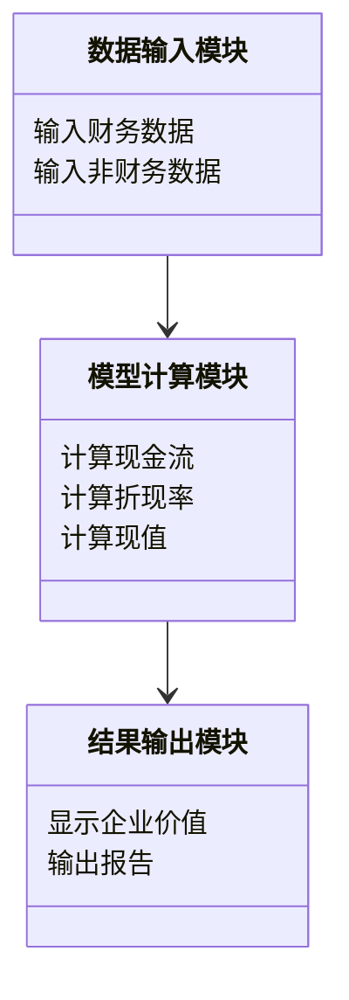
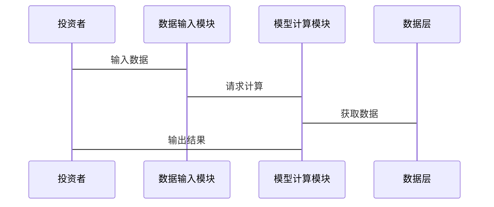

                 


# 实例演示：如何计算企业价值

## 关键词：企业价值计算、财务模型、投资评估、企业估值、DCF模型、财务分析、投资决策

## 摘要：本文将详细介绍如何计算企业价值，从背景介绍到具体实例分析，结合财务模型和数据分析，深入探讨企业价值的计算方法和应用场景，帮助读者掌握企业价值评估的核心技巧。

---

# 第一部分：企业价值计算的背景与概念

## 第1章：企业价值计算概述

### 1.1 企业价值的概念与定义
企业价值（Enterprise Value，EV）是指企业整体的市场价值，包括股权价值和债权价值。企业价值是评估企业内在价值的重要指标，常用于投资决策、并购评估和财务分析。

#### 1.1.1 企业价值的定义
企业价值（EV）是公司全部股权和债务的市场价值之和，反映了企业整体的经济价值。公式如下：
$$ EV = Market\ Value\ of\ Equity + Market\ Value\ of\ Debt $$

#### 1.1.2 企业价值的核心要素
企业价值的核心要素包括：
1. 营收能力
2. 利润能力
3. 资产状况
4. 偿债能力
5. 竞争优势

#### 1.1.3 企业价值的边界与外延
企业价值的边界包括企业本身的资产和债务，而外延则包括企业的未来增长潜力、管理团队和市场环境等。

### 1.2 企业价值评估的重要性
企业价值评估是企业决策的重要工具，常用于投资评估、并购定价和业绩分析。

#### 1.2.1 企业价值评估的目的
企业价值评估的主要目的是为了确定企业的市场价值，帮助投资者做出合理的投资决策。

#### 1.2.2 企业价值评估的常见场景
企业价值评估常见于企业并购、上市定价和投资分析等场景。

#### 1.2.3 企业价值评估对企业决策的影响
企业价值评估能够帮助投资者评估企业的内在价值，从而做出合理的投资决策。

### 1.3 企业价值计算的背景与现状
#### 1.3.1 传统企业价值评估方法
传统方法包括资产基础法、收益法和市场法。

#### 1.3.2 现代企业价值评估方法的发展
现代方法包括现金流折现法（DCF）和相对估值法。

#### 1.3.3 当前企业价值评估的挑战与趋势
当前企业价值评估的挑战包括数据获取困难和模型复杂性，趋势则是更加依赖数据驱动的方法。

---

## 第2章：企业价值计算的核心概念与联系

### 2.1 核心概念原理
#### 2.1.1 财务指标与企业价值的关系
财务指标如营收、利润等直接影响企业价值的计算。

#### 2.1.2 非财务因素对企业价值的影响
非财务因素如管理团队和市场环境也会影响企业价值。

#### 2.1.3 企业价值计算的关键公式
企业价值计算的关键公式包括：
$$ EV = \frac{CF}{r} $$
其中，CF是未来现金流，r是折现率。

### 2.2 核心概念属性特征对比
#### 2.2.1 财务指标的特征对比
| 财务指标 | 特征 |
|----------|------|
| 营收     | 反映企业收入能力 |
| 利润     | 反映企业盈利能力 |

#### 2.2.2 非财务因素的特征对比
| 非财务因素 | 特征 |
|------------|------|
| 管理团队   | 反映企业治理能力 |
| 市场环境   | 反映企业市场风险 |

### 2.3 ER实体关系图
```mermaid
erDiagram
    actor 投资者 {
        <属性> 投资金额
        <属性> 投资期限
    }
    actor 企业 {
        <属性> 营收
        <属性> 净利润
        <属性> 资产
        <属性> 负债
    }
    actor 评估机构 {
        <属性> 评估标准
        <属性> 评估方法
    }
    投资者 --> 企业 : 投资
    企业 --> 评估机构 : 评估请求
    评估机构 --> 投资者 : 评估结果
```

### 2.4 本章小结
企业价值计算的核心概念包括财务指标和非财务因素，理解它们的关系和影响是计算企业价值的关键。

---

## 第3章：企业价值计算的算法原理

### 3.1 算法原理概述
企业价值计算的常用算法包括现金流折现法（DCF）和相对估值法。

#### 3.1.1 企业价值计算的基本流程
企业价值计算的基本流程包括数据收集、模型构建和结果分析。

### 3.2 算法原理详细讲解

#### 3.2.1 现金流折现法（DCF模型）
现金流折现法是通过预测企业未来现金流并将其折现来计算企业价值的方法。

##### 3.2.1.1 DCF模型的公式
$$ EV = \frac{CF_1}{(1 + r)^1} + \frac{CF_2}{(1 + r)^2} + \dots + \frac{CF_n}{(1 + r)^n} $$

##### 3.2.1.2 DCF模型的步骤
1. 预测未来现金流
2. 确定折现率
3. 计算现值
4. 加上残值

##### 3.2.1.3 DCF模型的实例
假设某公司未来5年的现金流分别为100万、120万、150万、180万和200万，折现率为10%。计算现值如下：
$$ PV = \frac{100}{1.1} + \frac{120}{1.1^2} + \frac{150}{1.1^3} + \frac{180}{1.1^4} + \frac{200}{1.1^5} $$

### 3.3 算法的数学模型和公式
企业价值计算的数学模型包括现金流折现模型和相对估值模型。

---

## 第4章：系统架构设计

### 4.1 系统功能设计
企业价值计算系统包括数据输入、模型计算和结果输出三个模块。

#### 4.1.1 领域模型（领域模型图）


### 4.2 系统架构设计
企业价值计算系统的架构包括数据层、业务逻辑层和用户界面层。

#### 4.2.1 系统架构图


### 4.3 系统交互设计
#### 4.3.1 系统交互流程图


---

## 第5章：项目实战

### 5.1 实战案例
以某公司为例，计算其企业价值。

#### 5.1.1 数据收集
收集该公司的财务数据和市场数据。

#### 5.1.2 模型应用
应用DCF模型进行计算。

#### 5.1.3 结果分析
分析计算结果并解读。

---

## 第6章：最佳实践与总结

### 6.1 最佳实践
企业价值计算的最佳实践包括数据准确性、模型选择和结果验证。

### 6.2 小结
企业价值计算是投资决策的重要工具，掌握核心概念和算法是关键。

### 6.3 注意事项
计算企业价值时需要注意数据的准确性和模型的适用性。

### 6.4 拓展阅读
推荐相关书籍和文章，进一步学习企业价值计算的方法。

---

# 作者：AI天才研究院 & 禅与计算机程序设计艺术

---

这篇文章详细讲解了如何计算企业价值，从背景到具体实例，结合财务模型和数据分析，帮助读者掌握企业价值评估的核心技巧。

