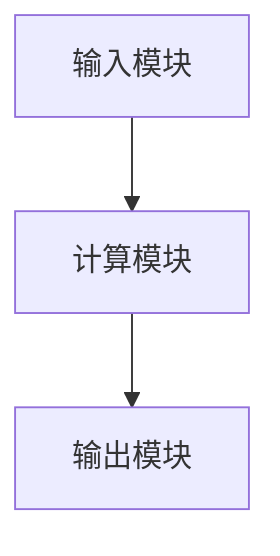
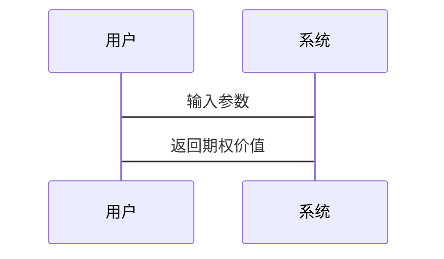

                 


# 实物期权估值：灵活性和不确定性的价值量化

> 关键词：实物期权，灵活性，不确定性，价值量化，Black-Scholes模型，风险管理

> 摘要：本文深入探讨了实物期权在价值量化中的应用，特别是其在灵活性和不确定性环境下的评估方法。通过分析Black-Scholes模型、资本预算、情景分析等方法，结合实际案例，为读者提供系统的理论框架和实践指南。

---

## 第一部分: 实物期权估值基础

### 第1章: 实物期权的基本概念

#### 1.1 实物期权的定义与背景

##### 1.1.1 实物期权的定义
实物期权是一种将实物资产视为有期权性质的权利，允许持有者在未来特定时间内以特定价格购买或出售资产的选择权。这种概念广泛应用于企业决策、投资评估和风险管理等领域。

##### 1.1.2 实物期权的背景与应用领域
在现代金融和投资领域，实物期权的理论源于Black-Scholes模型，最初用于股票期权定价。随着理论的发展，实物期权的概念被扩展到更广泛的领域，如房地产、能源项目、技术创新等。特别是在面对不确定性时，实物期权提供了一种灵活的价值评估方法。

##### 1.1.3 实物期权与传统期权的区别
- **标的资产**：传统期权通常基于标准化的金融资产，如股票或债券；实物期权则基于实物资产，如房地产、设备或资源。
- **执行条件**：实物期权的执行条件更为灵活，允许根据实际情况调整决策。
- **应用场景**：实物期权更常用于长期投资和资本预算决策，而传统期权主要用于短期金融交易。

#### 1.2 实物期权的核心概念

##### 1.2.1 实物资产的期权特性
实物资产通常具有时间价值和内在价值。时间价值反映了未来灵活性的价值，而内在价值则基于当前市场条件下的实际价值。

##### 1.2.2 灵活性与不确定性的定义
- **灵活性**：企业在不确定环境中调整策略的能力，体现在对资产使用时间、方式的选择上。
- **不确定性**：未来可能面临的市场波动、技术变化等不确定性因素，影响资产的实际价值。

##### 1.2.3 实物期权的价值量化方法
通过将实物资产看作一种期权，可以使用期权定价模型（如Black-Scholes模型）来量化其时间价值和潜在价值。

#### 1.3 实物期权在资产定价中的作用

##### 1.3.1 资产定价的基本原理
资产定价涉及对未来现金流的折现，但实物期权提供了另一种视角，通过期权价值量化未来灵活性。

##### 1.3.2 实物期权在资产定价中的应用
在资本预算中，实物期权用于评估项目投资的灵活性价值，帮助企业在不确定性中做出更优决策。

##### 1.3.3 实物期权与投资决策的关系
实物期权提供了将不确定性因素转化为可量化的价值的方法，从而优化投资决策。

---

## 第二部分: 实物期权的核心理论与模型

### 第2章: 实物期权的核心理论与模型

#### 2.1 Black-Scholes模型

##### 2.1.1 Black-Scholes模型的概述
Black-Scholes模型是期权定价的经典公式，适用于标准化的欧式期权。公式为：

$$ C = S_0 \Phi(d_1) - K e^{-rT} \Phi(d_2) $$

其中，$d_1 = \frac{\ln(S_0/K) + (r + \sigma^2/2)T}{\sigma \sqrt{T}}$，$d_2 = d_1 - \sigma \sqrt{T}$。

##### 2.1.2 Black-Scholes公式的数学推导
通过无套利原理和随机微分方程，推导出Black-Scholes公式，假设市场无摩擦且波动率恒定。

##### 2.1.3 Black-Scholes模型的适用性
适用于标准化的欧式期权，但实物期权的应用需要根据具体情况进行调整。

#### 2.2 实物期权的核心理论

##### 2.2.1 实物期权的内在价值与时间价值
内在价值基于当前市场条件，时间价值反映未来灵活性的价值。

##### 2.2.2 实物期权定价的三要素
- 标的资产当前价值
- 行权价格
- 时间至到期日

#### 2.3 资本预算中的实物期权应用

##### 2.3.1 项目投资的期权特性
项目投资可以被视为一种看涨期权，企业有权在未来决定是否继续投资。

##### 2.3.2 期权特性在资本预算中的体现
通过实物期权模型，企业可以量化项目的灵活性价值，优化资本预算决策。

##### 2.3.3 实物期权与资本预算的结合
将实物期权的理论应用于资本预算，通过量化不确定性中的价值，优化投资决策。

---

## 第三部分: 实物期权的不确定性与风险管理

### 第3章: 不确定性分析与风险管理

#### 3.1 不确定性分析

##### 3.1.1 不确定性来源
市场波动、政策变化、技术进步等都可能影响实物资产的价值。

##### 3.1.2 不确定性的影响
不确定性可能导致实物资产的实际价值偏离预期，影响期权的执行决策。

##### 3.1.3 不确定性量化方法
通过概率分布和蒙特卡洛模拟，量化不确定性对期权价值的影响。

#### 3.2 情景分析

##### 3.2.1 情景分析的定义
通过构建不同市场情景，评估实物期权在不同情况下的价值。

##### 3.2.2 情景分析的步骤
1. 确定关键变量（如市场波动率、利率）
2. 构建不同情景
3. 计算每种情景下的期权价值
4. 综合评估整体价值

#### 3.3 动态调整策略

##### 3.3.1 动态调整的必要性
根据市场变化，实时调整实物期权的执行策略。

##### 3.3.2 动态调整的方法
通过定期重新评估期权价值，调整投资决策。

##### 3.3.3 动态调整的挑战
需要实时监控市场变化，提高决策的及时性和准确性。

#### 3.4 风险对冲

##### 3.4.1 风险对冲的定义
通过金融工具（如期货、期权）对冲实物期权中的不确定性风险。

##### 3.4.2 风险对冲的方法
使用衍生品对冲价格波动风险，降低不确定性对实物期权价值的影响。

##### 3.4.3 风险对冲的优缺点
优点：降低风险，缺点：可能限制灵活性。

---

## 第四部分: 实物期权的系统分析与架构设计

### 第4章: 系统分析与架构设计

#### 4.1 系统分析

##### 4.1.1 问题场景介绍
在不确定性环境下，企业需要评估实物资产的期权价值，优化投资决策。

##### 4.1.2 系统目标
设计一个系统，能够量化实物期权的时间价值和内在价值，支持决策优化。

##### 4.1.3 需求分析
- 输入：标的资产价值、行权价格、时间至到期日、波动率等
- 输出：期权价值

#### 4.2 系统架构设计

##### 4.2.1 系统功能设计
- 数据输入模块：接收标的资产参数
- 计算模块：使用Black-Scholes模型计算期权价值
- 结果输出模块：显示期权价值和相关分析结果

##### 4.2.2 系统架构图


##### 4.2.3 接口设计
- 输入接口：API接收标的资产参数
- 输出接口：API返回期权价值

#### 4.3 系统交互设计

##### 4.3.1 交互流程
1. 用户输入参数
2. 系统计算期权价值
3. 用户查看结果

##### 4.3.2 交互序列图


---

## 第五部分: 项目实战与案例分析

### 第5章: 项目实战与案例分析

#### 5.1 环境安装

##### 5.1.1 系统需求
- Python 3.8+
- 安装numpy和scipy库
```bash
pip install numpy scipy
```

##### 5.1.2 开发环境配置
- 创建虚拟环境并激活
```bash
python -m venv env
source env/bin/activate
```

#### 5.2 核心代码实现

##### 5.2.1 Black-Scholes模型的Python实现
```python
import numpy as np
from scipy.stats import norm

def black_scholes(S, K, r, sigma, T):
    d1 = (np.log(S/K) + (r + sigma**2/2)*T) / (sigma * np.sqrt(T))
    d2 = d1 - sigma * np.sqrt(T)
    C = S * norm.cdf(d1) - K * np.exp(-r*T) * norm.cdf(d2)
    return C

# 示例输入
S = 100
K = 105
r = 0.05
sigma = 0.2
T = 1

print(black_scholes(S, K, r, sigma, T))
```

##### 5.2.2 情景分析的实现
```python
import numpy as np

def情景分析(S, K, r, sigma, T):
    # 创建情景
    scenarios = 1000
    simulations = np.random.lognormal(mean=(r - sigma**2/2)*T, 
                                  sigma=sigma*np.sqrt(T), size=scenarios)
    # 计算每种情景下的期权价值
    option_values = []
    for s in simulations:
        d1 = (np.log(s/K) + (r + sigma**2/2)*T) / (sigma * np.sqrt(T))
        d2 = d1 - sigma * np.sqrt(T)
        C = s * norm.cdf(d1) - K * np.exp(-r*T) * norm.cdf(d2)
        option_values.append(C)
    # 计算平均值
    avg_value = np.mean(option_values)
    return avg_value

print(情景分析(S, K, r, sigma, T))
```

##### 5.2.3 结果解读与分析
通过情景分析，我们可以量化不同市场情景下实物期权的平均价值，评估不确定性对投资决策的影响。

#### 5.3 项目小结
通过Python代码实现Black-Scholes模型和情景分析，可以帮助企业量化实物期权的价值，优化投资决策。

---

## 第六部分: 实物期权估值的最佳实践与总结

### 第6章: 最佳实践与总结

#### 6.1 小结
实物期权提供了将不确定性转化为可量化价值的方法，帮助企业优化投资决策。

#### 6.2 注意事项
- 确保模型参数的准确性
- 定期重新评估模型假设
- 结合实际情况调整模型

#### 6.3 拓展阅读
建议深入学习Black-Scholes模型的数学推导，探索其他期权定价模型的应用。

---

## 作者

作者：AI天才研究院/AI Genius Institute & 禅与计算机程序设计艺术 /Zen And The Art of Computer Programming

---

通过以上内容，本文系统地介绍了实物期权估值的理论与实践，从基础概念到实际应用，为读者提供了全面的知识框架和实用的工具。

